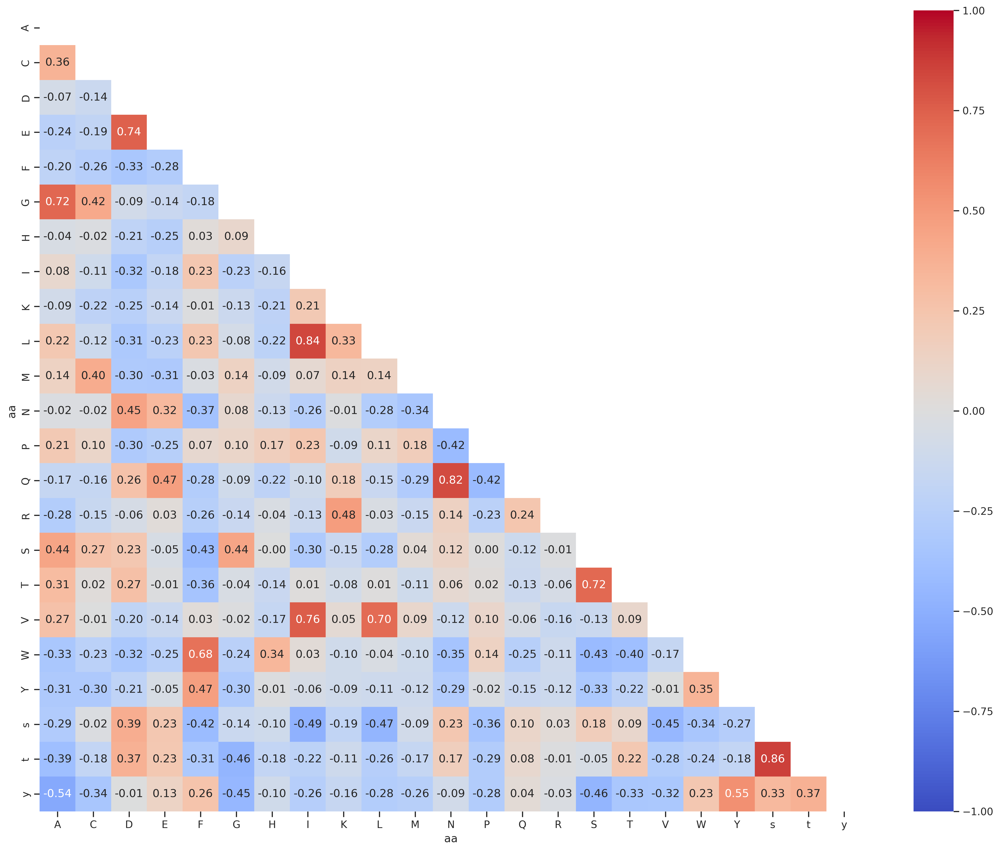
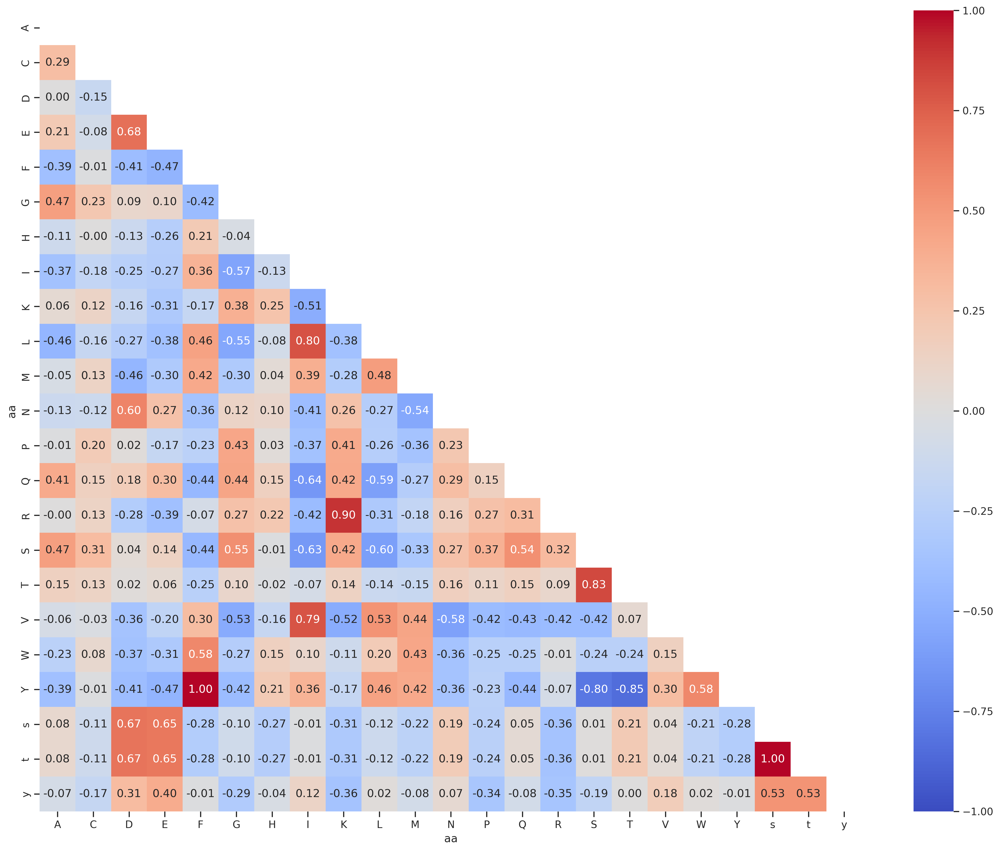

# Analysis of amino acid features


<!-- WARNING: THIS FILE WAS AUTOGENERATED! DO NOT EDIT! -->

## Setup

``` python
from katlas.core import *
from katlas.feature import *
from katlas.plot import *
from fastbook import *
from tqdm.notebook import tqdm; tqdm.pandas()
import seaborn as sns
```

## AA info

``` python
# Download the amino acid info
aa = Data.get_aa_info()
```

``` python
aa = aa.iloc[:-2,:]
```

## Rdkit chemical property

``` python
aa_rdkit = get_rdkit(aa, 'SMILES')
```

``` python
aa_rdkit.shape
```

    (23, 210)

``` python
aa_rdkit = preprocess(aa_rdkit)
```

    removing columns: {'fr_COO2', 'ExactMolWt', 'fr_ether', 'fr_N_O', 'fr_phenol', 'fr_C_O_noCOO', 'fr_nitrile', 'fr_bicyclic', 'NumRadicalElectrons', 'fr_ketone', 'NumSaturatedCarbocycles', 'fr_amide', 'fr_nitro', 'fr_COO', 'fr_Al_OH_noTert', 'fr_isothiocyan', 'PEOE_VSA13', 'fr_oxazole', 'fr_azo', 'fr_nitro_arom', 'fr_phos_acid', 'SMR_VSA8', 'SlogP_VSA10', 'fr_Nhpyrrole', 'fr_thiophene', 'fr_morpholine', 'fr_piperdine', 'fr_lactone', 'Chi2n', 'fr_aniline', 'fr_furan', 'SMR_VSA2', 'fr_pyridine', 'HeavyAtomMolWt', 'fr_alkyl_carbamate', 'fr_ArN', 'SlogP_VSA6', 'fr_Ar_COO', 'fr_Ar_OH', 'fr_dihydropyridine', 'NumAliphaticCarbocycles', 'fr_epoxide', 'fr_aryl_methyl', 'MaxPartialCharge', 'fr_imide', 'Chi2v', 'fr_diazo', 'fr_ester', 'MinAbsPartialCharge', 'fr_nitroso', 'fr_para_hydroxylation', 'fr_allylic_oxid', 'fr_Ar_NH', 'fr_phos_ester', 'fr_quatN', 'fr_aldehyde', 'fr_sulfone', 'fr_hdrzone', 'fr_Ndealkylation2', 'fr_oxime', 'fr_priamide', 'VSA_EState9', 'fr_hdrzine', 'fr_guanido', 'NumSaturatedHeterocycles', 'fr_thiazole', 'MaxEStateIndex', 'PEOE_VSA5', 'HeavyAtomCount', 'NumSaturatedRings', 'fr_halogen', 'fr_ketone_Topliss', 'SlogP_VSA11', 'fr_prisulfonamd', 'fr_thiocyan', 'fr_urea', 'fr_term_acetylene', 'SlogP_VSA12', 'EState_VSA11', 'fr_benzodiazepine', 'fr_nitro_arom_nonortho', 'BCUT2D_MRHI', 'fr_sulfonamd', 'fr_Imine', 'fr_alkyl_halide', 'fr_isocyan', 'fr_Ndealkylation1', 'fr_HOCCN', 'fr_azide', 'fr_phenol_noOrthoHbond', 'SlogP_VSA9', 'fr_tetrazole', 'LabuteASA', 'fr_methoxy', 'NumValenceElectrons', 'fr_piperzine', 'Chi0', 'fr_benzene', 'VSA_EState1', 'fr_C_S', 'SlogP_VSA7', 'NumAliphaticRings', 'fr_amidine', 'fr_barbitur', 'fr_imidazole', 'fr_lactam'}

``` python
aa_rdkit.shape
```

    (23, 104)

## PCA

``` python
sns.set(rc={"figure.dpi":300, 'savefig.dpi':300})
sns.set_context('notebook')
sns.set_style("ticks")
```

``` python
plot_cluster(aa_rdkit, name_list = aa.Name, hue = 'aa', method = 'pca')
```


## Correlation of aa

``` python
rdkit_corr = aa_rdkit.T.corr()
```

``` python
draw_corr(rdkit_corr)
```



## Correlation of aa in target

### PSPA - tyr

``` python
df = Data.get_pspa_tyr_norm().iloc[:,:-3]

df2 = df.unstack().reset_index()

df2.columns = ['substrate','kinase','target']

df2['aa']=df2.substrate.str[-1]

df2['enum'] = df2.groupby('aa').cumcount()

df_pivot = df2.pivot(index='enum', columns='aa', values='target')

corr = df_pivot.corr().round(2)

draw_corr(corr)
```



### PSPA - st

``` python
df = Data.get_pspa_st_norm().iloc[:,:-3]

df2 = df.unstack().reset_index()

df2.columns = ['substrate','kinase','target']

df2['aa']=df2.substrate.str[-1]

df2['enum'] = df2.groupby('aa').cumcount()

df_pivot = df2.pivot(index='enum', columns='aa', values='target')

corr = df_pivot.corr().round(2)

draw_corr(corr)
```


### CDDM

``` python
df = Data.get_cddm().iloc[:,:-3]

df2 = df.unstack().reset_index()

df2.columns = ['substrate','kinase','target']

df2['aa']=df2.substrate.str[-1]

df2['enum'] = df2.groupby('aa').cumcount()

df_pivot = df2.pivot(index='enum', columns='aa', values='target')

corr = df_pivot.corr().round(2)

draw_corr(corr)
```


