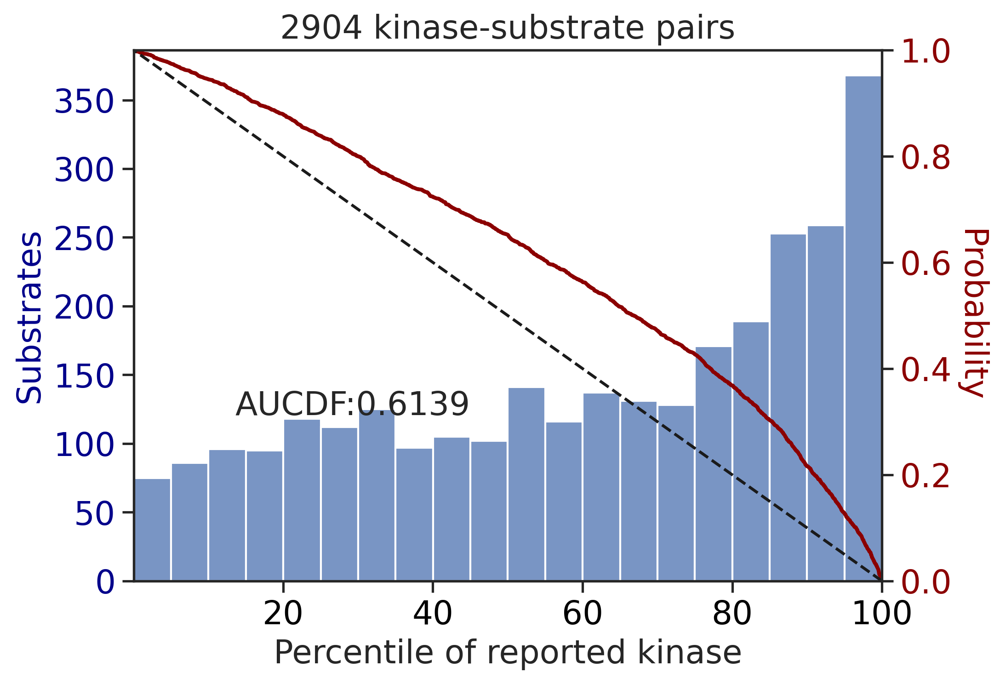
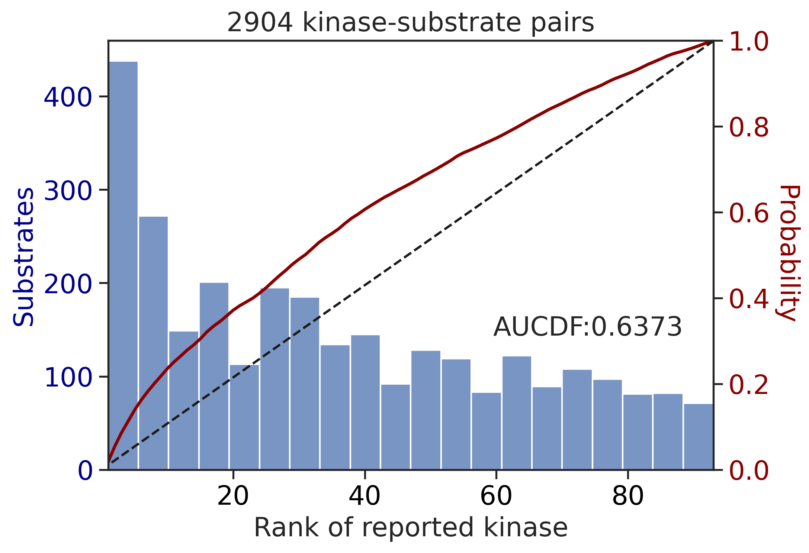
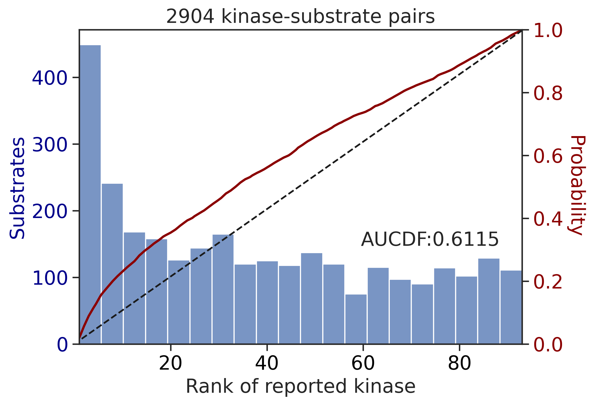

# Plot AUCDF


<!-- WARNING: THIS FILE WAS AUTOGENERATED! DO NOT EDIT! -->

In this notebook, we will evaluate PSSMs derived from two methods:PSPA
and CDDM, using kinase-substrate datasets from PhosphoSitePlus (PSP). We
will use AUCDF (Area Under Cumulative Distribution Function) to
evaluate. AUCDF was previously introduced to evaluate PSSMs in the paper
[An atlas of substrate specificities for the human serine/threonine
kinome.](https://www.nature.com/articles/s41586-022-05575-3)

## Setup

``` python
from katlas.imports import *
import pickle,pandas as pd, seaborn as sns
from matplotlib import pyplot as plt
```

## Get kinase idx map

``` python
info = Data.get_kinase_info().query('pseudo=="0"')

info = info[['kinase','ID_coral','ID_HGNC']].map(lambda x: x.upper())

kinase_map = {}
for idx, row in info.iterrows():
    # Add each of the different kinase name formats to the map
    kinase_map[row['ID_coral']] = row['kinase']
    kinase_map[row['ID_HGNC']] = row['kinase']
    # Ensure the kinase name itself is also in the map
    kinase_map[row['kinase']] = row['kinase']

kinase_map['ABL'] = 'ABL1'
kinase_map['HER2'] = 'ERBB2'
kinase_map['ETK'] = 'BMX'
kinase_map['MKK6'] = 'MAP2K6'
kinase_map['MKK4'] = 'MAP2K4'
kinase_map['MKK3'] = 'MAP2K3'
kinase_map['MKK7'] = 'MAP2K7'

kinase_map['ARG'] = 'ABL2'
```

Uncheck below to save and load kinase_map.pkl

``` python
# import pickle
# with open('raw/kinase_map.pkl', 'wb') as file:
#     pickle.dump(kinase_map, file)
    
# with open('raw/kinase_map.pkl', 'rb') as file:
#     loaded_dict = pickle.load(file)
```

## Load kinase-substrate data from PSP

``` python
# load kinase-substrate pairs from PSP
psp = pd.read_csv('raw/PSP_Kinase_Substrate_Dataset.csv')
```

``` python
psp.head()
```

<div>
<style scoped>
    .dataframe tbody tr th:only-of-type {
        vertical-align: middle;
    }
&#10;    .dataframe tbody tr th {
        vertical-align: top;
    }
&#10;    .dataframe thead th {
        text-align: right;
    }
</style>

<table class="dataframe" data-quarto-postprocess="true" data-border="1">
<thead>
<tr class="header" style="text-align: right;">
<th data-quarto-table-cell-role="th"></th>
<th data-quarto-table-cell-role="th">GENE</th>
<th data-quarto-table-cell-role="th">KINASE</th>
<th data-quarto-table-cell-role="th">KIN_ACC_ID</th>
<th data-quarto-table-cell-role="th">KIN_ORGANISM</th>
<th data-quarto-table-cell-role="th">SUBSTRATE</th>
<th data-quarto-table-cell-role="th">SUB_GENE_ID</th>
<th data-quarto-table-cell-role="th">SUB_ACC_ID</th>
<th data-quarto-table-cell-role="th">SUB_GENE</th>
<th data-quarto-table-cell-role="th">SUB_ORGANISM</th>
<th data-quarto-table-cell-role="th">SUB_MOD_RSD</th>
<th data-quarto-table-cell-role="th">SITE_GRP_ID</th>
<th data-quarto-table-cell-role="th">site_seq</th>
<th data-quarto-table-cell-role="th">DOMAIN</th>
<th data-quarto-table-cell-role="th">IN_VIVO_RXN</th>
<th data-quarto-table-cell-role="th">IN_VITRO_RXN</th>
<th data-quarto-table-cell-role="th">CST_CAT#</th>
</tr>
</thead>
<tbody>
<tr class="odd">
<td data-quarto-table-cell-role="th">0</td>
<td>Dyrk2</td>
<td>DYRK2</td>
<td>Q5U4C9</td>
<td>mouse</td>
<td>NDEL1</td>
<td>83431.0</td>
<td>Q9ERR1</td>
<td>Ndel1</td>
<td>mouse</td>
<td>S336</td>
<td>1869686801</td>
<td>LGSsRPSsAPGMLPL</td>
<td>NaN</td>
<td></td>
<td>X</td>
<td>NaN</td>
</tr>
<tr class="even">
<td data-quarto-table-cell-role="th">1</td>
<td>Pak2</td>
<td>PAK2</td>
<td>Q64303</td>
<td>rat</td>
<td>MEK1</td>
<td>170851.0</td>
<td>Q01986</td>
<td>Map2k1</td>
<td>rat</td>
<td>S298</td>
<td>448284</td>
<td>RtPGRPLsSYGMDSR</td>
<td>Pkinase</td>
<td></td>
<td>X</td>
<td>9128; 98195</td>
</tr>
<tr class="odd">
<td data-quarto-table-cell-role="th">2</td>
<td>Pak2</td>
<td>PAK2</td>
<td>Q64303</td>
<td>rat</td>
<td>PRKD1</td>
<td>85421.0</td>
<td>Q9WTQ1</td>
<td>Prkd1</td>
<td>rat</td>
<td>S203</td>
<td>449896</td>
<td>GVRRRRLsNVsLTGL</td>
<td>NaN</td>
<td>X</td>
<td></td>
<td>NaN</td>
</tr>
<tr class="even">
<td data-quarto-table-cell-role="th">3</td>
<td>Pak2</td>
<td>PAK2</td>
<td>Q64303</td>
<td>rat</td>
<td>prolactin</td>
<td>24683.0</td>
<td>P01237</td>
<td>Prl</td>
<td>rat</td>
<td>S206</td>
<td>451732</td>
<td>IRCLRRDsHKVDNYL</td>
<td>Hormone_1</td>
<td></td>
<td>X</td>
<td>NaN</td>
</tr>
<tr class="odd">
<td data-quarto-table-cell-role="th">4</td>
<td>Pak2</td>
<td>PAK2</td>
<td>Q64303</td>
<td>rat</td>
<td>prolactin</td>
<td>5617.0</td>
<td>P01236</td>
<td>PRL</td>
<td>human</td>
<td>S207</td>
<td>451732</td>
<td>LHCLRRDsHKIDNYL</td>
<td>Hormone_1</td>
<td></td>
<td>X</td>
<td>NaN</td>
</tr>
</tbody>
</table>

</div>

As there are some sequences in ‘site_seq’ column that do not have s/t/y
at the center position, we need to remove them.

``` python
# For site sequence
psp = psp.loc[psp.site_seq.str[7].isin(list('stySTY'))]
```

We also notice that the kinase name in ‘KINASE’ column is not always
consistent (e.g., gene name and protein name are mixed in some cases),
so we need to convert the kinase name to a consistent name.

``` python
# for isoform, suppose they have similar recognition pattern; drop the isoform # and take the kinase name
psp.KINASE = psp.KINASE.str.split(' ').str[0].str.upper()

# for fusion form of kinase,get the second item
psp.KINASE = psp.KINASE.apply(lambda x: x.split('-')[1] if '-' in x else x) 

# map various kinase name (coral ID, gene name) to a common name
psp['kinase'] = psp.KINASE.map(kinase_map)
```

Check kinase that is not mapped:

``` python
# kinase not mapped
psp[psp.kinase.isna()].KINASE.value_counts()[:10]
```

    KINASE
    CK2B      20
    VEGFR2    15
    AMPKB1    15
    UL97      14
    ILK       13
    PKM       12
    PIK3CA    11
    AMPKG2    10
    CSFR      10
    VEGFR1     7
    Name: count, dtype: int64

``` python
# drop kinase not mapped
psp = psp.dropna(subset='kinase')
```

``` python
# drop duplicates
psp = psp[['site_seq','kinase']].drop_duplicates()
```

``` python
psp.site_seq.str[7].value_counts()
```

    site_seq
    s    13543
    t     4349
    y     3049
    Name: count, dtype: int64

## Filter sites and kinase for PSPA scoring

``` python
import pandas as pd, numpy as np
from tqdm import tqdm
```

``` python
ref_y = Data.get_pspa_tyr_norm()

ref_st = Data.get_pspa_st_norm()
```

``` python
TK = ref_y.index.str.split('_').str[0].tolist()
ST = ref_st.index.str.split('_').str[0].tolist()
```

We will use two kinds of inputs for PSPA evaluation:

- All capital (the official method from the Nature paper.)
- With lowercase indicating phosphorylation status

``` python
# filter samples, include only available kinase from the reference for scoring
df_st = psp[psp.kinase.isin(ref_st.index)].copy()
df_y = psp[psp.kinase.isin(ref_y.index)].copy()

# keep ST sites
df_st = df_st[df_st.site_seq.str[7].isin(list('stST'))]

# keep Y sites
df_y = df_y[df_y.site_seq.str[7].isin(list('yY'))]
```

``` python
df_st.site_seq.str[7].value_counts()
```

    site_seq
    s    13398
    t     4287
    Name: count, dtype: int64

``` python
df_y.site_seq.str[7].value_counts()
```

    site_seq
    y    2904
    Name: count, dtype: int64

``` python
# convert site sequence to capital, for percentile calculation
df_st['site_seq_upper'] = df_st['site_seq'].str.upper()
df_y['site_seq_upper'] = df_y['site_seq'].str.upper()
```

``` python
df_st.head()
```

<div>
<style scoped>
    .dataframe tbody tr th:only-of-type {
        vertical-align: middle;
    }
&#10;    .dataframe tbody tr th {
        vertical-align: top;
    }
&#10;    .dataframe thead th {
        text-align: right;
    }
</style>

<table class="dataframe" data-quarto-postprocess="true" data-border="1">
<thead>
<tr class="header" style="text-align: right;">
<th data-quarto-table-cell-role="th"></th>
<th data-quarto-table-cell-role="th">site_seq</th>
<th data-quarto-table-cell-role="th">kinase</th>
<th data-quarto-table-cell-role="th">site_seq_upper</th>
</tr>
</thead>
<tbody>
<tr class="odd">
<td data-quarto-table-cell-role="th">0</td>
<td>LGSsRPSsAPGMLPL</td>
<td>DYRK2</td>
<td>LGSSRPSSAPGMLPL</td>
</tr>
<tr class="even">
<td data-quarto-table-cell-role="th">1</td>
<td>RtPGRPLsSYGMDSR</td>
<td>PAK2</td>
<td>RTPGRPLSSYGMDSR</td>
</tr>
<tr class="odd">
<td data-quarto-table-cell-role="th">2</td>
<td>GVRRRRLsNVsLTGL</td>
<td>PAK2</td>
<td>GVRRRRLSNVSLTGL</td>
</tr>
<tr class="even">
<td data-quarto-table-cell-role="th">3</td>
<td>IRCLRRDsHKVDNYL</td>
<td>PAK2</td>
<td>IRCLRRDSHKVDNYL</td>
</tr>
<tr class="odd">
<td data-quarto-table-cell-role="th">4</td>
<td>LHCLRRDsHKIDNYL</td>
<td>PAK2</td>
<td>LHCLRRDSHKIDNYL</td>
</tr>
</tbody>
</table>

</div>

## Multiply score

``` python
y_param_multiply = param_PSPA_y
st_param_multiply = param_PSPA_st
```

``` python
# multiply score on all capital
st_mul_up = predict_kinase_df(df_st,'site_seq_upper',**st_param_multiply)

# multiply score on phosphorylated substrates
st_mul_lo = predict_kinase_df(df_st,'site_seq',**st_param_multiply)
```

    input dataframe has a length 17685
    Preprocessing
    Finish preprocessing
    Merging reference
    Finish merging

    100%|██████████| 303/303 [00:02<00:00, 135.63it/s]

    input dataframe has a length 17685
    Preprocessing
    Finish preprocessing
    Merging reference
    Finish merging

    100%|██████████| 303/303 [00:02<00:00, 131.82it/s]

``` python
# multiply score on all capital
st_mul_up = predict_kinase_df(df_st,'site_seq_upper',**st_param_multiply)

# multiply score on phosphorylated substrates
st_mul_lo = predict_kinase_df(df_st,'site_seq',**st_param_multiply)
```

    input dataframe has a length 17685
    Preprocessing
    Finish preprocessing
    Merging reference
    Finish merging

    100%|██████████| 303/303 [00:02<00:00, 137.92it/s]

    input dataframe has a length 17685
    Preprocessing
    Finish preprocessing
    Merging reference
    Finish merging

    100%|██████████| 303/303 [00:02<00:00, 132.47it/s]

``` python
# multiply score on all capital
y_mul_up = predict_kinase_df(df_y,'site_seq_upper',**y_param_multiply)

# multiply score on phosphorylated substrates
y_mul_lo = predict_kinase_df(df_y,'site_seq',**y_param_multiply)
```

    input dataframe has a length 2904
    Preprocessing
    Finish preprocessing
    Merging reference
    Finish merging

    100%|██████████| 93/93 [00:00<00:00, 319.46it/s]

    input dataframe has a length 2904
    Preprocessing
    Finish preprocessing
    Merging reference
    Finish merging

    100%|██████████| 93/93 [00:00<00:00, 349.33it/s]

``` python
df_st
```

<div>
<style scoped>
    .dataframe tbody tr th:only-of-type {
        vertical-align: middle;
    }
&#10;    .dataframe tbody tr th {
        vertical-align: top;
    }
&#10;    .dataframe thead th {
        text-align: right;
    }
</style>

<table class="dataframe" data-quarto-postprocess="true" data-border="1">
<thead>
<tr class="header" style="text-align: right;">
<th data-quarto-table-cell-role="th"></th>
<th data-quarto-table-cell-role="th">site_seq</th>
<th data-quarto-table-cell-role="th">kinase</th>
<th data-quarto-table-cell-role="th">site_seq_upper</th>
</tr>
</thead>
<tbody>
<tr class="odd">
<td data-quarto-table-cell-role="th">0</td>
<td>LGSsRPSsAPGMLPL</td>
<td>DYRK2</td>
<td>LGSSRPSSAPGMLPL</td>
</tr>
<tr class="even">
<td data-quarto-table-cell-role="th">1</td>
<td>RtPGRPLsSYGMDSR</td>
<td>PAK2</td>
<td>RTPGRPLSSYGMDSR</td>
</tr>
<tr class="odd">
<td data-quarto-table-cell-role="th">2</td>
<td>GVRRRRLsNVsLTGL</td>
<td>PAK2</td>
<td>GVRRRRLSNVSLTGL</td>
</tr>
<tr class="even">
<td data-quarto-table-cell-role="th">3</td>
<td>IRCLRRDsHKVDNYL</td>
<td>PAK2</td>
<td>IRCLRRDSHKVDNYL</td>
</tr>
<tr class="odd">
<td data-quarto-table-cell-role="th">4</td>
<td>LHCLRRDsHKIDNYL</td>
<td>PAK2</td>
<td>LHCLRRDSHKIDNYL</td>
</tr>
<tr class="even">
<td data-quarto-table-cell-role="th">...</td>
<td>...</td>
<td>...</td>
<td>...</td>
</tr>
<tr class="odd">
<td data-quarto-table-cell-role="th">23276</td>
<td>QRVLDtssLtQsAPA</td>
<td>ULK2</td>
<td>QRVLDTSSLTQSAPA</td>
</tr>
<tr class="even">
<td data-quarto-table-cell-role="th">23277</td>
<td>DtssLtQsAPAsPtN</td>
<td>ULK2</td>
<td>DTSSLTQSAPASPTN</td>
</tr>
<tr class="odd">
<td data-quarto-table-cell-role="th">23278</td>
<td>LAQPINFsVSLSNSH</td>
<td>ULK2</td>
<td>LAQPINFSVSLSNSH</td>
</tr>
<tr class="even">
<td data-quarto-table-cell-role="th">23279</td>
<td>ESsPILTsFELVKVP</td>
<td>ULK2</td>
<td>ESSPILTSFELVKVP</td>
</tr>
<tr class="odd">
<td data-quarto-table-cell-role="th">23280</td>
<td>THRRMVVsMPNLQDI</td>
<td>ULK2</td>
<td>THRRMVVSMPNLQDI</td>
</tr>
</tbody>
</table>

<p>17685 rows × 3 columns</p>
</div>

## Sum score

``` python
y_param_sum = {'ref':Data.get_pspa_tyr_norm(), 'func': sumup}
st_param_sum = {'ref':Data.get_pspa_st_norm(), 'func': sumup}
```

``` python
# sum score on all capital
st_sum_up = predict_kinase_df(df_st,'site_seq_upper',**st_param_sum)

# sum score on phosphorylated substrates
st_sum_lo = predict_kinase_df(df_st,'site_seq',**st_param_sum)
```

    input dataframe has a length 17685
    Preprocessing
    Finish preprocessing
    Merging reference
    Finish merging
    input dataframe has a length 17685
    Preprocessing
    Finish preprocessing
    Merging reference
    Finish merging

``` python
# sum score on all capital
y_sum_up = predict_kinase_df(df_y,'site_seq_upper',**y_param_sum)

# sum score on phosphorylated substrates
y_sum_lo = predict_kinase_df(df_y,'site_seq',**y_param_sum)
```

    input dataframe has a length 2904
    Preprocessing
    Finish preprocessing
    Merging reference
    Finish merging
    input dataframe has a length 2904
    Preprocessing
    Finish preprocessing
    Merging reference
    Finish merging

## Plot differences of all-capital and phosphorylated

``` python
df_y['acceptor'] = df_y.site_seq_upper.str[7]
```

``` python
palette = get_color_dict(['S','T','Y'],'tab20')
```

``` python
sns.set(rc={"figure.dpi":300, 'savefig.dpi':300})
sns.set_context('notebook')
sns.set_style("ticks")
```

``` python
k = 'SYK'
xmin,xmax = y_mul_lo[k].min()-0.1, y_mul_lo[k].max()+0.1

plot_hist(y_mul_up,k,hue = df_y.acceptor,palette=palette)
plt.title(f'{k}, without considering phospho-priming')
plt.xlim(xmin,xmax);

plot_hist(y_mul_lo,k,hue = df_y.acceptor,palette=palette)
plt.title(f'{k}, with considering phospho-priming')
plt.xlim(xmin,xmax);
```


### Get score rank

``` python
# get rank of multiply score for all capital
y_rnk_mul_up = y_mul_up.rank(axis=1,ascending=False)
st_rnk_mul_up = st_mul_up.rank(axis=1,ascending=False)

# get rank of multiply score for phosphorylated
y_rnk_mul_lo = y_mul_lo.rank(axis=1,ascending=False)
st_rnk_mul_lo = st_mul_lo.rank(axis=1,ascending=False)
```

``` python
# get rank of sum score for all capital
y_rnk_sum_up = y_sum_up.rank(axis=1,ascending=False)
st_rnk_sum_up = st_sum_up.rank(axis=1,ascending=False)

# get rank of sum score for all capital
y_rnk_sum_lo = y_sum_lo.rank(axis=1,ascending=False)
st_rnk_sum_lo = st_sum_lo.rank(axis=1,ascending=False)
```

As the reference for percentile calculation is calculated based on
all-capital sequences, we will calculate percentile score and its rank
only for the uppercase one.

For the lowercase, it should be also noted that the phosphorylation
status from PSP might not be accurate, as it includes all
high-throughput phosphorylation and low-throughput phosphorylation
sites.

### Percentile

Percentile calculation, for all capital only:

``` python
# get percentile based on percentile_reference
y_pct_ref = Data.get_pspa_tyr_pct()
st_pct_ref = Data.get_pspa_st_pct()

y_pct = get_pct_df(y_mul_up,y_pct_ref)
st_pct = get_pct_df(st_mul_up,st_pct_ref)

# get percentile rank across kinases
y_pct_rnk = y_pct.rank(axis=1,ascending=False)
st_pct_rnk = st_pct.rank(axis=1,ascending=False)
```

    100%|██████████| 93/93 [00:00<00:00, 2401.17it/s]
    100%|██████████| 303/303 [00:00<00:00, 310.19it/s]

### Match values

``` python
def match_values(df,rnk):
    return pd.Series([rnk.at[k,v] for k,v in df.kinase.items()],index=df.index)
```

``` python
# merge rank values to df
df_y['y_rnk_mul_up'] = match_values(df_y,y_rnk_mul_up)
df_y['y_rnk_mul_lo'] = match_values(df_y,y_rnk_mul_lo)

df_y['y_rnk_sum_up'] = match_values(df_y,y_rnk_sum_up)
df_y['y_rnk_sum_lo'] = match_values(df_y,y_rnk_sum_lo)
```

``` python
# merge rank values to df
df_st['st_rnk_mul_up'] = match_values(df_st,st_rnk_mul_up)
df_st['st_rnk_mul_lo'] = match_values(df_st,st_rnk_mul_lo)

df_st['st_rnk_sum_up'] = match_values(df_st,st_rnk_sum_up)
df_st['st_rnk_sum_lo'] = match_values(df_st,st_rnk_sum_lo)
```

``` python
# for uppercase only
df_y['pct'] = match_values(df_y,y_pct)
df_y['pct_rnk'] = match_values(df_y,y_pct_rnk)

df_st['pct'] = match_values(df_st,st_pct)
df_st['pct_rnk'] = match_values(df_st,st_pct_rnk)
```

``` python
df_y.head()
```

<div>
<style scoped>
    .dataframe tbody tr th:only-of-type {
        vertical-align: middle;
    }
&#10;    .dataframe tbody tr th {
        vertical-align: top;
    }
&#10;    .dataframe thead th {
        text-align: right;
    }
</style>

<table class="dataframe" data-quarto-postprocess="true" data-border="1">
<thead>
<tr class="header" style="text-align: right;">
<th data-quarto-table-cell-role="th"></th>
<th data-quarto-table-cell-role="th">site_seq</th>
<th data-quarto-table-cell-role="th">kinase</th>
<th data-quarto-table-cell-role="th">site_seq_upper</th>
<th data-quarto-table-cell-role="th">acceptor</th>
<th data-quarto-table-cell-role="th">y_rnk_mul_up</th>
<th data-quarto-table-cell-role="th">y_rnk_mul_lo</th>
<th data-quarto-table-cell-role="th">y_rnk_sum_up</th>
<th data-quarto-table-cell-role="th">y_rnk_sum_lo</th>
<th data-quarto-table-cell-role="th">pct</th>
<th data-quarto-table-cell-role="th">pct_rnk</th>
</tr>
</thead>
<tbody>
<tr class="odd">
<td data-quarto-table-cell-role="th">1516</td>
<td>KETEGQFyNYFPN__</td>
<td>ITK</td>
<td>KETEGQFYNYFPN__</td>
<td>Y</td>
<td>8.0</td>
<td>8.0</td>
<td>11.0</td>
<td>11.0</td>
<td>83.472</td>
<td>17.5</td>
</tr>
<tr class="even">
<td data-quarto-table-cell-role="th">1517</td>
<td>ETLVIALyDYQTNDP</td>
<td>ITK</td>
<td>ETLVIALYDYQTNDP</td>
<td>Y</td>
<td>25.0</td>
<td>25.0</td>
<td>31.0</td>
<td>31.0</td>
<td>39.262</td>
<td>26.0</td>
</tr>
<tr class="odd">
<td data-quarto-table-cell-role="th">1518</td>
<td>PNEGDNDyIIPLPDP</td>
<td>PDGFRB</td>
<td>PNEGDNDYIIPLPDP</td>
<td>Y</td>
<td>26.0</td>
<td>26.0</td>
<td>43.5</td>
<td>43.5</td>
<td>98.237</td>
<td>15.0</td>
</tr>
<tr class="even">
<td data-quarto-table-cell-role="th">1519</td>
<td>ERKEVsKysDIQRsL</td>
<td>PDGFRB</td>
<td>ERKEVSKYSDIQRSL</td>
<td>Y</td>
<td>44.0</td>
<td>63.0</td>
<td>60.0</td>
<td>70.0</td>
<td>58.742</td>
<td>36.0</td>
</tr>
<tr class="odd">
<td data-quarto-table-cell-role="th">1520</td>
<td>LDTSSVLyTAVQPNE</td>
<td>PDGFRB</td>
<td>LDTSSVLYTAVQPNE</td>
<td>Y</td>
<td>58.0</td>
<td>58.0</td>
<td>71.0</td>
<td>71.0</td>
<td>58.524</td>
<td>59.0</td>
</tr>
</tbody>
</table>

</div>

## Percentile

``` python
sns.set(rc={"figure.dpi":300, 'savefig.dpi':300})
sns.set_context('notebook')
sns.set_style("ticks")

get_AUCDF(df_y,'pct',reverse=True,xlabel='Percentile of reported kinase')
```



    0.613949614139531

``` python
get_AUCDF(df_st,'pct',reverse=True,xlabel='Percentile of reported kinase')
```


    0.7996590541217666

## Percentile rank

``` python
get_AUCDF(df_y,'pct_rnk')
```


    0.6021502629886102

``` python
get_AUCDF(df_st,'pct_rnk')
```


    0.7903312239631667

## Multiply score on all capital

``` python
get_AUCDF(df_y,'y_rnk_mul_up')
```


    0.6240460933796205

``` python
get_AUCDF(df_st,'st_rnk_mul_up')
```


    0.8225713446901245

## Multiply score on phosphorylated

``` python
get_AUCDF(df_y,'y_rnk_mul_lo')
```



    0.6373005243034091

``` python
get_AUCDF(df_st,'st_rnk_mul_lo')
```


    0.8232876176843243

## Sum score on all capital

``` python
get_AUCDF(df_y,'y_rnk_sum_up')
```



    0.6115071915765649

``` python
get_AUCDF(df_st,'st_rnk_sum_up')
```


    0.8151544558555669

## Sum score on phosphorylated

``` python
get_AUCDF(df_y,'y_rnk_sum_lo')
```


    0.6251077799990844

``` python
get_AUCDF(df_st,'st_rnk_sum_lo')
```


    0.8235627655503237

## Plot average rank for each kinase

The bar plot will reflect how accurate the prediction is for each
kinase. The lower the y axis value is, the better.

``` python
cnt_y = df_y.kinase.value_counts()
cnt_st = df_st.kinase.value_counts()
```

``` python
df_y['count'] = df_y.kinase.map(cnt_y)
df_st['count'] = df_st.kinase.map(cnt_st)
```

``` python
dd_y = df_y.query('count>=20')
dd_st = df_st.query('count>=20')
```

``` python
bar_param = {'dots':False, 'fontsize':10, 'figsize':(17,3),'ascending':True}
```

``` python
plot_bar(dd_y,'y_rnk_mul_up','kinase',**bar_param)
plt.ylabel('Rank with all capital');

plot_bar(dd_y,'y_rnk_mul_lo','kinase',**bar_param)
plt.ylabel('Rank with phosphorylation status');
```


``` python
plot_bar(dd_st,'st_rnk_mul_up','kinase',**bar_param)
plt.ylabel('Rank with all capital');

plot_bar(dd_st,'st_rnk_mul_lo','kinase',**bar_param)
plt.ylabel('Rank with phosphorylation status');
```


### Statistical analysis

``` python
dd_y = dd_y.rename(columns={'y_rnk_mul_lo':'phosphorylated','y_rnk_mul_up':'all-capital'})
dd_st = dd_st.rename(columns={'st_rnk_mul_lo':'phosphorylated','st_rnk_mul_up':'all-capital'})
```

``` python
import scipy.stats as stats
```

``` python
delta_y = dd_y.groupby('kinase')[['all-capital', 'phosphorylated']].mean()
delta_st = dd_st.groupby('kinase')[['all-capital', 'phosphorylated']].mean()
```

``` python
delta_y['diff'] = (delta_y['all-capital'] - delta_y['phosphorylated'])/delta_y['all-capital']
delta_st['diff'] = (delta_st['all-capital'] - delta_st['phosphorylated'])/delta_st['all-capital']
```

``` python
delta_y.sort_values('diff',ascending=False).head()
```

<div>
<style scoped>
    .dataframe tbody tr th:only-of-type {
        vertical-align: middle;
    }
&#10;    .dataframe tbody tr th {
        vertical-align: top;
    }
&#10;    .dataframe thead th {
        text-align: right;
    }
</style>

<table class="dataframe" data-quarto-postprocess="true" data-border="1">
<thead>
<tr class="header" style="text-align: right;">
<th data-quarto-table-cell-role="th"></th>
<th data-quarto-table-cell-role="th">all-capital</th>
<th data-quarto-table-cell-role="th">phosphorylated</th>
<th data-quarto-table-cell-role="th">diff</th>
</tr>
<tr class="odd">
<th data-quarto-table-cell-role="th">kinase</th>
<th data-quarto-table-cell-role="th"></th>
<th data-quarto-table-cell-role="th"></th>
<th data-quarto-table-cell-role="th"></th>
</tr>
</thead>
<tbody>
<tr class="odd">
<td data-quarto-table-cell-role="th">PTK2</td>
<td>30.382979</td>
<td>15.170213</td>
<td>0.500700</td>
</tr>
<tr class="even">
<td data-quarto-table-cell-role="th">SYK</td>
<td>20.233333</td>
<td>12.011111</td>
<td>0.406370</td>
</tr>
<tr class="odd">
<td data-quarto-table-cell-role="th">ZAP70</td>
<td>25.238095</td>
<td>16.119048</td>
<td>0.361321</td>
</tr>
<tr class="even">
<td data-quarto-table-cell-role="th">EGFR</td>
<td>32.346457</td>
<td>24.929134</td>
<td>0.229309</td>
</tr>
<tr class="odd">
<td data-quarto-table-cell-role="th">BMX</td>
<td>41.250000</td>
<td>31.800000</td>
<td>0.229091</td>
</tr>
</tbody>
</table>

</div>

``` python
def t_test(group):
    t_stat, p_val = stats.ttest_rel(group['all-capital'], group['phosphorylated'])
    return pd.Series({'t-statistic': t_stat, 'p-value': p_val})
```

``` python
# Apply the t-test function to each group
ttest_y = dd_y.groupby('kinase').apply(t_test)

ttest_st = dd_st.groupby('kinase').apply(t_test)
```

``` python
y_rnk_statistics = pd.concat([delta_y,ttest_y],axis=1)
st_rnk_statistics = pd.concat([delta_st,ttest_st],axis=1)
```

``` python
y_rnk_statistics.head()
```

<div>
<style scoped>
    .dataframe tbody tr th:only-of-type {
        vertical-align: middle;
    }
&#10;    .dataframe tbody tr th {
        vertical-align: top;
    }
&#10;    .dataframe thead th {
        text-align: right;
    }
</style>

<table class="dataframe" data-quarto-postprocess="true" data-border="1">
<thead>
<tr class="header" style="text-align: right;">
<th data-quarto-table-cell-role="th"></th>
<th data-quarto-table-cell-role="th">all-capital</th>
<th data-quarto-table-cell-role="th">phosphorylated</th>
<th data-quarto-table-cell-role="th">diff</th>
<th data-quarto-table-cell-role="th">t-statistic</th>
<th data-quarto-table-cell-role="th">p-value</th>
</tr>
<tr class="odd">
<th data-quarto-table-cell-role="th">kinase</th>
<th data-quarto-table-cell-role="th"></th>
<th data-quarto-table-cell-role="th"></th>
<th data-quarto-table-cell-role="th"></th>
<th data-quarto-table-cell-role="th"></th>
<th data-quarto-table-cell-role="th"></th>
</tr>
</thead>
<tbody>
<tr class="odd">
<td data-quarto-table-cell-role="th">ABL1</td>
<td>27.249110</td>
<td>30.587189</td>
<td>-0.122502</td>
<td>-4.800813</td>
<td>2.575967e-06</td>
</tr>
<tr class="even">
<td data-quarto-table-cell-role="th">ABL2</td>
<td>26.205882</td>
<td>28.352941</td>
<td>-0.081930</td>
<td>-1.498866</td>
<td>1.434148e-01</td>
</tr>
<tr class="odd">
<td data-quarto-table-cell-role="th">BMX</td>
<td>41.250000</td>
<td>31.800000</td>
<td>0.229091</td>
<td>2.516893</td>
<td>2.097901e-02</td>
</tr>
<tr class="even">
<td data-quarto-table-cell-role="th">BTK</td>
<td>50.185185</td>
<td>50.629630</td>
<td>-0.008856</td>
<td>-0.676868</td>
<td>5.044680e-01</td>
</tr>
<tr class="odd">
<td data-quarto-table-cell-role="th">EGFR</td>
<td>32.346457</td>
<td>24.929134</td>
<td>0.229309</td>
<td>6.082135</td>
<td>1.314753e-08</td>
</tr>
</tbody>
</table>

</div>

## Plot all-capital vs. phosphorylated

``` python
def plot_rnk(df,value_cols,group,figsize,order=None,fontsize=18,rotation=90,title=None,**kwargs):
    # Prepare the dataframe for plotting
    # Melt the dataframe to go from wide to long format
    df_melted = df.melt(id_vars=group, value_vars=value_cols, var_name='Ranking', value_name='Value')

    plt.figure(figsize=figsize)
    
    # Create the bar plot
    sns.barplot(data=df_melted, x=group, y='Value', hue='Ranking',order=order, 
                capsize=0.1,errwidth=1.5,errcolor='gray', # adjust the error bar settings
                **kwargs)
    
    # Increase font size for the x-axis and y-axis tick labels
    plt.tick_params(axis='x', labelsize=fontsize)  # Increase x-axis label size
    plt.tick_params(axis='y', labelsize=fontsize)  # Increase y-axis label size
    
    # Modify x and y label and increase font size
    plt.xlabel('', fontsize=fontsize)
    plt.ylabel('Rank of kinases (count≥20)', fontsize=fontsize)
    
    # Rotate X labels
    plt.xticks(rotation=rotation)
    
    # Plot titles
    if title is not None:
        plt.title(title, fontsize=fontsize)
    
    plt.gca().spines[['right', 'top']].set_visible(False)
    # plt.legend(title='Substrate', fontsize=fontsize-1, title_fontsize=fontsize-1)
    plt.legend(fontsize=fontsize)
```

``` python
y_order = y_rnk_statistics.sort_values('diff',ascending=False).index
st_order = st_rnk_statistics.sort_values('diff',ascending=False).index
```

``` python
plot_rnk(dd_y,['all-capital','phosphorylated'],'kinase',figsize=(24,5),order=y_order)
```


From the graph, it seems PTK2,SYK,ZAP70,EGFR,BMX rank increased a lot
when considering phosphorylation status in the calculation. These
kinases are known to prefer phosphopriming.

``` python
plot_rnk(dd_st,['all-capital','phosphorylated'],'kinase',figsize=(24,5),order=st_order,fontsize=14)
```


From the graph, it seems GRK, CK2, CK1s, GSK3s rank increased a lot when
considering phosphorylation status in the calculation. These kinases are
known to prefer phosphopriming.

## CDDM scoring

As PSSMs from CDDM contains both tyrosine kinases and Ser/Thr kinases,
we need to calculate AUCDF separately for each type.

``` python
set_sns()
```

``` python
param_CDDM['ref']['0Y'].hist(bins=50)
plt.title('Distribution of 0Y ratio');
```


``` python
# Get TK and ST kinase list
TK = param_CDDM['ref']['0Y']>0.3
ST = param_CDDM['ref']['0Y']<0.7

TK = TK[TK].index.tolist()
ST = ST[ST].index.tolist()
```

### CDDM Scoring (contains lowercase STY indicating phosphorylation status)

``` python
# include only available kinase from the reference for scoring
TK_df = psp[psp.kinase.isin(TK)].copy()
ST_df = psp[psp.kinase.isin(ST)].copy()


# get log2(score)
ST_out = predict_kinase_df(ST_df,'site_seq',**param_CDDM)
TK_out = predict_kinase_df(TK_df,'site_seq',**param_CDDM)

# to rank, need to split TK and ST kinase columns
ST_out = ST_out[ST]
TK_out = TK_out[TK]

# get rank of score
TK_rnk = TK_out.rank(axis=1,ascending=False)
ST_rnk = ST_out.rank(axis=1,ascending=False)

TK_df['rnk']=match_values(TK_df,TK_rnk)
ST_df['rnk']=match_values(ST_df,ST_rnk)
```

    input dataframe has a length 16799
    Preprocessing
    Finish preprocessing
    Calculating position: [-7, -6, -5, -4, -3, -2, -1, 0, 1, 2, 3, 4, 5, 6, 7]

    100%|██████████| 289/289 [00:51<00:00,  5.62it/s]

    input dataframe has a length 3009
    Preprocessing
    Finish preprocessing
    Calculating position: [-7, -6, -5, -4, -3, -2, -1, 0, 1, 2, 3, 4, 5, 6, 7]

    100%|██████████| 289/289 [00:10<00:00, 27.98it/s]

``` python
get_AUCDF(ST_df,'rnk')
get_AUCDF(TK_df,'rnk')
```


    0.7136624421990068

### CDDM scoring (all capital)

``` python
# convert to capital
TK_df['site_seq_upper']=TK_df['site_seq'].str.upper()
ST_df['site_seq_upper']=ST_df['site_seq'].str.upper()

# get log2(score)
ST_out_upper = predict_kinase_df(ST_df,'site_seq_upper',**param_CDDM_upper)
TK_out_upper = predict_kinase_df(TK_df,'site_seq_upper',**param_CDDM_upper)

# to rank, need to split TK and ST kinase columns
ST_out_upper = ST_out_upper[ST]
TK_out_upper = TK_out_upper[TK]

# get rank of score
ST_rnk_upper = ST_out_upper.rank(axis=1,ascending=False)
TK_rnk_upper = TK_out_upper.rank(axis=1,ascending=False)

ST_df['rnk_upper']=match_values(ST_df,ST_rnk_upper)
TK_df['rnk_upper']=match_values(TK_df,TK_rnk_upper)
```

    input dataframe has a length 16799
    Preprocessing
    Finish preprocessing
    Calculating position: [-7, -6, -5, -4, -3, -2, -1, 0, 1, 2, 3, 4, 5, 6, 7]

    100%|██████████| 289/289 [01:06<00:00,  4.36it/s]

    input dataframe has a length 3009
    Preprocessing
    Finish preprocessing
    Calculating position: [-7, -6, -5, -4, -3, -2, -1, 0, 1, 2, 3, 4, 5, 6, 7]

    100%|██████████| 289/289 [00:06<00:00, 42.56it/s]

``` python
get_AUCDF(ST_df,'rnk_upper')
get_AUCDF(TK_df,'rnk_upper')
```


    0.7216848757497858

## Plot rank

Find the corresponding rank and map them in the kinase-substrate dataset

``` python
ST_cnt = ST_df.kinase.value_counts()
TK_cnt = TK_df.kinase.value_counts()

ST_df['count'] = ST_df.kinase.map(ST_cnt)
TK_df['count'] = TK_df.kinase.map(TK_cnt)
```

``` python
# remove kinases that have substrate pairs less than 20
st_v = ST_df.query('count>=20')
tk_v = TK_df.query('count>=20')
```

For the rank value, the lower the better.

``` python
plot_bar(st_v,'rnk','kinase',**bar_param)
plt.ylabel('Rank of kinases')
```

    Text(0, 0.5, 'Rank of kinases')


``` python
plot_bar(tk_v,'rnk','kinase',**bar_param)
plt.ylabel('Rank of kinases')
```

    Text(0, 0.5, 'Rank of kinases')


