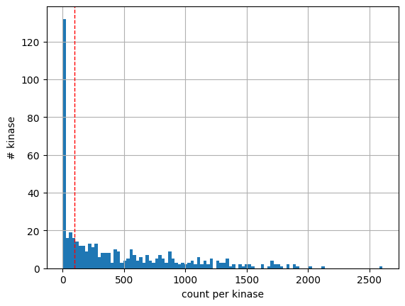

# Prepare kinase-substrate dataset


<!-- WARNING: THIS FILE WAS AUTOGENERATED! DO NOT EDIT! -->

``` python
from matplotlib import pyplot as plt
import pandas as pd
import numpy as np
import seaborn as sns
from scipy.stats import spearmanr, pearsonr
```

## Large scale dataset

``` python
# large_scale data
LS= pd.read_excel('raw/large_scale_final2.xlsx')

LS['gene_site'] = LS['S_position']

LS = LS[['Kinase','gene_site','substrate']]

LS_info = pd.read_csv('raw/LS_info.csv')

LS = LS.merge(LS_info).drop(columns = ['count'])
```

## PhosphoSitePlus dataset

``` python
KS = pd.read_csv('raw/Kinase_Substrate_Dataset_final.csv')

# only keep human kinase substrate pairs
KS = KS.query('KIN_ORGANISM=="human"')

# remove the substrate that does not have sty in the middle
KS = KS[KS.substrate.str[7].isin(['s','t','y'])].reset_index(drop=True)

KS['gene_site'] = KS.SUB_GENE.str.upper() + "_"+KS.SUB_MOD_RSD

KS = KS[['Kinase','gene_site','substrate','kinase_uniprot','kinase_paper']]
```

## Combine

``` python
KS['source'] = 'pplus'

LS['source'] = 'large_scale'
```

``` python
df = pd.concat([KS,LS]).reset_index(drop=True)
```

``` python
df
```

<div>
<style scoped>
    .dataframe tbody tr th:only-of-type {
        vertical-align: middle;
    }
&#10;    .dataframe tbody tr th {
        vertical-align: top;
    }
&#10;    .dataframe thead th {
        text-align: right;
    }
</style>

<table class="dataframe" data-quarto-postprocess="true" data-border="1">
<thead>
<tr class="header" style="text-align: right;">
<th data-quarto-table-cell-role="th"></th>
<th data-quarto-table-cell-role="th">Kinase</th>
<th data-quarto-table-cell-role="th">gene_site</th>
<th data-quarto-table-cell-role="th">substrate</th>
<th data-quarto-table-cell-role="th">kinase_uniprot</th>
<th data-quarto-table-cell-role="th">kinase_paper</th>
<th data-quarto-table-cell-role="th">source</th>
</tr>
</thead>
<tbody>
<tr class="odd">
<td data-quarto-table-cell-role="th">0</td>
<td>DYRK2</td>
<td>GLI2_S385</td>
<td>AEGLRPAsPLGLTQE</td>
<td>Q92630</td>
<td>DYRK2</td>
<td>pplus</td>
</tr>
<tr class="even">
<td data-quarto-table-cell-role="th">1</td>
<td>DYRK2</td>
<td>SIAH2_S68</td>
<td>GGGAGPVsPQHHELT</td>
<td>Q92630</td>
<td>DYRK2</td>
<td>pplus</td>
</tr>
<tr class="odd">
<td data-quarto-table-cell-role="th">2</td>
<td>DYRK2</td>
<td>CARHSP1_S41</td>
<td>LRGNVVPsPLPtRRt</td>
<td>Q92630</td>
<td>DYRK2</td>
<td>pplus</td>
</tr>
<tr class="even">
<td data-quarto-table-cell-role="th">3</td>
<td>DYRK2</td>
<td>DCX_S306</td>
<td>GPMRRSKsPADSANG</td>
<td>Q92630</td>
<td>DYRK2</td>
<td>pplus</td>
</tr>
<tr class="odd">
<td data-quarto-table-cell-role="th">4</td>
<td>DYRK2</td>
<td>CDC25A_S283</td>
<td>PErsQEEsPPGSTKr</td>
<td>Q92630</td>
<td>DYRK2</td>
<td>pplus</td>
</tr>
<tr class="even">
<td data-quarto-table-cell-role="th">...</td>
<td>...</td>
<td>...</td>
<td>...</td>
<td>...</td>
<td>...</td>
<td>...</td>
</tr>
<tr class="odd">
<td data-quarto-table-cell-role="th">216464</td>
<td>SPHK1</td>
<td>HERC2_S2928</td>
<td>AAVPFLAsDNEEEED</td>
<td>Q9NYA1</td>
<td>NaN</td>
<td>large_scale</td>
</tr>
<tr class="even">
<td data-quarto-table-cell-role="th">216465</td>
<td>SPHK1</td>
<td>PARG_Y832</td>
<td>DALHFRRyLDQFVPE</td>
<td>Q9NYA1</td>
<td>NaN</td>
<td>large_scale</td>
</tr>
<tr class="odd">
<td data-quarto-table-cell-role="th">216466</td>
<td>SPHK1</td>
<td>G6PI_T109</td>
<td>ALRNRsNtPILVDGK</td>
<td>Q9NYA1</td>
<td>NaN</td>
<td>large_scale</td>
</tr>
<tr class="even">
<td data-quarto-table-cell-role="th">216467</td>
<td>PRPK</td>
<td>TITIN_S20761</td>
<td>DAERKSWsTVTTECs</td>
<td>Q96S44</td>
<td>PRPK</td>
<td>large_scale</td>
</tr>
<tr class="odd">
<td data-quarto-table-cell-role="th">216468</td>
<td>PRPK</td>
<td>TITIN_S20768</td>
<td>sTVTTECsKTSFRVA</td>
<td>Q96S44</td>
<td>PRPK</td>
<td>large_scale</td>
</tr>
</tbody>
</table>

<p>216469 rows × 6 columns</p>
</div>

``` python
# kinase without mapping
df.loc[df.kinase_paper.isna()].Kinase.value_counts()
```

    Kinase
    LYNb            1694
    ABL1[T315I]     1320
    ABL1[E255K]     1274
    RET[M918T]      1221
    FGFR3[K650M]    1220
                    ... 
    GRP78              1
    TAO3               1
    PIK3CD             1
    PIK3CB             1
    G11                1
    Name: count, Length: 80, dtype: int64

``` python
df.substrate.str[7].value_counts()
```

    substrate
    y    109225
    s     74830
    t     32414
    Name: count, dtype: int64

``` python
df.source.value_counts()
```

    source
    large_scale    198248
    pplus           18221
    Name: count, dtype: int64

``` python
len(df)
```

    216469

``` python
df['substrate'] = df['substrate'].\
str.replace('r', 'R').\
str.replace('k', 'K').\
str.replace('n', 'N').\
str.replace('d', 'D').\
str.replace('h', 'H').\
str.replace('c', 'C').\
str.replace('X', '_').\
str.replace('p', 'P').\
str.replace('a', 'A').\
str.replace('v', 'V').\
str.replace('g', 'G').\
str.replace('m', 'M').\
str.replace('l', 'L').\
str.replace('q', 'Q').\
str.replace('f', 'F')
```

Split phosphosite sequence to single amino acid

``` python
df
```

<div>
<style scoped>
    .dataframe tbody tr th:only-of-type {
        vertical-align: middle;
    }
&#10;    .dataframe tbody tr th {
        vertical-align: top;
    }
&#10;    .dataframe thead th {
        text-align: right;
    }
</style>

<table class="dataframe" data-quarto-postprocess="true" data-border="1">
<thead>
<tr class="header" style="text-align: right;">
<th data-quarto-table-cell-role="th"></th>
<th data-quarto-table-cell-role="th">Kinase</th>
<th data-quarto-table-cell-role="th">gene_site</th>
<th data-quarto-table-cell-role="th">substrate</th>
<th data-quarto-table-cell-role="th">kinase_uniprot</th>
<th data-quarto-table-cell-role="th">kinase_paper</th>
<th data-quarto-table-cell-role="th">source</th>
</tr>
</thead>
<tbody>
<tr class="odd">
<td data-quarto-table-cell-role="th">0</td>
<td>DYRK2</td>
<td>GLI2_S385</td>
<td>AEGLRPAsPLGLTQE</td>
<td>Q92630</td>
<td>DYRK2</td>
<td>pplus</td>
</tr>
<tr class="even">
<td data-quarto-table-cell-role="th">1</td>
<td>DYRK2</td>
<td>SIAH2_S68</td>
<td>GGGAGPVsPQHHELT</td>
<td>Q92630</td>
<td>DYRK2</td>
<td>pplus</td>
</tr>
<tr class="odd">
<td data-quarto-table-cell-role="th">2</td>
<td>DYRK2</td>
<td>CARHSP1_S41</td>
<td>LRGNVVPsPLPtRRt</td>
<td>Q92630</td>
<td>DYRK2</td>
<td>pplus</td>
</tr>
<tr class="even">
<td data-quarto-table-cell-role="th">3</td>
<td>DYRK2</td>
<td>DCX_S306</td>
<td>GPMRRSKsPADSANG</td>
<td>Q92630</td>
<td>DYRK2</td>
<td>pplus</td>
</tr>
<tr class="odd">
<td data-quarto-table-cell-role="th">4</td>
<td>DYRK2</td>
<td>CDC25A_S283</td>
<td>PERsQEEsPPGSTKR</td>
<td>Q92630</td>
<td>DYRK2</td>
<td>pplus</td>
</tr>
<tr class="even">
<td data-quarto-table-cell-role="th">...</td>
<td>...</td>
<td>...</td>
<td>...</td>
<td>...</td>
<td>...</td>
<td>...</td>
</tr>
<tr class="odd">
<td data-quarto-table-cell-role="th">216464</td>
<td>SPHK1</td>
<td>HERC2_S2928</td>
<td>AAVPFLAsDNEEEED</td>
<td>Q9NYA1</td>
<td>NaN</td>
<td>large_scale</td>
</tr>
<tr class="even">
<td data-quarto-table-cell-role="th">216465</td>
<td>SPHK1</td>
<td>PARG_Y832</td>
<td>DALHFRRyLDQFVPE</td>
<td>Q9NYA1</td>
<td>NaN</td>
<td>large_scale</td>
</tr>
<tr class="odd">
<td data-quarto-table-cell-role="th">216466</td>
<td>SPHK1</td>
<td>G6PI_T109</td>
<td>ALRNRsNtPILVDGK</td>
<td>Q9NYA1</td>
<td>NaN</td>
<td>large_scale</td>
</tr>
<tr class="even">
<td data-quarto-table-cell-role="th">216467</td>
<td>PRPK</td>
<td>TITIN_S20761</td>
<td>DAERKSWsTVTTECs</td>
<td>Q96S44</td>
<td>PRPK</td>
<td>large_scale</td>
</tr>
<tr class="odd">
<td data-quarto-table-cell-role="th">216468</td>
<td>PRPK</td>
<td>TITIN_S20768</td>
<td>sTVTTECsKTSFRVA</td>
<td>Q96S44</td>
<td>PRPK</td>
<td>large_scale</td>
</tr>
</tbody>
</table>

<p>216469 rows × 6 columns</p>
</div>

## Split site sequence to individual columns

``` python
# Split the 'SITE_+/-7_AA' column into individual letters
split_cols = df['substrate'].apply(list).apply(pd.Series).fillna('_')

# Rename the new columns from -7 to 7
split_cols.columns = range(-7, 8)

# Concatenate the original dataframe with the split columns
df = pd.concat([df, split_cols], axis=1)
```

``` python
df
```

<div>
<style scoped>
    .dataframe tbody tr th:only-of-type {
        vertical-align: middle;
    }
&#10;    .dataframe tbody tr th {
        vertical-align: top;
    }
&#10;    .dataframe thead th {
        text-align: right;
    }
</style>

<table class="dataframe" data-quarto-postprocess="true" data-border="1">
<thead>
<tr class="header" style="text-align: right;">
<th data-quarto-table-cell-role="th"></th>
<th data-quarto-table-cell-role="th">Kinase</th>
<th data-quarto-table-cell-role="th">gene_site</th>
<th data-quarto-table-cell-role="th">substrate</th>
<th data-quarto-table-cell-role="th">kinase_uniprot</th>
<th data-quarto-table-cell-role="th">kinase_paper</th>
<th data-quarto-table-cell-role="th">source</th>
<th data-quarto-table-cell-role="th">-7</th>
<th data-quarto-table-cell-role="th">-6</th>
<th data-quarto-table-cell-role="th">-5</th>
<th data-quarto-table-cell-role="th">-4</th>
<th data-quarto-table-cell-role="th">...</th>
<th data-quarto-table-cell-role="th">-2</th>
<th data-quarto-table-cell-role="th">-1</th>
<th data-quarto-table-cell-role="th">0</th>
<th data-quarto-table-cell-role="th">1</th>
<th data-quarto-table-cell-role="th">2</th>
<th data-quarto-table-cell-role="th">3</th>
<th data-quarto-table-cell-role="th">4</th>
<th data-quarto-table-cell-role="th">5</th>
<th data-quarto-table-cell-role="th">6</th>
<th data-quarto-table-cell-role="th">7</th>
</tr>
</thead>
<tbody>
<tr class="odd">
<td data-quarto-table-cell-role="th">0</td>
<td>DYRK2</td>
<td>GLI2_S385</td>
<td>AEGLRPAsPLGLTQE</td>
<td>Q92630</td>
<td>DYRK2</td>
<td>pplus</td>
<td>A</td>
<td>E</td>
<td>G</td>
<td>L</td>
<td>...</td>
<td>P</td>
<td>A</td>
<td>s</td>
<td>P</td>
<td>L</td>
<td>G</td>
<td>L</td>
<td>T</td>
<td>Q</td>
<td>E</td>
</tr>
<tr class="even">
<td data-quarto-table-cell-role="th">1</td>
<td>DYRK2</td>
<td>SIAH2_S68</td>
<td>GGGAGPVsPQHHELT</td>
<td>Q92630</td>
<td>DYRK2</td>
<td>pplus</td>
<td>G</td>
<td>G</td>
<td>G</td>
<td>A</td>
<td>...</td>
<td>P</td>
<td>V</td>
<td>s</td>
<td>P</td>
<td>Q</td>
<td>H</td>
<td>H</td>
<td>E</td>
<td>L</td>
<td>T</td>
</tr>
<tr class="odd">
<td data-quarto-table-cell-role="th">2</td>
<td>DYRK2</td>
<td>CARHSP1_S41</td>
<td>LRGNVVPsPLPtRRt</td>
<td>Q92630</td>
<td>DYRK2</td>
<td>pplus</td>
<td>L</td>
<td>R</td>
<td>G</td>
<td>N</td>
<td>...</td>
<td>V</td>
<td>P</td>
<td>s</td>
<td>P</td>
<td>L</td>
<td>P</td>
<td>t</td>
<td>R</td>
<td>R</td>
<td>t</td>
</tr>
<tr class="even">
<td data-quarto-table-cell-role="th">3</td>
<td>DYRK2</td>
<td>DCX_S306</td>
<td>GPMRRSKsPADSANG</td>
<td>Q92630</td>
<td>DYRK2</td>
<td>pplus</td>
<td>G</td>
<td>P</td>
<td>M</td>
<td>R</td>
<td>...</td>
<td>S</td>
<td>K</td>
<td>s</td>
<td>P</td>
<td>A</td>
<td>D</td>
<td>S</td>
<td>A</td>
<td>N</td>
<td>G</td>
</tr>
<tr class="odd">
<td data-quarto-table-cell-role="th">4</td>
<td>DYRK2</td>
<td>CDC25A_S283</td>
<td>PERsQEEsPPGSTKR</td>
<td>Q92630</td>
<td>DYRK2</td>
<td>pplus</td>
<td>P</td>
<td>E</td>
<td>R</td>
<td>s</td>
<td>...</td>
<td>E</td>
<td>E</td>
<td>s</td>
<td>P</td>
<td>P</td>
<td>G</td>
<td>S</td>
<td>T</td>
<td>K</td>
<td>R</td>
</tr>
<tr class="even">
<td data-quarto-table-cell-role="th">...</td>
<td>...</td>
<td>...</td>
<td>...</td>
<td>...</td>
<td>...</td>
<td>...</td>
<td>...</td>
<td>...</td>
<td>...</td>
<td>...</td>
<td>...</td>
<td>...</td>
<td>...</td>
<td>...</td>
<td>...</td>
<td>...</td>
<td>...</td>
<td>...</td>
<td>...</td>
<td>...</td>
<td>...</td>
</tr>
<tr class="odd">
<td data-quarto-table-cell-role="th">216464</td>
<td>SPHK1</td>
<td>HERC2_S2928</td>
<td>AAVPFLAsDNEEEED</td>
<td>Q9NYA1</td>
<td>NaN</td>
<td>large_scale</td>
<td>A</td>
<td>A</td>
<td>V</td>
<td>P</td>
<td>...</td>
<td>L</td>
<td>A</td>
<td>s</td>
<td>D</td>
<td>N</td>
<td>E</td>
<td>E</td>
<td>E</td>
<td>E</td>
<td>D</td>
</tr>
<tr class="even">
<td data-quarto-table-cell-role="th">216465</td>
<td>SPHK1</td>
<td>PARG_Y832</td>
<td>DALHFRRyLDQFVPE</td>
<td>Q9NYA1</td>
<td>NaN</td>
<td>large_scale</td>
<td>D</td>
<td>A</td>
<td>L</td>
<td>H</td>
<td>...</td>
<td>R</td>
<td>R</td>
<td>y</td>
<td>L</td>
<td>D</td>
<td>Q</td>
<td>F</td>
<td>V</td>
<td>P</td>
<td>E</td>
</tr>
<tr class="odd">
<td data-quarto-table-cell-role="th">216466</td>
<td>SPHK1</td>
<td>G6PI_T109</td>
<td>ALRNRsNtPILVDGK</td>
<td>Q9NYA1</td>
<td>NaN</td>
<td>large_scale</td>
<td>A</td>
<td>L</td>
<td>R</td>
<td>N</td>
<td>...</td>
<td>s</td>
<td>N</td>
<td>t</td>
<td>P</td>
<td>I</td>
<td>L</td>
<td>V</td>
<td>D</td>
<td>G</td>
<td>K</td>
</tr>
<tr class="even">
<td data-quarto-table-cell-role="th">216467</td>
<td>PRPK</td>
<td>TITIN_S20761</td>
<td>DAERKSWsTVTTECs</td>
<td>Q96S44</td>
<td>PRPK</td>
<td>large_scale</td>
<td>D</td>
<td>A</td>
<td>E</td>
<td>R</td>
<td>...</td>
<td>S</td>
<td>W</td>
<td>s</td>
<td>T</td>
<td>V</td>
<td>T</td>
<td>T</td>
<td>E</td>
<td>C</td>
<td>s</td>
</tr>
<tr class="odd">
<td data-quarto-table-cell-role="th">216468</td>
<td>PRPK</td>
<td>TITIN_S20768</td>
<td>sTVTTECsKTSFRVA</td>
<td>Q96S44</td>
<td>PRPK</td>
<td>large_scale</td>
<td>s</td>
<td>T</td>
<td>V</td>
<td>T</td>
<td>...</td>
<td>E</td>
<td>C</td>
<td>s</td>
<td>K</td>
<td>T</td>
<td>S</td>
<td>F</td>
<td>R</td>
<td>V</td>
<td>A</td>
</tr>
</tbody>
</table>

<p>216469 rows × 21 columns</p>
</div>

## Add extra columns

``` python
df['kinase'] = df['kinase_paper'].fillna(df['Kinase'])

df['on_tree']=df['kinase_paper'].notna().astype(int)
```

## Save

> Uncheck below

``` python
df.columns = df.columns.astype(str) # Parquet can only save df with string column name
df.to_parquet('raw/df.parquet')
```

## Load data

> Need to convert the number in the columns to integer type

``` python
df = pd.read_parquet('raw/df.parquet')
#Convert the number in the column name into integer
df.columns = [int(col) if col.lstrip('-').isdigit() else col for col in df.columns]
```

## Visualize counts

``` python
df.kinase.value_counts().hist(bins=100)
plt.axvline(x=100, color='r', linestyle='--', linewidth=1)
plt.xlabel('count per kinase')
plt.ylabel('# kinase');
```



``` python
cnt = df.kinase.value_counts().reset_index()
```

``` python
cnt.columns = ['kinase','count']
```

``` python
cnt
```

<div>
<style scoped>
    .dataframe tbody tr th:only-of-type {
        vertical-align: middle;
    }
&#10;    .dataframe tbody tr th {
        vertical-align: top;
    }
&#10;    .dataframe thead th {
        text-align: right;
    }
</style>

<table class="dataframe" data-quarto-postprocess="true" data-border="1">
<thead>
<tr class="header" style="text-align: right;">
<th data-quarto-table-cell-role="th"></th>
<th data-quarto-table-cell-role="th">kinase</th>
<th data-quarto-table-cell-role="th">count</th>
</tr>
</thead>
<tbody>
<tr class="odd">
<td data-quarto-table-cell-role="th">0</td>
<td>SRC</td>
<td>2605</td>
</tr>
<tr class="even">
<td data-quarto-table-cell-role="th">1</td>
<td>EPHA3</td>
<td>2120</td>
</tr>
<tr class="odd">
<td data-quarto-table-cell-role="th">2</td>
<td>FES</td>
<td>2013</td>
</tr>
<tr class="even">
<td data-quarto-table-cell-role="th">3</td>
<td>NTRK3</td>
<td>1927</td>
</tr>
<tr class="odd">
<td data-quarto-table-cell-role="th">4</td>
<td>ALK</td>
<td>1889</td>
</tr>
<tr class="even">
<td data-quarto-table-cell-role="th">...</td>
<td>...</td>
<td>...</td>
</tr>
<tr class="odd">
<td data-quarto-table-cell-role="th">488</td>
<td>CAMK1G</td>
<td>1</td>
</tr>
<tr class="even">
<td data-quarto-table-cell-role="th">489</td>
<td>CAMK2D iso8</td>
<td>1</td>
</tr>
<tr class="odd">
<td data-quarto-table-cell-role="th">490</td>
<td>PHKA1</td>
<td>1</td>
</tr>
<tr class="even">
<td data-quarto-table-cell-role="th">491</td>
<td>VPRBP</td>
<td>1</td>
</tr>
<tr class="odd">
<td data-quarto-table-cell-role="th">492</td>
<td>NEK10</td>
<td>1</td>
</tr>
</tbody>
</table>

<p>493 rows × 2 columns</p>
</div>
