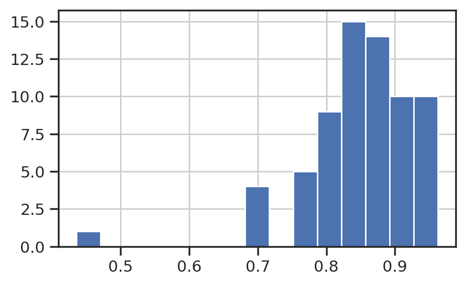
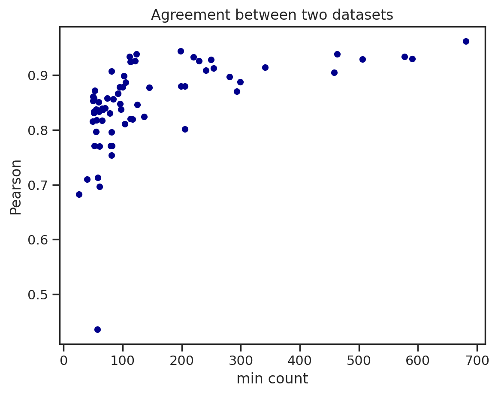
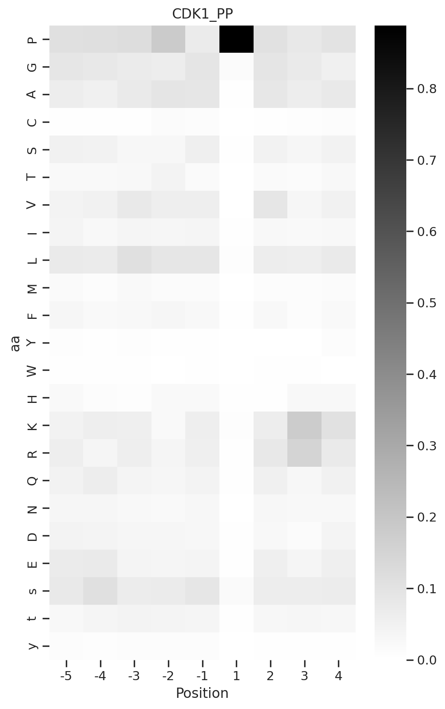
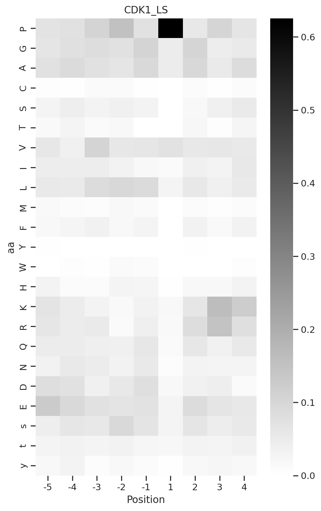
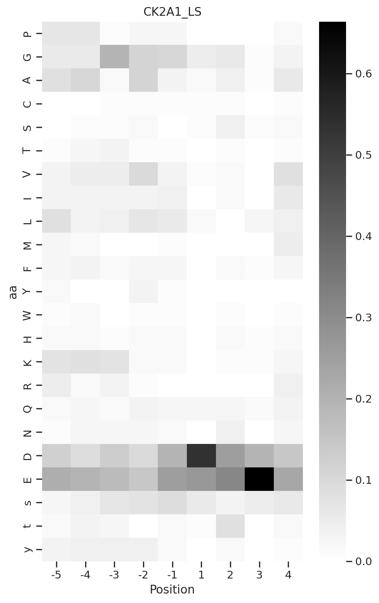

# Compare PhosphoSitePlus and Large-scale datasets


<!-- WARNING: THIS FILE WAS AUTOGENERATED! DO NOT EDIT! -->

## Setup

``` python
from katlas.core import *
from katlas.plot import *

import pandas as pd
import numpy as np

import matplotlib.pyplot as plt
import seaborn as sns

from scipy.stats import spearmanr, pearsonr
```

``` python
sns.set(rc={"figure.dpi":200, 'savefig.dpi':200})
sns.set_context('notebook')
sns.set_style("ticks")
```

## Load data

``` python
df = Data.get_ks_dataset()
```

``` python
df['SUB'] = df.substrate.str.upper()
```

``` python
PP = df.query('source == "pplus"').reset_index(drop=True)

LS = df.query('source == "large_scale"').reset_index(drop=True)
```

## Get overlap

``` python
cnt = PP[PP.kinase_paper.isin(LS.kinase_paper)].kinase_paper.value_counts()
```

``` python
overlap_PP = cnt[cnt>50]
```

## Calculate Pearson

``` python
data = []
for k in overlap_PP.index:

    
    PP_k = PP.query(f'kinase_paper=="{k}"')
    LS_k = LS.query(f'kinase_paper=="{k}"')
    
    # drop duplicates
    PP_k = PP_k.drop_duplicates(subset = 'SUB')
    LS_k = LS_k.drop_duplicates(subset = 'SUB')
    
    PP_cnt = PP_k.shape[0]
    LS_cnt = LS_k.shape[0]
    
    PP_paper, PP_full = get_freq(PP_k)
    LS_paper, LS_full = get_freq(LS_k)
    
#     plot_heatmap(PP_paper,f'{k}_PP')
#     plt.show()
#     plt.close()
    
#     plot_heatmap(LS_paper,f'{k}_LS')
#     plt.show()
#     plt.close()

    # Get pearson of full heatmap, then average
    corr_full,_ = pearsonr(PP_full.unstack().values,LS_full.unstack().values)

    data.append([k,corr_full,PP_cnt,LS_cnt])
```

``` python
PP_LS = pd.DataFrame(data,columns=['kinase','pearson',
                                   'PP_cnt','LS_cnt'])
```

``` python
PP_LS.sort_values('pearson')
```

<div>
<style scoped>
    .dataframe tbody tr th:only-of-type {
        vertical-align: middle;
    }
&#10;    .dataframe tbody tr th {
        vertical-align: top;
    }
&#10;    .dataframe thead th {
        text-align: right;
    }
</style>

<table class="dataframe" data-quarto-postprocess="true" data-border="1">
<thead>
<tr class="header" style="text-align: right;">
<th data-quarto-table-cell-role="th"></th>
<th data-quarto-table-cell-role="th">kinase</th>
<th data-quarto-table-cell-role="th">pearson</th>
<th data-quarto-table-cell-role="th">PP_cnt</th>
<th data-quarto-table-cell-role="th">LS_cnt</th>
</tr>
</thead>
<tbody>
<tr class="odd">
<td data-quarto-table-cell-role="th">38</td>
<td>LRRK2</td>
<td>0.435784</td>
<td>93</td>
<td>57</td>
</tr>
<tr class="even">
<td data-quarto-table-cell-role="th">51</td>
<td>TTK</td>
<td>0.682803</td>
<td>68</td>
<td>26</td>
</tr>
<tr class="odd">
<td data-quarto-table-cell-role="th">54</td>
<td>CK1E</td>
<td>0.696732</td>
<td>61</td>
<td>281</td>
</tr>
<tr class="even">
<td data-quarto-table-cell-role="th">23</td>
<td>MTOR</td>
<td>0.709667</td>
<td>146</td>
<td>40</td>
</tr>
<tr class="odd">
<td data-quarto-table-cell-role="th">57</td>
<td>CDK7</td>
<td>0.713317</td>
<td>58</td>
<td>148</td>
</tr>
<tr class="even">
<td data-quarto-table-cell-role="th">...</td>
<td>...</td>
<td>...</td>
<td>...</td>
<td>...</td>
</tr>
<tr class="odd">
<td data-quarto-table-cell-role="th">0</td>
<td>PKACA</td>
<td>0.934050</td>
<td>986</td>
<td>577</td>
</tr>
<tr class="even">
<td data-quarto-table-cell-role="th">2</td>
<td>CK2A1</td>
<td>0.938478</td>
<td>767</td>
<td>123</td>
</tr>
<tr class="odd">
<td data-quarto-table-cell-role="th">1</td>
<td>CDK1</td>
<td>0.938668</td>
<td>761</td>
<td>463</td>
</tr>
<tr class="even">
<td data-quarto-table-cell-role="th">19</td>
<td>FYN</td>
<td>0.944152</td>
<td>198</td>
<td>1362</td>
</tr>
<tr class="odd">
<td data-quarto-table-cell-role="th">4</td>
<td>SRC</td>
<td>0.962360</td>
<td>681</td>
<td>1664</td>
</tr>
</tbody>
</table>

<p>68 rows × 4 columns</p>
</div>

``` python
PP_LS['min_cnt'] = PP_LS[['PP_cnt','LS_cnt']].min(axis=1)
```

``` python
sns.set(rc={"figure.dpi":200, 'savefig.dpi':200})
sns.set_context('notebook')
sns.set_style("ticks")

plt.figure(figsize=(5,3))
PP_LS.pearson.hist(bins=15);
```



``` python
PP_LS.plot.scatter(y='pearson',x='min_cnt',c = 'DarkBlue')
plt.ylabel('Pearson')
plt.xlabel('min count')
plt.title('Agreement between two datasets');
```



## Examples

``` python
# Get one example
k = 'CDK1'

PP_k = PP.query(f'kinase_paper=="{k}"')
LS_k = LS.query(f'kinase_paper=="{k}"')

# drop duplicates
PP_k = PP_k.drop_duplicates(subset = 'SUB')
LS_k = LS_k.drop_duplicates(subset = 'SUB')


PP_paper, PP_full = get_freq(PP_k)
LS_paper, LS_full = get_freq(LS_k)


plot_heatmap(PP_paper,f'{k}_PP')
plot_heatmap(LS_paper,f'{k}_LS')
```





``` python
k = 'CK2A1'

PP_k = PP.query(f'kinase_paper=="{k}"')
LS_k = LS.query(f'kinase_paper=="{k}"')

# drop duplicates
PP_k = PP_k.drop_duplicates(subset = 'SUB')
LS_k = LS_k.drop_duplicates(subset = 'SUB')

PP_paper, PP_full = get_freq(PP_k)
LS_paper, LS_full = get_freq(LS_k)


plot_heatmap(PP_paper,f'{k}_PP')
plot_heatmap(LS_paper,f'{k}_LS')
```



