# Compare CDDM and PSPA in Ser/Thr kinases


<!-- WARNING: THIS FILE WAS AUTOGENERATED! DO NOT EDIT! -->

## Setup

``` python
from katlas.imports import *
import os, seaborn as sns

from fastbook import *
from scipy.stats import spearmanr, pearsonr

from PIL import Image
from tqdm import tqdm

set_sns()
```

## Load data

``` python
df = Data.get_ks_dataset()
df['SUB'] = df.substrate.str.upper()
```

## Get overlap kinase

``` python
# normalized PSPA data
norm = pd.read_csv('raw/pspa_st_norm.csv')
raw = pd.read_csv('raw/pspa_st_raw.csv')
```

``` python
#get overlap and count
overlap_cnt = df[df.kinase_paper.isin(raw.kinase)].kinase_paper.value_counts()
```

``` python
overlap_cnt
```

    kinase_paper
    PKACA     1740
    ERK2      1380
    CDK1      1325
    IKKB      1297
    ERK1      1160
              ... 
    HUNK         1
    MLK4         1
    CAMK1G       1
    CK1A2        1
    DRAK1        1
    Name: count, Length: 286, dtype: int64

``` python
overlap_cnt = overlap_cnt[overlap_cnt>100]
```

``` python
overlap_cnt
```

    kinase_paper
    PKACA    1740
    ERK2     1380
    CDK1     1325
    IKKB     1297
    ERK1     1160
             ... 
    HIPK3     110
    CDK8      107
    BUB1      106
    MEKK3     104
    GRK1      101
    Name: count, Length: 202, dtype: int64

``` python
# PSPA data
raw = raw.set_index('kinase')
norm = norm.set_index('kinase')
```

## Plot

``` python
sns.set(rc={"figure.dpi":200, 'savefig.dpi':200})
sns.set_context('notebook')
sns.set_style("ticks")
```

``` python
# aa_order = [i for i in 'PGACSTVILMFYWHKRQNDEsty']
aa_order_paper = [i for i in 'PGACSTVILMFYWHKRQNDEsty']
# position = [i for i in range(-7,8)]
position_paper = [-5,-4,-3,-2,-1,1,2,3,4]
```

### Dataset-driven vs. normalized

To generate all of other figures and save them, uncheck plt.savefig, and
comment out plt.show() and break

``` python
set_sns()
```

``` python
for k in tqdm(overlap_cnt.index,total=len(overlap_cnt)):
    df_k = df.query(f'kinase_paper=="{k}"')
    df_k = df_k.drop_duplicates(subset='SUB').reset_index()
    
    paper,full = get_freq(df_k)
    raw_k = get_one_kinase(norm,k,drop_s=False).T.reindex(index=aa_order_paper,columns=position_paper).round(3)
    
    plot_heatmap(paper,f'{k} from CDDM (n={overlap_cnt[k]})')
    # plt.savefig(f'corr/KS/{k}.png',bbox_inches='tight', pad_inches=0.05)
    plt.show()
    plt.close()

    plot_heatmap(raw_k,f'{k} from PSPA')
    # plt.savefig(f'corr/PSPA/{k}.png',bbox_inches='tight', pad_inches=0.05)
    plt.show()
    plt.close()

    plot_corr(y = paper.unstack().values, #dataset driven
              x = raw_k.unstack().values, # PSPA
              ylabel='CDDM',
              xlabel='PSPA')
    plt.title(k)
    # plt.savefig(f'corr/pear/{k}.png',bbox_inches='tight', pad_inches=0.2)
    plt.show()
    plt.close()
    
    break
```

      0%|          | 0/202 [00:00<?, ?it/s]

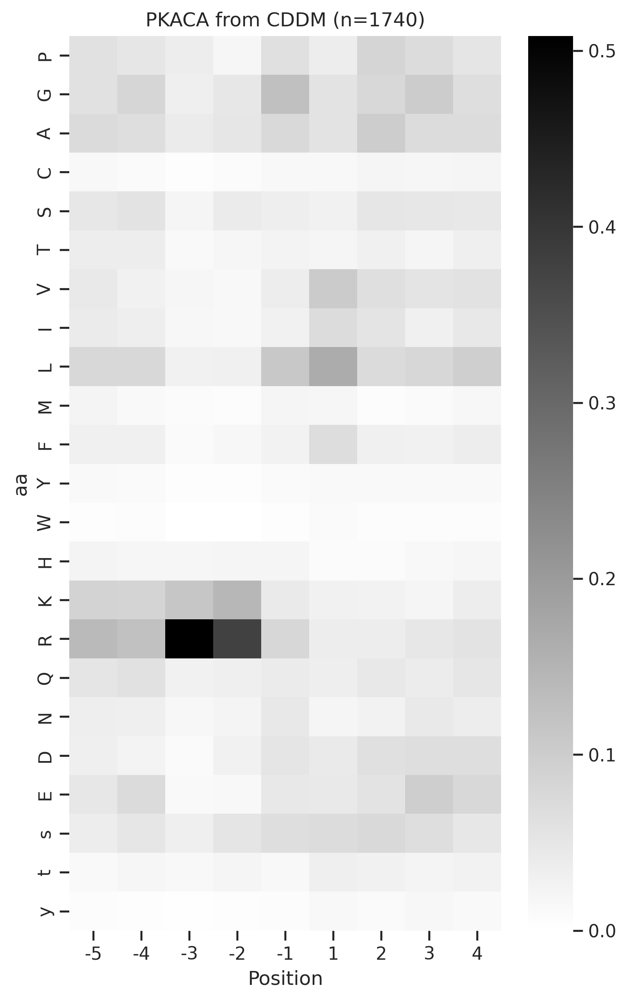

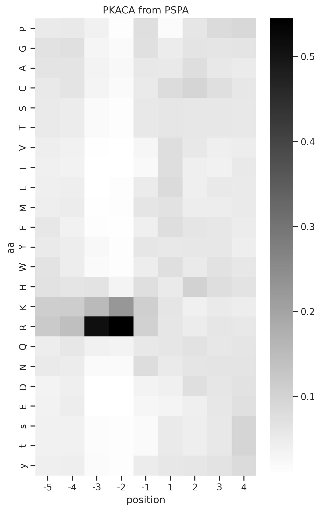

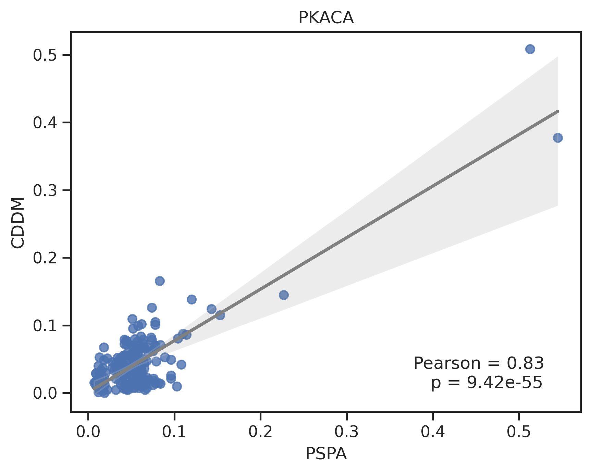

      0%|          | 0/202 [00:00<?, ?it/s]

Combine the figures: correlation on top, and two heatmaps on the bottom

``` python
def combine_images_custom_layout(image_paths, output_path):
    images = [Image.open(image_path).convert('RGBA') for image_path in image_paths]
    
    # Calculate total width and height for the new image
    total_width = max(images[0].width, images[1].width + images[2].width)
    total_height = images[0].height + max(images[1].height, images[2].height)
    
    # Create a new image with calculated dimensions
    combined_image = Image.new('RGBA', (total_width, total_height))
    
    # Paste the first image at the top-center
    x_offset = (total_width - images[0].width) // 2
    combined_image.paste(images[0], (x_offset, 0), images[0])
    
    # Paste the second image at the bottom-left
    combined_image.paste(images[1], (0, images[0].height), images[1])
    
    # Paste the third image at the bottom-right
    combined_image.paste(images[2], (images[1].width, images[0].height), images[2])
    
    # Save the result
    combined_image.save(output_path)
```

Uncheck below to save combined figures

``` python
# folders = ["corr/pear",'corr/KS','corr/PSPA']

# for k in tqdm(overlap_cnt.index,total=len(overlap_cnt)):
#     filename = f"{k}.png"
#     image_paths = [os.path.join(folder, filename) for folder in folders]
#     output_path = f"corr/combine/{k}.png"
#     combine_images_custom_layout(image_paths, output_path)
#     # break
```

## Plot comparison

***Correlation with raw PSPA***

``` python
data = []
for k in tqdm(overlap_cnt.index):
    df_k = df.query(f'kinase_paper=="{k}"')
    df_k = df_k.drop_duplicates(subset='SUB').reset_index()
    
    cnt = df_k.shape[0]
    
    paper,full = get_freq(df_k)
    raw_k = get_one_kinase(raw,k,drop_s=False).T.reindex(index=aa_order_paper,columns=position_paper).round(3)
    
    full_corr,_ = pearsonr(raw_k.unstack().values,paper.unstack().values)
    
    data.append([k,full_corr,cnt])
```

    100%|██████████| 202/202 [00:04<00:00, 41.24it/s]

``` python
corr_raw = pd.DataFrame(data,columns= ['kinase','corr_with_raw','count_unique'])
```

***Correlation with normalized PSPA***

``` python
data = []
for k in overlap_cnt.index:
    df_k = df.query(f'kinase_paper=="{k}"')
    df_k = df_k.drop_duplicates(subset='SUB').reset_index()
    
    cnt = df_k.shape[0]
    
    paper,full = get_freq(df_k)
    norm_k = get_one_kinase(norm,k,drop_s=False).T.reindex(index=aa_order_paper,columns=position_paper).round(3)
    
    full_corr,_ = pearsonr(norm_k.unstack().values,paper.unstack().values)
    
    data.append([k,full_corr])
```

``` python
corr_norm = pd.DataFrame(data,columns= ['kinase','corr_with_norm',
                                ])
```

***Merge with specificity***

``` python
corr = corr_raw.merge(corr_norm)
```

``` python
m = pd.read_csv('raw/specificity_pspa.csv')
```

``` python
corr= corr.merge(m).rename(columns={'max':'specificity'})
```

``` python
corr
```

<div>
<style scoped>
    .dataframe tbody tr th:only-of-type {
        vertical-align: middle;
    }
&#10;    .dataframe tbody tr th {
        vertical-align: top;
    }
&#10;    .dataframe thead th {
        text-align: right;
    }
</style>

<table class="dataframe" data-quarto-postprocess="true" data-border="1">
<thead>
<tr class="header" style="text-align: right;">
<th data-quarto-table-cell-role="th"></th>
<th data-quarto-table-cell-role="th">kinase</th>
<th data-quarto-table-cell-role="th">corr_with_raw</th>
<th data-quarto-table-cell-role="th">count_unique</th>
<th data-quarto-table-cell-role="th">corr_with_norm</th>
<th data-quarto-table-cell-role="th">specificity</th>
</tr>
</thead>
<tbody>
<tr class="odd">
<td data-quarto-table-cell-role="th">0</td>
<td>PKACA</td>
<td>0.841437</td>
<td>1547</td>
<td>0.833627</td>
<td>0.476953</td>
</tr>
<tr class="even">
<td data-quarto-table-cell-role="th">1</td>
<td>ERK2</td>
<td>0.755683</td>
<td>1241</td>
<td>0.830667</td>
<td>0.510499</td>
</tr>
<tr class="odd">
<td data-quarto-table-cell-role="th">2</td>
<td>CDK1</td>
<td>0.867922</td>
<td>1197</td>
<td>0.880447</td>
<td>0.569784</td>
</tr>
<tr class="even">
<td data-quarto-table-cell-role="th">3</td>
<td>IKKB</td>
<td>0.151149</td>
<td>1133</td>
<td>0.278715</td>
<td>0.157279</td>
</tr>
<tr class="odd">
<td data-quarto-table-cell-role="th">4</td>
<td>ERK1</td>
<td>0.832991</td>
<td>1048</td>
<td>0.880669</td>
<td>0.567533</td>
</tr>
<tr class="even">
<td data-quarto-table-cell-role="th">...</td>
<td>...</td>
<td>...</td>
<td>...</td>
<td>...</td>
<td>...</td>
</tr>
<tr class="odd">
<td data-quarto-table-cell-role="th">197</td>
<td>HIPK3</td>
<td>0.650688</td>
<td>97</td>
<td>0.709181</td>
<td>0.399684</td>
</tr>
<tr class="even">
<td data-quarto-table-cell-role="th">198</td>
<td>CDK8</td>
<td>0.391844</td>
<td>89</td>
<td>0.479039</td>
<td>0.542519</td>
</tr>
<tr class="odd">
<td data-quarto-table-cell-role="th">199</td>
<td>BUB1</td>
<td>0.222991</td>
<td>86</td>
<td>0.253001</td>
<td>0.240232</td>
</tr>
<tr class="even">
<td data-quarto-table-cell-role="th">200</td>
<td>MEKK3</td>
<td>-0.100448</td>
<td>85</td>
<td>0.008627</td>
<td>0.127274</td>
</tr>
<tr class="odd">
<td data-quarto-table-cell-role="th">201</td>
<td>GRK1</td>
<td>0.278294</td>
<td>83</td>
<td>0.318144</td>
<td>0.184903</td>
</tr>
</tbody>
</table>

<p>202 rows × 5 columns</p>
</div>

``` python
corr.query('kinase == "CK1A"')
```

<div>
<style scoped>
    .dataframe tbody tr th:only-of-type {
        vertical-align: middle;
    }
&#10;    .dataframe tbody tr th {
        vertical-align: top;
    }
&#10;    .dataframe thead th {
        text-align: right;
    }
</style>

<table class="dataframe" data-quarto-postprocess="true" data-border="1">
<thead>
<tr class="header" style="text-align: right;">
<th data-quarto-table-cell-role="th"></th>
<th data-quarto-table-cell-role="th">kinase</th>
<th data-quarto-table-cell-role="th">corr_with_raw</th>
<th data-quarto-table-cell-role="th">count_unique</th>
<th data-quarto-table-cell-role="th">corr_with_norm</th>
<th data-quarto-table-cell-role="th">specificity</th>
</tr>
</thead>
<tbody>
<tr class="odd">
<td data-quarto-table-cell-role="th">116</td>
<td>CK1A</td>
<td>0.221291</td>
<td>293</td>
<td>0.227877</td>
<td>0.79104</td>
</tr>
</tbody>
</table>

</div>

***Pearson vs. Specificity***

``` python
plot_corr(x=corr.specificity.values,
          y=corr.corr_with_norm.values)
plt.ylabel('Pearson\n dataset-driven vs. raw PSPA')
plt.xlabel('Kinase specificity');
```

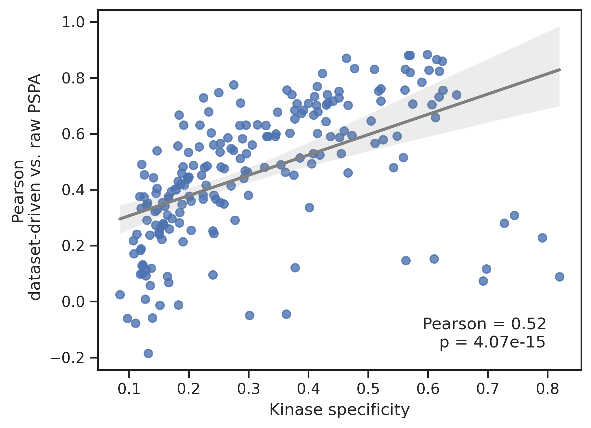

``` python
info = Data.get_kinase_info().query('pseudo=="0"')

corr2 = corr.merge(info)

color = load_pickle('raw/kinase_color.pkl')
```

``` python
plot_bar(corr2,'corr_with_norm','group',palette=color)
plt.ylabel('Pearson');
```

    /home/zeus/miniconda3/envs/cloudspace/lib/python3.10/site-packages/katlas/plot.py:406: FutureWarning: 

    Passing `palette` without assigning `hue` is deprecated and will be removed in v0.14.0. Assign the `x` variable to `hue` and set `legend=False` for the same effect.

      sns.barplot(data=df, x=group, y=value, order=idx, **kwargs)

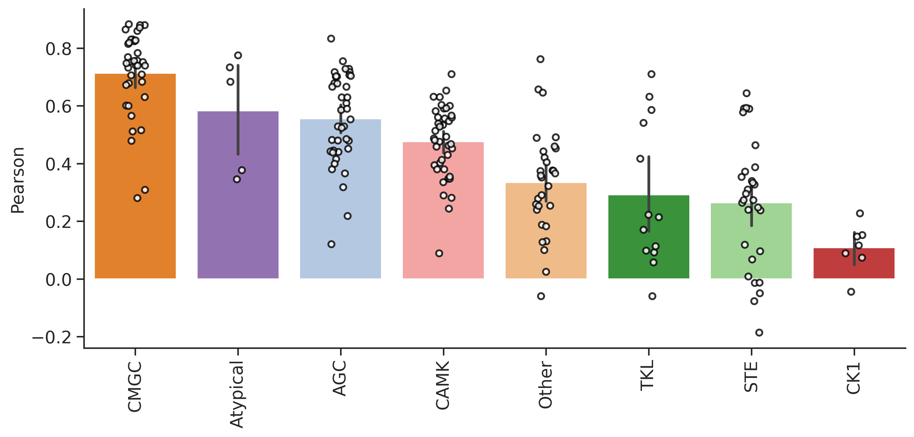

``` python
plt.figure(figsize=(7,3))
corr.corr_with_norm.hist(bins=20)
plt.xlabel('Pearson')
plt.ylabel('# Kinase')
plt.title('Distribution of Pearson score')
```

    Text(0.5, 1.0, 'Distribution of Pearson score')

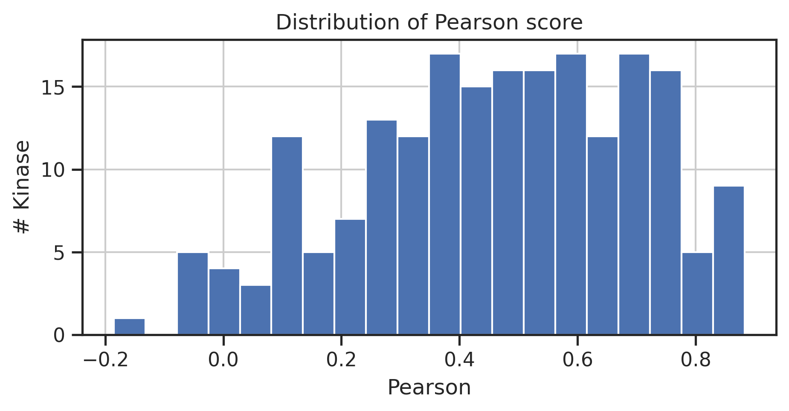

``` python
corr.plot.scatter(y='corr_with_norm',x='specificity',c='darkblue')
plt.ylabel('Pearson\n Dataset-driven vs. norm PSPA')
plt.xlabel('Kinase specificity');
# plt.title('Dataset-driven vs. raw PSPA')
```

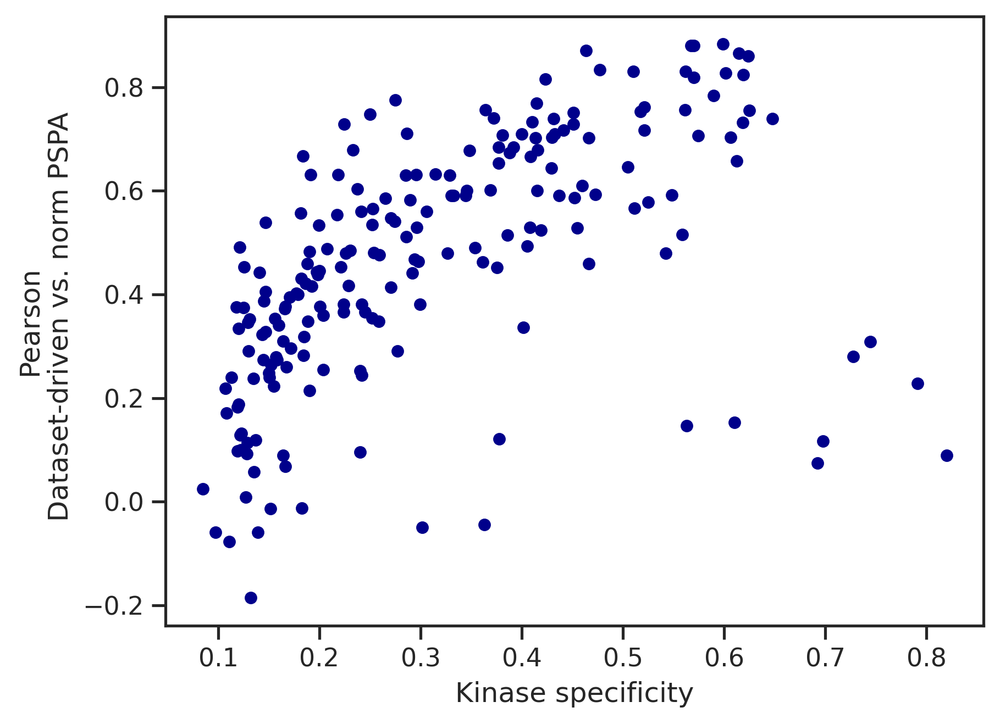

***Examples of outliers***

``` python
# Examples of data
k = 'CK1A'
df_k=df.query(f'kinase_paper == "{k}"')
df_k=df_k.drop_duplicates(subset='SUB')

paper, full = get_freq(df_k)

raw_k = get_one_kinase(raw,k,drop_s=False).T
raw_k = raw_k.reindex(index=aa_order_paper)

plot_heatmap(raw_k,f'{k} from raw PSPA')
plot_heatmap(paper,f'{k} from KS datasets (n={len(df_k)})')
```

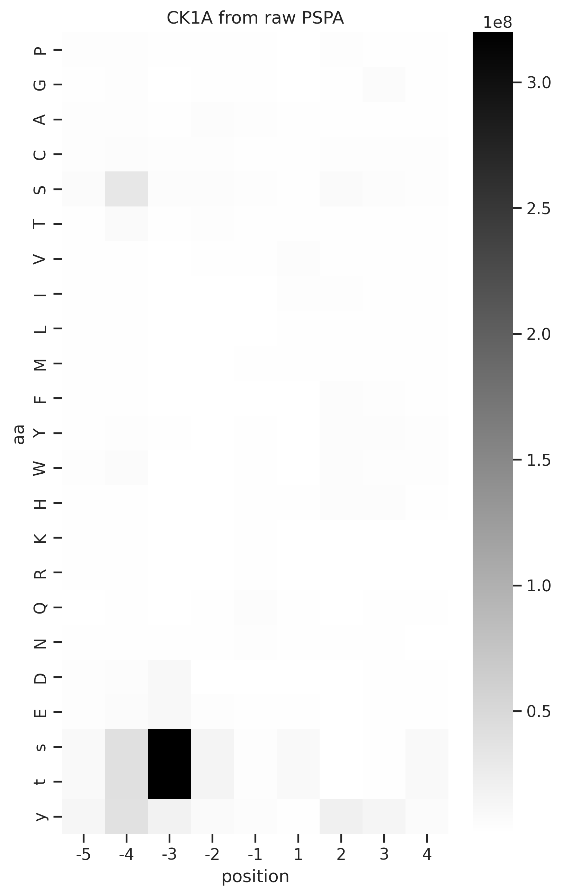

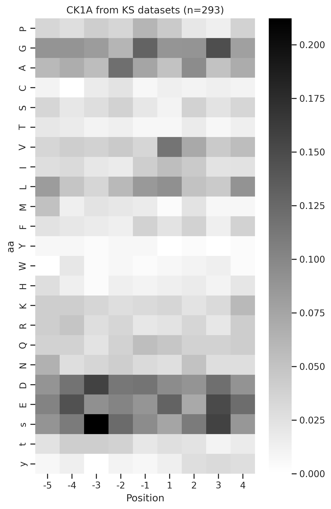

To check all of the outliers, uncheck below

``` python
# # Examples of data
# for k in corr.query('corr_with_norm<0.4 & specificity>0.55').kinase:
    
#     df_k=df.query(f'kinase_paper == "{k}"')
#     df_k=df_k.drop_duplicates(subset='SUB')

#     paper, full = get_freq(df_k)

#     raw_k = get_one_kinase(raw,k,drop_s=False).T
#     raw_k = raw_k.reindex(index=aa_order_paper)
    
#     plot_heatmap(raw_k,f'{k} from raw PSPA')
#     plot_heatmap(paper,f'{k} from KS datasets (n={len(df_k)})')
```

### Pearson with raw vs. Pearson with norm

``` python
melt = pd.melt(corr[['corr_with_raw','corr_with_norm']])
```

``` python
melt['variable'] = melt.variable.replace({'corr_with_raw':'raw','corr_with_norm':'normalized'})
```

``` python
def plot_box(data,x,y,dots=True):
    if dots:
        sns.stripplot(data=data,x=x,y=y)
    sns.boxplot(data=data, x=x, y=y, palette='pastel')
```

``` python
plot_box(melt,'variable','value')
plt.ylabel('Pearson \nDataset-driven vs. PSPA')
plt.xlabel('PSPA');
```

    /tmp/ipykernel_83057/2080842337.py:4: FutureWarning: 

    Passing `palette` without assigning `hue` is deprecated and will be removed in v0.14.0. Assign the `x` variable to `hue` and set `legend=False` for the same effect.

      sns.boxplot(data=data, x=x, y=y, palette='pastel')

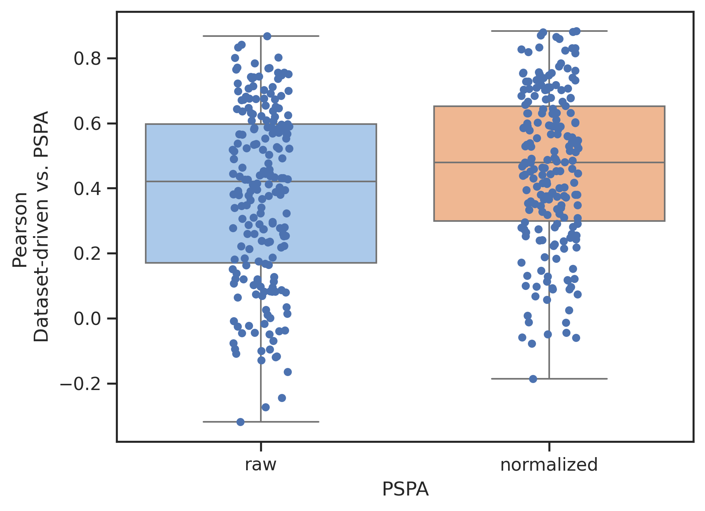

### Check if changed pearson is correlated with specificity

``` python
corr['change_corr'] = corr['corr_with_norm'] - corr['corr_with_raw']
```

``` python
plot_corr(y=corr.change_corr,x=corr.specificity,text_location=[0.8,0.85])
plt.xlabel('Kinase specificity based on PSPA')
plt.ylabel('Δ Pearson');
```

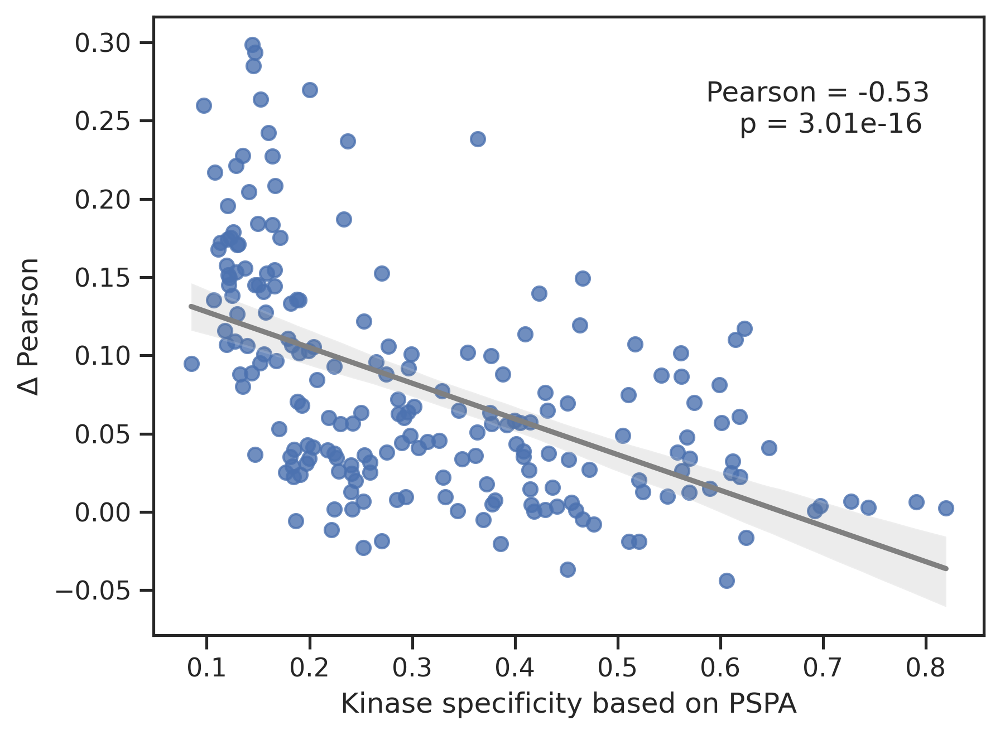

``` python
corr.plot.scatter(y='change_corr',x='specificity',c='darkblue')
pear,pvalue = pearsonr(corr.change_corr,corr.specificity)
plt.text(s=f'Pearson = {round(pear,2)}\n   p = {"{:.2e}".format(pvalue)}',x=0.6,y=0.2)
plt.ylabel('Δ Pearson')
plt.xlabel('Kinase specificity');
```

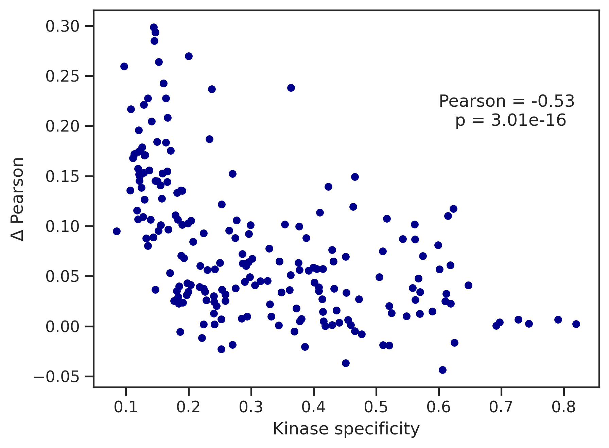

``` python
# corr.to_csv('PSSM_vs_dataset_summary.csv',index=False)
```

### Find out the factor that cause the biggest change in correlation

Plot the kinase with biggest change in pearson after normalization;
uncheck ‘break’ to run all

``` python
for k in corr.sort_values('change_corr',ascending=False).kinase[:5]:
    
    df_k=df.query(f'kinase_paper == "{k}"')
    df_k = df_k.drop_duplicates(subset="SUB")
    
    paper, full = get_freq(df_k)

    raw_k = get_one_kinase(raw,k,drop_s=False).T
    raw_k = raw_k.reindex(index=aa_order_paper)
    
    norm_k = get_one_kinase(norm,k,drop_s=False).T
    norm_k = norm_k.reindex(index=aa_order_paper)
    
    plot_heatmap(raw_k,f'{k} from raw PSPA')
    plot_heatmap(norm_k,f'{k} from normalized PSPA')
    plot_heatmap(paper,f'{k} from KS datasets (n={len(df_k)})')

    break
```

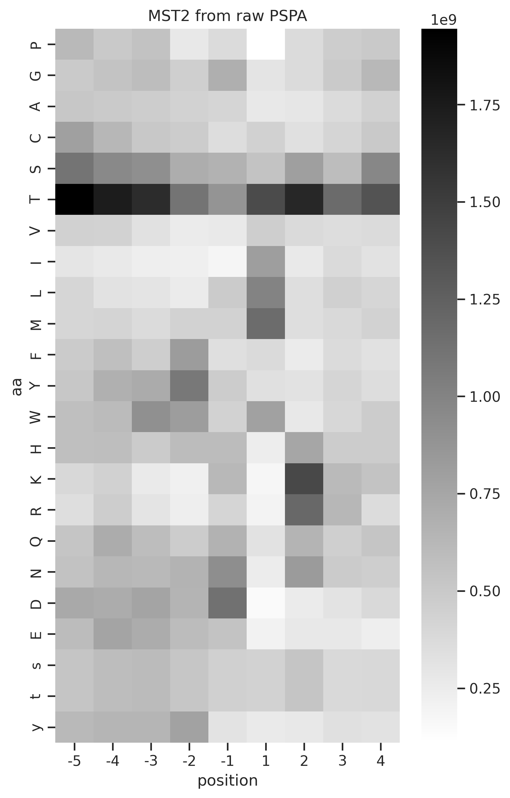

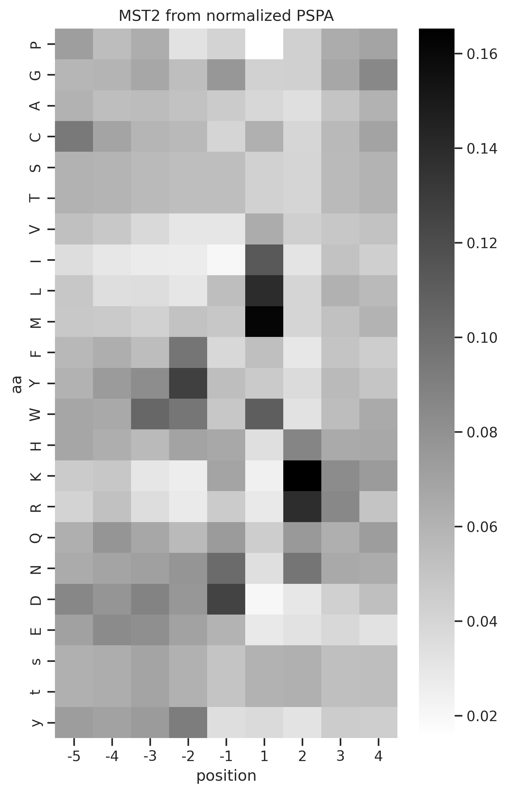

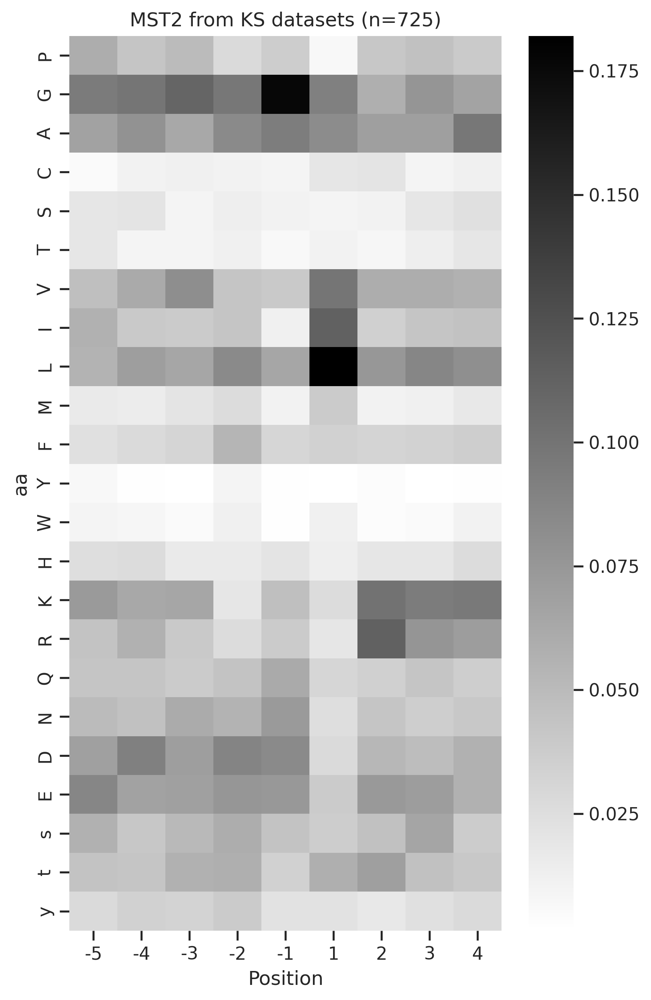

Calculate S and T ratio

``` python
data = []
for k in overlap_cnt.index:

    # paper, full = get_freq(df,k)

    raw_k = get_one_kinase(raw,k,drop_s=False).T
    raw_k = raw_k.reindex(index=aa_order_paper)
    
    s_ratio = (raw_k.loc['S']/raw_k.sum()).median() #use median because it can better reflect the distribution of the data than the average
    t_ratio = (raw_k.loc['T']/raw_k.sum()).median()
    data.append([k,s_ratio,t_ratio])
```

``` python
ST_ratio = pd.DataFrame(data,columns=['kinase','S_ratio','T_ratio'])
```

``` python
corr = corr.merge(ST_ratio)
```

``` python
corr
```

<div>
<style scoped>
    .dataframe tbody tr th:only-of-type {
        vertical-align: middle;
    }
&#10;    .dataframe tbody tr th {
        vertical-align: top;
    }
&#10;    .dataframe thead th {
        text-align: right;
    }
</style>

<table class="dataframe" data-quarto-postprocess="true" data-border="1">
<thead>
<tr class="header" style="text-align: right;">
<th data-quarto-table-cell-role="th"></th>
<th data-quarto-table-cell-role="th">kinase</th>
<th data-quarto-table-cell-role="th">corr_with_raw</th>
<th data-quarto-table-cell-role="th">count_unique</th>
<th data-quarto-table-cell-role="th">corr_with_norm</th>
<th data-quarto-table-cell-role="th">specificity</th>
<th data-quarto-table-cell-role="th">change_corr</th>
<th data-quarto-table-cell-role="th">S_ratio</th>
<th data-quarto-table-cell-role="th">T_ratio</th>
</tr>
</thead>
<tbody>
<tr class="odd">
<td data-quarto-table-cell-role="th">0</td>
<td>PKACA</td>
<td>0.841437</td>
<td>1547</td>
<td>0.833627</td>
<td>0.476953</td>
<td>-0.007810</td>
<td>0.056639</td>
<td>0.033424</td>
</tr>
<tr class="even">
<td data-quarto-table-cell-role="th">1</td>
<td>ERK2</td>
<td>0.755683</td>
<td>1241</td>
<td>0.830667</td>
<td>0.510499</td>
<td>0.074984</td>
<td>0.051646</td>
<td>0.051311</td>
</tr>
<tr class="odd">
<td data-quarto-table-cell-role="th">2</td>
<td>CDK1</td>
<td>0.867922</td>
<td>1197</td>
<td>0.880447</td>
<td>0.569784</td>
<td>0.012526</td>
<td>0.063222</td>
<td>0.048285</td>
</tr>
<tr class="even">
<td data-quarto-table-cell-role="th">3</td>
<td>IKKB</td>
<td>0.151149</td>
<td>1133</td>
<td>0.278715</td>
<td>0.157279</td>
<td>0.127567</td>
<td>0.081216</td>
<td>0.040976</td>
</tr>
<tr class="odd">
<td data-quarto-table-cell-role="th">4</td>
<td>ERK1</td>
<td>0.832991</td>
<td>1048</td>
<td>0.880669</td>
<td>0.567533</td>
<td>0.047678</td>
<td>0.063722</td>
<td>0.053194</td>
</tr>
<tr class="even">
<td data-quarto-table-cell-role="th">...</td>
<td>...</td>
<td>...</td>
<td>...</td>
<td>...</td>
<td>...</td>
<td>...</td>
<td>...</td>
<td>...</td>
</tr>
<tr class="odd">
<td data-quarto-table-cell-role="th">197</td>
<td>HIPK3</td>
<td>0.650688</td>
<td>97</td>
<td>0.709181</td>
<td>0.399684</td>
<td>0.058493</td>
<td>0.054908</td>
<td>0.049153</td>
</tr>
<tr class="even">
<td data-quarto-table-cell-role="th">198</td>
<td>CDK8</td>
<td>0.391844</td>
<td>89</td>
<td>0.479039</td>
<td>0.542519</td>
<td>0.087195</td>
<td>0.073872</td>
<td>0.041969</td>
</tr>
<tr class="odd">
<td data-quarto-table-cell-role="th">199</td>
<td>BUB1</td>
<td>0.222991</td>
<td>86</td>
<td>0.253001</td>
<td>0.240232</td>
<td>0.030010</td>
<td>0.048003</td>
<td>0.042768</td>
</tr>
<tr class="even">
<td data-quarto-table-cell-role="th">200</td>
<td>MEKK3</td>
<td>-0.100448</td>
<td>85</td>
<td>0.008627</td>
<td>0.127274</td>
<td>0.109075</td>
<td>0.051621</td>
<td>0.068361</td>
</tr>
<tr class="odd">
<td data-quarto-table-cell-role="th">201</td>
<td>GRK1</td>
<td>0.278294</td>
<td>83</td>
<td>0.318144</td>
<td>0.184903</td>
<td>0.039849</td>
<td>0.052647</td>
<td>0.029514</td>
</tr>
</tbody>
</table>

<p>202 rows × 8 columns</p>
</div>

``` python
corr.corr(numeric_only=True)
```

<div>
<style scoped>
    .dataframe tbody tr th:only-of-type {
        vertical-align: middle;
    }
&#10;    .dataframe tbody tr th {
        vertical-align: top;
    }
&#10;    .dataframe thead th {
        text-align: right;
    }
</style>

<table class="dataframe" data-quarto-postprocess="true" data-border="1">
<thead>
<tr class="header" style="text-align: right;">
<th data-quarto-table-cell-role="th"></th>
<th data-quarto-table-cell-role="th">corr_with_raw</th>
<th data-quarto-table-cell-role="th">count_unique</th>
<th data-quarto-table-cell-role="th">corr_with_norm</th>
<th data-quarto-table-cell-role="th">specificity</th>
<th data-quarto-table-cell-role="th">change_corr</th>
<th data-quarto-table-cell-role="th">S_ratio</th>
<th data-quarto-table-cell-role="th">T_ratio</th>
</tr>
</thead>
<tbody>
<tr class="odd">
<td data-quarto-table-cell-role="th">corr_with_raw</td>
<td>1.000000</td>
<td>0.141216</td>
<td>0.968214</td>
<td>0.594262</td>
<td>-0.566374</td>
<td>0.171268</td>
<td>-0.445375</td>
</tr>
<tr class="even">
<td data-quarto-table-cell-role="th">count_unique</td>
<td>0.141216</td>
<td>1.000000</td>
<td>0.199915</td>
<td>0.056954</td>
<td>0.128221</td>
<td>0.155907</td>
<td>0.001734</td>
</tr>
<tr class="odd">
<td data-quarto-table-cell-role="th">corr_with_norm</td>
<td>0.968214</td>
<td>0.199915</td>
<td>1.000000</td>
<td>0.515635</td>
<td>-0.342232</td>
<td>0.256669</td>
<td>-0.302619</td>
</tr>
<tr class="even">
<td data-quarto-table-cell-role="th">specificity</td>
<td>0.594262</td>
<td>0.056954</td>
<td>0.515635</td>
<td>1.000000</td>
<td>-0.533407</td>
<td>-0.001163</td>
<td>-0.295673</td>
</tr>
<tr class="odd">
<td data-quarto-table-cell-role="th">change_corr</td>
<td>-0.566374</td>
<td>0.128221</td>
<td>-0.342232</td>
<td>-0.533407</td>
<td>1.000000</td>
<td>0.202328</td>
<td>0.675979</td>
</tr>
<tr class="even">
<td data-quarto-table-cell-role="th">S_ratio</td>
<td>0.171268</td>
<td>0.155907</td>
<td>0.256669</td>
<td>-0.001163</td>
<td>0.202328</td>
<td>1.000000</td>
<td>-0.074444</td>
</tr>
<tr class="odd">
<td data-quarto-table-cell-role="th">T_ratio</td>
<td>-0.445375</td>
<td>0.001734</td>
<td>-0.302619</td>
<td>-0.295673</td>
<td>0.675979</td>
<td>-0.074444</td>
<td>1.000000</td>
</tr>
</tbody>
</table>

</div>

Check change_corr column in the correlation plot, it seems T ratio is
highly correlated with change_corr

``` python
plot_corr(y=corr.change_corr,x=corr.T_ratio)
plt.xlabel('T ratio in raw PSPA')
plt.ylabel('Δ Pearson');
```

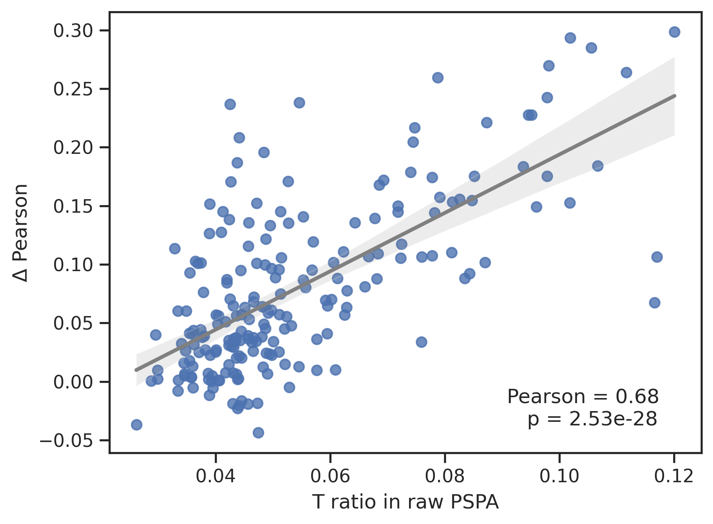
