# Compare CDDM and PSPA in Tyr kinase


<!-- WARNING: THIS FILE WAS AUTOGENERATED! DO NOT EDIT! -->

``` python
from katlas.core import *

import pandas as pd,seaborn as sns
```

## Load CDDM

``` python
cddm = Data.get_cddm()
```

``` python
cddm = cddm.iloc[:,:-6]
```

## Load PSPA

``` python
pspa = Data.get_pspa_tyr_norm().iloc[:,:-6]
```

## Match PSPA index to CDDM

``` python
pspa_info = pd.read_csv('raw/lew_tyr_info.csv')
```

``` python
pspa
```

<div>
<style scoped>
    .dataframe tbody tr th:only-of-type {
        vertical-align: middle;
    }
&#10;    .dataframe tbody tr th {
        vertical-align: top;
    }
&#10;    .dataframe thead th {
        text-align: right;
    }
</style>

<table class="dataframe" data-quarto-postprocess="true" data-border="1">
<thead>
<tr class="header" style="text-align: right;">
<th data-quarto-table-cell-role="th"></th>
<th data-quarto-table-cell-role="th">-5P</th>
<th data-quarto-table-cell-role="th">-5G</th>
<th data-quarto-table-cell-role="th">-5A</th>
<th data-quarto-table-cell-role="th">-5C</th>
<th data-quarto-table-cell-role="th">-5S</th>
<th data-quarto-table-cell-role="th">-5T</th>
<th data-quarto-table-cell-role="th">-5V</th>
<th data-quarto-table-cell-role="th">-5I</th>
<th data-quarto-table-cell-role="th">-5L</th>
<th data-quarto-table-cell-role="th">-5M</th>
<th data-quarto-table-cell-role="th">...</th>
<th data-quarto-table-cell-role="th">5H</th>
<th data-quarto-table-cell-role="th">5K</th>
<th data-quarto-table-cell-role="th">5R</th>
<th data-quarto-table-cell-role="th">5Q</th>
<th data-quarto-table-cell-role="th">5N</th>
<th data-quarto-table-cell-role="th">5D</th>
<th data-quarto-table-cell-role="th">5E</th>
<th data-quarto-table-cell-role="th">5s</th>
<th data-quarto-table-cell-role="th">5t</th>
<th data-quarto-table-cell-role="th">5y</th>
</tr>
<tr class="odd">
<th data-quarto-table-cell-role="th">kinase</th>
<th data-quarto-table-cell-role="th"></th>
<th data-quarto-table-cell-role="th"></th>
<th data-quarto-table-cell-role="th"></th>
<th data-quarto-table-cell-role="th"></th>
<th data-quarto-table-cell-role="th"></th>
<th data-quarto-table-cell-role="th"></th>
<th data-quarto-table-cell-role="th"></th>
<th data-quarto-table-cell-role="th"></th>
<th data-quarto-table-cell-role="th"></th>
<th data-quarto-table-cell-role="th"></th>
<th data-quarto-table-cell-role="th"></th>
<th data-quarto-table-cell-role="th"></th>
<th data-quarto-table-cell-role="th"></th>
<th data-quarto-table-cell-role="th"></th>
<th data-quarto-table-cell-role="th"></th>
<th data-quarto-table-cell-role="th"></th>
<th data-quarto-table-cell-role="th"></th>
<th data-quarto-table-cell-role="th"></th>
<th data-quarto-table-cell-role="th"></th>
<th data-quarto-table-cell-role="th"></th>
<th data-quarto-table-cell-role="th"></th>
</tr>
</thead>
<tbody>
<tr class="odd">
<td data-quarto-table-cell-role="th">ABL1</td>
<td>0.0668</td>
<td>0.0689</td>
<td>0.0646</td>
<td>0.0520</td>
<td>0.0564</td>
<td>0.0539</td>
<td>0.0485</td>
<td>0.0448</td>
<td>0.0520</td>
<td>0.0536</td>
<td>...</td>
<td>0.0613</td>
<td>0.0652</td>
<td>0.0756</td>
<td>0.0526</td>
<td>0.0512</td>
<td>0.0362</td>
<td>0.0339</td>
<td>0.0254</td>
<td>0.0254</td>
<td>0.0337</td>
</tr>
<tr class="even">
<td data-quarto-table-cell-role="th">TNK2</td>
<td>0.0679</td>
<td>0.0818</td>
<td>0.0627</td>
<td>0.0617</td>
<td>0.0529</td>
<td>0.0528</td>
<td>0.0419</td>
<td>0.0463</td>
<td>0.0437</td>
<td>0.0453</td>
<td>...</td>
<td>0.0499</td>
<td>0.0385</td>
<td>0.0302</td>
<td>0.0531</td>
<td>0.0465</td>
<td>0.0630</td>
<td>0.0572</td>
<td>0.0364</td>
<td>0.0364</td>
<td>0.0572</td>
</tr>
<tr class="odd">
<td data-quarto-table-cell-role="th">ALK</td>
<td>0.0675</td>
<td>0.0640</td>
<td>0.0590</td>
<td>0.0511</td>
<td>0.0476</td>
<td>0.0422</td>
<td>0.0455</td>
<td>0.0514</td>
<td>0.0546</td>
<td>0.0543</td>
<td>...</td>
<td>0.0448</td>
<td>0.0367</td>
<td>0.0489</td>
<td>0.0334</td>
<td>0.0387</td>
<td>0.0245</td>
<td>0.0226</td>
<td>0.0181</td>
<td>0.0181</td>
<td>0.0172</td>
</tr>
<tr class="even">
<td data-quarto-table-cell-role="th">ABL2</td>
<td>0.0687</td>
<td>0.0715</td>
<td>0.0611</td>
<td>0.0448</td>
<td>0.0537</td>
<td>0.0513</td>
<td>0.0467</td>
<td>0.0398</td>
<td>0.0462</td>
<td>0.0505</td>
<td>...</td>
<td>0.0566</td>
<td>0.0640</td>
<td>0.0779</td>
<td>0.0538</td>
<td>0.0565</td>
<td>0.0378</td>
<td>0.0381</td>
<td>0.0252</td>
<td>0.0252</td>
<td>0.0289</td>
</tr>
<tr class="odd">
<td data-quarto-table-cell-role="th">AXL</td>
<td>0.0656</td>
<td>0.0753</td>
<td>0.0535</td>
<td>0.0525</td>
<td>0.0468</td>
<td>0.0467</td>
<td>0.0459</td>
<td>0.0538</td>
<td>0.0507</td>
<td>0.0542</td>
<td>...</td>
<td>0.0441</td>
<td>0.0506</td>
<td>0.0355</td>
<td>0.0635</td>
<td>0.0696</td>
<td>0.0592</td>
<td>0.0559</td>
<td>0.0413</td>
<td>0.0413</td>
<td>0.0455</td>
</tr>
<tr class="even">
<td data-quarto-table-cell-role="th">...</td>
<td>...</td>
<td>...</td>
<td>...</td>
<td>...</td>
<td>...</td>
<td>...</td>
<td>...</td>
<td>...</td>
<td>...</td>
<td>...</td>
<td>...</td>
<td>...</td>
<td>...</td>
<td>...</td>
<td>...</td>
<td>...</td>
<td>...</td>
<td>...</td>
<td>...</td>
<td>...</td>
<td>...</td>
</tr>
<tr class="odd">
<td data-quarto-table-cell-role="th">KDR</td>
<td>0.0634</td>
<td>0.0672</td>
<td>0.0556</td>
<td>0.0517</td>
<td>0.0541</td>
<td>0.0526</td>
<td>0.0427</td>
<td>0.0420</td>
<td>0.0428</td>
<td>0.0476</td>
<td>...</td>
<td>0.0543</td>
<td>0.0653</td>
<td>0.0771</td>
<td>0.0509</td>
<td>0.0582</td>
<td>0.0414</td>
<td>0.0387</td>
<td>0.0335</td>
<td>0.0335</td>
<td>0.0406</td>
</tr>
<tr class="even">
<td data-quarto-table-cell-role="th">FLT4</td>
<td>0.0457</td>
<td>0.0531</td>
<td>0.0488</td>
<td>0.0553</td>
<td>0.0512</td>
<td>0.0471</td>
<td>0.0432</td>
<td>0.0499</td>
<td>0.0474</td>
<td>0.0530</td>
<td>...</td>
<td>0.0624</td>
<td>0.0564</td>
<td>0.0559</td>
<td>0.0537</td>
<td>0.0610</td>
<td>0.0620</td>
<td>0.0528</td>
<td>0.0600</td>
<td>0.0600</td>
<td>0.0464</td>
</tr>
<tr class="odd">
<td data-quarto-table-cell-role="th">WEE1_TYR</td>
<td>0.0531</td>
<td>0.0640</td>
<td>0.0559</td>
<td>0.0560</td>
<td>0.0433</td>
<td>0.0435</td>
<td>0.0568</td>
<td>0.0571</td>
<td>0.0637</td>
<td>0.0562</td>
<td>...</td>
<td>0.0585</td>
<td>0.1058</td>
<td>0.1658</td>
<td>0.0447</td>
<td>0.0495</td>
<td>0.0312</td>
<td>0.0365</td>
<td>0.0453</td>
<td>0.0453</td>
<td>0.0490</td>
</tr>
<tr class="even">
<td data-quarto-table-cell-role="th">YES1</td>
<td>0.0677</td>
<td>0.0571</td>
<td>0.0537</td>
<td>0.0530</td>
<td>0.0527</td>
<td>0.0505</td>
<td>0.0435</td>
<td>0.0375</td>
<td>0.0400</td>
<td>0.0463</td>
<td>...</td>
<td>0.0593</td>
<td>0.0662</td>
<td>0.0840</td>
<td>0.0559</td>
<td>0.0604</td>
<td>0.0422</td>
<td>0.0482</td>
<td>0.0374</td>
<td>0.0374</td>
<td>0.0411</td>
</tr>
<tr class="odd">
<td data-quarto-table-cell-role="th">ZAP70</td>
<td>0.0602</td>
<td>0.0880</td>
<td>0.0623</td>
<td>0.0496</td>
<td>0.0471</td>
<td>0.0514</td>
<td>0.0465</td>
<td>0.0380</td>
<td>0.0307</td>
<td>0.0526</td>
<td>...</td>
<td>0.0484</td>
<td>0.0477</td>
<td>0.0290</td>
<td>0.0520</td>
<td>0.0537</td>
<td>0.0709</td>
<td>0.0710</td>
<td>0.0862</td>
<td>0.0862</td>
<td>0.0605</td>
</tr>
</tbody>
</table>

<p>93 rows × 230 columns</p>
</div>

## Get overlapped kinase

``` python
# non-overlapped
pspa.index[~pspa.index.isin(cddm.index)]
```

    Index(['BMPR2_TYR', 'DDR1', 'ERBB2', 'LIMK1_TYR', 'LIMK2_TYR', 'MAP2K4_TYR',
           'MAP2K6_TYR', 'MAP2K7_TYR', 'PKMYT1_TYR', 'NEK10_TYR', 'PDHK1_TYR',
           'PDHK3_TYR', 'PDHK4_TYR', 'PINK1_TYR', 'TESK1_TYR', 'TNNI3K_TYR',
           'WEE1_TYR'],
          dtype='object', name='kinase')

``` python
overlap_kinase = pspa.index[pspa.index.isin(cddm.index)]
overlap_kinase
```

    Index(['ABL1', 'TNK2', 'ALK', 'ABL2', 'AXL', 'BLK', 'PTK6', 'BTK', 'CSF1R',
           'CSK', 'MATK', 'DDR2', 'EGFR', 'EPHA1', 'EPHA2', 'EPHA3', 'EPHA4',
           'EPHA5', 'EPHA6', 'EPHA7', 'EPHA8', 'EPHB1', 'EPHB2', 'EPHB3', 'EPHB4',
           'BMX', 'PTK2', 'FER', 'FES', 'FGFR1', 'FGFR2', 'FGFR3', 'FGFR4', 'FGR',
           'FLT3', 'FRK', 'FYN', 'HCK', 'ERBB4', 'IGF1R', 'INSR', 'INSRR', 'ITK',
           'JAK1', 'JAK2', 'JAK3', 'KIT', 'LCK', 'LTK', 'LYN', 'MERTK', 'MET',
           'MST1R', 'MUSK', 'PDGFRA', 'PDGFRB', 'PTK2B', 'RET', 'ROS1', 'SRC',
           'SRMS', 'SYK', 'TEC', 'TEK', 'TNK1', 'NTRK1', 'NTRK2', 'NTRK3', 'TXK',
           'TYK2', 'TYRO3', 'FLT1', 'KDR', 'FLT4', 'YES1', 'ZAP70'],
          dtype='object', name='kinase')

``` python
overlap_column = pspa.columns
```

``` python
pspa = pspa.loc[overlap_kinase,overlap_column]
```

``` python
cddm = cddm.loc[overlap_kinase,overlap_column]
```

## Pearson

``` python
from matplotlib import pyplot as plt
```

``` python
d = pspa.corrwith(cddm,axis=1).sort_values(ascending=False)
```

``` python
pspa.corrwith(cddm,axis=1).sort_values(ascending=False)
```

    kinase
    BLK       0.422068
    TNK2      0.418332
    TXK       0.366034
    LCK       0.364885
    ABL2      0.355762
                ...   
    MATK      0.028732
    FLT4      0.020456
    PTK6     -0.001976
    FES      -0.006169
    PDGFRA   -0.040095
    Length: 76, dtype: float64

``` python
sns.set(rc={"figure.dpi":200, 'savefig.dpi':200})
sns.set_context('notebook')
sns.set_style("ticks")

pspa.corrwith(cddm,axis=1).sort_values(ascending=False).plot.bar(figsize=(15,3))
plt.xlabel('')
plt.ylabel('Pearson');
```

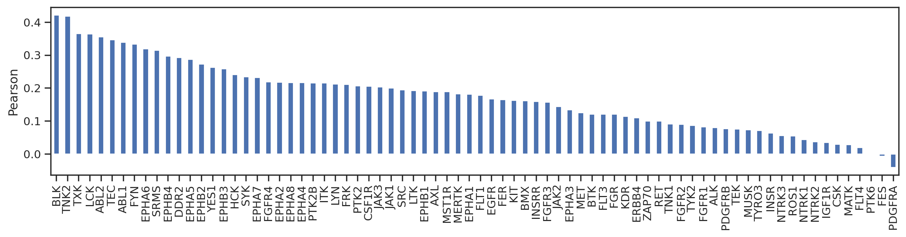

## Compare PSSM heatmaps

``` python
from matplotlib import pyplot as plt
from katlas.plot import *
import os, seaborn as sns
from tqdm import tqdm
from PIL import Image
```

``` python
def plot_kinase(df,kinase, title, fname=None, aa_order_paper = [i for i in 'PGACSTVILMFYWHKRQNDEsty']):
    
    # get PSSM matrix
    m = get_one_kinase(df, kinase, drop_s = False).T.loc[aa_order_paper]

    # plot heatmap
    plot_heatmap(m,title=title)
    
    
    plt.savefig(fname,bbox_inches='tight', pad_inches=0.05) if fname else plt.show()
    plt.close()
```

``` python
def plot_cor(k,title, fname=None):
    
    # plot
    plot_corr(cddm.loc[k],pspa.loc[k],'CDDM','PSPA')
    plt.title(title)
    
    plt.savefig(fname,bbox_inches='tight', pad_inches=0.2) if fname else plt.show()
    plt.close()
```

``` python
kinase_order = pspa.corrwith(cddm,axis=1).sort_values(ascending=False).index
```

``` python
kinase_order
```

    Index(['BLK', 'TNK2', 'TXK', 'LCK', 'ABL2', 'TEC', 'ABL1', 'FYN', 'EPHA6',
           'SRMS', 'EPHB4', 'DDR2', 'EPHA5', 'EPHB2', 'YES1', 'EPHB3', 'HCK',
           'SYK', 'EPHA7', 'FGFR4', 'EPHA2', 'EPHA8', 'EPHA4', 'PTK2B', 'ITK',
           'LYN', 'FRK', 'PTK2', 'CSF1R', 'JAK3', 'JAK1', 'SRC', 'LTK', 'EPHB1',
           'AXL', 'MST1R', 'MERTK', 'EPHA1', 'FLT1', 'EGFR', 'FER', 'KIT', 'BMX',
           'INSRR', 'FGFR3', 'JAK2', 'EPHA3', 'MET', 'BTK', 'FLT3', 'FGR', 'KDR',
           'ERBB4', 'ZAP70', 'RET', 'TNK1', 'FGFR2', 'TYK2', 'FGFR1', 'ALK',
           'PDGFRB', 'TEK', 'MUSK', 'TYRO3', 'INSR', 'NTRK3', 'ROS1', 'NTRK1',
           'NTRK2', 'IGF1R', 'CSK', 'MATK', 'FLT4', 'PTK6', 'FES', 'PDGFRA'],
          dtype='object', name='kinase')

``` python
# get count of KS pairs in CDDM
df = Data.get_ks_dataset()

# Convert substrate names to uppercase
df['SUB'] = df['substrate'].str.upper()

# Remove duplicates based on kinase and substrate
df_unique = df.drop_duplicates(subset=['kinase_paper', 'SUB'])

# Count unique substrates for each kinase
cnt_unique = df_unique.groupby('kinase_paper').size()
```

``` python
# Count number of substrates (with duplicates) for each kinase
cnt_general = df.kinase_paper.value_counts()
```

Uncheck below to run all

``` python
for k in tqdm(kinase_order):
    
    # print('CDDM')
    plot_kinase(cddm,k,title= f'{k} from KS datasets (n={cnt_unique[k]})')
    
    # print('PSPA')
    plot_kinase(pspa,k, title = f'{k} from PSPA')
    
    plot_cor(k,title = k)
    
    break
```

      0%|          | 0/76 [00:00<?, ?it/s]

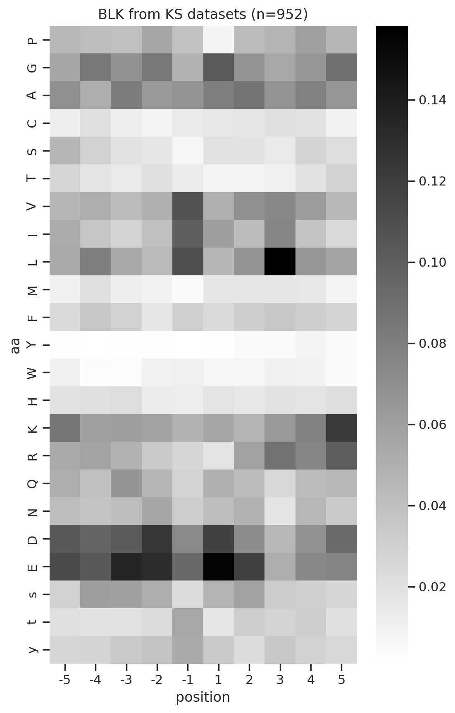

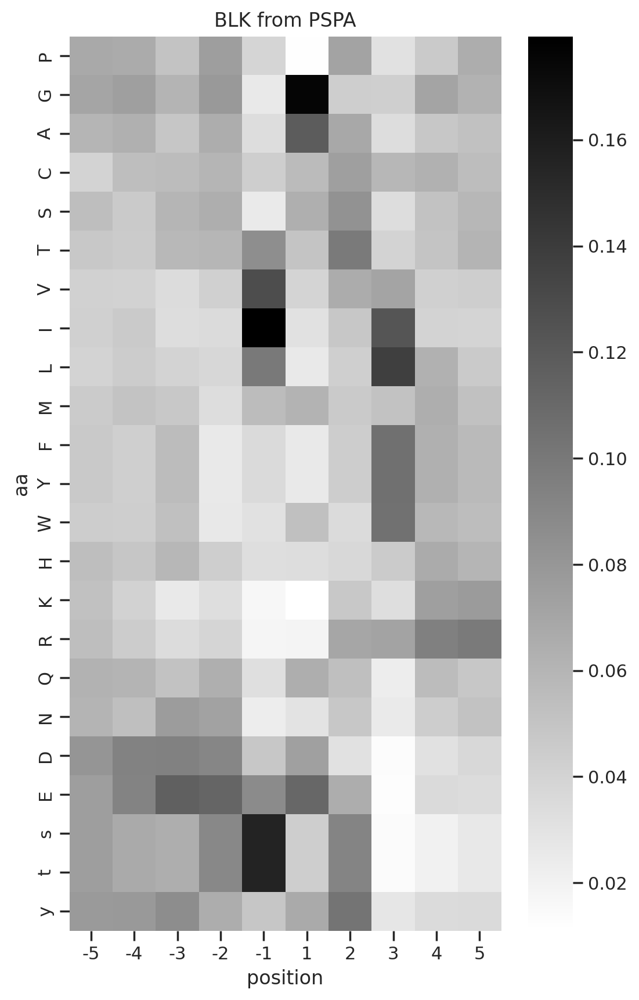

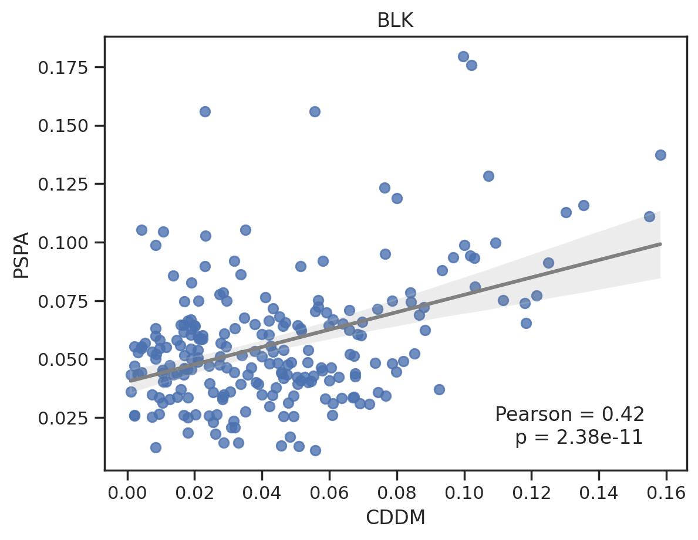

      0%|          | 0/76 [00:00<?, ?it/s]

To save, uncomment below

``` python
# for k in tqdm(kinase_order):
    
#     # print('CDDM')
#     plot_kinase(cddm,k,title= f'{k} from KS datasets (n={cnt_unique[k]})', fname=f'corr_tyr/CDDM/{k}.png')
    
#     # print('PSPA')
#     plot_kinase(pspa,k, title = f'{k} from PSPA', fname=f'corr_tyr/PSPA/{k}.png')
    
#     plot_cor(k,title = k, fname=f'corr_tyr/pear/{k}.png')
    
#     # break
```

## Combine images

``` python
def combine_images_custom_layout(image_paths, output_path):
    images = [Image.open(image_path).convert('RGBA') for image_path in image_paths]
    
    # Calculate total width and height for the new image
    total_width = max(images[0].width, images[1].width + images[2].width)
    total_height = images[0].height + max(images[1].height, images[2].height)
    
    # Create a new image with calculated dimensions
    combined_image = Image.new('RGBA', (total_width, total_height))
    
    # Paste the first image at the top-center
    x_offset = (total_width - images[0].width) // 2
    combined_image.paste(images[0], (x_offset, 0), images[0])
    
    # Paste the second image at the bottom-left
    combined_image.paste(images[1], (0, images[0].height), images[1])
    
    # Paste the third image at the bottom-right
    combined_image.paste(images[2], (images[1].width, images[0].height), images[2])
    
    # Save the result
    combined_image.save(output_path)
```

Uncomment below to save combined figure for pdf

``` python
# folders = ["corr_tyr/pear",'corr_tyr/CDDM','corr_tyr/PSPA']

# for k in tqdm(kinase_order,total=len(kinase_order)):
#     filename = f"{k}.png"
#     image_paths = [os.path.join(folder, filename) for folder in folders]
    
#     output_path = f"corr_tyr/combine/{k}.png"
#     combine_images_custom_layout(image_paths, output_path)
    
#     # break
```

Convert images to pdf

## Correlation of amino acids DE and phospho-S/T/Y

``` python
import pandas as pd

from katlas.core import *
from katlas.plot import *

import seaborn as sns
from matplotlib import pyplot as plt
```

``` python
cddm = Data.get_cddm()

pspa= Data.get_pspa_tyr_norm().iloc[:,:-6]
```

``` python
# remove dual
pspa = pspa[pspa.index.str.split('_').str.len() ==1]

overlap_kinase = cddm.index.intersection(pspa.index)
```

``` python
overlap_columns=pspa.columns
```

``` python
pspa = pspa.loc[overlap_kinase,overlap_columns]

cddm = cddm.loc[overlap_kinase,overlap_columns]

D = cddm.columns[cddm.columns.str.contains('D')].tolist()

E = cddm.columns[cddm.columns.str.contains('E')].tolist()

DE = D+E

cddm[DE].max(1)

s = cddm.columns[cddm.columns.str.contains('s')].tolist()
t = cddm.columns[cddm.columns.str.contains('t')].tolist()
y = cddm.columns[cddm.columns.str.contains('y')].tolist()

sty = s+t+y
```

``` python
sns.set(rc={"figure.dpi":200, 'savefig.dpi':200})
sns.set_context('notebook')
sns.set_style("ticks")

plt.figure(figsize=(5,4))
plot_corr(cddm[DE].median(1), pspa[sty].max(1),'CDDM DE median', 'PSPA sty max')

plt.figure(figsize=(5,4))
plot_corr(cddm[E].median(1), pspa[sty].max(1),'CDDM DE median', 'PSPA sty max')

plt.figure(figsize=(5,4))
plot_corr(cddm[E].median(1), pspa[y].max(1),'CDDM DE median', 'PSPA sty max')

plt.figure(figsize=(5,4))
plot_corr(cddm[E].median(1), pspa[s].max(1),'CDDM DE median', 'PSPA sty max')

plt.figure(figsize=(5,4))
plot_corr(cddm[DE].median(1), pspa[t].max(1),'CDDM DE median', 'PSPA s/t max')

plt.figure(figsize=(5,4))
plot_corr(cddm[E].median(1), pspa[y].max(1),'CDDM E median', 'PSPA y max')

plt.figure(figsize=(5,4))
plot_corr(cddm[D].median(1), pspa[sty].max(1),'CDDM DE median', 'PSPA sty max')
```

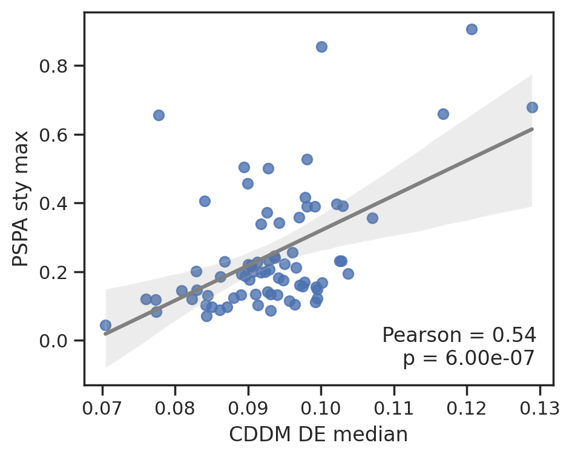

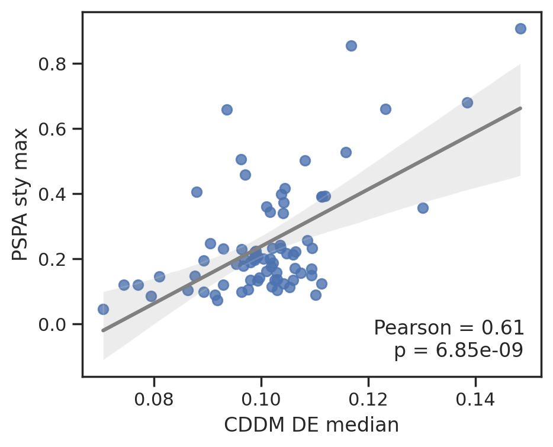

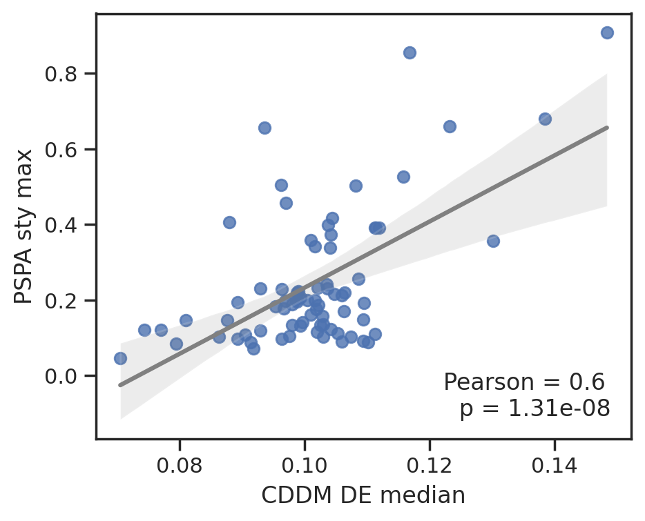

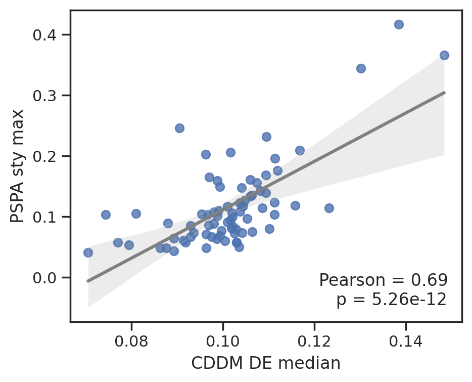

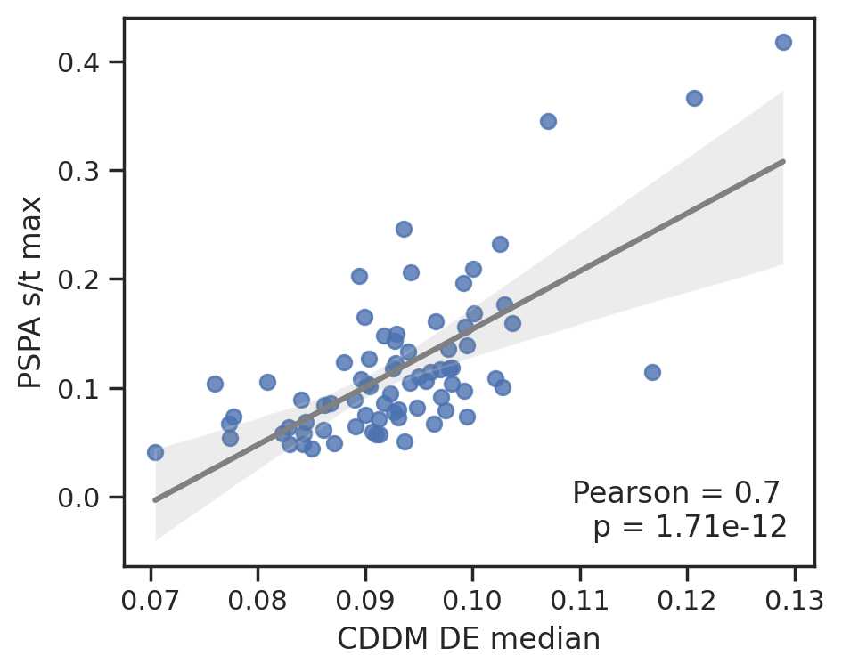

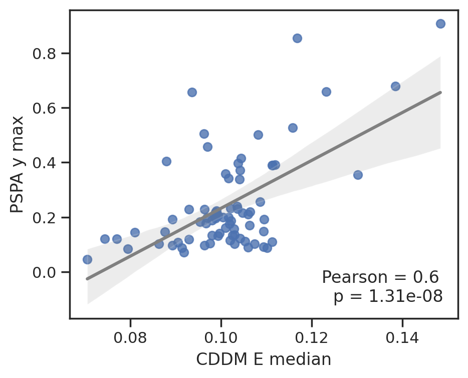

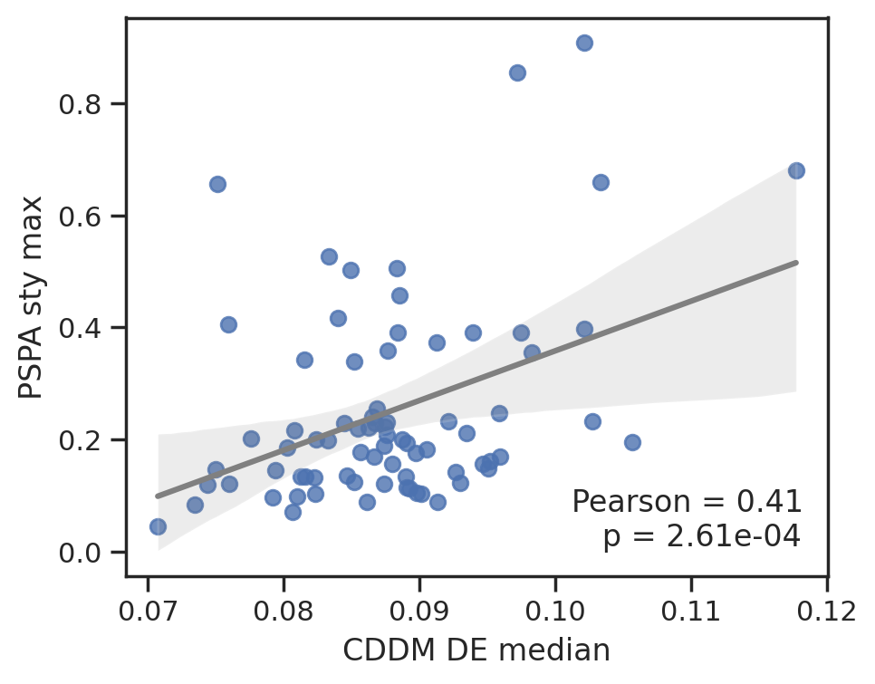

To save data, uncheck below

``` python
# data_list = [cddm[DE].median(1),
#              cddm[D].median(1),
#              cddm[E].median(1),
#              pspa[t].max(1),
#              pspa[y].max(1)]

# d = pd.concat(data_list,axis=1)

# d.columns=['CDDM_DE_median','CDDM_D_median','CDDM_E_median',
#            'PSPA_t_max','PSPA_y_max']

# d.to_csv('source/Fig4CD.csv')
```
