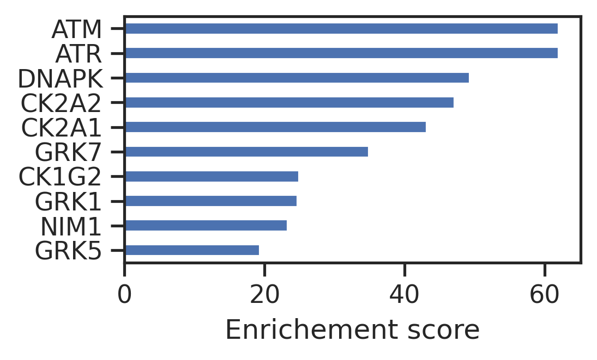

# Kinase enrichment analysis - ATM


<!-- WARNING: THIS FILE WAS AUTOGENERATED! DO NOT EDIT! -->

In this session, we will analyze the differential change of
phosphorylation sites in phosphoproteomics dataset.

## Setup

``` python
# katlas
from katlas.core import *
from katlas.plot import *

# utils
import pandas as pd, numpy as np, seaborn as sns
from matplotlib import pyplot as plt
from functools import reduce, partial
from tqdm import tqdm

# statistics
from scipy.stats import ttest_rel,ttest_ind
from statsmodels.stats.multitest import multipletests

# disable warning
import warnings
warnings.filterwarnings("ignore", message="converting a masked element to nan")

pd.set_option('display.precision', 15)

    
set_sns()
```

## Data

``` python
df = pd.read_csv('raw/ATM_radiation.csv')
```

``` python
df.head()
```

<div>
<style scoped>
    .dataframe tbody tr th:only-of-type {
        vertical-align: middle;
    }
&#10;    .dataframe tbody tr th {
        vertical-align: top;
    }
&#10;    .dataframe thead th {
        text-align: right;
    }
</style>

<table class="dataframe" data-quarto-postprocess="true" data-border="1">
<thead>
<tr class="header" style="text-align: right;">
<th data-quarto-table-cell-role="th"></th>
<th data-quarto-table-cell-role="th">SITE_+/-7_AA</th>
<th data-quarto-table-cell-role="th">Log2Fold-Change</th>
</tr>
</thead>
<tbody>
<tr class="odd">
<td data-quarto-table-cell-role="th">0</td>
<td>SRSGEDEsQEDVLMD</td>
<td>2.617689667</td>
</tr>
<tr class="even">
<td data-quarto-table-cell-role="th">1</td>
<td>QEAREVNsQEEEEEE</td>
<td>4.383139333</td>
</tr>
<tr class="odd">
<td data-quarto-table-cell-role="th">2</td>
<td>KLFDVCGsQDFESDL</td>
<td>3.119948000</td>
</tr>
<tr class="even">
<td data-quarto-table-cell-role="th">3</td>
<td>ESEKQQDsQPEEVMD</td>
<td>2.178596333</td>
</tr>
<tr class="odd">
<td data-quarto-table-cell-role="th">4</td>
<td>QDGEVQLsQNDDKTK</td>
<td>0.767963900</td>
</tr>
</tbody>
</table>

</div>

## Substrate scoring

``` python
# pspa_out = predict_kinase_df(azd,seq_col='site_seq2', **param_PSPA)
cddm_out = predict_kinase_df(df,seq_col='SITE_+/-7_AA', **param_CDDM_upper)
```

    input dataframe has a length 37
    Preprocessing
    Finish preprocessing
    Calculating position: [-7, -6, -5, -4, -3, -2, -1, 0, 1, 2, 3, 4, 5, 6, 7]

    100%|██████████| 289/289 [00:03<00:00, 84.33it/s]

## Kinase enrichment

``` python
def top_kinases(site_row,top_n=5):
    # Sort the row in descending order and get the top n kinases
    top_kinases = site_row.sort_values(ascending=False).head(top_n)

    # Get the counts of the top kinases
    kinase_counts = top_kinases.index.value_counts()

    return kinase_counts
```

``` python
func = partial(top_kinases,top_n=10)
```

``` python
cnt_df = cddm_out.apply(func,axis=1)
```

``` python
cnt = cnt_df.sum()
```

``` python
w_cnt_df = cnt_df.multiply(df['Log2Fold-Change'],axis=0)
```

``` python
w_cnt = w_cnt_df.sum()
```

``` python
w_cnt
```

    AKT1       4.160016533
    AKT3       4.160016533
    ALK2      15.193937901
    ALK4       2.591647667
    AMPKA1     3.844430200
                  ...     
    TLK2       0.859286567
    TNIK       0.859286567
    TSSK1      9.668330334
    TSSK2     13.435776167
    ULK3       4.405065666
    Length: 88, dtype: float64

``` python
enrich = pd.concat([cnt,w_cnt],axis=1)
```

``` python
enrich.columns = ['count','weighted_count']
```

``` python
enrich = enrich.sort_values('weighted_count')
```

``` python
set_sns()
```

``` python
enrich.tail(10).weighted_count.plot.barh(figsize=(3.6,2))
plt.xlabel('Enrichement score');
```


