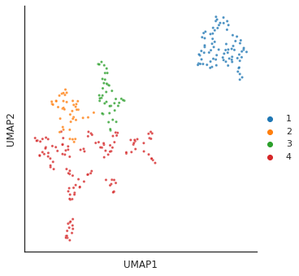

# Hierarchical clustering


<!-- WARNING: THIS FILE WAS AUTOGENERATED! DO NOT EDIT! -->

## Setup

``` python
import pandas as pd, numpy as np, seaborn as sns, matplotlib.pyplot as plt

from katlas.core import *
from katlas.feature import *
from katlas.plot import *

from scipy.cluster.hierarchy import linkage, dendrogram, to_tree,fcluster

from Bio import Phylo
from io import StringIO
```

## Data

``` python
df = Data.get_cddm().iloc[:,:-3]
```

``` python
tyr = (df['0y']>0.7).index
```

``` python
# Ward method to calculate linkage matrix
Z = linkage(df, method='ward')
```

``` python
Z
```

    array([[1.20000000e+01, 1.70000000e+01, 8.16324973e-02, 2.00000000e+00],
           [1.50000000e+01, 2.89000000e+02, 8.70342690e-02, 3.00000000e+00],
           [2.00000000e+00, 1.60000000e+01, 8.89836215e-02, 2.00000000e+00],
           ...,
           [5.69000000e+02, 5.73000000e+02, 4.49856709e+00, 1.67000000e+02],
           [5.65000000e+02, 5.74000000e+02, 4.58327062e+00, 2.09000000e+02],
           [5.66000000e+02, 5.75000000e+02, 1.20398599e+01, 2.89000000e+02]])

## Plot dendrogram

``` python
sns.set(rc={"figure.dpi":300, 'savefig.dpi':300})
sns.set_context('notebook')
sns.set_style("ticks")
```

``` python
plt.figure(figsize=(4,50))
dendrogram(Z,orientation='left',leaf_font_size=10,labels=df.index,color_threshold=0.6)
plt.title('Hierarchical Clustering Dendrogram')
# plt.xlabel('Sample index')
plt.ylabel('Distance')
plt.show()
```


## Save Tree

``` python
def get_newick(node, parent_dist, leaf_names, newick='') -> str:
    """
    Convert sciply.cluster.hierarchy.to_tree()-output to Newick format.
    Referenced from: https://stackoverflow.com/questions/28222179/save-dendrogram-to-newick-format
    
    :param node: output of sciply.cluster.hierarchy.to_tree()
    :param parent_dist: output of sciply.cluster.hierarchy.to_tree().dist
    :param leaf_names: list of leaf names
    :param newick: leave empty, this variable is used in recursion.
    :returns: tree in Newick format
    
    """
    if node.is_leaf():
        return "%s:%.2f%s" % (leaf_names[node.id], parent_dist - node.dist, newick)
    else:
        if len(newick) > 0:
            newick = "):%.2f%s" % (parent_dist - node.dist, newick)
        else:
            newick = ");"
        newick = get_newick(node.get_left(), node.dist, leaf_names, newick=newick)
        newick = get_newick(node.get_right(), node.dist, leaf_names, newick=",%s" % (newick))
        newick = "(%s" % (newick)
        return newick
```

``` python
tree = to_tree(Z, False)
```

``` python
newick_str = get_newick(tree, tree.dist, df.index)
```

``` python
newick_str
```

    '((((((((((((CK1E:0.21,CK1D:0.21):0.14,CK1A:0.35):0.23,((CK1G1:0.24,CK1G2:0.24):0.10,CK1G3:0.34):0.25):0.27,((((GRK2:0.35,TTBK1:0.35):0.06,PLK3:0.41):0.11,(GRK7:0.39,GRK5:0.39):0.12):0.07,GRK1:0.58):0.28):0.32,(CK2A2:0.31,CK2A1:0.31):0.87):0.13,(((TLK2:0.20,TLK1:0.20):0.38,PERK:0.58):0.22,((((TGFBR1:0.23,ALK4:0.23):0.05,ALK2:0.29):0.02,BMPR1B:0.30):0.14,ACVR2A:0.44):0.35):0.51):0.32,(((((MLK3:0.20,MLK1:0.20):0.24,COT:0.45):0.09,(((NEK7:0.18,NEK6:0.18):0.20,DSTYK:0.38):0.01,(NEK9:0.24,NEK2:0.24):0.15):0.15):0.13,((BUB1B:0.27,PLK1:0.27):0.27,PLK4:0.54):0.13):0.29,(((TBK1:0.22,IKKE:0.22):0.16,(IKKA:0.22,IKKB:0.22):0.17):0.12,ULK3:0.50):0.45):0.67):0.46,((ATR:0.36,ATM:0.36):0.26,DNAPK:0.62):1.46):1.25,((((((((((MNK2:0.33,PHKG2:0.33):0.05,PKN1:0.39):0.08,PHKG1:0.47):0.11,PKN2:0.58):0.11,((NDR2:0.37,NDR1:0.37):0.09,(LATS1:0.26,LATS2:0.26):0.20):0.24):0.26,(((((PKCT:0.26,PKCB:0.26):0.02,PKCG:0.28):0.04,PKCH:0.32):0.05,(PKCI:0.30,PKCZ:0.30):0.07):0.10,((PKCD:0.25,PKCA:0.25):0.12,PKCE:0.37):0.11):0.48):0.32,((((AURC:0.21,AURA:0.21):0.07,AURB:0.28):0.22,((PAK2:0.17,PAK1:0.17):0.04,PAK3:0.21):0.29):0.27,((PAK5:0.37,PAK6:0.37):0.04,PAK4:0.41):0.37):0.51):0.27,((((((CHK2:0.37,CHK1:0.37):0.09,SKMLCK:0.46):0.06,(DCAMKL1:0.30,DCAMKL2:0.30):0.22):0.09,(CAMK1A:0.44,MELK:0.44):0.17):0.27,((LRRK2:0.52,DAPK1:0.52):0.05,((ROCK2:0.30,ROCK1:0.30):0.15,MRCKB:0.45):0.12):0.31):0.39,(((CAMK1D:0.44,CAMK4:0.44):0.13,(((PRKD1:0.24,PRKD3:0.24):0.03,PRKD2:0.28):0.08,MAPKAPK3:0.36):0.21):0.15,(((CAMK2D:0.19,CAMK2G:0.19):0.01,CAMK2B:0.20):0.06,CAMK2A:0.26):0.45):0.55):0.28):0.24,(((((NUAK1:0.33,NUAK2:0.33):0.13,(TSSK2:0.26,TSSK1:0.26):0.21):0.03,(AMPKA2:0.26,AMPKA1:0.26):0.24):0.02,BRSK2:0.52):0.20,(((NIM1:0.21,QIK:0.21):0.10,SIK:0.31):0.07,((MARK3:0.19,MARK4:0.19):0.00,(MARK1:0.17,MARK2:0.17):0.02):0.19):0.33):1.08):0.15,(((((((((RSK2:0.21,RSK4:0.21):0.04,RSK3:0.25):0.04,P90RSK:0.29):0.05,P70S6K:0.34):0.12,(MSK2:0.26,MSK1:0.26):0.19):0.26,P70S6KB:0.71):0.08,((PIM3:0.20,PIM1:0.20):0.21,PIM2:0.40):0.39):0.12,((((PKG2:0.25,PKACB:0.25):0.02,PKACA:0.28):0.09,PKG1:0.37):0.02,PRKX:0.39):0.53):0.04,(((SGK2:0.29,SGK1:0.29):0.09,SGK3:0.38):0.11,((AKT3:0.26,AKT2:0.26):0.08,AKT1:0.33):0.16):0.46):0.98):1.40):1.16,((((((((DYRK1A:0.25,DYRK4:0.25):0.10,CDK9:0.35):0.02,HIPK2:0.37):0.19,(HIPK3:0.36,HIPK1:0.36):0.20):0.39,(MAP2K3:0.42,MAP2K4:0.42):0.54):0.11,((((CLK3:0.40,CLK1:0.40):0.12,MAP2K7:0.53):0.14,((MAPKAPK2:0.30,MAPKAPK5:0.30):0.22,HIPK4:0.52):0.15):0.10,((((DYRK3:0.20,DYRK2:0.20):0.29,CDK7:0.50):0.05,MTOR:0.55):0.09,CDK8:0.64):0.13):0.30):0.11,(((MOK:0.38,ICK:0.38):0.13,ERK5:0.51):0.25,ERK7:0.76):0.41):0.55,((((((P38B:0.24,P38A:0.24):0.09,NLK:0.33):0.02,CDK6:0.35):0.22,(((JNK2:0.16,JNK1:0.16):0.09,JNK3:0.24):0.03,(P38G:0.15,P38D:0.15):0.12):0.30):0.14,(GSK3A:0.30,GSK3B:0.30):0.41):0.13,(((ERK1:0.10,ERK2:0.10):0.28,CDK4:0.38):0.12,(((CDK2:0.18,CDK1:0.18):0.05,CDK5:0.22):0.10,CDK3:0.32):0.17):0.35):0.88):2.78):0.08,((((((STLK3:0.47,TAK1:0.47):0.15,ASK1:0.62):0.06,MOS:0.68):0.19,((MEKK3:0.45,MEKK2:0.45):0.14,(MEK1:0.37,MEK2:0.37):0.21):0.28):0.16,((((((IRAK4:0.31,MLK2:0.31):0.07,IRAK1:0.38):0.08,((NEK11:0.28,ZAK:0.28):0.08,MEKK1:0.35):0.11):0.15,BUB1:0.62):0.04,HASPIN:0.66):0.11,((WNK2:0.29,WNK3:0.29):0.02,WNK1:0.31):0.46):0.25):0.36,((((OSR1:0.47,EEF2K:0.47):0.08,(MEK5:0.45,SLK:0.45):0.10):0.13,((((((TNIK:0.16,MINK:0.16):0.02,HGK:0.17):0.05,(MST2:0.14,MST1:0.14):0.09):0.01,GCK:0.24):0.16,(NEK4:0.20,NEK1:0.20):0.20):0.03,(((TAO2:0.21,KHS1:0.21):0.06,((MST4:0.14,MST3:0.14):0.01,YSK1:0.15):0.13):0.06,TAO1:0.34):0.10):0.24):0.25,((MPSK1:0.54,PBK:0.54):0.12,((CAMKK2:0.30,CAMKK1:0.30):0.12,LKB1:0.41):0.25):0.26):0.46):3.20):7.46,((((((((KIT:0.16,CSF1R:0.16):0.07,(JAK2:0.15,JAK3:0.15):0.08):0.03,((FGFR4:0.16,ERBB4:0.16):0.01,FGFR3:0.17):0.09):0.04,((ZAP70:0.14,SYK:0.14):0.05,EGFR:0.19):0.11):0.12,(((((KDR:0.13,FLT4:0.13):0.04,FLT1:0.18):0.04,(((FGFR2:0.10,FGFR1:0.10):0.06,NTRK2:0.16):0.01,((IGF1R:0.09,INSR:0.09):0.03,INSRR:0.13):0.04):0.05):0.01,(NTRK1:0.09,NTRK3:0.09):0.14):0.02,(((((TYRO3:0.11,ROS1:0.11):0.01,ALK:0.12):0.03,MUSK:0.14):0.03,(PDGFRB:0.13,PDGFRA:0.13):0.05):0.01,((MST1R:0.12,MET:0.12):0.01,(RET:0.12,FLT3:0.12):0.01):0.05):0.07):0.17):0.12,((JAK1:0.23,TYK2:0.23):0.17,WEE1:0.40):0.14):0.07,(((((((((MERTK:0.11,AXL:0.11):0.06,PTK2B:0.17):0.07,TNK1:0.24):0.08,DDR2:0.32):0.00,CSK:0.32):0.05,TNK2:0.37):0.06,((((((FER:0.09,FES:0.09):0.07,SRMS:0.16):0.01,((FRK:0.13,BMX:0.13):0.03,TEK:0.15):0.02):0.02,(EPHA1:0.14,LTK:0.14):0.06):0.04,((EPHA8:0.09,EPHA3:0.09):0.05,(((EPHB4:0.08,EPHB1:0.08):0.01,EPHB3:0.09):0.00,EPHB2:0.09):0.06):0.09):0.06,(((EPHA6:0.11,EPHA7:0.11):0.01,(EPHA2:0.11,EPHA5:0.11):0.01):0.07,EPHA4:0.19):0.11):0.14):0.05,PTK2:0.49):0.04,((((((BLK:0.12,LCK:0.12):0.01,(LYN:0.11,YES1:0.11):0.01):0.05,(FYN:0.13,SRC:0.13):0.05):0.04,((HCK:0.15,FGR:0.15):0.02,PTK6:0.17):0.05):0.03,(ABL2:0.12,ABL1:0.12):0.13):0.02,(((TXK:0.15,TEC:0.15):0.01,BTK:0.16):0.04,ITK:0.20):0.08):0.25):0.09):0.81,((LIMK2:0.45,TESK1:0.45):0.10,(MATK:0.38,LIMK1:0.38):0.17):0.87):10.61);'

``` python
# Save the Newick string to a file
with open(f'supp/CDDM.newick', 'w') as f:
    f.write(newick_str)# Open the tree.newick in figtree
```

## Determine threshold to cut tree

``` python
# Generate a range of possible t values
t_values = np.linspace(0, 15, 40)  # Example range from 0.05 to 1
num_clusters = [len(np.unique(fcluster(Z, t=t, criterion='distance'))) for t in t_values]

# Plot the elbow curve
plt.figure(figsize=(10, 6))
plt.plot(t_values, num_clusters, marker='o')
plt.title('Elbow Method to Determine Threshold')
plt.xlabel('Threshold (t)')
plt.ylabel('Number of clusters')
plt.grid(True)
plt.show()
```


``` python
# Generate a range of possible t values
t_values = np.linspace(1.2, 14, 40)  # Example range from 0.05 to 1
num_clusters = [len(np.unique(fcluster(Z, t=t, criterion='distance'))) for t in t_values]

# Plot the elbow curve
plt.figure(figsize=(10, 6))
plt.plot(t_values, num_clusters, marker='o')
plt.title('Elbow Method to Determine Threshold')
plt.xlabel('Threshold (t)')
plt.ylabel('Number of clusters')
plt.grid(True)
plt.show()
```


## UMAP

### Determine parameters in UMAP

``` python
# the lower the value, the more localized
for i in [3,5,10,15,20,30]:
    plot_cluster(df,method='umap',complexity=i,min_dist=0.6,s=5)
    plt.show()
    plt.close()
```

    /usr/local/lib/python3.9/dist-packages/umap/umap_.py:1945: UserWarning: n_jobs value 1 overridden to 1 by setting random_state. Use no seed for parallelism.
      warn(f"n_jobs value {self.n_jobs} overridden to 1 by setting random_state. Use no seed for parallelism.")


    /usr/local/lib/python3.9/dist-packages/umap/umap_.py:1945: UserWarning: n_jobs value 1 overridden to 1 by setting random_state. Use no seed for parallelism.
      warn(f"n_jobs value {self.n_jobs} overridden to 1 by setting random_state. Use no seed for parallelism.")


    /usr/local/lib/python3.9/dist-packages/umap/umap_.py:1945: UserWarning: n_jobs value 1 overridden to 1 by setting random_state. Use no seed for parallelism.
      warn(f"n_jobs value {self.n_jobs} overridden to 1 by setting random_state. Use no seed for parallelism.")


    /usr/local/lib/python3.9/dist-packages/umap/umap_.py:1945: UserWarning: n_jobs value 1 overridden to 1 by setting random_state. Use no seed for parallelism.
      warn(f"n_jobs value {self.n_jobs} overridden to 1 by setting random_state. Use no seed for parallelism.")


    /usr/local/lib/python3.9/dist-packages/umap/umap_.py:1945: UserWarning: n_jobs value 1 overridden to 1 by setting random_state. Use no seed for parallelism.
      warn(f"n_jobs value {self.n_jobs} overridden to 1 by setting random_state. Use no seed for parallelism.")


    /usr/local/lib/python3.9/dist-packages/umap/umap_.py:1945: UserWarning: n_jobs value 1 overridden to 1 by setting random_state. Use no seed for parallelism.
      warn(f"n_jobs value {self.n_jobs} overridden to 1 by setting random_state. Use no seed for parallelism.")


Complexity 5 looks good

### Visualize threshold for clusters

``` python
# umap_matrix = reduce_feature(df,'umap',5,min_dist=0.6)

for i in [3,4,6,14]:
    
    # cut tree to get cluster
    cluster = fcluster(Z, t=i, criterion='distance')
    
    print(f'q is {i}') # lower value of q, more clusters
    # plot_2d(umap_matrix,legend=True, s=10, hue=cluster,palette='tab10')
    
    plot_cluster(df, hue = cluster,method= 'umap',palette='tab10',
                 s = 10,legend=True,complexity = 5,min_dist=0.6)
    plt.show()
    plt.close()
```

    q is 3

    /usr/local/lib/python3.9/dist-packages/umap/umap_.py:1945: UserWarning: n_jobs value 1 overridden to 1 by setting random_state. Use no seed for parallelism.
      warn(f"n_jobs value {self.n_jobs} overridden to 1 by setting random_state. Use no seed for parallelism.")


    q is 4

    /usr/local/lib/python3.9/dist-packages/umap/umap_.py:1945: UserWarning: n_jobs value 1 overridden to 1 by setting random_state. Use no seed for parallelism.
      warn(f"n_jobs value {self.n_jobs} overridden to 1 by setting random_state. Use no seed for parallelism.")



    q is 6

    /usr/local/lib/python3.9/dist-packages/umap/umap_.py:1945: UserWarning: n_jobs value 1 overridden to 1 by setting random_state. Use no seed for parallelism.
      warn(f"n_jobs value {self.n_jobs} overridden to 1 by setting random_state. Use no seed for parallelism.")


    q is 14

    /usr/local/lib/python3.9/dist-packages/umap/umap_.py:1945: UserWarning: n_jobs value 1 overridden to 1 by setting random_state. Use no seed for parallelism.
      warn(f"n_jobs value {self.n_jobs} overridden to 1 by setting random_state. Use no seed for parallelism.")


``` python
cluster = fcluster(Z, t=3, criterion='distance')
```

``` python
cluster_info = pd.DataFrame(df.index)
```

``` python
cluster_info['CDDM_big'] = cluster
```

``` python
cluster = fcluster(Z, t=0.6, criterion='distance')
```

``` python
cluster_info['CDDM_small'] = cluster
```

``` python
cluster_info.to_csv('supp/CDDM_cluster.csv',index=False)
```

``` python
info = Data.get_kinase_info()
```

``` python
info
```

<div>
<style scoped>
    .dataframe tbody tr th:only-of-type {
        vertical-align: middle;
    }
&#10;    .dataframe tbody tr th {
        vertical-align: top;
    }
&#10;    .dataframe thead th {
        text-align: right;
    }
</style>

<table class="dataframe" data-quarto-postprocess="true" data-border="1">
<thead>
<tr class="header" style="text-align: right;">
<th data-quarto-table-cell-role="th"></th>
<th data-quarto-table-cell-role="th">kinase</th>
<th data-quarto-table-cell-role="th">ID_coral</th>
<th data-quarto-table-cell-role="th">uniprot</th>
<th data-quarto-table-cell-role="th">ID_HGNC</th>
<th data-quarto-table-cell-role="th">group</th>
<th data-quarto-table-cell-role="th">family</th>
<th data-quarto-table-cell-role="th">subfamily_coral</th>
<th data-quarto-table-cell-role="th">subfamily</th>
<th data-quarto-table-cell-role="th">in_ST_paper</th>
<th data-quarto-table-cell-role="th">in_Tyr_paper</th>
<th data-quarto-table-cell-role="th">in_cddm</th>
<th data-quarto-table-cell-role="th">pseudo</th>
<th data-quarto-table-cell-role="th">pspa_category_small</th>
<th data-quarto-table-cell-role="th">pspa_category_big</th>
<th data-quarto-table-cell-role="th">cddm_big</th>
<th data-quarto-table-cell-role="th">cddm_small</th>
<th data-quarto-table-cell-role="th">length</th>
<th data-quarto-table-cell-role="th">human_uniprot_sequence</th>
<th data-quarto-table-cell-role="th">kinasecom_domain</th>
<th data-quarto-table-cell-role="th">nucleus</th>
<th data-quarto-table-cell-role="th">cytosol</th>
<th data-quarto-table-cell-role="th">cytoskeleton</th>
<th data-quarto-table-cell-role="th">plasma membrane</th>
<th data-quarto-table-cell-role="th">mitochondrion</th>
<th data-quarto-table-cell-role="th">Golgi apparatus</th>
<th data-quarto-table-cell-role="th">endoplasmic reticulum</th>
<th data-quarto-table-cell-role="th">vesicle</th>
<th data-quarto-table-cell-role="th">centrosome</th>
<th data-quarto-table-cell-role="th">aggresome</th>
<th data-quarto-table-cell-role="th">main_location</th>
</tr>
</thead>
<tbody>
<tr class="odd">
<td data-quarto-table-cell-role="th">0</td>
<td>AAK1</td>
<td>AAK1</td>
<td>Q2M2I8</td>
<td>AAK1</td>
<td>Other</td>
<td>NAK</td>
<td>None</td>
<td>NAK</td>
<td>1</td>
<td>0</td>
<td>0</td>
<td>0</td>
<td>NAK</td>
<td>NAK</td>
<td>NaN</td>
<td>NaN</td>
<td>339</td>
<td>MKKFFDSRREQGGSGLGSGSSGGGGSTSGLGSGYIGRVFGIGRQQVTVDEVLAEGGFAIVFLVRTSNGMKCALKRMFVNNEHDLQVCKREIQIMRDLSGHKNIVGYIDSSINNVSSGDVWEVLILMDFCRGGQVVNLMNQRLQTGFTENEVLQIFCDTCEAVARLHQCKTPIIHRDLKVENILLHDRGHYVLCDFGSATNKFQNPQTEGVNAVEDEIKKYTTLSYRAPEMVNLYSGKIITTKADIWALGCLLYKLCYFTLPFGESQVAICDGNFTIPDNSRYSQDMHCLIRYMLEPDPDKRPDIYQVSYFSFKLLKKECPIPNVQNSPIPAKLPEPVKASEAAAKKTQPKARLTDPIPTTETSIAPRQRPKAGQTQPNPGILPIQPALTPRKRATVQPPPQAAGSSNQPGLLASVPQPKPQAPPSQPLPQTQAKQPQAPPTPQQTPSTQAQGLPAQAQATPQHQQQLFLKQQQQQQQPPPAQQQPAGTFYQQQQAQTQQFQAVHPATQKPAIAQFPVVSQGGSQQQLMQNFYQQQQQQQQQQQQQQLATALHQQQLMTQQAALQQKPTMAAGQQPQPQPAAAPQPAPAQEPAIQAP...</td>
<td>VTVDEVLAEGGFAIVFLVRTSNGMKCALKRMFVNNEHDLQVCKREIQIMRDLSGHKNIVGYIDSSINNVSSGDVWEVLILMDFCRGGQVVNLMNQRLQTGFTENEVLQIFCDTCEAVARLHQCKTPIIHRDLKVENILLHDRGHYVLCDFGSATNKFQNPQTEGVNAVEDEIKKYTTLSYRAPEMVNLYSGKIITTKADIWALGCLLYKLCYFTLPFGESQVAICDGNFTIPDNSRYSQDMHCLIRYMLEPDPDKRPDIYQVSYF</td>
<td>NaN</td>
<td>NaN</td>
<td>NaN</td>
<td>NaN</td>
<td>NaN</td>
<td>NaN</td>
<td>NaN</td>
<td>NaN</td>
<td>NaN</td>
<td>NaN</td>
<td>None</td>
</tr>
<tr class="even">
<td data-quarto-table-cell-role="th">1</td>
<td>ABL1</td>
<td>ABL1</td>
<td>P00519</td>
<td>ABL1</td>
<td>TK</td>
<td>Abl</td>
<td>None</td>
<td>Abl</td>
<td>0</td>
<td>1</td>
<td>1</td>
<td>0</td>
<td>ABL</td>
<td>ABL</td>
<td>1.0</td>
<td>2.0</td>
<td>1130</td>
<td>MLEICLKLVGCKSKKGLSSSSSCYLEEALQRPVASDFEPQGLSEAARWNSKENLLAGPSENDPNLFVALYDFVASGDNTLSITKGEKLRVLGYNHNGEWCEAQTKNGQGWVPSNYITPVNSLEKHSWYHGPVSRNAAEYLLSSGINGSFLVRESESSPGQRSISLRYEGRVYHYRINTASDGKLYVSSESRFNTLAELVHHHSTVADGLITTLHYPAPKRNKPTVYGVSPNYDKWEMERTDITMKHKLGGGQYGEVYEGVWKKYSLTVAVKTLKEDTMEVEEFLKEAAVMKEIKHPNLVQLLGVCTREPPFYIITEFMTYGNLLDYLRECNRQEVNAVVLLYMATQISSAMEYLEKKNFIHRDLAARNCLVGENHLVKVADFGLSRLMTGDTYTAHAGAKFPIKWTAPESLAYNKFSIKSDVWAFGVLLWEIATYGMSPYPGIDLSQVYELLEKDYRMERPEGCPEKVYELMRACWQWNPSDRPSFAEIHQAFETMFQESSISDEVEKELGKQGVRGAVSTLLQAPELPTKTRTSRRAAEHRDTTDVPEMPHSKGQGESDPLDHEPAVSPLLPRKERGPPEGGLNEDERLLPKDKK...</td>
<td>ITMKHKLGGGQYGEVYEGVWKKYSLTVAVKTLKEDTMEVEEFLKEAAVMKEIKHPNLVQLLGVCTREPPFYIITEFMTYGNLLDYLRECNRQEVNAVVLLYMATQISSAMEYLEKKNFIHRDLAARNCLVGENHLVKVADFGLSRLMTGDTYTAHAGAKFPIKWTAPESLAYNKFSIKSDVWAFGVLLWEIATYGMSPYPGIDLSQVYELLEKDYRMERPEGCPEKVYELMRACWQWNPSDRPSFAEIHQAF</td>
<td>NaN</td>
<td>6.0</td>
<td>NaN</td>
<td>4.0</td>
<td>NaN</td>
<td>NaN</td>
<td>NaN</td>
<td>NaN</td>
<td>NaN</td>
<td>NaN</td>
<td>cytosol</td>
</tr>
<tr class="odd">
<td data-quarto-table-cell-role="th">2</td>
<td>ABL2</td>
<td>ABL2</td>
<td>P42684</td>
<td>ABL2</td>
<td>TK</td>
<td>Abl</td>
<td>None</td>
<td>Abl</td>
<td>0</td>
<td>1</td>
<td>1</td>
<td>0</td>
<td>ABL</td>
<td>ABL</td>
<td>1.0</td>
<td>2.0</td>
<td>1182</td>
<td>MGQQVGRVGEAPGLQQPQPRGIRGSSAARPSGRRRDPAGRTTETGFNIFTQHDHFASCVEDGFEGDKTGGSSPEALHRPYGCDVEPQALNEAIRWSSKENLLGATESDPNLFVALYDFVASGDNTLSITKGEKLRVLGYNQNGEWSEVRSKNGQGWVPSNYITPVNSLEKHSWYHGPVSRSAAEYLLSSLINGSFLVRESESSPGQLSISLRYEGRVYHYRINTTADGKVYVTAESRFSTLAELVHHHSTVADGLVTTLHYPAPKCNKPTVYGVSPIHDKWEMERTDITMKHKLGGGQYGEVYVGVWKKYSLTVAVKTLKEDTMEVEEFLKEAAVMKEIKHPNLVQLLGVCTLEPPFYIVTEYMPYGNLLDYLRECNREEVTAVVLLYMATQISSAMEYLEKKNFIHRDLAARNCLVGENHVVKVADFGLSRLMTGDTYTAHAGAKFPIKWTAPESLAYNTFSIKSDVWAFGVLLWEIATYGMSPYPGIDLSQVYDLLEKGYRMEQPEGCPPKVYELMRACWKWSPADRPSFAETHQAFETMFHDSSISEEVAEELGRAASSSSVVPYLPRLPILPSKTRTLKKQVENKENIEGAQ...</td>
<td>ITMKHKLGGGQYGEVYVGVWKKYSLTVAVKTLKEDTMEVEEFLKEAAVMKEIKHPNLVQLLGVCTLEPPFYIVTEYMPYGNLLDYLRECNREEVTAVVLLYMATQISSAMEYLEKKNFIHRDLAARNCLVGENHVVKVADFGLSRLMTGDTYTAHAGAKFPIKWTAPESLAYNTFSIKSDVWAFGVLLWEIATYGMSPYPGIDLSQVYDLLEKGYRMEQPEGCPPKVYELMRACWKWSPADRPSFAETHQAF</td>
<td>NaN</td>
<td>4.0</td>
<td>6.0</td>
<td>NaN</td>
<td>NaN</td>
<td>NaN</td>
<td>NaN</td>
<td>NaN</td>
<td>NaN</td>
<td>NaN</td>
<td>cytoskeleton</td>
</tr>
<tr class="even">
<td data-quarto-table-cell-role="th">3</td>
<td>TNK2</td>
<td>ACK</td>
<td>Q07912</td>
<td>TNK2</td>
<td>TK</td>
<td>Ack</td>
<td>None</td>
<td>Ack</td>
<td>0</td>
<td>1</td>
<td>1</td>
<td>0</td>
<td>ACK</td>
<td>ACK</td>
<td>1.0</td>
<td>2.0</td>
<td>1038</td>
<td>MQPEEGTGWLLELLSEVQLQQYFLRLRDDLNVTRLSHFEYVKNEDLEKIGMGRPGQRRLWEAVKRRKALCKRKSWMSKVFSGKRLEAEFPPHHSQSTFRKTSPAPGGPAGEGPLQSLTCLIGEKDLRLLEKLGDGSFGVVRRGEWDAPSGKTVSVAVKCLKPDVLSQPEAMDDFIREVNAMHSLDHRNLIRLYGVVLTPPMKMVTELAPLGSLLDRLRKHQGHFLLGTLSRYAVQVAEGMGYLESKRFIHRDLAARNLLLATRDLVKIGDFGLMRALPQNDDHYVMQEHRKVPFAWCAPESLKTRTFSHASDTWMFGVTLWEMFTYGQEPWIGLNGSQILHKIDKEGERLPRPEDCPQDIYNVMVQCWAHKPEDRPTFVALRDFLLEAQPTDMRALQDFEEPDKLHIQMNDVITVIEGRAENYWWRGQNTRTLCVGPFPRNVVTSVAGLSAQDISQPLQNSFIHTGHGDSDPRHCWGFPDRIDELYLGNPMDPPDLLSVELSTSRPPQHLGGVKKPTYDPVSEDQDPLSSDFKRLGLRKPGLPRGLWLAKPSARVPGTKASRGSGAEVTLIDFGEEPVVPALRPCAPSLAQLAMDA...</td>
<td>LRLLEKLGDGSFGVVRRGEWDAPSGKTVSVAVKCLKPDVLSQPEAMDDFIREVNAMHSLDHRNLIRLYGVVLTPPMKMVTELAPLGSLLDRLRKHQGHFLLGTLSRYAVQVAEGMGYLESKRFIHRDLAARNLLLATRDLVKIGDFGLMRALPQNDDHYVMQEHRKVPFAWCAPESLKTRTFSHASDTWMFGVTLWEMFTYGQEPWIGLNGSQILHKIDKEGERLPRPEDCPQDIYNVMVQCWAHKPEDRPTFVALRDFL</td>
<td>NaN</td>
<td>NaN</td>
<td>NaN</td>
<td>NaN</td>
<td>NaN</td>
<td>NaN</td>
<td>NaN</td>
<td>8.0</td>
<td>NaN</td>
<td>2.0</td>
<td>vesicle</td>
</tr>
<tr class="odd">
<td data-quarto-table-cell-role="th">4</td>
<td>ACVR2A</td>
<td>ACTR2</td>
<td>P27037</td>
<td>ACVR2A</td>
<td>TKL</td>
<td>STKR</td>
<td>STKR2</td>
<td>STKR2</td>
<td>1</td>
<td>0</td>
<td>1</td>
<td>0</td>
<td>TGFBR</td>
<td>acidophilic</td>
<td>5.0</td>
<td>49.0</td>
<td>352</td>
<td>MGAAAKLAFAVFLISCSSGAILGRSETQECLFFNANWEKDRTNQTGVEPCYGDKDKRRHCFATWKNISGSIEIVKQGCWLDDINCYDRTDCVEKKDSPEVYFCCCEGNMCNEKFSYFPEMEVTQPTSNPVTPKPPYYNILLYSLVPLMLIAGIVICAFWVYRHHKMAYPPVLVPTQDPGPPPPSPLLGLKPLQLLEVKARGRFGCVWKAQLLNEYVAVKIFPIQDKQSWQNEYEVYSLPGMKHENILQFIGAEKRGTSVDVDLWLITAFHEKGSLSDFLKANVVSWNELCHIAETMARGLAYLHEDIPGLKDGHKPAISHRDIKSKNVLLKNNLTACIADFGLALKFEAGKSAGDTHGQVGTRRYMAPEVLEGAINFQRDAFLRIDMYAMGLVLWELASRCTAADGPVDEYMLPFEEEIGQHPSLEDMQEVVVHKKKRPVLRDYWQKHAGMAMLCETIEECWDHDAEARLSAGCVGERITQMQRLTNIITTEDIVTVVTMVTNVDFPPKESSL</td>
<td>LQLLEVKARGRFGCVWKAQLLNEYVAVKIFPIQDKQSWQNEYEVYSLPGMKHENILQFIGAEKRGTSVDVDLWLITAFHEKGSLSDFLKANVVSWNELCHIAETMARGLAYLHEDIPGLKDGHKPAISHRDIKSKNVLLKNNLTACIADFGLALKFEAGKSAGDTHGQVGTRRYMAPEVLEGAINFQRDAFLRIDMYAMGLVLWELASRCTAADGPVDEYMLPFEEEIGQHPSLEDMQEVVVHKKKRPVLRDYWQKHAGMAMLCETIEECWDHDAEARLSAGCVGERI</td>
<td>NaN</td>
<td>5.0</td>
<td>NaN</td>
<td>NaN</td>
<td>NaN</td>
<td>NaN</td>
<td>5.0</td>
<td>NaN</td>
<td>NaN</td>
<td>NaN</td>
<td>cytosol</td>
</tr>
<tr class="even">
<td data-quarto-table-cell-role="th">...</td>
<td>...</td>
<td>...</td>
<td>...</td>
<td>...</td>
<td>...</td>
<td>...</td>
<td>...</td>
<td>...</td>
<td>...</td>
<td>...</td>
<td>...</td>
<td>...</td>
<td>...</td>
<td>...</td>
<td>...</td>
<td>...</td>
<td>...</td>
<td>...</td>
<td>...</td>
<td>...</td>
<td>...</td>
<td>...</td>
<td>...</td>
<td>...</td>
<td>...</td>
<td>...</td>
<td>...</td>
<td>...</td>
<td>...</td>
<td>...</td>
</tr>
<tr class="odd">
<td data-quarto-table-cell-role="th">518</td>
<td>YSK1</td>
<td>YSK1</td>
<td>O00506</td>
<td>STK25</td>
<td>STE</td>
<td>STE20</td>
<td>YSK</td>
<td>YSK</td>
<td>1</td>
<td>0</td>
<td>1</td>
<td>0</td>
<td>MAP4K</td>
<td>MAP4K</td>
<td>2.0</td>
<td>6.0</td>
<td>426</td>
<td>MAHLRGFANQHSRVDPEELFTKLDRIGKGSFGEVYKGIDNHTKEVVAIKIIDLEEAEDEIEDIQQEITVLSQCDSPYITRYFGSYLKSTKLWIIMEYLGGGSALDLLKPGPLEETYIATILREILKGLDYLHSERKIHRDIKAANVLLSEQGDVKLADFGVAGQLTDTQIKRNTFVGTPFWMAPEVIKQSAYDFKADIWSLGITAIELAKGEPPNSDLHPMRVLFLIPKNSPPTLEGQHSKPFKEFVEACLNKDPRFRPTAKELLKHKFITRYTKKTSFLTELIDRYKRWKSEGHGEESSSEDSDIDGEAEDGEQGPIWTFPPTIRPSPHSKLHKGTALHSSQKPAEPVKRQPRSQCLSTLVRPVFGELKEKHKQSGGSVGALEELENAFSLAEESCPGISDKLMVHLVERVQRFSHNRNHLTSTR</td>
<td>FTKLDRIGKGSFGEVYKGIDNHTKEVVAIKIIDLEEAEDEIEDIQQEITVLSQCDSPYITRYFGSYLKSTKLWIIMEYLGGGSALDLLKPGPLEETYIATILREILKGLDYLHSERKIHRDIKAANVLLSEQGDVKLADFGVAGQLTDTQIKRNTFVGTPFWMAPEVIKQSAYDFKADIWSLGITAIELAKGEPPNSDLHPMRVLFLIPKNSPPTLEGQHSKPFKEFVEACLNKDPRFRPTAKELLKHKFI</td>
<td>NaN</td>
<td>6.0</td>
<td>NaN</td>
<td>NaN</td>
<td>NaN</td>
<td>4.0</td>
<td>NaN</td>
<td>NaN</td>
<td>NaN</td>
<td>NaN</td>
<td>cytosol</td>
</tr>
<tr class="even">
<td data-quarto-table-cell-role="th">519</td>
<td>ZAK</td>
<td>ZAK</td>
<td>Q9NYL2</td>
<td>MAP3K20</td>
<td>TKL</td>
<td>MLK</td>
<td>ZAK</td>
<td>ZAK</td>
<td>1</td>
<td>0</td>
<td>1</td>
<td>0</td>
<td>MAP3K</td>
<td>MAP3K</td>
<td>2.0</td>
<td>9.0</td>
<td>800</td>
<td>MSSLGASFVQIKFDDLQFFENCGGGSFGSVYRAKWISQDKEVAVKKLLKIEKEAEILSVLSHRNIIQFYGVILEPPNYGIVTEYASLGSLYDYINSNRSEEMDMDHIMTWATDVAKGMHYLHMEAPVKVIHRDLKSRNVVIAADGVLKICDFGASRFHNHTTHMSLVGTFPWMAPEVIQSLPVSETCDTYSYGVVLWEMLTREVPFKGLEGLQVAWLVVEKNERLTIPSSCPRSFAELLHQCWEADAKKRPSFKQIISILESMSNDTSLPDKCNSFLHNKAEWRCEIEATLERLKKLERDLSFKEQELKERERRLKMWEQKLTEQSNTPLLPSFEIGAWTEDDVYCWVQQLVRKGDSSAEMSVYASLFKENNITGKRLLLLEEEDLKDMGIVSKGHIIHFKSAIEKLTHDYINLFHFPPLIKDSGGEPEENEEKIVNLELVFGFHLKPGTGPQDCKWKMYMEMDGDEIAITYIKDVTFNTNLPDAEILKMTKPPFVMEKWIVGIAKSQTVECTVTYESDVRTPKSTKHVHSIQWSRTKPQDEVKAVQLAIQTLFTNSDGNPGSRSDSSADCQWLDTLRMRQIASNTSLQRSQSNPI...</td>
<td>LQFFENCGGGSFGSVYRAKWISQDKEVAVKKLLKIEKEAEILSVLSHRNIIQFYGVILEPPNYGIVTEYASLGSLYDYINSNRSEEMDMDHIMTWATDVAKGMHYLHMEAPVKVIHRDLKSRNVVIAADGVLKICDFGASRFHNHTTHMSLVGTFPWMAPEVIQSLPVSETCDTYSYGVVLWEMLTREVPFKGLEGLQVAWLVVEKNERLTIPSSCPRSFAELLHQCWEADAKKRPSFKQIISI</td>
<td>5.0</td>
<td>5.0</td>
<td>NaN</td>
<td>NaN</td>
<td>NaN</td>
<td>NaN</td>
<td>NaN</td>
<td>NaN</td>
<td>NaN</td>
<td>NaN</td>
<td>nucleus</td>
</tr>
<tr class="odd">
<td data-quarto-table-cell-role="th">520</td>
<td>ZAP70</td>
<td>ZAP70</td>
<td>P43403</td>
<td>ZAP70</td>
<td>TK</td>
<td>Syk</td>
<td>None</td>
<td>Syk</td>
<td>0</td>
<td>1</td>
<td>1</td>
<td>0</td>
<td>SYK and FAK</td>
<td>SYK and FAK</td>
<td>1.0</td>
<td>3.0</td>
<td>619</td>
<td>MPDPAAHLPFFYGSISRAEAEEHLKLAGMADGLFLLRQCLRSLGGYVLSLVHDVRFHHFPIERQLNGTYAIAGGKAHCGPAELCEFYSRDPDGLPCNLRKPCNRPSGLEPQPGVFDCLRDAMVRDYVRQTWKLEGEALEQAIISQAPQVEKLIATTAHERMPWYHSSLTREEAERKLYSGAQTDGKFLLRPRKEQGTYALSLIYGKTVYHYLISQDKAGKYCIPEGTKFDTLWQLVEYLKLKADGLIYCLKEACPNSSASNASGAAAPTLPAHPSTLTHPQRRIDTLNSDGYTPEPARITSPDKPRPMPMDTSVYESPYSDPEELKDKKLFLKRDNLLIADIELGCGNFGSVRQGVYRMRKKQIDVAIKVLKQGTEKADTEEMMREAQIMHQLDNPYIVRLIGVCQAEALMLVMEMAGGGPLHKFLVGKREEIPVSNVAELLHQVSMGMKYLEEKNFVHRDLAARNVLLVNRHYAKISDFGLSKALGADDSYYTARSAGKWPLKWYAPECINFRKFSSRSDVWSYGVTMWEALSYGQKPYKKMKGPEVMAFIEQGKRMECPPECPPELYALMSDCWIYKWEDRPDFLTVEQRMRAC...</td>
<td>LIADIELGCGNFGSVRQGVYRMRKKQIDVAIKVLKQGTEKADTEEMMREAQIMHQLDNPYIVRLIGVCQAEALMLVMEMAGGGPLHKFLVGKREEIPVSNVAELLHQVSMGMKYLEEKNFVHRDLAARNVLLVNRHYAKISDFGLSKALGADDSYYTARSAGKWPLKWYAPECINFRKFSSRSDVWSYGVTMWEALSYGQKPYKKMKGPEVMAFIEQGKRMECPPECPPELYALMSDCWIYKWEDRPDFL</td>
<td>3.0</td>
<td>5.0</td>
<td>NaN</td>
<td>2.0</td>
<td>NaN</td>
<td>NaN</td>
<td>NaN</td>
<td>NaN</td>
<td>NaN</td>
<td>NaN</td>
<td>cytosol</td>
</tr>
<tr class="even">
<td data-quarto-table-cell-role="th">521</td>
<td>EEF2K</td>
<td>eEF2K</td>
<td>O00418</td>
<td>EEF2K</td>
<td>Atypical</td>
<td>Alpha</td>
<td>eEF2K</td>
<td>eEF2K</td>
<td>1</td>
<td>0</td>
<td>1</td>
<td>0</td>
<td>ALPHA/MLK</td>
<td>ALPHA/MLK</td>
<td>2.0</td>
<td>7.0</td>
<td>725</td>
<td>MADEDLIFRLEGVDGGQSPRAGHDGDSDGDSDDEEGYFICPITDDPSSNQNVNSKVNKYYSNLTKSERYSSSGSPANSFHFKEAWKHAIQKAKHMPDPWAEFHLEDIATERATRHRYNAVTGEWLDDEVLIKMASQPFGRGAMRECFRTKKLSNFLHAQQWKGASNYVAKRYIEPVDRDVYFEDVRLQMEAKLWGEEYNRHKPPKQVDIMQMCIIELKDRPGKPLFHLEHYIEGKYIKYNSNSGFVRDDNIRLTPQAFSHFTFERSGHQLIVVDIQGVGDLYTDPQIHTETGTDFGDGNLGVRGMALFFYSHACNRICESMGLAPFDLSPRERDAVNQNTKLLQSAKTILRGTEEKCGSPQVRTLSGSRPPLLRPLSENSGDENMSDVTFDSLPSSPSSATPHSQKLDHLHWPVFSDLDNMASRDHDHLDNHRESENSGDSGYPSEKRGELDDPEPREHGHSYSNRKYESDEDSLGSSGRVCVEKWNLLNSSRLHLPRASAVALEVQRLNALDLEKKIGKSILGKVHLAMVRYHEGGRFCEKGEEWDQESAVFHLEHAANLGELEAIVGLGLMYSQLPHHILADVSLKETEENKTK...</td>
<td>VTGEWLDDEVLIKMASQPFGRGAMRECFRTKKLSNFLHAQQWKGASNYVAKRYIEPVDRDVYFEDVRLQMEAKLWGEEYNRHKPPKQVDIMQMCIIELKDRPGKPLFHLEHYIEGKYIKYNSNSGFVRDDNIRLTPQAFSHFTFERSGHQLIVVDIQGVGDLYTDPQIHTETGTDFGDGNLGVRGMALFFYSHACNRIC</td>
<td>NaN</td>
<td>9.0</td>
<td>NaN</td>
<td>1.0</td>
<td>NaN</td>
<td>NaN</td>
<td>NaN</td>
<td>NaN</td>
<td>NaN</td>
<td>NaN</td>
<td>cytosol</td>
</tr>
<tr class="odd">
<td data-quarto-table-cell-role="th">522</td>
<td>FAM20C</td>
<td>FAM20C</td>
<td>Q8IXL6</td>
<td>FAM20C</td>
<td>Atypical</td>
<td>FAM20C</td>
<td>None</td>
<td>FAM20C</td>
<td>1</td>
<td>0</td>
<td>0</td>
<td>0</td>
<td>FAM20C</td>
<td>acidophilic</td>
<td>NaN</td>
<td>NaN</td>
<td>562</td>
<td>MKMMLVRRFRVLILMVFLVACALHIALDLLPRLERRGARPSGEPGCSCAQPAAEVAAPGWAQVRGRPGEPPAASSAAGDAGWPNKHTLRILQDFSSDPSSNLSSHSLEKLPPAAEPAERALRGRDPGALRPHDPAHRPLLRDPGPRRSESPPGPGGDASLLARLFEHPLYRVAVPPLTEEDVLFNVNSDTRLSPKAAENPDWPHAGAEGAEFLSPGEAAVDSYPNWLKFHIGINRYELYSRHNPAIEALLHDLSSQRITSVAMKSGGTQLKLIMTFQNYGQALFKPMKQTREQETPPDFFYFSDYERHNAEIAAFHLDRILDFRRVPPVAGRMVNMTKEIRDVTRDKKLWRTFFISPANNICFYGECSYYCSTEHALCGKPDQIEGSLAAFLPDLSLAKRKTWRNPWRRSYHKRKKAEWEVDPDYCEEVKQTPPYDSSHRILDVMDMTIFDFLMGNMDRHHYETFEKFGNETFIIHLDNGRGFGKYSHDELSILVPLQQCCRIRKSTYLRLQLLAKEEYKLSLLMAESLRGDQVAPVLYQPHLEALDRRLRVVLKAVRDCVERNGLHSVVDDDLDTEHRAASAR</td>
<td>FISPANNICFYGECSYYCSTEHALCGKPDQIEGSLAAFLPDLSLAKRKTWRNPWRRSYHKRKKAEWEVDPDYCEEVKQTPPYDSSHRILDVMDMTIFDFLMGNMDRHHYETFEKFGNETFIIHLDNGRGFGKYSHDELSILVPLQQCCRIRKSTYLRLQLLAKEEYKLSLLMAESLRGDQVAPVLYQPHLEALDRRLRVVLKAVRDCVERNG</td>
<td>NaN</td>
<td>2.0</td>
<td>NaN</td>
<td>NaN</td>
<td>NaN</td>
<td>7.0</td>
<td>1.0</td>
<td>NaN</td>
<td>NaN</td>
<td>NaN</td>
<td>Golgi apparatus</td>
</tr>
</tbody>
</table>

<p>523 rows × 30 columns</p>
</div>

## Plot UMAP

``` python
info = Data.get_kinase_info().query('pseudo=="0"')
```

We have already merge the cluster in the info, so no need to merge here

``` python
info = info.set_index('kinase')
```

### colored by CDDM cluster

``` python
plot_cluster(df, hue = info.cddm_big,method= 'umap',palette='tab10',
             s = 10,legend=True,complexity = 5,min_dist=0.6)
```

    /usr/local/lib/python3.9/dist-packages/umap/umap_.py:1945: UserWarning: n_jobs value 1 overridden to 1 by setting random_state. Use no seed for parallelism.
      warn(f"n_jobs value {self.n_jobs} overridden to 1 by setting random_state. Use no seed for parallelism.")


### colored by kinase family/group

``` python
from fastcore.xtras import *
```

``` python
color_group = load_pickle('raw/kinase_color.pkl')
```

``` python
plot_cluster(df, hue = info.group,method= 'umap',palette=color_group,
             s = 10,legend=True,complexity = 5,min_dist=0.6)
```

    /usr/local/lib/python3.9/dist-packages/umap/umap_.py:1945: UserWarning: n_jobs value 1 overridden to 1 by setting random_state. Use no seed for parallelism.
      warn(f"n_jobs value {self.n_jobs} overridden to 1 by setting random_state. Use no seed for parallelism.")


### PSPA category

``` python
pspa_color = pd.read_csv('raw/pspa_color.csv')
```

``` python
pspa_color = pspa_color.set_index('Label')['Color'].to_dict()
```

``` python
info.pspa_category_big.value_counts()
```

    basophilic                            87
    pro-directed                          45
    acidophilic                           32
    MAP3K                                 17
    MAP4K                                 17
    ALPHA/MLK                             15
    FGF and VEGF receptors                13
    RIPK/WNK                              13
    PKC                                   12
    Ephrin receptors                      11
    assorted                              11
    NEK/ASK                               10
    EIF2AK/TLK                            10
    PDGF receptors                         9
    SRC                                    8
    TEC                                    7
    CMGC                                   7
    TAM receptors                          7
    ULK/TTBK                               7
    Insulin and neurotrophin receptors     6
    Non-canonical (WEE)                    6
    JAK                                    5
    EGF receptors                          5
    LKB/CAMKK                              5
    IKK                                    4
    PIKK                                   4
    Non-canonical (PDHK)                   3
    NAK                                    3
    SYK and FAK                            3
    Discoidin domain receptors             2
    ABL                                    2
    assorted_Non-canonical (PDHK)          2
    ACK                                    2
    assorted_Non-canomical (PDHK)          1
    LKB/CAMKK_Non-canonical (WEE)          1
    Name: pspa_category_big, dtype: int64

``` python
info.columns
```

    Index(['ID_coral', 'uniprot', 'ID_HGNC', 'group', 'family', 'subfamily_coral',
           'subfamily', 'in_ST_paper', 'in_Tyr_paper', 'in_cddm', 'pseudo',
           'pspa_category_small', 'pspa_category_big', 'cddm_big', 'cddm_small',
           'length', 'human_uniprot_sequence', 'kinasecom_domain', 'nucleus',
           'cytosol', 'cytoskeleton', 'plasma membrane', 'mitochondrion',
           'Golgi apparatus', 'endoplasmic reticulum', 'vesicle', 'centrosome',
           'aggresome', 'main_location'],
          dtype='object')

``` python
plot_cluster(df, hue = info.pspa_category_big.str.split('_').str[0],
             method= 'umap',palette=pspa_color,
             s = 10,legend=True,complexity = 5,min_dist=0.6)
```

    /usr/local/lib/python3.9/dist-packages/umap/umap_.py:1945: UserWarning: n_jobs value 1 overridden to 1 by setting random_state. Use no seed for parallelism.
      warn(f"n_jobs value {self.n_jobs} overridden to 1 by setting random_state. Use no seed for parallelism.")


### Main location

``` python
plot_cluster(df, hue = info.main_location,method= 'umap',palette='tab20',
             s = 10,legend=True,complexity = 5,min_dist=0.6)
```

    /usr/local/lib/python3.9/dist-packages/umap/umap_.py:1945: UserWarning: n_jobs value 1 overridden to 1 by setting random_state. Use no seed for parallelism.
      warn(f"n_jobs value {self.n_jobs} overridden to 1 by setting random_state. Use no seed for parallelism.")


