# Analyze DL/ML results


<!-- WARNING: THIS FILE WAS AUTOGENERATED! DO NOT EDIT! -->

## Setup

``` python
from fastbook import *
from scipy.optimize import minimize
from katlas.imports import *
import seaborn as sns
```

## Load data

``` python
# read training data
df = pd.read_parquet('train_data/combine_t5_kd.parquet').reset_index()
# column name of feature and target
feat_col = df.columns[df.columns.str.startswith('T5_')]
target_col = df.columns[~df.columns.isin(feat_col)][1:]

y = df[target_col]
```

``` python
oof_results = pd.read_pickle('raw/oof.pkl')
```

``` python
source = pd.read_excel('train_data/combine_info_PSPA.xlsx').iloc[:,:2]

info = Data.get_kinase_info().query('pseudo !="1"')

info = source.merge(info)
```

## Ensemble

The goal here is to use different weights for each oof to optimize the
results; then choose the top models, and re-ensemble them and see their
weights.

``` python
def ensemble(oof_results, # dictionary of oofs
             y # target df
            ):
    
    "Ensemble a dictionary of OOFs"
    
    oofs = np.zeros((len(oof_results), y.shape[0], y.shape[1]))
    y_true = y.values
    
    for i in range(oofs.shape[0]):
        oofs[i] = list(oof_results.values())[i]
        
    # The sum of weights is 1 (because we normalize it)
    cons = ({'type':'eq','fun':lambda w: 1-sum(w)})

    # Each weight is bounded between 0 and 1
    num_models = len(oofs)
    bounds = [(0, 1)] * num_models

    # Initial guess - divide 1 equally among all models
    initial_weights = [1./num_models] * num_models
    
    # Objective function to minimize (Mean Squared Error)
    def objective(weights): 
        ''' Minimize negative Mean Squared Error to find the best weights '''
        final_prediction = sum(w * oof for w, oof in zip(weights, oofs))
        return np.mean((final_prediction - y_true) ** 2)

    # Use 'trust-constr' or 'SLSQP' method to ensure constraints are followed
    result = minimize(objective, initial_weights, method='SLSQP', bounds=bounds, constraints=cons)
    # result = minimize(objective, initial_weights, method='trust-constr', bounds=bounds, constraints=cons, options={'maxiter': 5000})

    # Check whether it is converged
    print(f'result: {result.success}')
    print(result.message)

    # Extract the optimized weights
    best_weights = result.x
    # print(best_weights)
    
    weights = {}

    i = 0
    for k,v in oof_results.items():
        weights[k] = best_weights[i]
        i+=1
        
    weights_df = pd.DataFrame(weights.items(),columns=['model','weights'])
    
    display(weights_df.sort_values('weights',ascending=False))
    
    final_prediction = sum(w * oof for w, oof in zip(best_weights, oofs))
    oof_w = pd.DataFrame(final_prediction,columns=target_col)
    
    return weights_df, oof_w
```

``` python
# get ensemble weights for each oof
weights,oof_ensemble = ensemble(oof_results,y)
```

    result: True
    Optimization terminated successfully

<div>
<style scoped>
    .dataframe tbody tr th:only-of-type {
        vertical-align: middle;
    }
&#10;    .dataframe tbody tr th {
        vertical-align: top;
    }
&#10;    .dataframe thead th {
        text-align: right;
    }
</style>

<table class="dataframe" data-quarto-postprocess="true" data-border="1">
<thead>
<tr class="header" style="text-align: right;">
<th data-quarto-table-cell-role="th"></th>
<th data-quarto-table-cell-role="th">model</th>
<th data-quarto-table-cell-role="th">weights</th>
</tr>
</thead>
<tbody>
<tr class="odd">
<td data-quarto-table-cell-role="th">5</td>
<td>cnn_t5_kd</td>
<td>2.229052e-01</td>
</tr>
<tr class="even">
<td data-quarto-table-cell-role="th">7</td>
<td>cnn_esm_kd</td>
<td>2.044781e-01</td>
</tr>
<tr class="odd">
<td data-quarto-table-cell-role="th">4</td>
<td>cnn_t5</td>
<td>1.372858e-01</td>
</tr>
<tr class="even">
<td data-quarto-table-cell-role="th">19</td>
<td>Ridge_esm_kd</td>
<td>7.176390e-02</td>
</tr>
<tr class="odd">
<td data-quarto-table-cell-role="th">29</td>
<td>KNN_t5_kd</td>
<td>7.153355e-02</td>
</tr>
<tr class="even">
<td data-quarto-table-cell-role="th">11</td>
<td>LinearRegression_esm_kd</td>
<td>5.621854e-02</td>
</tr>
<tr class="odd">
<td data-quarto-table-cell-role="th">10</td>
<td>LinearRegression_esm</td>
<td>5.518402e-02</td>
</tr>
<tr class="even">
<td data-quarto-table-cell-role="th">9</td>
<td>LinearRegression_t5_kd</td>
<td>4.254569e-02</td>
</tr>
<tr class="odd">
<td data-quarto-table-cell-role="th">6</td>
<td>cnn_esm</td>
<td>4.045877e-02</td>
</tr>
<tr class="even">
<td data-quarto-table-cell-role="th">28</td>
<td>KNN_t5</td>
<td>2.837086e-02</td>
</tr>
<tr class="odd">
<td data-quarto-table-cell-role="th">31</td>
<td>KNN_esm_kd</td>
<td>2.613324e-02</td>
</tr>
<tr class="even">
<td data-quarto-table-cell-role="th">8</td>
<td>LinearRegression_t5</td>
<td>1.770226e-02</td>
</tr>
<tr class="odd">
<td data-quarto-table-cell-role="th">25</td>
<td>DecisionTreeRegressor_t5_kd</td>
<td>1.498182e-02</td>
</tr>
<tr class="even">
<td data-quarto-table-cell-role="th">27</td>
<td>DecisionTreeRegressor_esm_kd</td>
<td>5.412341e-03</td>
</tr>
<tr class="odd">
<td data-quarto-table-cell-role="th">18</td>
<td>Ridge_esm</td>
<td>5.025994e-03</td>
</tr>
<tr class="even">
<td data-quarto-table-cell-role="th">15</td>
<td>Lasso_esm_kd</td>
<td>1.081117e-17</td>
</tr>
<tr class="odd">
<td data-quarto-table-cell-role="th">20</td>
<td>ElasticNet_t5</td>
<td>7.169454e-18</td>
</tr>
<tr class="even">
<td data-quarto-table-cell-role="th">1</td>
<td>mlp_t5_kd</td>
<td>5.042534e-18</td>
</tr>
<tr class="odd">
<td data-quarto-table-cell-role="th">14</td>
<td>Lasso_esm</td>
<td>3.581190e-18</td>
</tr>
<tr class="even">
<td data-quarto-table-cell-role="th">0</td>
<td>mlp_t5</td>
<td>3.488243e-18</td>
</tr>
<tr class="odd">
<td data-quarto-table-cell-role="th">21</td>
<td>ElasticNet_t5_kd</td>
<td>1.283283e-18</td>
</tr>
<tr class="even">
<td data-quarto-table-cell-role="th">22</td>
<td>ElasticNet_esm</td>
<td>1.233044e-18</td>
</tr>
<tr class="odd">
<td data-quarto-table-cell-role="th">13</td>
<td>Lasso_t5_kd</td>
<td>8.692677e-19</td>
</tr>
<tr class="even">
<td data-quarto-table-cell-role="th">2</td>
<td>mlp_esm</td>
<td>7.528412e-19</td>
</tr>
<tr class="odd">
<td data-quarto-table-cell-role="th">17</td>
<td>Ridge_t5_kd</td>
<td>0.000000e+00</td>
</tr>
<tr class="even">
<td data-quarto-table-cell-role="th">23</td>
<td>ElasticNet_esm_kd</td>
<td>0.000000e+00</td>
</tr>
<tr class="odd">
<td data-quarto-table-cell-role="th">24</td>
<td>DecisionTreeRegressor_t5</td>
<td>0.000000e+00</td>
</tr>
<tr class="even">
<td data-quarto-table-cell-role="th">26</td>
<td>DecisionTreeRegressor_esm</td>
<td>0.000000e+00</td>
</tr>
<tr class="odd">
<td data-quarto-table-cell-role="th">12</td>
<td>Lasso_t5</td>
<td>0.000000e+00</td>
</tr>
<tr class="even">
<td data-quarto-table-cell-role="th">3</td>
<td>mlp_esm_kd</td>
<td>0.000000e+00</td>
</tr>
<tr class="odd">
<td data-quarto-table-cell-role="th">30</td>
<td>KNN_esm</td>
<td>0.000000e+00</td>
</tr>
<tr class="even">
<td data-quarto-table-cell-role="th">16</td>
<td>Ridge_t5</td>
<td>0.000000e+00</td>
</tr>
</tbody>
</table>

</div>

``` python
_ = score_each(y,oof_ensemble)
```

    overall MSE: 0.2979
    Average Pearson: 0.8240 

Then we choose the top three models and ensemble them.

``` python
top = ['cnn_t5_kd','cnn_esm_kd','cnn_t5']
```

``` python
oofs2 = {key: oof_results[key] for key in top}
```

``` python
weights2,oof_ensemble2 = ensemble(oofs2,y)
```

    result: True
    Optimization terminated successfully

<div>
<style scoped>
    .dataframe tbody tr th:only-of-type {
        vertical-align: middle;
    }
&#10;    .dataframe tbody tr th {
        vertical-align: top;
    }
&#10;    .dataframe thead th {
        text-align: right;
    }
</style>

<table class="dataframe" data-quarto-postprocess="true" data-border="1">
<thead>
<tr class="header" style="text-align: right;">
<th data-quarto-table-cell-role="th"></th>
<th data-quarto-table-cell-role="th">model</th>
<th data-quarto-table-cell-role="th">weights</th>
</tr>
</thead>
<tbody>
<tr class="odd">
<td data-quarto-table-cell-role="th">1</td>
<td>cnn_esm_kd</td>
<td>0.370932</td>
</tr>
<tr class="even">
<td data-quarto-table-cell-role="th">0</td>
<td>cnn_t5_kd</td>
<td>0.350575</td>
</tr>
<tr class="odd">
<td data-quarto-table-cell-role="th">2</td>
<td>cnn_t5</td>
<td>0.278493</td>
</tr>
</tbody>
</table>

</div>

``` python
_,_,corr = score_each(y,oof_ensemble2)
```

    overall MSE: 0.3081
    Average Pearson: 0.8174 

``` python
# Pie Chart
labels = weights2.model
sizes =  weights2.weights

plt.figure(figsize=(5, 5))
plt.pie(sizes, labels=labels, autopct='%1.2f%%', startangle=140, colors=sns.color_palette("Set3", len(weights2)))
plt.title("Ensemble Weights")
plt.show()
```

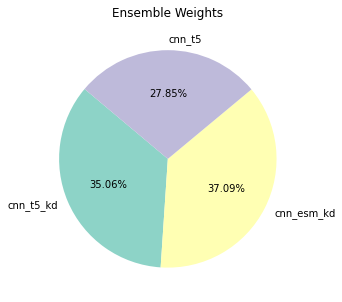

As it looks to be an average of the three models, we’ll take the average
of them

``` python
oof_ensemble = (oof_results['cnn_t5_kd'] + oof_results['cnn_esm_kd'] + oof_results['cnn_t5']) / 3
```

``` python
oof_ensemble
```

<div>
<style scoped>
    .dataframe tbody tr th:only-of-type {
        vertical-align: middle;
    }
&#10;    .dataframe tbody tr th {
        vertical-align: top;
    }
&#10;    .dataframe thead th {
        text-align: right;
    }
</style>

<table class="dataframe" data-quarto-postprocess="true" data-border="1">
<thead>
<tr class="header" style="text-align: right;">
<th data-quarto-table-cell-role="th"></th>
<th data-quarto-table-cell-role="th">-5P</th>
<th data-quarto-table-cell-role="th">-5G</th>
<th data-quarto-table-cell-role="th">-5A</th>
<th data-quarto-table-cell-role="th">-5C</th>
<th data-quarto-table-cell-role="th">-5S</th>
<th data-quarto-table-cell-role="th">-5T</th>
<th data-quarto-table-cell-role="th">-5V</th>
<th data-quarto-table-cell-role="th">-5I</th>
<th data-quarto-table-cell-role="th">-5L</th>
<th data-quarto-table-cell-role="th">-5M</th>
<th data-quarto-table-cell-role="th">-5F</th>
<th data-quarto-table-cell-role="th">-5Y</th>
<th data-quarto-table-cell-role="th">-5W</th>
<th data-quarto-table-cell-role="th">-5H</th>
<th data-quarto-table-cell-role="th">-5K</th>
<th data-quarto-table-cell-role="th">-5R</th>
<th data-quarto-table-cell-role="th">-5Q</th>
<th data-quarto-table-cell-role="th">-5N</th>
<th data-quarto-table-cell-role="th">-5D</th>
<th data-quarto-table-cell-role="th">-5E</th>
<th data-quarto-table-cell-role="th">-5s</th>
<th data-quarto-table-cell-role="th">-5t</th>
<th data-quarto-table-cell-role="th">-5y</th>
<th data-quarto-table-cell-role="th">-4P</th>
<th data-quarto-table-cell-role="th">-4G</th>
<th data-quarto-table-cell-role="th">-4A</th>
<th data-quarto-table-cell-role="th">-4C</th>
<th data-quarto-table-cell-role="th">-4S</th>
<th data-quarto-table-cell-role="th">-4T</th>
<th data-quarto-table-cell-role="th">-4V</th>
<th data-quarto-table-cell-role="th">-4I</th>
<th data-quarto-table-cell-role="th">-4L</th>
<th data-quarto-table-cell-role="th">-4M</th>
<th data-quarto-table-cell-role="th">-4F</th>
<th data-quarto-table-cell-role="th">-4Y</th>
<th data-quarto-table-cell-role="th">-4W</th>
<th data-quarto-table-cell-role="th">-4H</th>
<th data-quarto-table-cell-role="th">-4K</th>
<th data-quarto-table-cell-role="th">-4R</th>
<th data-quarto-table-cell-role="th">-4Q</th>
<th data-quarto-table-cell-role="th">-4N</th>
<th data-quarto-table-cell-role="th">-4D</th>
<th data-quarto-table-cell-role="th">-4E</th>
<th data-quarto-table-cell-role="th">-4s</th>
<th data-quarto-table-cell-role="th">-4t</th>
<th data-quarto-table-cell-role="th">-4y</th>
<th data-quarto-table-cell-role="th">-3P</th>
<th data-quarto-table-cell-role="th">-3G</th>
<th data-quarto-table-cell-role="th">-3A</th>
<th data-quarto-table-cell-role="th">-3C</th>
<th data-quarto-table-cell-role="th">-3S</th>
<th data-quarto-table-cell-role="th">-3T</th>
<th data-quarto-table-cell-role="th">-3V</th>
<th data-quarto-table-cell-role="th">-3I</th>
<th data-quarto-table-cell-role="th">-3L</th>
<th data-quarto-table-cell-role="th">-3M</th>
<th data-quarto-table-cell-role="th">-3F</th>
<th data-quarto-table-cell-role="th">-3Y</th>
<th data-quarto-table-cell-role="th">-3W</th>
<th data-quarto-table-cell-role="th">-3H</th>
<th data-quarto-table-cell-role="th">-3K</th>
<th data-quarto-table-cell-role="th">-3R</th>
<th data-quarto-table-cell-role="th">-3Q</th>
<th data-quarto-table-cell-role="th">-3N</th>
<th data-quarto-table-cell-role="th">-3D</th>
<th data-quarto-table-cell-role="th">-3E</th>
<th data-quarto-table-cell-role="th">-3s</th>
<th data-quarto-table-cell-role="th">-3t</th>
<th data-quarto-table-cell-role="th">-3y</th>
<th data-quarto-table-cell-role="th">-2P</th>
<th data-quarto-table-cell-role="th">-2G</th>
<th data-quarto-table-cell-role="th">-2A</th>
<th data-quarto-table-cell-role="th">-2C</th>
<th data-quarto-table-cell-role="th">-2S</th>
<th data-quarto-table-cell-role="th">-2T</th>
<th data-quarto-table-cell-role="th">-2V</th>
<th data-quarto-table-cell-role="th">-2I</th>
<th data-quarto-table-cell-role="th">-2L</th>
<th data-quarto-table-cell-role="th">-2M</th>
<th data-quarto-table-cell-role="th">-2F</th>
<th data-quarto-table-cell-role="th">-2Y</th>
<th data-quarto-table-cell-role="th">-2W</th>
<th data-quarto-table-cell-role="th">-2H</th>
<th data-quarto-table-cell-role="th">-2K</th>
<th data-quarto-table-cell-role="th">-2R</th>
<th data-quarto-table-cell-role="th">-2Q</th>
<th data-quarto-table-cell-role="th">-2N</th>
<th data-quarto-table-cell-role="th">-2D</th>
<th data-quarto-table-cell-role="th">-2E</th>
<th data-quarto-table-cell-role="th">-2s</th>
<th data-quarto-table-cell-role="th">-2t</th>
<th data-quarto-table-cell-role="th">-2y</th>
<th data-quarto-table-cell-role="th">-1P</th>
<th data-quarto-table-cell-role="th">-1G</th>
<th data-quarto-table-cell-role="th">-1A</th>
<th data-quarto-table-cell-role="th">-1C</th>
<th data-quarto-table-cell-role="th">-1S</th>
<th data-quarto-table-cell-role="th">-1T</th>
<th data-quarto-table-cell-role="th">-1V</th>
<th data-quarto-table-cell-role="th">-1I</th>
<th data-quarto-table-cell-role="th">-1L</th>
<th data-quarto-table-cell-role="th">-1M</th>
<th data-quarto-table-cell-role="th">-1F</th>
<th data-quarto-table-cell-role="th">-1Y</th>
<th data-quarto-table-cell-role="th">-1W</th>
<th data-quarto-table-cell-role="th">-1H</th>
<th data-quarto-table-cell-role="th">-1K</th>
<th data-quarto-table-cell-role="th">-1R</th>
<th data-quarto-table-cell-role="th">-1Q</th>
<th data-quarto-table-cell-role="th">-1N</th>
<th data-quarto-table-cell-role="th">-1D</th>
<th data-quarto-table-cell-role="th">-1E</th>
<th data-quarto-table-cell-role="th">-1s</th>
<th data-quarto-table-cell-role="th">-1t</th>
<th data-quarto-table-cell-role="th">-1y</th>
<th data-quarto-table-cell-role="th">1P</th>
<th data-quarto-table-cell-role="th">1G</th>
<th data-quarto-table-cell-role="th">1A</th>
<th data-quarto-table-cell-role="th">1C</th>
<th data-quarto-table-cell-role="th">1S</th>
<th data-quarto-table-cell-role="th">1T</th>
<th data-quarto-table-cell-role="th">1V</th>
<th data-quarto-table-cell-role="th">1I</th>
<th data-quarto-table-cell-role="th">1L</th>
<th data-quarto-table-cell-role="th">1M</th>
<th data-quarto-table-cell-role="th">1F</th>
<th data-quarto-table-cell-role="th">1Y</th>
<th data-quarto-table-cell-role="th">1W</th>
<th data-quarto-table-cell-role="th">1H</th>
<th data-quarto-table-cell-role="th">1K</th>
<th data-quarto-table-cell-role="th">1R</th>
<th data-quarto-table-cell-role="th">1Q</th>
<th data-quarto-table-cell-role="th">1N</th>
<th data-quarto-table-cell-role="th">1D</th>
<th data-quarto-table-cell-role="th">1E</th>
<th data-quarto-table-cell-role="th">1s</th>
<th data-quarto-table-cell-role="th">1t</th>
<th data-quarto-table-cell-role="th">1y</th>
<th data-quarto-table-cell-role="th">2P</th>
<th data-quarto-table-cell-role="th">2G</th>
<th data-quarto-table-cell-role="th">2A</th>
<th data-quarto-table-cell-role="th">2C</th>
<th data-quarto-table-cell-role="th">2S</th>
<th data-quarto-table-cell-role="th">2T</th>
<th data-quarto-table-cell-role="th">2V</th>
<th data-quarto-table-cell-role="th">2I</th>
<th data-quarto-table-cell-role="th">2L</th>
<th data-quarto-table-cell-role="th">2M</th>
<th data-quarto-table-cell-role="th">2F</th>
<th data-quarto-table-cell-role="th">2Y</th>
<th data-quarto-table-cell-role="th">2W</th>
<th data-quarto-table-cell-role="th">2H</th>
<th data-quarto-table-cell-role="th">2K</th>
<th data-quarto-table-cell-role="th">2R</th>
<th data-quarto-table-cell-role="th">2Q</th>
<th data-quarto-table-cell-role="th">2N</th>
<th data-quarto-table-cell-role="th">2D</th>
<th data-quarto-table-cell-role="th">2E</th>
<th data-quarto-table-cell-role="th">2s</th>
<th data-quarto-table-cell-role="th">2t</th>
<th data-quarto-table-cell-role="th">2y</th>
<th data-quarto-table-cell-role="th">3P</th>
<th data-quarto-table-cell-role="th">3G</th>
<th data-quarto-table-cell-role="th">3A</th>
<th data-quarto-table-cell-role="th">3C</th>
<th data-quarto-table-cell-role="th">3S</th>
<th data-quarto-table-cell-role="th">3T</th>
<th data-quarto-table-cell-role="th">3V</th>
<th data-quarto-table-cell-role="th">3I</th>
<th data-quarto-table-cell-role="th">3L</th>
<th data-quarto-table-cell-role="th">3M</th>
<th data-quarto-table-cell-role="th">3F</th>
<th data-quarto-table-cell-role="th">3Y</th>
<th data-quarto-table-cell-role="th">3W</th>
<th data-quarto-table-cell-role="th">3H</th>
<th data-quarto-table-cell-role="th">3K</th>
<th data-quarto-table-cell-role="th">3R</th>
<th data-quarto-table-cell-role="th">3Q</th>
<th data-quarto-table-cell-role="th">3N</th>
<th data-quarto-table-cell-role="th">3D</th>
<th data-quarto-table-cell-role="th">3E</th>
<th data-quarto-table-cell-role="th">3s</th>
<th data-quarto-table-cell-role="th">3t</th>
<th data-quarto-table-cell-role="th">3y</th>
<th data-quarto-table-cell-role="th">4P</th>
<th data-quarto-table-cell-role="th">4G</th>
<th data-quarto-table-cell-role="th">4A</th>
<th data-quarto-table-cell-role="th">4C</th>
<th data-quarto-table-cell-role="th">4S</th>
<th data-quarto-table-cell-role="th">4T</th>
<th data-quarto-table-cell-role="th">4V</th>
<th data-quarto-table-cell-role="th">4I</th>
<th data-quarto-table-cell-role="th">4L</th>
<th data-quarto-table-cell-role="th">4M</th>
<th data-quarto-table-cell-role="th">4F</th>
<th data-quarto-table-cell-role="th">4Y</th>
<th data-quarto-table-cell-role="th">4W</th>
<th data-quarto-table-cell-role="th">4H</th>
<th data-quarto-table-cell-role="th">4K</th>
<th data-quarto-table-cell-role="th">4R</th>
<th data-quarto-table-cell-role="th">4Q</th>
<th data-quarto-table-cell-role="th">4N</th>
<th data-quarto-table-cell-role="th">4D</th>
<th data-quarto-table-cell-role="th">4E</th>
<th data-quarto-table-cell-role="th">4s</th>
<th data-quarto-table-cell-role="th">4t</th>
<th data-quarto-table-cell-role="th">4y</th>
<th data-quarto-table-cell-role="th">0s</th>
<th data-quarto-table-cell-role="th">0t</th>
<th data-quarto-table-cell-role="th">0y</th>
</tr>
</thead>
<tbody>
<tr class="odd">
<td data-quarto-table-cell-role="th">0</td>
<td>0.188878</td>
<td>0.634647</td>
<td>0.887343</td>
<td>-0.927092</td>
<td>-0.392501</td>
<td>-0.586569</td>
<td>0.142022</td>
<td>0.007973</td>
<td>0.562061</td>
<td>-0.993858</td>
<td>-0.566768</td>
<td>-1.220567</td>
<td>-1.158315</td>
<td>-0.642133</td>
<td>1.120802</td>
<td>0.364175</td>
<td>0.375434</td>
<td>0.055257</td>
<td>1.663378</td>
<td>2.376884</td>
<td>-0.301946</td>
<td>-0.794536</td>
<td>-0.552649</td>
<td>0.190727</td>
<td>1.270748</td>
<td>0.513715</td>
<td>-0.854113</td>
<td>-0.487572</td>
<td>-0.638809</td>
<td>0.230982</td>
<td>-0.242128</td>
<td>1.036821</td>
<td>-0.792146</td>
<td>-0.403138</td>
<td>-1.319813</td>
<td>-1.409867</td>
<td>-0.841248</td>
<td>0.476729</td>
<td>0.362317</td>
<td>-0.164695</td>
<td>-0.232484</td>
<td>1.704270</td>
<td>2.104024</td>
<td>0.291016</td>
<td>-0.687562</td>
<td>-0.548687</td>
<td>0.069685</td>
<td>0.753290</td>
<td>1.037177</td>
<td>-1.145434</td>
<td>-0.621697</td>
<td>-0.929131</td>
<td>0.163861</td>
<td>-0.488886</td>
<td>0.603018</td>
<td>-0.976631</td>
<td>-0.657797</td>
<td>-1.337881</td>
<td>-1.360138</td>
<td>-0.648267</td>
<td>0.672734</td>
<td>0.166015</td>
<td>0.424121</td>
<td>0.005110</td>
<td>1.784140</td>
<td>3.080080</td>
<td>0.135212</td>
<td>-0.625342</td>
<td>-0.208076</td>
<td>0.522695</td>
<td>1.255310</td>
<td>0.811666</td>
<td>-1.000513</td>
<td>-0.704257</td>
<td>-0.894888</td>
<td>0.036102</td>
<td>-0.181274</td>
<td>0.143785</td>
<td>-1.174770</td>
<td>-0.859642</td>
<td>-1.324347</td>
<td>-1.155678</td>
<td>-0.889019</td>
<td>0.587813</td>
<td>-0.260471</td>
<td>0.352046</td>
<td>0.267965</td>
<td>2.108112</td>
<td>2.557907</td>
<td>0.359679</td>
<td>-0.419893</td>
<td>-0.191064</td>
<td>-0.031897</td>
<td>-0.041261</td>
<td>0.768281</td>
<td>-1.046224</td>
<td>-1.056009</td>
<td>-0.841082</td>
<td>1.678762</td>
<td>1.474963</td>
<td>2.380413</td>
<td>-1.209911</td>
<td>-0.328476</td>
<td>-1.353052</td>
<td>-1.178340</td>
<td>-0.810562</td>
<td>-0.073252</td>
<td>-0.627969</td>
<td>-0.244801</td>
<td>-0.143653</td>
<td>1.185254</td>
<td>1.820870</td>
<td>-0.503965</td>
<td>0.033932</td>
<td>0.055079</td>
<td>-0.990394</td>
<td>2.050974</td>
<td>1.202434</td>
<td>-0.896472</td>
<td>-0.751740</td>
<td>-1.074353</td>
<td>0.673735</td>
<td>0.215778</td>
<td>0.388112</td>
<td>-0.904532</td>
<td>-0.696476</td>
<td>-1.325945</td>
<td>-1.133978</td>
<td>-0.718839</td>
<td>-0.004357</td>
<td>-0.723982</td>
<td>0.306474</td>
<td>-0.201503</td>
<td>1.981238</td>
<td>3.301958</td>
<td>0.194510</td>
<td>-0.673171</td>
<td>-0.147423</td>
<td>-0.012991</td>
<td>0.666403</td>
<td>1.149449</td>
<td>-0.809711</td>
<td>-0.726497</td>
<td>-0.936235</td>
<td>0.676131</td>
<td>-0.102694</td>
<td>0.933665</td>
<td>-0.895986</td>
<td>-0.314606</td>
<td>-1.249670</td>
<td>-1.060242</td>
<td>-0.775663</td>
<td>0.120224</td>
<td>-0.079433</td>
<td>-0.139687</td>
<td>0.144503</td>
<td>1.457012</td>
<td>2.152325</td>
<td>0.207267</td>
<td>-0.323534</td>
<td>-0.220516</td>
<td>0.579143</td>
<td>0.581741</td>
<td>0.764128</td>
<td>-0.780944</td>
<td>-0.667929</td>
<td>-0.927524</td>
<td>0.894377</td>
<td>0.651753</td>
<td>2.628730</td>
<td>-0.783616</td>
<td>-0.169506</td>
<td>-1.289550</td>
<td>-1.116577</td>
<td>-0.653992</td>
<td>0.193128</td>
<td>0.715483</td>
<td>-0.328777</td>
<td>-0.497816</td>
<td>0.547089</td>
<td>0.568319</td>
<td>-0.167851</td>
<td>-0.542341</td>
<td>-0.194183</td>
<td>0.416947</td>
<td>0.874074</td>
<td>1.057034</td>
<td>-0.942906</td>
<td>-0.373124</td>
<td>-0.787586</td>
<td>0.601266</td>
<td>-0.254105</td>
<td>0.793548</td>
<td>-0.834147</td>
<td>-0.294836</td>
<td>-1.225388</td>
<td>-1.186767</td>
<td>-0.653884</td>
<td>0.888362</td>
<td>0.690264</td>
<td>-0.043264</td>
<td>-0.115584</td>
<td>1.033319</td>
<td>1.457796</td>
<td>-0.159984</td>
<td>-0.520591</td>
<td>-0.457668</td>
<td>-0.704891</td>
<td>-0.679028</td>
<td>1.414340</td>
</tr>
<tr class="even">
<td data-quarto-table-cell-role="th">1</td>
<td>-0.025378</td>
<td>0.714929</td>
<td>0.920944</td>
<td>-1.022550</td>
<td>-0.377764</td>
<td>-0.636222</td>
<td>0.134602</td>
<td>-0.041053</td>
<td>0.666049</td>
<td>-0.975972</td>
<td>-0.436032</td>
<td>-1.089625</td>
<td>-1.148152</td>
<td>-0.615748</td>
<td>1.547186</td>
<td>0.616245</td>
<td>0.263874</td>
<td>0.219127</td>
<td>1.361456</td>
<td>1.681483</td>
<td>-0.458307</td>
<td>-0.781143</td>
<td>-0.551071</td>
<td>0.131412</td>
<td>1.280712</td>
<td>0.343339</td>
<td>-0.892329</td>
<td>-0.411230</td>
<td>-0.595306</td>
<td>0.272755</td>
<td>-0.149464</td>
<td>1.104624</td>
<td>-0.778450</td>
<td>-0.379281</td>
<td>-1.217710</td>
<td>-1.201595</td>
<td>-0.732177</td>
<td>0.788771</td>
<td>0.675667</td>
<td>-0.106178</td>
<td>-0.085377</td>
<td>1.359592</td>
<td>1.520061</td>
<td>0.125365</td>
<td>-0.668326</td>
<td>-0.569933</td>
<td>0.217928</td>
<td>0.803164</td>
<td>1.125930</td>
<td>-1.078663</td>
<td>-0.694710</td>
<td>-0.892364</td>
<td>0.308811</td>
<td>-0.217046</td>
<td>0.690249</td>
<td>-0.967827</td>
<td>-0.508961</td>
<td>-1.235178</td>
<td>-1.157629</td>
<td>-0.601595</td>
<td>0.733407</td>
<td>0.290156</td>
<td>0.361249</td>
<td>-0.081060</td>
<td>1.511702</td>
<td>2.072425</td>
<td>0.152596</td>
<td>-0.614647</td>
<td>-0.341213</td>
<td>0.232904</td>
<td>0.967064</td>
<td>0.870205</td>
<td>-0.957279</td>
<td>-0.700066</td>
<td>-1.014585</td>
<td>0.176937</td>
<td>-0.020815</td>
<td>0.229948</td>
<td>-1.000263</td>
<td>-0.768759</td>
<td>-1.291999</td>
<td>-1.003731</td>
<td>-0.901384</td>
<td>1.032405</td>
<td>0.113560</td>
<td>0.275431</td>
<td>-0.084332</td>
<td>1.372409</td>
<td>2.307034</td>
<td>0.361895</td>
<td>-0.367394</td>
<td>-0.101802</td>
<td>-0.505137</td>
<td>-0.005732</td>
<td>0.529710</td>
<td>-1.089594</td>
<td>-1.030629</td>
<td>-0.930996</td>
<td>0.675152</td>
<td>0.595349</td>
<td>1.792188</td>
<td>-1.231175</td>
<td>-0.360018</td>
<td>-1.313301</td>
<td>-1.248776</td>
<td>-0.891328</td>
<td>-0.034980</td>
<td>-0.276024</td>
<td>-0.269184</td>
<td>0.695430</td>
<td>3.171903</td>
<td>2.060493</td>
<td>-0.313544</td>
<td>-0.091605</td>
<td>0.062153</td>
<td>-0.884825</td>
<td>0.876114</td>
<td>1.224441</td>
<td>-0.919931</td>
<td>-0.917134</td>
<td>-1.074066</td>
<td>1.190683</td>
<td>0.769583</td>
<td>0.686133</td>
<td>-0.905399</td>
<td>-0.505974</td>
<td>-1.319224</td>
<td>-1.148758</td>
<td>-0.704071</td>
<td>-0.205544</td>
<td>-0.778959</td>
<td>0.389553</td>
<td>-0.531959</td>
<td>1.657287</td>
<td>3.571767</td>
<td>0.192003</td>
<td>-0.706291</td>
<td>-0.158499</td>
<td>-0.136238</td>
<td>0.138411</td>
<td>0.950910</td>
<td>-0.904203</td>
<td>-0.872926</td>
<td>-0.971147</td>
<td>0.585231</td>
<td>-0.246415</td>
<td>0.663709</td>
<td>-0.727415</td>
<td>-0.171336</td>
<td>-1.205408</td>
<td>-1.029339</td>
<td>-0.633804</td>
<td>0.182212</td>
<td>-0.301457</td>
<td>-0.200499</td>
<td>0.235688</td>
<td>2.338714</td>
<td>2.657143</td>
<td>0.058047</td>
<td>-0.332117</td>
<td>-0.117603</td>
<td>0.449370</td>
<td>0.295798</td>
<td>0.717976</td>
<td>-0.782166</td>
<td>-1.050453</td>
<td>-0.913831</td>
<td>1.325246</td>
<td>0.764809</td>
<td>3.037096</td>
<td>-0.633829</td>
<td>-0.091207</td>
<td>-1.248452</td>
<td>-1.097738</td>
<td>-0.679635</td>
<td>-0.100422</td>
<td>0.314001</td>
<td>-0.278309</td>
<td>-0.327892</td>
<td>0.736089</td>
<td>0.606189</td>
<td>-0.329023</td>
<td>-0.365070</td>
<td>-0.414462</td>
<td>0.277456</td>
<td>0.820147</td>
<td>0.992880</td>
<td>-0.931553</td>
<td>-0.488792</td>
<td>-0.853461</td>
<td>0.552210</td>
<td>-0.261802</td>
<td>0.841647</td>
<td>-0.791326</td>
<td>-0.152338</td>
<td>-1.163227</td>
<td>-1.173420</td>
<td>-0.663181</td>
<td>0.814095</td>
<td>0.477838</td>
<td>-0.275963</td>
<td>-0.028011</td>
<td>1.277532</td>
<td>1.637414</td>
<td>-0.231553</td>
<td>-0.460945</td>
<td>-0.521478</td>
<td>-0.666918</td>
<td>-0.666190</td>
<td>1.365925</td>
</tr>
<tr class="odd">
<td data-quarto-table-cell-role="th">2</td>
<td>-0.024647</td>
<td>0.560756</td>
<td>0.934807</td>
<td>-0.974955</td>
<td>-0.175042</td>
<td>-0.629669</td>
<td>0.058849</td>
<td>-0.054240</td>
<td>0.548685</td>
<td>-0.881397</td>
<td>-0.394332</td>
<td>-1.076726</td>
<td>-1.069301</td>
<td>-0.709501</td>
<td>1.228867</td>
<td>0.759148</td>
<td>0.222496</td>
<td>0.029304</td>
<td>1.321192</td>
<td>1.630601</td>
<td>-0.312367</td>
<td>-0.637080</td>
<td>-0.497616</td>
<td>0.074048</td>
<td>1.185613</td>
<td>0.402796</td>
<td>-0.747981</td>
<td>-0.400933</td>
<td>-0.575594</td>
<td>0.273450</td>
<td>-0.230542</td>
<td>1.133951</td>
<td>-0.717366</td>
<td>-0.266730</td>
<td>-1.135025</td>
<td>-1.146772</td>
<td>-0.733745</td>
<td>0.728746</td>
<td>0.739683</td>
<td>-0.047235</td>
<td>-0.141333</td>
<td>1.264864</td>
<td>1.433561</td>
<td>0.203258</td>
<td>-0.433761</td>
<td>-0.338125</td>
<td>-0.044754</td>
<td>0.713836</td>
<td>1.139258</td>
<td>-0.899315</td>
<td>-0.652277</td>
<td>-0.879406</td>
<td>0.059048</td>
<td>-0.320130</td>
<td>0.305766</td>
<td>-0.920699</td>
<td>-0.600200</td>
<td>-1.255255</td>
<td>-1.168093</td>
<td>-0.597407</td>
<td>0.832587</td>
<td>0.963251</td>
<td>0.302916</td>
<td>-0.164538</td>
<td>1.218751</td>
<td>2.107990</td>
<td>0.381744</td>
<td>-0.424843</td>
<td>-0.323495</td>
<td>0.356763</td>
<td>0.976482</td>
<td>0.622836</td>
<td>-0.739690</td>
<td>-0.612199</td>
<td>-0.895093</td>
<td>0.093400</td>
<td>-0.090386</td>
<td>0.139569</td>
<td>-0.966888</td>
<td>-0.727430</td>
<td>-1.153557</td>
<td>-0.945674</td>
<td>-0.698418</td>
<td>0.708270</td>
<td>0.314546</td>
<td>0.157194</td>
<td>0.149991</td>
<td>1.325282</td>
<td>1.825401</td>
<td>0.602699</td>
<td>-0.325473</td>
<td>-0.059798</td>
<td>-0.236990</td>
<td>0.297713</td>
<td>0.743918</td>
<td>-0.943952</td>
<td>-1.088841</td>
<td>-0.932575</td>
<td>0.906144</td>
<td>0.701359</td>
<td>1.553143</td>
<td>-1.070274</td>
<td>-0.357941</td>
<td>-1.170364</td>
<td>-1.054697</td>
<td>-0.674670</td>
<td>0.179464</td>
<td>0.007014</td>
<td>-0.023326</td>
<td>0.243161</td>
<td>1.640087</td>
<td>1.131995</td>
<td>-0.228535</td>
<td>-0.038759</td>
<td>0.317038</td>
<td>-0.753399</td>
<td>0.888694</td>
<td>0.988067</td>
<td>-0.806323</td>
<td>-0.818472</td>
<td>-0.953558</td>
<td>0.886148</td>
<td>0.677087</td>
<td>0.715901</td>
<td>-0.695982</td>
<td>0.193626</td>
<td>-1.151319</td>
<td>-1.019825</td>
<td>-0.642614</td>
<td>-0.016035</td>
<td>-0.493689</td>
<td>0.357618</td>
<td>-0.568868</td>
<td>1.169129</td>
<td>2.158598</td>
<td>0.385091</td>
<td>-0.366585</td>
<td>0.149272</td>
<td>0.035840</td>
<td>0.311061</td>
<td>0.678965</td>
<td>-0.755270</td>
<td>-0.885359</td>
<td>-0.873519</td>
<td>0.491406</td>
<td>-0.120983</td>
<td>0.781147</td>
<td>-0.662009</td>
<td>-0.124938</td>
<td>-1.059510</td>
<td>-1.038169</td>
<td>-0.550205</td>
<td>0.209194</td>
<td>0.310325</td>
<td>-0.297987</td>
<td>0.256709</td>
<td>1.455295</td>
<td>1.829231</td>
<td>0.255894</td>
<td>-0.268770</td>
<td>0.083823</td>
<td>0.590880</td>
<td>0.364527</td>
<td>0.517759</td>
<td>-0.591672</td>
<td>-0.807841</td>
<td>-0.794786</td>
<td>1.258402</td>
<td>0.601661</td>
<td>2.574703</td>
<td>-0.628313</td>
<td>-0.008908</td>
<td>-1.041480</td>
<td>-0.960783</td>
<td>-0.690295</td>
<td>-0.127888</td>
<td>0.610275</td>
<td>-0.348584</td>
<td>-0.423146</td>
<td>0.385747</td>
<td>0.535732</td>
<td>-0.134539</td>
<td>-0.336298</td>
<td>-0.352171</td>
<td>0.373305</td>
<td>0.949861</td>
<td>0.825229</td>
<td>-0.804869</td>
<td>-0.547974</td>
<td>-0.773568</td>
<td>0.533965</td>
<td>-0.140524</td>
<td>0.621019</td>
<td>-0.819822</td>
<td>-0.151661</td>
<td>-1.073182</td>
<td>-0.975920</td>
<td>-0.773664</td>
<td>0.731652</td>
<td>0.564922</td>
<td>-0.105418</td>
<td>-0.128784</td>
<td>0.877137</td>
<td>1.439533</td>
<td>-0.146537</td>
<td>-0.233944</td>
<td>-0.445056</td>
<td>-0.472215</td>
<td>-0.577957</td>
<td>1.176335</td>
</tr>
<tr class="even">
<td data-quarto-table-cell-role="th">3</td>
<td>-0.115886</td>
<td>0.820746</td>
<td>1.072479</td>
<td>-1.107175</td>
<td>-0.336168</td>
<td>-0.784364</td>
<td>0.094444</td>
<td>-0.072963</td>
<td>0.810767</td>
<td>-1.064753</td>
<td>-0.608579</td>
<td>-1.339365</td>
<td>-1.245652</td>
<td>-0.831597</td>
<td>1.721726</td>
<td>0.712874</td>
<td>0.235246</td>
<td>0.276209</td>
<td>1.626535</td>
<td>2.092431</td>
<td>-0.482970</td>
<td>-0.750626</td>
<td>-0.460130</td>
<td>0.236611</td>
<td>1.392298</td>
<td>0.586144</td>
<td>-0.986109</td>
<td>-0.543984</td>
<td>-0.869062</td>
<td>0.406866</td>
<td>-0.199675</td>
<td>1.261367</td>
<td>-0.931979</td>
<td>-0.453303</td>
<td>-1.378041</td>
<td>-1.429664</td>
<td>-0.885421</td>
<td>0.790337</td>
<td>0.861260</td>
<td>-0.105331</td>
<td>-0.107974</td>
<td>1.406247</td>
<td>1.556562</td>
<td>0.291431</td>
<td>-0.635116</td>
<td>-0.547837</td>
<td>0.246646</td>
<td>0.842397</td>
<td>1.374244</td>
<td>-1.213337</td>
<td>-0.836970</td>
<td>-1.061880</td>
<td>0.445910</td>
<td>-0.240524</td>
<td>0.818263</td>
<td>-1.145204</td>
<td>-0.652396</td>
<td>-1.454522</td>
<td>-1.350311</td>
<td>-0.748239</td>
<td>1.094022</td>
<td>0.496164</td>
<td>0.291302</td>
<td>-0.021706</td>
<td>1.384924</td>
<td>2.188752</td>
<td>0.427537</td>
<td>-0.540029</td>
<td>-0.402436</td>
<td>0.263044</td>
<td>1.126636</td>
<td>0.818492</td>
<td>-1.084867</td>
<td>-0.777840</td>
<td>-1.156849</td>
<td>0.150072</td>
<td>-0.151041</td>
<td>0.160017</td>
<td>-1.158610</td>
<td>-0.724767</td>
<td>-1.481028</td>
<td>-1.148549</td>
<td>-1.060825</td>
<td>1.138146</td>
<td>0.097964</td>
<td>0.181290</td>
<td>0.068909</td>
<td>1.746760</td>
<td>2.522271</td>
<td>0.638805</td>
<td>-0.363088</td>
<td>-0.016735</td>
<td>-0.108448</td>
<td>1.061750</td>
<td>0.936679</td>
<td>-1.093320</td>
<td>-1.129213</td>
<td>-1.258457</td>
<td>0.759771</td>
<td>0.511325</td>
<td>1.550209</td>
<td>-1.309304</td>
<td>-0.281704</td>
<td>-1.516510</td>
<td>-1.239510</td>
<td>-0.933464</td>
<td>0.154529</td>
<td>-0.326074</td>
<td>-0.101655</td>
<td>0.455826</td>
<td>2.016972</td>
<td>1.575466</td>
<td>-0.069357</td>
<td>-0.185581</td>
<td>0.533793</td>
<td>-0.699799</td>
<td>1.152556</td>
<td>0.896781</td>
<td>-1.046621</td>
<td>-1.170381</td>
<td>-1.218255</td>
<td>1.496725</td>
<td>0.998083</td>
<td>1.133697</td>
<td>-0.938286</td>
<td>-0.015171</td>
<td>-1.440916</td>
<td>-1.188007</td>
<td>-0.683514</td>
<td>0.378795</td>
<td>-0.640599</td>
<td>0.183254</td>
<td>-0.548098</td>
<td>1.053966</td>
<td>2.207037</td>
<td>0.354827</td>
<td>-0.519037</td>
<td>0.394696</td>
<td>0.244732</td>
<td>0.381438</td>
<td>1.113125</td>
<td>-0.899122</td>
<td>-1.096222</td>
<td>-1.173454</td>
<td>0.687293</td>
<td>-0.046008</td>
<td>0.940206</td>
<td>-0.894093</td>
<td>-0.104996</td>
<td>-1.368054</td>
<td>-1.066989</td>
<td>-0.855887</td>
<td>0.294873</td>
<td>0.093265</td>
<td>-0.139776</td>
<td>0.133550</td>
<td>1.779457</td>
<td>1.869632</td>
<td>0.243867</td>
<td>-0.375760</td>
<td>0.071816</td>
<td>0.692799</td>
<td>0.415830</td>
<td>0.703685</td>
<td>-0.878906</td>
<td>-1.026634</td>
<td>-1.112752</td>
<td>1.394995</td>
<td>0.792975</td>
<td>2.919907</td>
<td>-0.848465</td>
<td>-0.122632</td>
<td>-1.400679</td>
<td>-1.258569</td>
<td>-0.974020</td>
<td>0.270461</td>
<td>0.788220</td>
<td>-0.574408</td>
<td>-0.295961</td>
<td>0.706526</td>
<td>0.730792</td>
<td>-0.166971</td>
<td>-0.385794</td>
<td>-0.312091</td>
<td>0.376540</td>
<td>0.884624</td>
<td>0.977607</td>
<td>-1.104369</td>
<td>-0.602411</td>
<td>-0.914841</td>
<td>0.743480</td>
<td>-0.106034</td>
<td>1.201335</td>
<td>-0.814697</td>
<td>-0.223407</td>
<td>-1.285807</td>
<td>-1.231427</td>
<td>-0.859937</td>
<td>1.158588</td>
<td>0.774048</td>
<td>-0.271745</td>
<td>-0.174051</td>
<td>0.883699</td>
<td>1.405990</td>
<td>-0.198720</td>
<td>-0.331293</td>
<td>-0.493096</td>
<td>-0.617485</td>
<td>-0.773803</td>
<td>1.381849</td>
</tr>
<tr class="odd">
<td data-quarto-table-cell-role="th">4</td>
<td>0.005970</td>
<td>0.751114</td>
<td>1.085722</td>
<td>-1.039904</td>
<td>-0.406701</td>
<td>-0.679811</td>
<td>0.072615</td>
<td>-0.075559</td>
<td>0.692090</td>
<td>-1.072586</td>
<td>-0.460515</td>
<td>-1.288880</td>
<td>-1.222914</td>
<td>-0.716772</td>
<td>1.364289</td>
<td>0.482584</td>
<td>0.263830</td>
<td>0.171767</td>
<td>1.651816</td>
<td>2.032803</td>
<td>-0.388215</td>
<td>-0.720607</td>
<td>-0.454893</td>
<td>0.265395</td>
<td>1.379802</td>
<td>0.589531</td>
<td>-0.818324</td>
<td>-0.519316</td>
<td>-0.746067</td>
<td>0.413932</td>
<td>-0.178369</td>
<td>1.170074</td>
<td>-0.894897</td>
<td>-0.355494</td>
<td>-1.330207</td>
<td>-1.312370</td>
<td>-0.802593</td>
<td>0.591601</td>
<td>0.688329</td>
<td>-0.156697</td>
<td>-0.163164</td>
<td>1.411729</td>
<td>1.699529</td>
<td>0.206069</td>
<td>-0.666106</td>
<td>-0.523285</td>
<td>0.173828</td>
<td>0.883171</td>
<td>1.294354</td>
<td>-1.112042</td>
<td>-0.686691</td>
<td>-0.939822</td>
<td>0.276185</td>
<td>-0.307773</td>
<td>0.697519</td>
<td>-0.985738</td>
<td>-0.642088</td>
<td>-1.393248</td>
<td>-1.392490</td>
<td>-0.732761</td>
<td>0.973595</td>
<td>0.358805</td>
<td>0.335087</td>
<td>0.064024</td>
<td>1.482641</td>
<td>2.376040</td>
<td>0.233742</td>
<td>-0.572048</td>
<td>-0.423111</td>
<td>0.447690</td>
<td>1.153062</td>
<td>0.833891</td>
<td>-1.003197</td>
<td>-0.699037</td>
<td>-0.993186</td>
<td>0.153248</td>
<td>-0.209088</td>
<td>0.223381</td>
<td>-1.165334</td>
<td>-0.741596</td>
<td>-1.444063</td>
<td>-1.076746</td>
<td>-0.977388</td>
<td>0.960369</td>
<td>-0.033733</td>
<td>0.309105</td>
<td>0.115317</td>
<td>1.677490</td>
<td>2.432875</td>
<td>0.478845</td>
<td>-0.499757</td>
<td>-0.138839</td>
<td>-0.151743</td>
<td>0.650876</td>
<td>0.836831</td>
<td>-0.989553</td>
<td>-1.087273</td>
<td>-1.087959</td>
<td>0.785815</td>
<td>0.776908</td>
<td>1.770988</td>
<td>-1.228824</td>
<td>-0.357408</td>
<td>-1.430037</td>
<td>-1.258179</td>
<td>-0.797396</td>
<td>0.152119</td>
<td>-0.311512</td>
<td>-0.174495</td>
<td>0.422862</td>
<td>1.711298</td>
<td>1.606907</td>
<td>-0.111176</td>
<td>-0.190658</td>
<td>0.401723</td>
<td>-0.786975</td>
<td>1.135739</td>
<td>1.058611</td>
<td>-0.969714</td>
<td>-0.932000</td>
<td>-1.149220</td>
<td>1.275183</td>
<td>0.763192</td>
<td>1.097840</td>
<td>-0.851838</td>
<td>-0.135197</td>
<td>-1.440695</td>
<td>-1.176001</td>
<td>-0.535466</td>
<td>0.188978</td>
<td>-0.533128</td>
<td>0.373298</td>
<td>-0.448216</td>
<td>1.071386</td>
<td>2.115694</td>
<td>0.146461</td>
<td>-0.588486</td>
<td>0.263037</td>
<td>0.268874</td>
<td>0.469420</td>
<td>1.094261</td>
<td>-0.928724</td>
<td>-1.012780</td>
<td>-1.003566</td>
<td>0.759516</td>
<td>-0.058255</td>
<td>0.952261</td>
<td>-0.984737</td>
<td>-0.179058</td>
<td>-1.345385</td>
<td>-1.038068</td>
<td>-0.822988</td>
<td>0.324975</td>
<td>0.130887</td>
<td>-0.013518</td>
<td>0.059971</td>
<td>1.701512</td>
<td>2.136519</td>
<td>0.050153</td>
<td>-0.482915</td>
<td>-0.053709</td>
<td>0.684908</td>
<td>0.572248</td>
<td>0.710637</td>
<td>-0.836325</td>
<td>-0.807433</td>
<td>-0.992573</td>
<td>1.345920</td>
<td>0.821516</td>
<td>2.887753</td>
<td>-0.706492</td>
<td>-0.110270</td>
<td>-1.351152</td>
<td>-1.205737</td>
<td>-0.737653</td>
<td>0.244887</td>
<td>0.633224</td>
<td>-0.466895</td>
<td>-0.268452</td>
<td>0.583513</td>
<td>0.529670</td>
<td>-0.291038</td>
<td>-0.485136</td>
<td>-0.285899</td>
<td>0.483719</td>
<td>0.887183</td>
<td>1.036619</td>
<td>-1.038690</td>
<td>-0.437466</td>
<td>-0.841210</td>
<td>0.719239</td>
<td>-0.163292</td>
<td>1.080628</td>
<td>-0.780459</td>
<td>-0.308839</td>
<td>-1.277385</td>
<td>-1.213813</td>
<td>-0.850979</td>
<td>1.037729</td>
<td>0.641427</td>
<td>-0.145962</td>
<td>-0.076124</td>
<td>0.989158</td>
<td>1.263439</td>
<td>-0.166760</td>
<td>-0.514443</td>
<td>-0.423403</td>
<td>-0.676674</td>
<td>-0.746608</td>
<td>1.362359</td>
</tr>
<tr class="even">
<td data-quarto-table-cell-role="th">...</td>
<td>...</td>
<td>...</td>
<td>...</td>
<td>...</td>
<td>...</td>
<td>...</td>
<td>...</td>
<td>...</td>
<td>...</td>
<td>...</td>
<td>...</td>
<td>...</td>
<td>...</td>
<td>...</td>
<td>...</td>
<td>...</td>
<td>...</td>
<td>...</td>
<td>...</td>
<td>...</td>
<td>...</td>
<td>...</td>
<td>...</td>
<td>...</td>
<td>...</td>
<td>...</td>
<td>...</td>
<td>...</td>
<td>...</td>
<td>...</td>
<td>...</td>
<td>...</td>
<td>...</td>
<td>...</td>
<td>...</td>
<td>...</td>
<td>...</td>
<td>...</td>
<td>...</td>
<td>...</td>
<td>...</td>
<td>...</td>
<td>...</td>
<td>...</td>
<td>...</td>
<td>...</td>
<td>...</td>
<td>...</td>
<td>...</td>
<td>...</td>
<td>...</td>
<td>...</td>
<td>...</td>
<td>...</td>
<td>...</td>
<td>...</td>
<td>...</td>
<td>...</td>
<td>...</td>
<td>...</td>
<td>...</td>
<td>...</td>
<td>...</td>
<td>...</td>
<td>...</td>
<td>...</td>
<td>...</td>
<td>...</td>
<td>...</td>
<td>...</td>
<td>...</td>
<td>...</td>
<td>...</td>
<td>...</td>
<td>...</td>
<td>...</td>
<td>...</td>
<td>...</td>
<td>...</td>
<td>...</td>
<td>...</td>
<td>...</td>
<td>...</td>
<td>...</td>
<td>...</td>
<td>...</td>
<td>...</td>
<td>...</td>
<td>...</td>
<td>...</td>
<td>...</td>
<td>...</td>
<td>...</td>
<td>...</td>
<td>...</td>
<td>...</td>
<td>...</td>
<td>...</td>
<td>...</td>
<td>...</td>
<td>...</td>
<td>...</td>
<td>...</td>
<td>...</td>
<td>...</td>
<td>...</td>
<td>...</td>
<td>...</td>
<td>...</td>
<td>...</td>
<td>...</td>
<td>...</td>
<td>...</td>
<td>...</td>
<td>...</td>
<td>...</td>
<td>...</td>
<td>...</td>
<td>...</td>
<td>...</td>
<td>...</td>
<td>...</td>
<td>...</td>
<td>...</td>
<td>...</td>
<td>...</td>
<td>...</td>
<td>...</td>
<td>...</td>
<td>...</td>
<td>...</td>
<td>...</td>
<td>...</td>
<td>...</td>
<td>...</td>
<td>...</td>
<td>...</td>
<td>...</td>
<td>...</td>
<td>...</td>
<td>...</td>
<td>...</td>
<td>...</td>
<td>...</td>
<td>...</td>
<td>...</td>
<td>...</td>
<td>...</td>
<td>...</td>
<td>...</td>
<td>...</td>
<td>...</td>
<td>...</td>
<td>...</td>
<td>...</td>
<td>...</td>
<td>...</td>
<td>...</td>
<td>...</td>
<td>...</td>
<td>...</td>
<td>...</td>
<td>...</td>
<td>...</td>
<td>...</td>
<td>...</td>
<td>...</td>
<td>...</td>
<td>...</td>
<td>...</td>
<td>...</td>
<td>...</td>
<td>...</td>
<td>...</td>
<td>...</td>
<td>...</td>
<td>...</td>
<td>...</td>
<td>...</td>
<td>...</td>
<td>...</td>
<td>...</td>
<td>...</td>
<td>...</td>
<td>...</td>
<td>...</td>
<td>...</td>
<td>...</td>
<td>...</td>
<td>...</td>
<td>...</td>
<td>...</td>
<td>...</td>
<td>...</td>
<td>...</td>
<td>...</td>
<td>...</td>
<td>...</td>
<td>...</td>
<td>...</td>
<td>...</td>
<td>...</td>
<td>...</td>
<td>...</td>
<td>...</td>
<td>...</td>
<td>...</td>
<td>...</td>
<td>...</td>
<td>...</td>
</tr>
<tr class="odd">
<td data-quarto-table-cell-role="th">385</td>
<td>0.578521</td>
<td>0.815616</td>
<td>-0.008575</td>
<td>0.070166</td>
<td>0.041314</td>
<td>-0.172278</td>
<td>-0.091158</td>
<td>-0.266501</td>
<td>-0.299746</td>
<td>-0.250539</td>
<td>0.037579</td>
<td>0.365901</td>
<td>0.166937</td>
<td>0.305540</td>
<td>-0.234406</td>
<td>0.311013</td>
<td>-0.110569</td>
<td>-0.114513</td>
<td>-0.452355</td>
<td>-0.358867</td>
<td>-0.177268</td>
<td>-0.018237</td>
<td>0.172704</td>
<td>0.274292</td>
<td>0.847559</td>
<td>0.161803</td>
<td>0.157351</td>
<td>-0.062481</td>
<td>0.004793</td>
<td>-0.146151</td>
<td>-0.365771</td>
<td>-0.515028</td>
<td>-0.126082</td>
<td>0.122814</td>
<td>0.157954</td>
<td>0.266116</td>
<td>0.356241</td>
<td>-0.009107</td>
<td>0.023418</td>
<td>-0.148322</td>
<td>0.061621</td>
<td>-0.206390</td>
<td>-0.161031</td>
<td>-0.145769</td>
<td>-0.173076</td>
<td>-0.111084</td>
<td>0.722043</td>
<td>1.151718</td>
<td>0.075962</td>
<td>0.111401</td>
<td>-0.285507</td>
<td>-0.096357</td>
<td>-0.541320</td>
<td>-0.756826</td>
<td>-0.717633</td>
<td>-0.359527</td>
<td>-0.290220</td>
<td>-0.110387</td>
<td>-0.381590</td>
<td>0.329526</td>
<td>-0.013344</td>
<td>0.645284</td>
<td>0.069591</td>
<td>-0.080180</td>
<td>-0.271745</td>
<td>-0.389325</td>
<td>0.168342</td>
<td>0.324664</td>
<td>0.071264</td>
<td>1.154482</td>
<td>2.082457</td>
<td>0.152455</td>
<td>0.251916</td>
<td>-0.405427</td>
<td>-0.261448</td>
<td>-0.662001</td>
<td>-0.681511</td>
<td>-0.454917</td>
<td>-0.063818</td>
<td>-0.606271</td>
<td>-0.279721</td>
<td>-0.684625</td>
<td>0.440753</td>
<td>-0.405008</td>
<td>0.477990</td>
<td>0.301193</td>
<td>0.743176</td>
<td>-0.173409</td>
<td>-0.523468</td>
<td>-0.174576</td>
<td>-0.337592</td>
<td>-0.310680</td>
<td>-0.409673</td>
<td>-0.728864</td>
<td>-0.224772</td>
<td>-0.421970</td>
<td>-0.001823</td>
<td>-0.022175</td>
<td>0.726590</td>
<td>0.268676</td>
<td>0.504831</td>
<td>0.188382</td>
<td>0.003810</td>
<td>0.641346</td>
<td>-0.001090</td>
<td>0.389831</td>
<td>0.532993</td>
<td>1.586001</td>
<td>0.033036</td>
<td>-0.142395</td>
<td>-0.569806</td>
<td>-0.779241</td>
<td>-0.615640</td>
<td>-0.564244</td>
<td>0.172966</td>
<td>-1.446164</td>
<td>-1.158714</td>
<td>-0.324238</td>
<td>-0.100830</td>
<td>0.009197</td>
<td>-0.054438</td>
<td>1.004409</td>
<td>0.018712</td>
<td>-0.682721</td>
<td>0.401000</td>
<td>-0.044198</td>
<td>0.451011</td>
<td>0.404542</td>
<td>0.097068</td>
<td>1.442745</td>
<td>3.523521</td>
<td>1.326161</td>
<td>-0.442833</td>
<td>-1.214377</td>
<td>-0.791535</td>
<td>-0.586027</td>
<td>-0.601752</td>
<td>-0.526851</td>
<td>-1.061495</td>
<td>-0.837982</td>
<td>-0.073638</td>
<td>1.031971</td>
<td>-0.445046</td>
<td>-0.147461</td>
<td>1.855818</td>
<td>1.188337</td>
<td>0.445286</td>
<td>1.252941</td>
<td>-0.193166</td>
<td>0.172993</td>
<td>-0.162267</td>
<td>0.209781</td>
<td>0.546619</td>
<td>0.245775</td>
<td>0.375268</td>
<td>-0.744369</td>
<td>-1.455791</td>
<td>-1.201336</td>
<td>-0.631667</td>
<td>-0.685654</td>
<td>0.551269</td>
<td>-0.736841</td>
<td>1.236806</td>
<td>0.449564</td>
<td>-0.154367</td>
<td>-0.164832</td>
<td>-0.148053</td>
<td>-0.329820</td>
<td>-0.414346</td>
<td>-0.298004</td>
<td>-0.010251</td>
<td>0.186727</td>
<td>0.785969</td>
<td>0.857228</td>
<td>1.468341</td>
<td>-0.210802</td>
<td>1.092909</td>
<td>-0.021411</td>
<td>0.736797</td>
<td>-1.086275</td>
<td>-1.293551</td>
<td>-0.710390</td>
<td>-0.662196</td>
<td>-0.044366</td>
<td>-0.379483</td>
<td>0.707046</td>
<td>0.061626</td>
<td>0.087535</td>
<td>0.007229</td>
<td>-0.019088</td>
<td>-0.553130</td>
<td>-0.311879</td>
<td>-0.316806</td>
<td>0.212299</td>
<td>-0.013452</td>
<td>0.280088</td>
<td>0.704376</td>
<td>0.256359</td>
<td>0.145685</td>
<td>0.728678</td>
<td>-0.053264</td>
<td>0.159969</td>
<td>-0.264172</td>
<td>-0.542244</td>
<td>-0.728845</td>
<td>-0.736948</td>
<td>0.484063</td>
<td>-0.014160</td>
<td>0.981396</td>
<td>-0.823922</td>
</tr>
<tr class="even">
<td data-quarto-table-cell-role="th">386</td>
<td>-0.343952</td>
<td>-0.155117</td>
<td>0.006063</td>
<td>0.285334</td>
<td>-0.023862</td>
<td>-0.073818</td>
<td>-0.028110</td>
<td>-0.030005</td>
<td>-0.120587</td>
<td>-0.063003</td>
<td>0.280372</td>
<td>0.288623</td>
<td>0.244785</td>
<td>0.197624</td>
<td>1.120448</td>
<td>1.342140</td>
<td>-0.393144</td>
<td>-0.255975</td>
<td>-0.764882</td>
<td>-0.688033</td>
<td>-0.411714</td>
<td>-0.402310</td>
<td>-0.559895</td>
<td>-0.188687</td>
<td>-0.186149</td>
<td>0.085229</td>
<td>0.209445</td>
<td>-0.110868</td>
<td>-0.112135</td>
<td>-0.038973</td>
<td>-0.186215</td>
<td>-0.290907</td>
<td>-0.101395</td>
<td>-0.244995</td>
<td>0.194110</td>
<td>0.174400</td>
<td>0.261491</td>
<td>1.335250</td>
<td>1.739041</td>
<td>-0.331995</td>
<td>-0.067029</td>
<td>-0.969707</td>
<td>-0.835346</td>
<td>-0.225157</td>
<td>-0.148649</td>
<td>-0.401451</td>
<td>-0.357386</td>
<td>-0.172101</td>
<td>-0.267598</td>
<td>0.055623</td>
<td>-0.301132</td>
<td>-0.293372</td>
<td>-0.312323</td>
<td>-0.360072</td>
<td>-0.296617</td>
<td>0.118884</td>
<td>-0.607369</td>
<td>-0.253655</td>
<td>-0.284446</td>
<td>0.472431</td>
<td>2.497014</td>
<td>4.099475</td>
<td>-0.093472</td>
<td>-0.581561</td>
<td>-1.095450</td>
<td>-1.027082</td>
<td>-0.416788</td>
<td>-0.326693</td>
<td>-0.437598</td>
<td>0.242633</td>
<td>1.007429</td>
<td>0.612549</td>
<td>0.445686</td>
<td>-0.113361</td>
<td>-0.165806</td>
<td>-0.077746</td>
<td>-0.558640</td>
<td>-0.442297</td>
<td>-0.442617</td>
<td>-0.120817</td>
<td>-0.194407</td>
<td>-0.131095</td>
<td>0.800921</td>
<td>0.920657</td>
<td>3.575207</td>
<td>-0.188720</td>
<td>-0.316105</td>
<td>-1.465925</td>
<td>-1.350469</td>
<td>-0.464359</td>
<td>-0.489196</td>
<td>-0.903108</td>
<td>-0.498298</td>
<td>0.109299</td>
<td>-0.114649</td>
<td>-0.001037</td>
<td>0.134193</td>
<td>0.014040</td>
<td>0.015718</td>
<td>-0.352781</td>
<td>0.098042</td>
<td>0.576062</td>
<td>-0.191512</td>
<td>0.245011</td>
<td>-0.089833</td>
<td>0.270160</td>
<td>1.991614</td>
<td>2.207065</td>
<td>0.346616</td>
<td>-0.165267</td>
<td>-1.167193</td>
<td>-1.213787</td>
<td>-0.807511</td>
<td>-0.884333</td>
<td>-0.417336</td>
<td>-1.620930</td>
<td>-0.555660</td>
<td>-0.464463</td>
<td>0.605316</td>
<td>0.025533</td>
<td>-0.010126</td>
<td>0.147222</td>
<td>0.569386</td>
<td>1.156091</td>
<td>1.878517</td>
<td>0.915935</td>
<td>0.596800</td>
<td>0.249085</td>
<td>-0.144031</td>
<td>0.167630</td>
<td>1.245727</td>
<td>0.605658</td>
<td>-0.114234</td>
<td>-1.367335</td>
<td>-1.328265</td>
<td>-0.889478</td>
<td>-0.864110</td>
<td>-1.000866</td>
<td>-0.936579</td>
<td>-0.003797</td>
<td>0.017008</td>
<td>-0.051265</td>
<td>-0.051686</td>
<td>-0.080829</td>
<td>0.378418</td>
<td>0.772260</td>
<td>0.344638</td>
<td>0.409918</td>
<td>0.039382</td>
<td>0.462811</td>
<td>0.084301</td>
<td>0.359274</td>
<td>0.503638</td>
<td>2.669749</td>
<td>-0.557002</td>
<td>-0.483690</td>
<td>-0.531673</td>
<td>-0.898888</td>
<td>-0.787395</td>
<td>-0.776047</td>
<td>-0.809296</td>
<td>-0.849585</td>
<td>-0.280741</td>
<td>-0.492412</td>
<td>-0.034216</td>
<td>-0.011144</td>
<td>-0.093382</td>
<td>-0.190026</td>
<td>0.007295</td>
<td>0.291797</td>
<td>0.243285</td>
<td>1.052784</td>
<td>0.933768</td>
<td>0.930262</td>
<td>0.666788</td>
<td>0.674066</td>
<td>1.130771</td>
<td>-0.423281</td>
<td>-0.062838</td>
<td>-0.576920</td>
<td>-0.789637</td>
<td>-0.839921</td>
<td>-0.702896</td>
<td>-0.638031</td>
<td>-0.294989</td>
<td>-0.192360</td>
<td>-0.384952</td>
<td>-0.066190</td>
<td>-0.074334</td>
<td>-0.004895</td>
<td>0.262383</td>
<td>0.598844</td>
<td>0.536701</td>
<td>0.483695</td>
<td>0.370696</td>
<td>0.272201</td>
<td>0.482870</td>
<td>0.014603</td>
<td>0.760624</td>
<td>0.726867</td>
<td>-0.293256</td>
<td>-0.392450</td>
<td>-0.695027</td>
<td>-0.750916</td>
<td>-0.507727</td>
<td>-0.535106</td>
<td>-0.734783</td>
<td>1.085545</td>
<td>-0.034680</td>
<td>-1.120232</td>
</tr>
<tr class="odd">
<td data-quarto-table-cell-role="th">387</td>
<td>-0.066611</td>
<td>0.160646</td>
<td>-0.006179</td>
<td>-0.204166</td>
<td>-0.168144</td>
<td>-0.095100</td>
<td>-0.243909</td>
<td>0.001036</td>
<td>0.018622</td>
<td>-0.132618</td>
<td>-0.108387</td>
<td>-0.101219</td>
<td>0.037201</td>
<td>0.357807</td>
<td>0.484108</td>
<td>0.846920</td>
<td>-0.316675</td>
<td>-0.220923</td>
<td>-0.182159</td>
<td>-0.201830</td>
<td>-0.020689</td>
<td>-0.018036</td>
<td>0.235278</td>
<td>0.006709</td>
<td>0.077673</td>
<td>-0.004747</td>
<td>-0.197423</td>
<td>-0.078612</td>
<td>-0.252352</td>
<td>-0.264757</td>
<td>-0.315038</td>
<td>-0.140217</td>
<td>-0.227206</td>
<td>-0.193583</td>
<td>-0.215091</td>
<td>0.134330</td>
<td>-0.096614</td>
<td>0.246689</td>
<td>0.545683</td>
<td>-0.251511</td>
<td>-0.228500</td>
<td>-0.169469</td>
<td>-0.057055</td>
<td>0.460213</td>
<td>0.310485</td>
<td>0.341025</td>
<td>-0.166372</td>
<td>-0.354935</td>
<td>-0.295832</td>
<td>-0.178881</td>
<td>-0.292668</td>
<td>-0.360785</td>
<td>-0.451096</td>
<td>-0.513882</td>
<td>-0.657880</td>
<td>-0.478158</td>
<td>-0.491899</td>
<td>-0.434251</td>
<td>-0.406700</td>
<td>-0.212107</td>
<td>0.124407</td>
<td>3.893183</td>
<td>-0.286749</td>
<td>-0.499564</td>
<td>-0.526325</td>
<td>-0.124638</td>
<td>1.252761</td>
<td>1.312268</td>
<td>0.342483</td>
<td>0.004115</td>
<td>-0.056000</td>
<td>-0.110703</td>
<td>0.007906</td>
<td>-0.230503</td>
<td>-0.064162</td>
<td>-0.338650</td>
<td>-0.398219</td>
<td>0.155609</td>
<td>-0.084716</td>
<td>-0.036575</td>
<td>-0.142463</td>
<td>-0.120580</td>
<td>-0.222994</td>
<td>-0.008855</td>
<td>0.615924</td>
<td>0.163314</td>
<td>-0.006318</td>
<td>-0.705759</td>
<td>-0.551729</td>
<td>0.300174</td>
<td>0.248571</td>
<td>1.596671</td>
<td>0.455188</td>
<td>0.153293</td>
<td>-0.110889</td>
<td>-0.167419</td>
<td>-0.122656</td>
<td>-0.197031</td>
<td>-0.184998</td>
<td>-0.355753</td>
<td>-0.013585</td>
<td>0.091351</td>
<td>0.036043</td>
<td>0.073222</td>
<td>-0.143890</td>
<td>0.139732</td>
<td>0.614046</td>
<td>0.811038</td>
<td>-0.067180</td>
<td>0.125167</td>
<td>-0.353471</td>
<td>-0.382233</td>
<td>-0.262606</td>
<td>-0.128705</td>
<td>-0.115752</td>
<td>-0.930421</td>
<td>-0.507747</td>
<td>-0.406452</td>
<td>-0.126812</td>
<td>-0.148081</td>
<td>-0.326349</td>
<td>0.227474</td>
<td>0.215811</td>
<td>-0.184397</td>
<td>0.205914</td>
<td>1.248248</td>
<td>-0.133319</td>
<td>-0.132941</td>
<td>-0.284734</td>
<td>-0.096872</td>
<td>0.267902</td>
<td>0.014163</td>
<td>-0.482787</td>
<td>-0.561293</td>
<td>-0.408395</td>
<td>0.966641</td>
<td>0.926225</td>
<td>0.544455</td>
<td>-0.586569</td>
<td>-0.499789</td>
<td>-0.065891</td>
<td>-0.199973</td>
<td>-0.439885</td>
<td>-0.387354</td>
<td>-0.157257</td>
<td>-0.178767</td>
<td>-0.327227</td>
<td>-0.351513</td>
<td>-0.125342</td>
<td>-0.064263</td>
<td>0.032916</td>
<td>-0.383703</td>
<td>-0.438517</td>
<td>-0.171442</td>
<td>-0.539449</td>
<td>-0.618777</td>
<td>-0.057934</td>
<td>-0.143144</td>
<td>-0.004363</td>
<td>-0.055794</td>
<td>4.528556</td>
<td>-0.463506</td>
<td>-0.244622</td>
<td>-0.200806</td>
<td>0.088204</td>
<td>-0.189010</td>
<td>-0.130377</td>
<td>-0.079691</td>
<td>-0.034115</td>
<td>-0.205404</td>
<td>-0.151083</td>
<td>-0.100164</td>
<td>0.088742</td>
<td>0.401504</td>
<td>-0.072054</td>
<td>-0.382634</td>
<td>-0.209524</td>
<td>-0.169464</td>
<td>-0.283133</td>
<td>0.080513</td>
<td>0.219396</td>
<td>0.427655</td>
<td>0.448607</td>
<td>1.228775</td>
<td>0.066399</td>
<td>-0.074440</td>
<td>-0.069934</td>
<td>-0.223483</td>
<td>-0.160704</td>
<td>-0.181497</td>
<td>-0.348366</td>
<td>-0.218320</td>
<td>-0.077495</td>
<td>-0.241710</td>
<td>-0.254692</td>
<td>-0.243633</td>
<td>-0.004971</td>
<td>-0.168279</td>
<td>-0.118715</td>
<td>-0.021867</td>
<td>-0.164025</td>
<td>-0.209928</td>
<td>0.084288</td>
<td>0.064790</td>
<td>0.679144</td>
<td>0.696433</td>
<td>1.445132</td>
<td>0.759144</td>
<td>0.359163</td>
<td>-1.111332</td>
</tr>
<tr class="even">
<td data-quarto-table-cell-role="th">388</td>
<td>0.122353</td>
<td>0.206068</td>
<td>0.121852</td>
<td>0.135813</td>
<td>-0.106405</td>
<td>-0.109500</td>
<td>-0.318797</td>
<td>-0.224553</td>
<td>-0.402368</td>
<td>-0.253572</td>
<td>-0.036752</td>
<td>0.022141</td>
<td>0.066784</td>
<td>-0.063115</td>
<td>0.251984</td>
<td>0.423665</td>
<td>-0.267971</td>
<td>-0.062237</td>
<td>-0.152510</td>
<td>-0.180560</td>
<td>0.266860</td>
<td>0.226020</td>
<td>0.638867</td>
<td>0.088377</td>
<td>0.154580</td>
<td>0.005537</td>
<td>-0.090565</td>
<td>0.017880</td>
<td>-0.177648</td>
<td>-0.368970</td>
<td>-0.474865</td>
<td>-0.318903</td>
<td>-0.211556</td>
<td>-0.036925</td>
<td>-0.068680</td>
<td>0.345664</td>
<td>-0.108639</td>
<td>0.092657</td>
<td>0.241915</td>
<td>-0.125310</td>
<td>-0.220962</td>
<td>-0.083301</td>
<td>0.101778</td>
<td>0.665436</td>
<td>0.661190</td>
<td>0.391846</td>
<td>0.032425</td>
<td>-0.122417</td>
<td>-0.246262</td>
<td>-0.158146</td>
<td>-0.240017</td>
<td>-0.122328</td>
<td>-0.403602</td>
<td>-0.548235</td>
<td>-0.350910</td>
<td>-0.150657</td>
<td>-0.175774</td>
<td>-0.052711</td>
<td>-0.224810</td>
<td>-0.142411</td>
<td>-0.019941</td>
<td>0.819984</td>
<td>-0.153961</td>
<td>-0.405981</td>
<td>-0.366120</td>
<td>-0.108321</td>
<td>1.687876</td>
<td>1.622842</td>
<td>0.652195</td>
<td>-0.479712</td>
<td>-0.341194</td>
<td>-0.167773</td>
<td>0.185297</td>
<td>-0.248528</td>
<td>-0.174750</td>
<td>-0.413215</td>
<td>-0.459817</td>
<td>0.526658</td>
<td>0.149524</td>
<td>0.233992</td>
<td>0.404246</td>
<td>-0.384420</td>
<td>-0.202454</td>
<td>-0.232836</td>
<td>0.875517</td>
<td>-0.114594</td>
<td>-0.221065</td>
<td>-0.712393</td>
<td>-0.532897</td>
<td>0.319931</td>
<td>0.323008</td>
<td>2.141544</td>
<td>-0.064749</td>
<td>-0.010680</td>
<td>0.034973</td>
<td>0.001995</td>
<td>-0.051811</td>
<td>-0.032508</td>
<td>-0.348255</td>
<td>-0.522988</td>
<td>0.082399</td>
<td>0.101567</td>
<td>-0.123955</td>
<td>0.217515</td>
<td>-0.207852</td>
<td>-0.092817</td>
<td>0.690799</td>
<td>0.952746</td>
<td>0.093686</td>
<td>0.173415</td>
<td>-0.280747</td>
<td>-0.262276</td>
<td>-0.089357</td>
<td>-0.138289</td>
<td>0.316182</td>
<td>-0.668020</td>
<td>-0.985175</td>
<td>-0.451458</td>
<td>-0.087931</td>
<td>-0.302541</td>
<td>-0.245176</td>
<td>0.238130</td>
<td>0.574219</td>
<td>0.316361</td>
<td>0.675789</td>
<td>0.944873</td>
<td>0.063380</td>
<td>-0.064271</td>
<td>-0.529131</td>
<td>-0.110035</td>
<td>0.152777</td>
<td>-0.179061</td>
<td>-0.656349</td>
<td>-1.086887</td>
<td>-0.572069</td>
<td>0.924667</td>
<td>0.833399</td>
<td>0.543780</td>
<td>-0.580854</td>
<td>-0.631862</td>
<td>-0.545981</td>
<td>-0.427226</td>
<td>-0.472761</td>
<td>-0.538179</td>
<td>-0.563131</td>
<td>-0.538459</td>
<td>-0.570086</td>
<td>-0.314039</td>
<td>-0.380604</td>
<td>0.047765</td>
<td>-0.288111</td>
<td>-0.177088</td>
<td>-0.163989</td>
<td>0.743438</td>
<td>-0.539873</td>
<td>-0.361177</td>
<td>-0.369740</td>
<td>-0.456937</td>
<td>0.372878</td>
<td>0.371784</td>
<td>5.449268</td>
<td>-0.405970</td>
<td>-0.293095</td>
<td>-0.158044</td>
<td>0.175940</td>
<td>-0.249805</td>
<td>-0.177893</td>
<td>-0.147267</td>
<td>-0.088540</td>
<td>-0.072262</td>
<td>-0.206695</td>
<td>0.068685</td>
<td>0.125533</td>
<td>0.060028</td>
<td>-0.050328</td>
<td>-0.266684</td>
<td>-0.032236</td>
<td>-0.238533</td>
<td>-0.261867</td>
<td>-0.173550</td>
<td>-0.290882</td>
<td>0.612625</td>
<td>0.566128</td>
<td>1.814760</td>
<td>0.186249</td>
<td>-0.183579</td>
<td>-0.175168</td>
<td>-0.185604</td>
<td>-0.089263</td>
<td>-0.080009</td>
<td>-0.237149</td>
<td>-0.422907</td>
<td>-0.339149</td>
<td>-0.322928</td>
<td>-0.295930</td>
<td>-0.266436</td>
<td>-0.128413</td>
<td>-0.140600</td>
<td>0.191414</td>
<td>0.118732</td>
<td>-0.214912</td>
<td>-0.150141</td>
<td>-0.197409</td>
<td>-0.067330</td>
<td>0.571728</td>
<td>0.583210</td>
<td>1.916396</td>
<td>0.428484</td>
<td>0.622558</td>
<td>-1.158134</td>
</tr>
<tr class="odd">
<td data-quarto-table-cell-role="th">389</td>
<td>0.188459</td>
<td>0.439853</td>
<td>0.060391</td>
<td>-0.086527</td>
<td>-0.111686</td>
<td>-0.140101</td>
<td>-0.463691</td>
<td>-0.544235</td>
<td>-0.622486</td>
<td>-0.254746</td>
<td>-0.199929</td>
<td>-0.062966</td>
<td>0.097649</td>
<td>0.434262</td>
<td>0.265382</td>
<td>0.478620</td>
<td>-0.427277</td>
<td>-0.060230</td>
<td>-0.091186</td>
<td>-0.309038</td>
<td>0.539724</td>
<td>0.559802</td>
<td>0.440024</td>
<td>0.128444</td>
<td>0.499696</td>
<td>0.072232</td>
<td>0.075077</td>
<td>-0.052714</td>
<td>-0.098313</td>
<td>-0.613954</td>
<td>-0.814414</td>
<td>-0.586662</td>
<td>-0.110255</td>
<td>0.008663</td>
<td>0.077707</td>
<td>0.526670</td>
<td>0.362162</td>
<td>0.250743</td>
<td>0.447850</td>
<td>-0.353245</td>
<td>0.000355</td>
<td>0.057385</td>
<td>-0.129434</td>
<td>0.129044</td>
<td>0.264084</td>
<td>-0.151309</td>
<td>0.187910</td>
<td>0.701375</td>
<td>-0.176368</td>
<td>0.160061</td>
<td>-0.201854</td>
<td>-0.140544</td>
<td>-0.994704</td>
<td>-1.104489</td>
<td>-0.316708</td>
<td>-0.046821</td>
<td>-0.307645</td>
<td>0.054225</td>
<td>0.131244</td>
<td>0.156841</td>
<td>0.514177</td>
<td>1.656849</td>
<td>-0.312444</td>
<td>0.051022</td>
<td>-0.255884</td>
<td>-0.577326</td>
<td>0.415048</td>
<td>0.403577</td>
<td>0.101188</td>
<td>-0.175350</td>
<td>0.444570</td>
<td>0.352650</td>
<td>0.795194</td>
<td>-0.160316</td>
<td>-0.056730</td>
<td>-0.546945</td>
<td>-0.769426</td>
<td>-0.528751</td>
<td>-0.205588</td>
<td>0.239008</td>
<td>0.641354</td>
<td>0.262148</td>
<td>0.426456</td>
<td>-0.454494</td>
<td>0.724283</td>
<td>-0.200243</td>
<td>0.330112</td>
<td>0.008259</td>
<td>-0.999883</td>
<td>0.017019</td>
<td>0.072978</td>
<td>0.122243</td>
<td>-0.523335</td>
<td>1.182480</td>
<td>-0.105016</td>
<td>-0.272883</td>
<td>-0.000234</td>
<td>-0.081880</td>
<td>-1.263563</td>
<td>-1.332233</td>
<td>-0.173574</td>
<td>0.552361</td>
<td>-0.588848</td>
<td>0.421488</td>
<td>-0.713752</td>
<td>0.874099</td>
<td>1.210574</td>
<td>2.066226</td>
<td>0.211755</td>
<td>0.655666</td>
<td>-0.286226</td>
<td>-0.599556</td>
<td>-0.776689</td>
<td>-0.756884</td>
<td>0.246952</td>
<td>-1.647672</td>
<td>-0.860567</td>
<td>-0.548863</td>
<td>0.526335</td>
<td>-0.349274</td>
<td>-0.382024</td>
<td>1.129147</td>
<td>1.860528</td>
<td>1.245924</td>
<td>2.198426</td>
<td>0.931788</td>
<td>0.749532</td>
<td>1.861245</td>
<td>-0.052901</td>
<td>-0.131282</td>
<td>0.375158</td>
<td>0.008166</td>
<td>-0.912338</td>
<td>-1.778002</td>
<td>-1.599741</td>
<td>-0.825851</td>
<td>-0.703281</td>
<td>-1.259517</td>
<td>-0.908033</td>
<td>-0.635809</td>
<td>-0.452992</td>
<td>0.022787</td>
<td>-0.297470</td>
<td>-0.285614</td>
<td>-0.502733</td>
<td>-0.523386</td>
<td>-0.616326</td>
<td>0.057821</td>
<td>0.086172</td>
<td>1.968491</td>
<td>0.404133</td>
<td>1.909161</td>
<td>2.396706</td>
<td>3.200826</td>
<td>-0.365028</td>
<td>0.028798</td>
<td>-1.295352</td>
<td>-1.507143</td>
<td>-0.796399</td>
<td>-0.895243</td>
<td>-1.172440</td>
<td>-0.527432</td>
<td>-0.025165</td>
<td>-0.362537</td>
<td>0.052917</td>
<td>0.104496</td>
<td>0.161911</td>
<td>-0.352495</td>
<td>0.092749</td>
<td>0.535177</td>
<td>0.261345</td>
<td>0.743398</td>
<td>0.675169</td>
<td>1.295758</td>
<td>0.199683</td>
<td>0.695838</td>
<td>1.587987</td>
<td>-0.377386</td>
<td>-0.247616</td>
<td>-1.245401</td>
<td>-1.319967</td>
<td>-0.703791</td>
<td>-0.856706</td>
<td>-0.503849</td>
<td>0.439088</td>
<td>0.397687</td>
<td>-0.232954</td>
<td>-0.087055</td>
<td>0.049947</td>
<td>-0.109176</td>
<td>-0.509142</td>
<td>-0.155921</td>
<td>-0.209409</td>
<td>-0.040702</td>
<td>-0.241797</td>
<td>0.307563</td>
<td>0.482718</td>
<td>0.484882</td>
<td>1.912625</td>
<td>1.505288</td>
<td>0.072022</td>
<td>0.128418</td>
<td>-0.799038</td>
<td>-0.709763</td>
<td>-0.688117</td>
<td>-0.758006</td>
<td>-0.777439</td>
<td>-0.206744</td>
<td>1.409324</td>
<td>-1.200882</td>
</tr>
</tbody>
</table>

<p>390 rows × 210 columns</p>
</div>

### OOF Pearson score by family

``` python
_,_,corr = score_each(oof_ensemble,y)
```

    overall MSE: 0.3086
    Average Pearson: 0.8170 

``` python
corr = pd.concat([corr, info],axis=1)
```

``` python
corr_family = corr.groupby('family').agg({'Pearson':'mean','kinase':'count'})
```

``` python
corr_family.sort_values('Pearson',ascending=False)
```

<div>
<style scoped>
    .dataframe tbody tr th:only-of-type {
        vertical-align: middle;
    }
&#10;    .dataframe tbody tr th {
        vertical-align: top;
    }
&#10;    .dataframe thead th {
        text-align: right;
    }
</style>

<table class="dataframe" data-quarto-postprocess="true" data-border="1">
<thead>
<tr class="header" style="text-align: right;">
<th data-quarto-table-cell-role="th"></th>
<th data-quarto-table-cell-role="th">Pearson</th>
<th data-quarto-table-cell-role="th">kinase</th>
</tr>
<tr class="odd">
<th data-quarto-table-cell-role="th">family</th>
<th data-quarto-table-cell-role="th"></th>
<th data-quarto-table-cell-role="th"></th>
</tr>
</thead>
<tbody>
<tr class="odd">
<td data-quarto-table-cell-role="th">Sev</td>
<td>0.981550</td>
<td>1</td>
</tr>
<tr class="even">
<td data-quarto-table-cell-role="th">Met</td>
<td>0.979476</td>
<td>2</td>
</tr>
<tr class="odd">
<td data-quarto-table-cell-role="th">InsR</td>
<td>0.978676</td>
<td>3</td>
</tr>
<tr class="even">
<td data-quarto-table-cell-role="th">Eph</td>
<td>0.976189</td>
<td>12</td>
</tr>
<tr class="odd">
<td data-quarto-table-cell-role="th">Akt</td>
<td>0.974935</td>
<td>3</td>
</tr>
<tr class="even">
<td data-quarto-table-cell-role="th">...</td>
<td>...</td>
<td>...</td>
</tr>
<tr class="odd">
<td data-quarto-table-cell-role="th">KIS</td>
<td>0.102436</td>
<td>1</td>
</tr>
<tr class="even">
<td data-quarto-table-cell-role="th">Bud32</td>
<td>0.096503</td>
<td>1</td>
</tr>
<tr class="odd">
<td data-quarto-table-cell-role="th">FAM20C</td>
<td>0.086976</td>
<td>1</td>
</tr>
<tr class="even">
<td data-quarto-table-cell-role="th">CDC7</td>
<td>-0.028638</td>
<td>1</td>
</tr>
<tr class="odd">
<td data-quarto-table-cell-role="th">WEE</td>
<td>-0.090115</td>
<td>1</td>
</tr>
</tbody>
</table>

<p>100 rows × 2 columns</p>
</div>

``` python
corr_family.to_csv('raw/oof_corr_family.csv')
```

``` python
corr_subfamily = corr.groupby('subfamily').agg({'Pearson':'mean','kinase':'count'})
```

``` python
corr_subfamily.sort_values('kinase',ascending=False)
```

<div>
<style scoped>
    .dataframe tbody tr th:only-of-type {
        vertical-align: middle;
    }
&#10;    .dataframe tbody tr th {
        vertical-align: top;
    }
&#10;    .dataframe thead th {
        text-align: right;
    }
</style>

<table class="dataframe" data-quarto-postprocess="true" data-border="1">
<thead>
<tr class="header" style="text-align: right;">
<th data-quarto-table-cell-role="th"></th>
<th data-quarto-table-cell-role="th">Pearson</th>
<th data-quarto-table-cell-role="th">kinase</th>
</tr>
<tr class="odd">
<th data-quarto-table-cell-role="th">subfamily</th>
<th data-quarto-table-cell-role="th"></th>
<th data-quarto-table-cell-role="th"></th>
</tr>
</thead>
<tbody>
<tr class="odd">
<td data-quarto-table-cell-role="th">Eph</td>
<td>0.976189</td>
<td>12</td>
</tr>
<tr class="even">
<td data-quarto-table-cell-role="th">Src</td>
<td>0.967152</td>
<td>11</td>
</tr>
<tr class="odd">
<td data-quarto-table-cell-role="th">NEK</td>
<td>0.778235</td>
<td>10</td>
</tr>
<tr class="even">
<td data-quarto-table-cell-role="th">STE11</td>
<td>0.749903</td>
<td>7</td>
</tr>
<tr class="odd">
<td data-quarto-table-cell-role="th">CK1</td>
<td>0.948548</td>
<td>7</td>
</tr>
<tr class="even">
<td data-quarto-table-cell-role="th">...</td>
<td>...</td>
<td>...</td>
</tr>
<tr class="odd">
<td data-quarto-table-cell-role="th">SNRK</td>
<td>0.700188</td>
<td>1</td>
</tr>
<tr class="even">
<td data-quarto-table-cell-role="th">NKF2</td>
<td>0.301151</td>
<td>1</td>
</tr>
<tr class="odd">
<td data-quarto-table-cell-role="th">CDK9</td>
<td>0.943745</td>
<td>1</td>
</tr>
<tr class="even">
<td data-quarto-table-cell-role="th">NKF1</td>
<td>0.734262</td>
<td>1</td>
</tr>
<tr class="odd">
<td data-quarto-table-cell-role="th">MOS</td>
<td>0.173084</td>
<td>1</td>
</tr>
</tbody>
</table>

<p>160 rows × 2 columns</p>
</div>

``` python
corr_subfamily.to_csv('raw/oof_corr_subfamily.csv')
```

## Plot

``` python
sns.set(rc={"figure.dpi":300, 'savefig.dpi':300})
sns.set_context('notebook')
sns.set_style("ticks")
```

``` python
corr
```

<div>
<style scoped>
    .dataframe tbody tr th:only-of-type {
        vertical-align: middle;
    }
&#10;    .dataframe tbody tr th {
        vertical-align: top;
    }
&#10;    .dataframe thead th {
        text-align: right;
    }
</style>

<table class="dataframe" data-quarto-postprocess="true" data-border="1">
<thead>
<tr class="header" style="text-align: right;">
<th data-quarto-table-cell-role="th"></th>
<th data-quarto-table-cell-role="th">Pearson</th>
<th data-quarto-table-cell-role="th">kinase</th>
<th data-quarto-table-cell-role="th">source</th>
<th data-quarto-table-cell-role="th">ID_coral</th>
<th data-quarto-table-cell-role="th">uniprot</th>
<th data-quarto-table-cell-role="th">ID_HGNC</th>
<th data-quarto-table-cell-role="th">group</th>
<th data-quarto-table-cell-role="th">family</th>
<th data-quarto-table-cell-role="th">subfamily_coral</th>
<th data-quarto-table-cell-role="th">subfamily</th>
<th data-quarto-table-cell-role="th">in_ST_paper</th>
<th data-quarto-table-cell-role="th">in_Tyr_paper</th>
<th data-quarto-table-cell-role="th">in_cddm</th>
<th data-quarto-table-cell-role="th">pseudo</th>
<th data-quarto-table-cell-role="th">pspa_category_small</th>
<th data-quarto-table-cell-role="th">pspa_category_big</th>
<th data-quarto-table-cell-role="th">cddm_big</th>
<th data-quarto-table-cell-role="th">cddm_small</th>
<th data-quarto-table-cell-role="th">length</th>
<th data-quarto-table-cell-role="th">human_uniprot_sequence</th>
<th data-quarto-table-cell-role="th">kinasecom_domain</th>
<th data-quarto-table-cell-role="th">nucleus</th>
<th data-quarto-table-cell-role="th">cytosol</th>
<th data-quarto-table-cell-role="th">cytoskeleton</th>
<th data-quarto-table-cell-role="th">plasma membrane</th>
<th data-quarto-table-cell-role="th">mitochondrion</th>
<th data-quarto-table-cell-role="th">Golgi apparatus</th>
<th data-quarto-table-cell-role="th">endoplasmic reticulum</th>
<th data-quarto-table-cell-role="th">vesicle</th>
<th data-quarto-table-cell-role="th">centrosome</th>
<th data-quarto-table-cell-role="th">aggresome</th>
<th data-quarto-table-cell-role="th">main_location</th>
</tr>
</thead>
<tbody>
<tr class="odd">
<td data-quarto-table-cell-role="th">0</td>
<td>0.980211</td>
<td>SRC</td>
<td>KS</td>
<td>SRC</td>
<td>P12931</td>
<td>SRC</td>
<td>TK</td>
<td>Src</td>
<td>None</td>
<td>Src</td>
<td>0</td>
<td>1</td>
<td>1</td>
<td>0</td>
<td>SRC</td>
<td>SRC</td>
<td>1.0</td>
<td>2.0</td>
<td>536</td>
<td>MGSNKSKPKDASQRRRSLEPAENVHGAGGGAFPASQTPSKPASADGHRGPSAAFAPAAAEPKLFGGFNSSDTVTSPQRAGPLAGGVTTFVALYDYESRTETDLSFKKGERLQIVNNTEGDWWLAHSLSTGQTGYIPSNYVAPSDSIQAEEWYFGKITRRESERLLLNAENPRGTFLVRESETTKGAYCLSVSDFDNAKGLNVKHYKIRKLDSGGFYITSRTQFNSLQQLVAYYSKHADGLCHRLTTVCPTSKPQTQGLAKDAWEIPRESLRLEVKLGQGCFGEVWMGTWNGTTRVAIKTLKPGTMSPEAFLQEAQVMKKLRHEKLVQLYAVVSEEPIYIVTEYMSKGSLLDFLKGETGKYLRLPQLVDMAAQIASGMAYVERMNYVHRDLRAANILVGENLVCKVADFGLARLIEDNEYTARQGAKFPIKWTAPEAALYGRFTIKSDVWSFGILLTELTTKGRVPYPGMVNREVLDQVERGYRMPCPPECPESLHDLMCQCWRKEPEERPTFEYLQAFLEDYFTSTEPQYQPGENL</td>
<td>LRLEVKLGQGCFGEVWMGTWNGTTRVAIKTLKPGTMSPEAFLQEAQVMKKLRHEKLVQLYAVVSEEPIYIVTEYMSKGSLLDFLKGETGKYLRLPQLVDMAAQIASGMAYVERMNYVHRDLRAANILVGENLVCKVADFGLARLIEDNEYTARQGAKFPIKWTAPEAALYGRFTIKSDVWSFGILLTELTTKGRVPYPGMVNREVLDQVERGYRMPCPPECPESLHDLMCQCWRKEPEERPTFEYLQAF</td>
<td>NaN</td>
<td>2.0</td>
<td>NaN</td>
<td>6.0</td>
<td>NaN</td>
<td>2.0</td>
<td>NaN</td>
<td>NaN</td>
<td>NaN</td>
<td>NaN</td>
<td>plasma membrane</td>
</tr>
<tr class="even">
<td data-quarto-table-cell-role="th">1</td>
<td>0.986307</td>
<td>EPHA3</td>
<td>KS</td>
<td>EphA3</td>
<td>P29320</td>
<td>EPHA3</td>
<td>TK</td>
<td>Eph</td>
<td>None</td>
<td>Eph</td>
<td>0</td>
<td>1</td>
<td>1</td>
<td>0</td>
<td>Ephrin receptors</td>
<td>Ephrin receptors</td>
<td>1.0</td>
<td>2.0</td>
<td>983</td>
<td>MDCQLSILLLLSCSVLDSFGELIPQPSNEVNLLDSKTIQGELGWISYPSHGWEEISGVDEHYTPIRTYQVCNVMDHSQNNWLRTNWVPRNSAQKIYVELKFTLRDCNSIPLVLGTCKETFNLYYMESDDDHGVKFREHQFTKIDTIAADESFTQMDLGDRILKLNTEIREVGPVNKKGFYLAFQDVGACVALVSVRVYFKKCPFTVKNLAMFPDTVPMDSQSLVEVRGSCVNNSKEEDPPRMYCSTEGEWLVPIGKCSCNAGYEERGFMCQACRPGFYKALDGNMKCAKCPPHSSTQEDGSMNCRCENNYFRADKDPPSMACTRPPSSPRNVISNINETSVILDWSWPLDTGGRKDVTFNIICKKCGWNIKQCEPCSPNVRFLPRQFGLTNTTVTVTDLLAHTNYTFEIDAVNGVSELSSPPRQFAAVSITTNQAAPSPVLTIKKDRTSRNSISLSWQEPEHPNGIILDYEVKYYEKQEQETSYTILRARGTNVTISSLKPDTIYVFQIRARTAAGYGTNSRKFEFETSPDSFSISGESSQVVMIAISAAVAIILLTVVIYVLIGRFCGYKSKHGADEKRLHFGNGHLKLPGLRTY...</td>
<td>ISIDKVVGAGEFGEVCSGRLKLPSKKEISVAIKTLKVGYTEKQRRDFLGEASIMGQFDHPNIIRLEGVVTKSKPVMIVTEYMENGSLDSFLRKHDAQFTVIQLVGMLRGIASGMKYLSDMGYVHRDLAARNILINSNLVCKVSDFGLSRVLEDDPEAAYTTRGGKIPIRWTSPEAIAYRKFTSASDVWSYGIVLWEVMSYGERPYWEMSNQDVIKAVDEGYRLPPPMDCPAALYQLMLDCWQKDRNNRPKFEQIVSI</td>
<td>NaN</td>
<td>1.0</td>
<td>NaN</td>
<td>6.0</td>
<td>NaN</td>
<td>3.0</td>
<td>NaN</td>
<td>NaN</td>
<td>NaN</td>
<td>NaN</td>
<td>plasma membrane</td>
</tr>
<tr class="odd">
<td data-quarto-table-cell-role="th">2</td>
<td>0.954302</td>
<td>FES</td>
<td>KS</td>
<td>FES</td>
<td>P07332</td>
<td>FES</td>
<td>TK</td>
<td>Fer</td>
<td>None</td>
<td>Fer</td>
<td>0</td>
<td>1</td>
<td>1</td>
<td>0</td>
<td>TAM receptors</td>
<td>TAM receptors</td>
<td>1.0</td>
<td>2.0</td>
<td>822</td>
<td>MGFSSELCSPQGHGVLQQMQEAELRLLEGMRKWMAQRVKSDREYAGLLHHMSLQDSGGQSRAISPDSPISQSWAEITSQTEGLSRLLRQHAEDLNSGPLSKLSLLIRERQQLRKTYSEQWQQLQQELTKTHSQDIEKLKSQYRALARDSAQAKRKYQEASKDKDRDKAKDKYVRSLWKLFAHHNRYVLGVRAAQLHHQHHHQLLLPGLLRSLQDLHEEMACILKEILQEYLEISSLVQDEVVAIHREMAAAAARIQPEAEYQGFLRQYGSAPDVPPCVTFDESLLEEGEPLEPGELQLNELTVESVQHTLTSVTDELAVATEMVFRRQEMVTQLQQELRNEEENTHPRERVQLLGKRQVLQEALQGLQVALCSQAKLQAQQELLQTKLEHLGPGEPPPVLLLQDDRHSTSSSEQEREGGRTPTLEILKSHISGIFRPKFSLPPPLQLIPEVQKPLHEQLWYHGAIPRAEVAELLVHSGDFLVRESQGKQEYVLSVLWDGLPRHFIIQSLDNLYRLEGEGFPSIPLLIDHLLSTQQPLTKKSGVVLHRAVPKDKWVLNHEDLVLGEQIGRGNFGEVFSGRLRADNTLVAVKSCRETL...</td>
<td>LVLGEQIGRGNFGEVFSGRLRADNTLVAVKSCRETLPPDLKAKFLQEARILKQYSHPNIVRLIGVCTQKQPIYIVMELVQGGDFLTFLRTEGARLRVKTLLQMVGDAAAGMEYLESKCCIHRDLAARNCLVTEKNVLKISDFGMSREEADGVYAASGGLRQVPVKWTAPEALNYGRYSSESDVWSFGILLWETFSLGASPYPNLSNQQTREFVEKGGRLPCPELCPDAVFRLMEQCWAYEPGQRPSFSTIYQELQS</td>
<td>NaN</td>
<td>6.0</td>
<td>NaN</td>
<td>4.0</td>
<td>NaN</td>
<td>NaN</td>
<td>NaN</td>
<td>NaN</td>
<td>NaN</td>
<td>NaN</td>
<td>cytosol</td>
</tr>
<tr class="even">
<td data-quarto-table-cell-role="th">3</td>
<td>0.973414</td>
<td>NTRK3</td>
<td>KS</td>
<td>TRKC</td>
<td>Q16288</td>
<td>NTRK3</td>
<td>TK</td>
<td>Trk</td>
<td>None</td>
<td>Trk</td>
<td>0</td>
<td>1</td>
<td>1</td>
<td>0</td>
<td>Insulin and neurotrophin receptors</td>
<td>Insulin and neurotrophin receptors</td>
<td>1.0</td>
<td>3.0</td>
<td>839</td>
<td>MDVSLCPAKCSFWRIFLLGSVWLDYVGSVLACPANCVCSKTEINCRRPDDGNLFPLLEGQDSGNSNGNASINITDISRNITSIHIENWRSLHTLNAVDMELYTGLQKLTIKNSGLRSIQPRAFAKNPHLRYINLSSNRLTTLSWQLFQTLSLRELQLEQNFFNCSCDIRWMQLWQEQGEAKLNSQNLYCINADGSQLPLFRMNISQCDLPEISVSHVNLTVREGDNAVITCNGSGSPLPDVDWIVTGLQSINTHQTNLNWTNVHAINLTLVNVTSEDNGFTLTCIAENVVGMSNASVALTVYYPPRVVSLEEPELRLEHCIEFVVRGNPPPTLHWLHNGQPLRESKIIHVEYYQEGEISEGCLLFNKPTHYNNGNYTLIAKNPLGTANQTINGHFLKEPFPESTDNFILFDEVSPTPPITVTHKPEEDTFGVSIAVGLAAFACVLLVVLFVMINKYGRRSKFGMKGPVAVISGEEDSASPLHHINHGITTPSSLDAGPDTVVIGMTRIPVIENPQYFRQGHNCHKPDTYVQHIKRRDIVLKRELGEGAFGKVFLAECYNLSPTKDKMLVAVKALKDPTLAARKDFQREAELLTNLQ...</td>
<td>IVLKRELGEGAFGKVFLAECYNLSPTKDKMLVAVKALKDPTLAARKDFQREAELLTNLQHEHIVKFYGVCGDGDPLIMVFEYMKHGDLNKFLRAHGPDAMILVDGQPRQAKGELGLSQMLHIASQIASGMVYLASQHFVHRDLATRNCLVGANLLVKIGDFGMSRDVYSTDYYRVGGHTMLPIRWMPPESIMYRKFTTESDVWSFGVILWEIFTYGKQPWFQLSNTEVIECITQGRVLERPRVCPKEVYDVMLGCWQREPQQRLNIKEIYKI</td>
<td>NaN</td>
<td>4.0</td>
<td>NaN</td>
<td>4.0</td>
<td>NaN</td>
<td>2.0</td>
<td>NaN</td>
<td>NaN</td>
<td>NaN</td>
<td>NaN</td>
<td>cytosol</td>
</tr>
<tr class="odd">
<td data-quarto-table-cell-role="th">4</td>
<td>0.981001</td>
<td>ALK</td>
<td>KS</td>
<td>ALK</td>
<td>Q9UM73</td>
<td>ALK</td>
<td>TK</td>
<td>ALK</td>
<td>None</td>
<td>ALK</td>
<td>0</td>
<td>1</td>
<td>1</td>
<td>0</td>
<td>PDGF receptors</td>
<td>PDGF receptors</td>
<td>1.0</td>
<td>3.0</td>
<td>1620</td>
<td>MGAIGLLWLLPLLLSTAAVGSGMGTGQRAGSPAAGPPLQPREPLSYSRLQRKSLAVDFVVPSLFRVYARDLLLPPSSSELKAGRPEARGSLALDCAPLLRLLGPAPGVSWTAGSPAPAEARTLSRVLKGGSVRKLRRAKQLVLELGEEAILEGCVGPPGEAAVGLLQFNLSELFSWWIRQGEGRLRIRLMPEKKASEVGREGRLSAAIRASQPRLLFQIFGTGHSSLESPTNMPSPSPDYFTWNLTWIMKDSFPFLSHRSRYGLECSFDFPCELEYSPPLHDLRNQSWSWRRIPSEEASQMDLLDGPGAERSKEMPRGSFLLLNTSADSKHTILSPWMRSSSEHCTLAVSVHRHLQPSGRYIAQLLPHNEAAREILLMPTPGKHGWTVLQGRIGRPDNPFRVALEYISSGNRSLSAVDFFALKNCSEGTSPGSKMALQSSFTCWNGTVLQLGQACDFHQDCAQGEDESQMCRKLPVGFYCNFEDGFCGWTQGTLSPHTPQWQVRTLKDARFQDHQDHALLLSTTDVPASESATVTSATFPAPIKSSPCELRMSWLIRGVLRGNVSLVLVENKTGKEQGRMVWHVAAYEGLSLWQWM...</td>
<td>ITLIRGLGHGAFGEVYEGQVSGMPNDPSPLQVAVKTLPEVCSEQDELDFLMEALIISKFNHQNIVRCIGVSLQSLPRFILLELMAGGDLKSFLRETRPRPSQPSSLAMLDLLHVARDIACGCQYLEENHFIHRDIAARNCLLTCPGPGRVAKIGDFGMARDIYRASYYRKGGCAMLPVKWMPPEAFMEGIFTSKTDTWSFGVLLWEIFSLGYMPYPSKSNQEVLEFVTSGGRMDPPKNCPGPVYRIMTQCWQHQPEDRPNFAIILERIEY</td>
<td>NaN</td>
<td>NaN</td>
<td>NaN</td>
<td>NaN</td>
<td>NaN</td>
<td>NaN</td>
<td>NaN</td>
<td>NaN</td>
<td>NaN</td>
<td>NaN</td>
<td>None</td>
</tr>
<tr class="even">
<td data-quarto-table-cell-role="th">...</td>
<td>...</td>
<td>...</td>
<td>...</td>
<td>...</td>
<td>...</td>
<td>...</td>
<td>...</td>
<td>...</td>
<td>...</td>
<td>...</td>
<td>...</td>
<td>...</td>
<td>...</td>
<td>...</td>
<td>...</td>
<td>...</td>
<td>...</td>
<td>...</td>
<td>...</td>
<td>...</td>
<td>...</td>
<td>...</td>
<td>...</td>
<td>...</td>
<td>...</td>
<td>...</td>
<td>...</td>
<td>...</td>
<td>...</td>
<td>...</td>
<td>...</td>
<td>...</td>
</tr>
<tr class="odd">
<td data-quarto-table-cell-role="th">385</td>
<td>0.698910</td>
<td>VRK2</td>
<td>PSPA</td>
<td>VRK2</td>
<td>Q86Y07</td>
<td>VRK2</td>
<td>CK1</td>
<td>VRK</td>
<td>None</td>
<td>VRK</td>
<td>1</td>
<td>0</td>
<td>0</td>
<td>0</td>
<td>assorted</td>
<td>assorted</td>
<td>NaN</td>
<td>NaN</td>
<td>508</td>
<td>MPPKRNEKYKLPIPFPEGKVLDDMEGNQWVLGKKIGSGGFGLIYLAFPTNKPEKDARHVVKVEYQENGPLFSELKFYQRVAKKDCIKKWIERKQLDYLGIPLFYGSGLTEFKGRSYRFMVMERLGIDLQKISGQNGTFKKSTVLQLGIRMLDVLEYIHENEYVHGDIKAANLLLGYKNPDQVYLADYGLSYRYCPNGNHKQYQENPRKGHNGTIEFTSLDAHKGVALSRRSDVEILGYCMLRWLCGKLPWEQNLKDPVAVQTAKTNLLDELPQSVLKWAPSGSSCCEIAQFLVCAHSLAYDEKPNYQALKKILNPHGIPLGPLDFSTKGQSINVHTPNSQKVDSQKAATKQVNKAHNRLIEKKVHSERSAESCATWKVQKEEKLIGLMNNEAAQESTRRRQKYQESQEPLNEVNSFPQKISYTQFPNSFYEPHQDFTSPDIFKKSRSPSWYKYTSTVSTGITDLESSTGLWPTISQFTLSEETNADVYYYRIIIPVLLMLVFLALFFL</td>
<td>WVLGKKIGSGGFGLIYLAFPTNKPEKDARHVVKVEYQENGPLFSELKFYQRVAKKDCIKKWIERKQLDYLGIPLFYGSGLTEFKGRSYRFMVMERLGIDLQKISGQNGTFKKSTVLQLGIRMLDVLEYIHENEYVHGDIKAANLLLGYKNPDQVYLADYGLSYRYCPNGNHKQYQENPRKGHNGTIEFTSLDAHKGVALSRRSDVEILGYCMLRWLCGKLPWEQNLKDPVAVQTAKTNLLDELPQSVLKWAPSGSSCCEIAQFL</td>
<td>NaN</td>
<td>NaN</td>
<td>NaN</td>
<td>NaN</td>
<td>NaN</td>
<td>NaN</td>
<td>10.0</td>
<td>NaN</td>
<td>NaN</td>
<td>NaN</td>
<td>endoplasmic reticulum</td>
</tr>
<tr class="even">
<td data-quarto-table-cell-role="th">386</td>
<td>0.885726</td>
<td>WNK4</td>
<td>PSPA</td>
<td>Wnk4</td>
<td>Q96J92</td>
<td>WNK4</td>
<td>Other</td>
<td>WNK</td>
<td>None</td>
<td>WNK</td>
<td>1</td>
<td>0</td>
<td>0</td>
<td>0</td>
<td>RIPK/WNK</td>
<td>RIPK/WNK</td>
<td>NaN</td>
<td>NaN</td>
<td>444</td>
<td>MLASPATETTVLMSQTEADLALRPPPPLGTAGQPRLGPPPRRARRFSGKAEPRPRSSRLSRRSSVDLGLLSSWSLPASPAPDPPDPPDSAGPGPARSPPPSSKEPPEGTWTEGAPVKAAEDSARPELPDSAVGPGSREPLRVPEAVALERRREQEEKEDMETQAVATSPDGRYLKFDIEIGRGSFKTVYRGLDTDTTVEVAWCELQTRKLSRAERQRFSEEVEMLKGLQHPNIVRFYDSWKSVLRGQVCIVLVTELMTSGTLKTYLRRFREMKPRVLQRWSRQILRGLHFLHSRVPPILHRDLKCDNVFITGPTGSVKIGDLGLATLKRASFAKSVIGTPEFMAPEMYEEKYDEAVDVYAFGMCMLEMATSEYPYSECQNAAQIYRKVTSGRKPNSFHKVKIPEVKEIIEGCIRTDKNERFTIQDLLAHAFFREERGVHVELAEEDDGEKPGLKLWLRMEDARRGGRPRDNQAIEFLFQLGRDAAEEVAQEMVALGLVCEADYQPVARAVRERVAAIQRKREKLRKARELEALPPEPGPPPATVPMAPGPPSVFPPEPEEPEADQHQPFLFRHASYSSTTSDCETDGYLSSSGFLD...</td>
<td>LKFDIEIGRGSFKTVYRGLDTDTTVEVAWCELQTRKLSRAERQRFSEEVEMLKGLQHPNIVRFYDSWKSVLRGQVCIVLVTELMTSGTLKTYLRRFREMKPRVLQRWSRQILRGLHFLHSRVPPILHRDLKCDNVFITGPTGSVKIGDLGLATLKRASFAKSVIGTPEFMAPEMYEEKYDEAVDVYAFGMCMLEMATSEYPYSECQNAAQIYRKVTSGRKPNSFHKVKIPEVKEIIEGCIRTDKNERFTIQDLLAHAFF</td>
<td>NaN</td>
<td>NaN</td>
<td>NaN</td>
<td>NaN</td>
<td>NaN</td>
<td>NaN</td>
<td>NaN</td>
<td>NaN</td>
<td>NaN</td>
<td>10.0</td>
<td>aggresome</td>
</tr>
<tr class="odd">
<td data-quarto-table-cell-role="th">387</td>
<td>0.767191</td>
<td>YANK2</td>
<td>PSPA</td>
<td>YANK2</td>
<td>Q9NY57</td>
<td>STK32B</td>
<td>AGC</td>
<td>YANK</td>
<td>None</td>
<td>YANK</td>
<td>1</td>
<td>0</td>
<td>0</td>
<td>0</td>
<td>YANK</td>
<td>acidophilic</td>
<td>NaN</td>
<td>NaN</td>
<td>414</td>
<td>MGGNHSHKPPVFDENEEVNFDHFQILRAIGKGSFGKVCIVQKRDTKKMYAMKYMNKQKCIERDEVRNVFRELQIMQGLEHPFLVNLWYSFQDEEDMFMVVDLLLGGDLRYHLQQNVHFTEGTVKLYICELALALEYLQRYHIIHRDIKPDNILLDEHGHVHITDFNIATVVKGAERASSMAGTKPYMAPEVFQVYMDRGPGYSYPVDWWSLGITAYELLRGWRPYEIHSVTPIDEILNMFKVERVHYSSTWCKGMVALLRKLLTKDPESRVSSLHDIQSVPYLADMNWDAVFKKALMPGFVPNKGRLNCDPTFELEEMILESKPLHKKKKRLAKNRSRDGTKDSCPLNGHLQHCLETVREEFIIFNREKLRRQQGQGSQLLDTDSRGGGQAQSKLQDGCNNNLLTHTCTRGCSS</td>
<td>FQILRAIGKGSFGKVCIVQKRDTKKMYAMKYMNKQKCIERDEVRNVFRELQIMQGLEHPFLVNLWYSFQDEEDMFMVVDLLLGGDLRYHLQQNVHFTEGTVKLYICELALALEYLQRYHIIHRDIKPDNILLDEHGHVHITDFNIATVVKGAERASSMAGTKPYMAPEVFQVYMDRGPGYSYPVDWWSLGITAYELLRGWRPYEIHSVTPIDEILNMFKVERVHYSSTWCKGMVALLRKLLTKDPESRVSSLHDIQSVPYL</td>
<td>1.0</td>
<td>6.0</td>
<td>NaN</td>
<td>3.0</td>
<td>NaN</td>
<td>NaN</td>
<td>NaN</td>
<td>NaN</td>
<td>NaN</td>
<td>NaN</td>
<td>cytosol</td>
</tr>
<tr class="even">
<td data-quarto-table-cell-role="th">388</td>
<td>0.866177</td>
<td>YANK3</td>
<td>PSPA</td>
<td>YANK3</td>
<td>Q86UX6</td>
<td>STK32C</td>
<td>AGC</td>
<td>YANK</td>
<td>None</td>
<td>YANK</td>
<td>1</td>
<td>0</td>
<td>0</td>
<td>0</td>
<td>YANK</td>
<td>acidophilic</td>
<td>NaN</td>
<td>NaN</td>
<td>421</td>
<td>MRSGAERRGSSAAASPGSPPPGRARPAGSDAPSALPPPAAGQPRARDSGDVRSQPRPLFQWSKWKKRMGSSMSAATARRPVFDDKEDVNFDHFQILRAIGKGSFGKVCIVQKRDTEKMYAMKYMNKQQCIERDEVRNVFRELEILQEIEHVFLVNLWYSFQDEEDMFMVVDLLLGGDLRYHLQQNVQFSEDTVRLYICEMALALDYLRGQHIIHRDVKPDNILLDERGHAHLTDFNIATIIKDGERATALAGTKPYMAPEIFHSFVNGGTGYSFEVDWWSVGVMAYELLRGWRPYDIHSSNAVESLVQLFSTVSVQYVPTWSKEMVALLRKLLTVNPEHRLSSLQDVQAAPALAGVLWDHLSEKRVEPGFVPNKGRLHCDPTFELEEMILESRPLHKKKKRLAKNKSRDNSRDSSQSENDYLQDCLDAIQQDFVIFNREKLKRSQDLPREPLPAPESRDAAEPVEDEAERSALPMCGPICPSAGSG</td>
<td>FQILRAIGKGSFGKVCIVQKRDTEKMYAMKYMNKQQCIERDEVRNVFRELEILQEIEHVFLVNLWYSFQDEEDMFMVVDLLLGGDLRYHLQQNVQFSEDTVRLYICEMALALDYLRGQHIIHRDVKPDNILLDERGHAHLTDFNIATIIKDGERATALAGTKPYMAPEIFHSFVNGGTGYSFEVDWWSVGVMAYELLRGWRPYDIHSSNAVESLVQLFSTVSVQYVPTWSKEMVALLRKLLTVNPEHRLSSLQDVQAAPAL</td>
<td>2.0</td>
<td>5.0</td>
<td>NaN</td>
<td>3.0</td>
<td>NaN</td>
<td>NaN</td>
<td>NaN</td>
<td>NaN</td>
<td>NaN</td>
<td>NaN</td>
<td>cytosol</td>
</tr>
<tr class="odd">
<td data-quarto-table-cell-role="th">389</td>
<td>0.638188</td>
<td>YSK4</td>
<td>PSPA</td>
<td>MAP3K19</td>
<td>Q56UN5</td>
<td>MAP3K19</td>
<td>STE</td>
<td>STE11</td>
<td>None</td>
<td>STE11</td>
<td>1</td>
<td>0</td>
<td>0</td>
<td>0</td>
<td>MAP3K</td>
<td>MAP3K</td>
<td>NaN</td>
<td>NaN</td>
<td>388</td>
<td>MSSMPKPERHAESLLDICHDTNSSPTDLMTVTKNQNIILQSISRSEEFDQDGDCSHSTLVNEEEDPSGGRQDWQPRTEGVEITVTFPRDVSPPQEMSQEDLKEKNLINSSLQEWAQAHAVSHPNEIETVELRKKKLTMRPLVLQKEESSRELCNVNLGFLLPRSCLELNISKSVTREDAPHFLKEQQRKSEEFSTSHMKYSGRSIKFLLPPLSLLPTRSGVLTIPQNHKFPKEKERNIPSLTSFVPKLSVSVRQSDELSPSNEPPGALVKSLMDPTLRSSDGFIWSRNMCSFPKTNHHRQCLEKEENWKSKEIEECNKIEITHFEKGQSLVSFENLKEGNIPAVREEDIDCHGSKTRKPEEENSQYLSSRKNESSVAKNYEQDPEIVCTIPSKFQETQHSEITPSQDEEMRNNKAASKRVSLHKNEAMEPNNILEECTVLKSLSSVVFDDPIDKLPEGCSSMETNIKISIAERAKPEMSRMVPLIHITFPVDGSPKEPVIAKPSLQTRKGTIHNNHSVNIPVHQENDKHKMNSHRSKLDSKTKTSKKTPQNFVISTEGPIKPTMHKTSIKTQIFPALGLVDPRPWQLPRFQKKMPQ...</td>
<td>WTKGEILGKGAYGTVYCGLTSQGQLIAVKQVALDTSNKLAAEKEYRKLQEEVDLLKALKHVNIVAYLGTCLQENTVSIFMEFVPGGSISSIINRFGPLPEMVFCKYTKQILQGVAYLHENCVVHRDIKGNNVMLMPTGIIKLIDFGCARRLAWAGLNGTHSDMLKSMHGTPYWMAPEVINESGYGRKSDIWSIGCTVFEMATGKPPLASMDRMAAMFYIGAHRGLMPPLPDHFSENAADFVRMCLTRDQHERPSALQLLKHSFL</td>
<td>NaN</td>
<td>NaN</td>
<td>NaN</td>
<td>NaN</td>
<td>NaN</td>
<td>NaN</td>
<td>NaN</td>
<td>NaN</td>
<td>NaN</td>
<td>NaN</td>
<td>None</td>
</tr>
</tbody>
</table>

<p>390 rows × 32 columns</p>
</div>

``` python
group = corr.group.unique()
group
```

    array(['TK', 'TKL', 'Other', 'AGC', 'STE', 'CAMK', 'Atypical', 'CMGC', 'CK1'], dtype=object)

### Individual kinase group

``` python
corrs = [corr.query(f'group == "{i}"') for i in group]
```

``` python
for i in range(len(corrs)):
    plot_box(corrs[i],'Pearson','family',group[i])
```

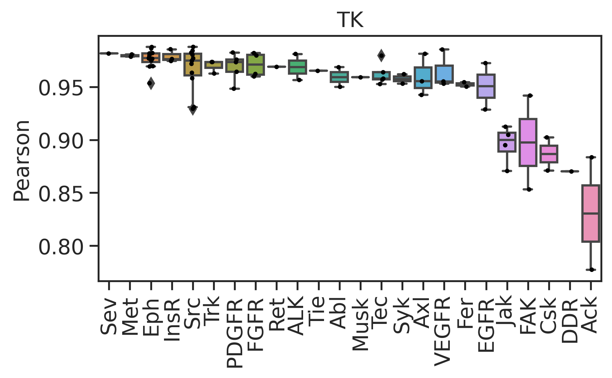

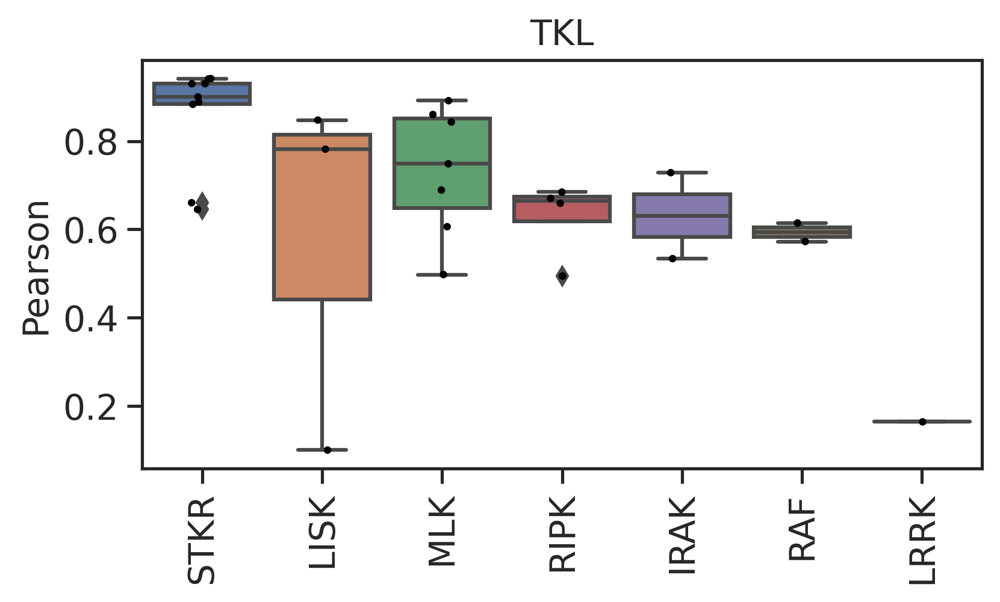

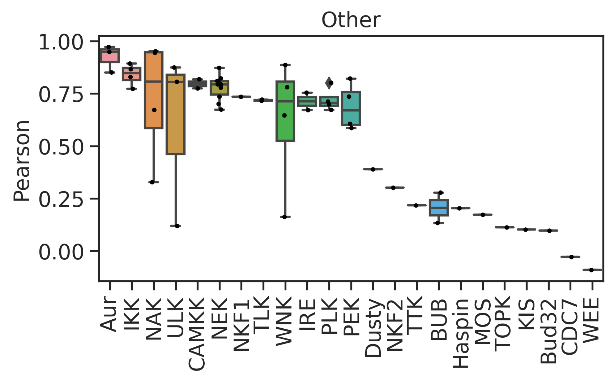

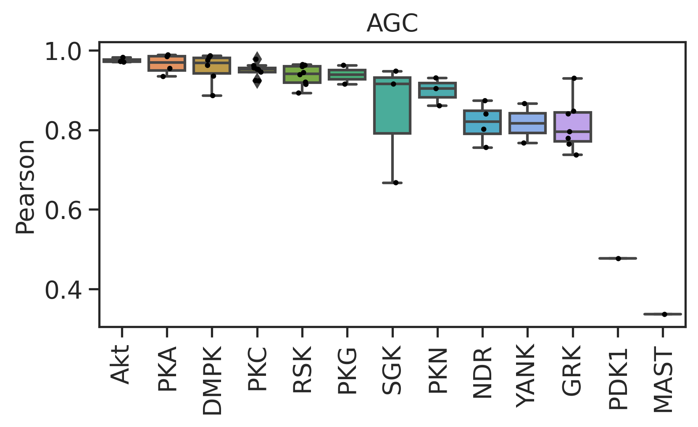

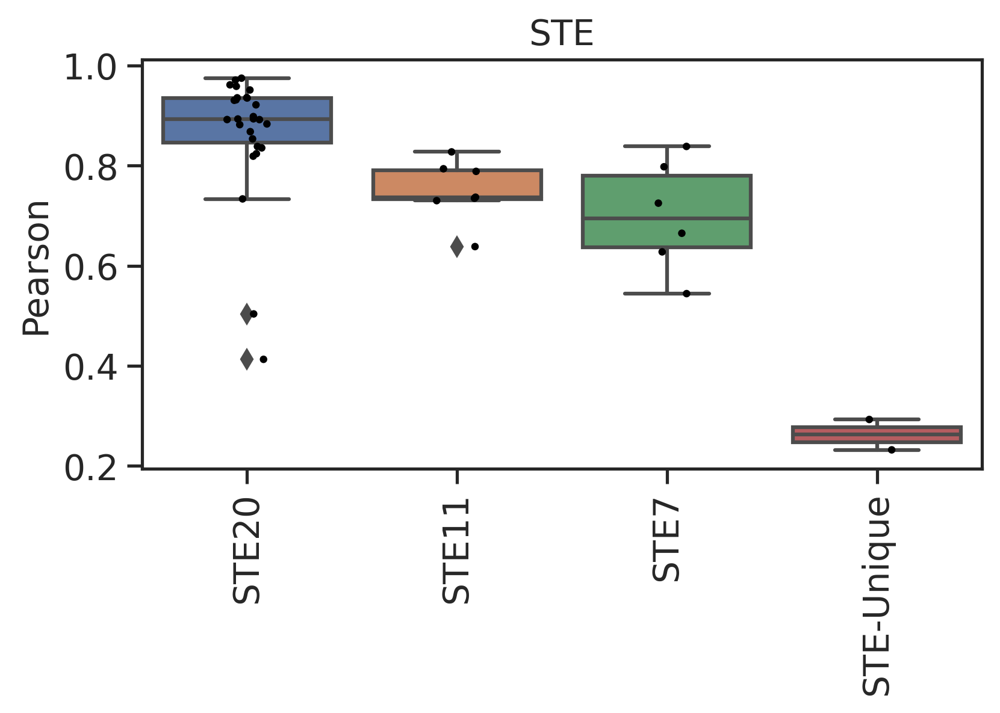

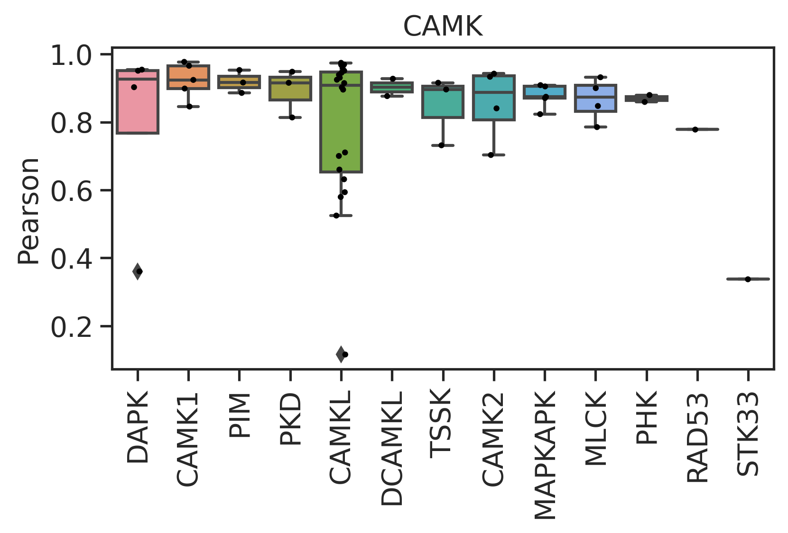

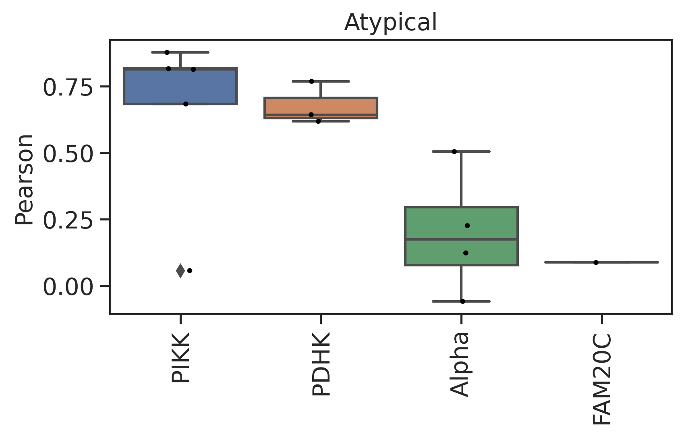

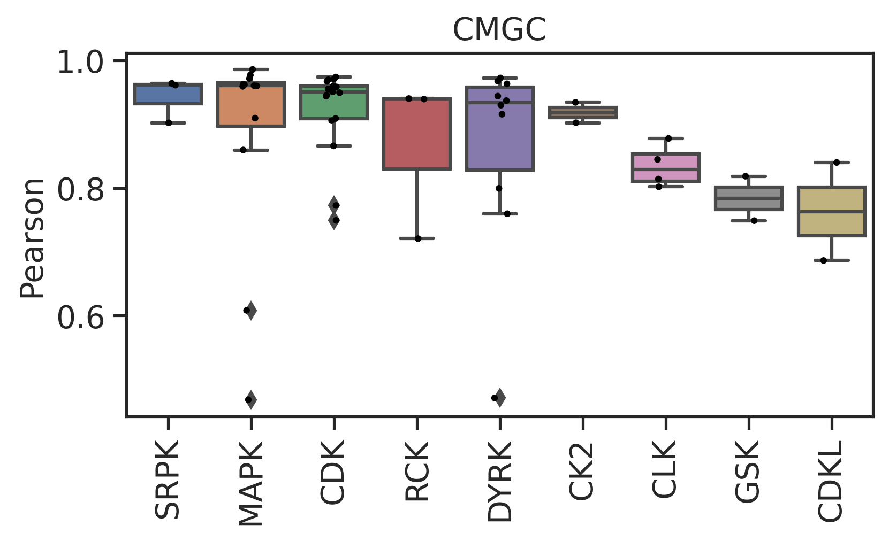

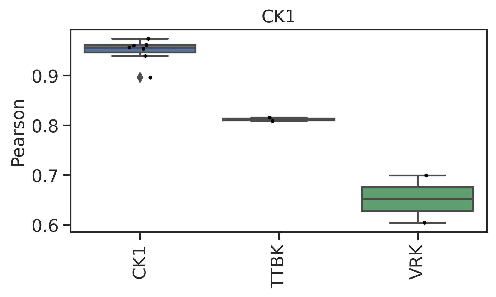

### In general

``` python
group_color = load_pickle("raw/kinase_color.pkl")
```

``` python
plot_bar(corr,'Pearson','group',palette=group_color,fontsize=20)
# plt.title('a')
```

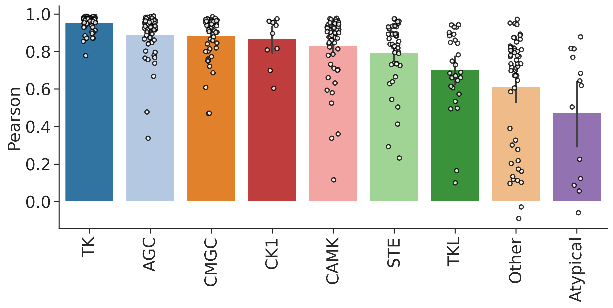

## Families with more counts

``` python
family_score = corr.groupby('family').agg(family_mean=('Pearson','mean'),cnt=('Pearson','size'))
```

``` python
family_score.sort_values('cnt',ascending=False)[:15]
```

<div>
<style scoped>
    .dataframe tbody tr th:only-of-type {
        vertical-align: middle;
    }
&#10;    .dataframe tbody tr th {
        vertical-align: top;
    }
&#10;    .dataframe thead th {
        text-align: right;
    }
</style>

<table class="dataframe" data-quarto-postprocess="true" data-border="1">
<thead>
<tr class="header" style="text-align: right;">
<th data-quarto-table-cell-role="th"></th>
<th data-quarto-table-cell-role="th">family_mean</th>
<th data-quarto-table-cell-role="th">cnt</th>
</tr>
<tr class="odd">
<th data-quarto-table-cell-role="th">family</th>
<th data-quarto-table-cell-role="th"></th>
<th data-quarto-table-cell-role="th"></th>
</tr>
</thead>
<tbody>
<tr class="odd">
<td data-quarto-table-cell-role="th">STE20</td>
<td>0.863932</td>
<td>27</td>
</tr>
<tr class="even">
<td data-quarto-table-cell-role="th">CAMKL</td>
<td>0.789590</td>
<td>20</td>
</tr>
<tr class="odd">
<td data-quarto-table-cell-role="th">CDK</td>
<td>0.923265</td>
<td>17</td>
</tr>
<tr class="even">
<td data-quarto-table-cell-role="th">MAPK</td>
<td>0.881876</td>
<td>12</td>
</tr>
<tr class="odd">
<td data-quarto-table-cell-role="th">Eph</td>
<td>0.976189</td>
<td>12</td>
</tr>
<tr class="even">
<td data-quarto-table-cell-role="th">Src</td>
<td>0.967152</td>
<td>11</td>
</tr>
<tr class="odd">
<td data-quarto-table-cell-role="th">DYRK</td>
<td>0.865820</td>
<td>10</td>
</tr>
<tr class="even">
<td data-quarto-table-cell-role="th">NEK</td>
<td>0.778235</td>
<td>10</td>
</tr>
<tr class="odd">
<td data-quarto-table-cell-role="th">PKC</td>
<td>0.949881</td>
<td>9</td>
</tr>
<tr class="even">
<td data-quarto-table-cell-role="th">STKR</td>
<td>0.857840</td>
<td>9</td>
</tr>
<tr class="odd">
<td data-quarto-table-cell-role="th">RSK</td>
<td>0.937107</td>
<td>8</td>
</tr>
<tr class="even">
<td data-quarto-table-cell-role="th">STE11</td>
<td>0.749903</td>
<td>7</td>
</tr>
<tr class="odd">
<td data-quarto-table-cell-role="th">CK1</td>
<td>0.948548</td>
<td>7</td>
</tr>
<tr class="even">
<td data-quarto-table-cell-role="th">GRK</td>
<td>0.813348</td>
<td>7</td>
</tr>
<tr class="odd">
<td data-quarto-table-cell-role="th">MLK</td>
<td>0.733784</td>
<td>7</td>
</tr>
</tbody>
</table>

</div>
