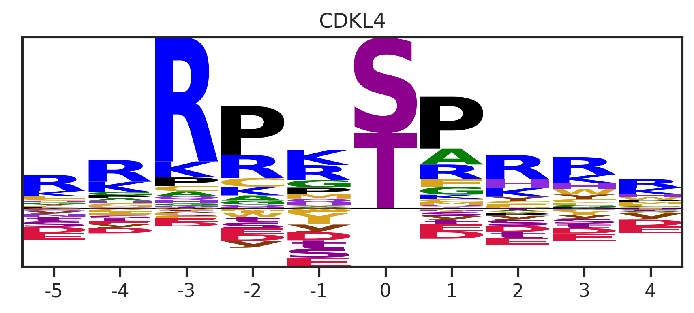

# Predict PSSMs


<!-- WARNING: THIS FILE WAS AUTOGENERATED! DO NOT EDIT! -->

## Setup

``` python
from katlas.imports import *
from fastbook import *
from functools import reduce
import seaborn as sns
from tqdm import tqdm
from sklearn.preprocessing import MinMaxScaler
```

## Load data

``` python
df = Data.get_kinase_info().query('pseudo=="0"') # exclude pseudo kinase
```

``` python
# Remove too long proteins as they can't fit into the model
df = df[df.human_uniprot_sequence.str.len()<7000]
df = df[df.kinasecom_domain.str.len()<7000]
```

### Get protein embeddings

Uncheck below to get protein embeddings for the kinases

``` python
# Remove too long proteins as they can't fit into the model
# valid_uniprot = df[df.human_uniprot_sequence.str.len()<7000]
# valid_kd = df[df.kinasecom_domain.str.len()<7000]
```

``` python
# feat_esm = get_esm(valid_uniprot,'human_uniprot_sequence')
# feat_esm_kd = get_esm(valid_kd,'kinasecom_domain')

# feat_t5 = get_t5(valid_uniprot,'human_uniprot_sequence')
# feat_t5_kd = get_t5(valid_kd,'kinasecom_domain')
```

``` python
# feat_esm.index=valid_uniprot.kinase

# feat_t5.index = valid_uniprot.kinase

# feat_esm_kd.index = valid_kd.kinase
# feat_t5_kd.index= valid_kd.kinase
```

``` python
# feat_esm.astype(float).to_parquet('raw/esm_unknown.parquet')
# feat_esm_kd.astype(float).to_parquet('raw/esm_unknown_kd.parquet')

# feat_t5.astype(float).to_parquet('raw/t5_unknown.parquet')
# feat_t5_kd.astype(float).to_parquet('raw/t5_unknown_kd.parquet')
```

Or directly load

``` python
feat_esm = pd.read_parquet('raw/esm_unknown.parquet')
feat_esm_kd = pd.read_parquet('raw/esm_unknown_kd.parquet')

feat_t5 = pd.read_parquet('raw/t5_unknown.parquet')
feat_t5_kd = pd.read_parquet('raw/t5_unknown_kd.parquet')
```

``` python
feat_esm.shape,feat_esm_kd.shape,feat_t5.shape,feat_t5_kd.shape
```

    ((508, 1280), (503, 1280), (508, 1024), (503, 1024))

``` python
# filter out pseudokinase
feat_esm = feat_esm[feat_esm.index.isin(df.kinase)]
feat_esm_kd = feat_esm_kd[feat_esm_kd.index.isin(df.kinase)]

feat_t5 = feat_t5[feat_t5.index.isin(df.kinase)]
feat_t5_kd = feat_t5_kd[feat_t5_kd.index.isin(df.kinase)]
```

## Prepare models

5 Fold x 3 models = 15 models

``` python
top = ['cnn_esm_kd',
'cnn_t5_kd',
'cnn_t5',
# 'mlp_t5',
      ]
```

``` python
# will not use these data, just to get t5_col and esm_col
t5 = pd.read_parquet('train_data/combine_t5.parquet').reset_index()
esm = pd.read_parquet('train_data/combine_esm.parquet').reset_index()

# feature column
t5_col = t5.columns[t5.columns.str.startswith('T5_')]
esm_col = esm.columns[esm.columns.str.startswith('esm_')]

# target column
target_col = t5.columns[~t5.columns.isin(t5_col)][1:]
```

``` python
num_esm = len(esm_col)
num_t5 = len(t5_col)
num_target = len(target_col)
```

``` python
def cnn_esm():
    return CNN1D_2(num_esm, num_target)

def cnn_t5():
    return CNN1D_2(num_t5, num_target)

def mlp_t5():
    return MLP_1(num_t5, num_target)

def mlp_esm():
    return MLP_1(num_esm, num_target)
```

``` python
models = {
    'cnn_esm_kd':(feat_esm_kd, esm_col, cnn_esm()),
    'cnn_t5_kd': (feat_t5_kd, t5_col, cnn_t5()),
    'cnn_t5':(feat_t5, t5_col, cnn_t5()) 
 }
```

## Predict through top models

``` python
predict_dl?
```

    Signature: predict_dl(df, feat_col, target_col, model, model_pth)
    Docstring: Predict dataframe given a deep learning model
    File:      /usr/local/lib/python3.9/dist-packages/katlas/dl.py
    Type:      function

``` python
N_FOLD=5
```

``` python
pred_list = []
for model_name, (data,feat_col,model) in models.items():
    for i in range(N_FOLD):
        pred = predict_dl(data,feat_col,target_col,model, f'{model_name}_fold{i}')
        pred_list.append(pred)
```

``` python
len(pred_list)
```

    15

## Aggregate results

``` python
# Add up everything
preds = reduce(lambda x, y: x.add(y, fill_value=0), pred_list)
```

``` python
def get_heatmap(df, # Stacked Dataframe with kinase as index, substrates as columns
                kinase, # A specific kinase name in index
                figsize = (7.5,10)
               ):
    
    "Plot PSSM of a single kinase from a df"
    # get a single kinase matrix from the df
    matrix = get_one_kinase(df, kinase,drop_s=False).T
    
    # reorder aa order
    aa_order = [i for i in 'PGACSTVILMFYWHKRQNDEsty']
    matrix = matrix.reindex(index=aa_order)
    
    plot_heatmap(matrix,title=kinase,figsize=figsize)
```

``` python
sns.set(rc={"figure.dpi":300, 'savefig.dpi':300})
sns.set_context('notebook')
sns.set_style("ticks")
```

``` python
get_heatmap(preds.iloc[:,:-3],'CK1A2')
```


## Post-process

``` python
# remove kinase with duplicated name
preds= preds[~preds.index.duplicated()]
```

``` python
preds_minmax = MinMaxScaler().fit_transform(preds.T).T
```

``` python
data = []
for k in preds_minmax.index:
    w = get_one_kinase(preds_minmax,k,drop_s=False).T
    w = w/w.sum()
    w2 = w.unstack().reset_index(name=k)
    w2['substrate'] = w2.position.astype(str)+w2.aa
    w3 = w2.set_index('substrate')[k]
    data.append(w3)
    # break
```

``` python
preds_final = pd.concat(data,axis=1).T

preds_final = preds_final[target_col]
```

``` python
preds_final = preds_final[~preds_final.index.isin(t5.kinase)]
```

``` python
preds_final.index
```

    Index(['ADCK1', 'ADCK2', 'COQ8A', 'COQ8B', 'ADCK5', 'ACVRL1', 'ACVR1C',
           'ALPK3', 'ALPK2', 'ARAF', 'CASK', 'CDK20', 'CDKL2', 'CDKL3', 'CDKL4',
           'STK35', 'PDIK1L', 'DCLK3', 'DDR1', 'CDC42BPG', 'STK17B', 'ERBB2',
           'MAPK6', 'MAPK4', 'STK36', 'TNNI3K', 'AATK', 'LMTK2', 'LMTK3', 'LRRK1',
           'MAP3K13', 'MAP2K6', 'MAP3K4', 'MAST1', 'MAST2', 'MAST3', 'MAST4',
           'AMHR2', 'PKMYT1', 'NEK10', 'NRK', 'PDHK3', 'CDK15', 'PIK3R4', 'CDK11B',
           'PSKH1', 'RIOK1', 'RIOK2', 'RIOK3', 'RNASEL', 'ROR1', 'ROR2', 'SBK2',
           'SBK3', 'ANKK1', 'RSKR', 'SPEG', 'TESK2', 'TIE1', 'KALRN', 'TRIO',
           'TSSK3', 'TSSK4', 'WEE2', 'STK32A'],
          dtype='object')

``` python
# preds_final.to_parquet('raw/predicted.parquet')
```

``` python
# or directly load
preds_final = pd.read_parquet('raw/predicted.parquet')
```

## Select kinase families with high oof Pearson scores

``` python
family_score = pd.read_csv('raw/oof_corr_family.csv').rename(columns={'kinase':'family_count','Pearson':'Pearson_family'})
subfamily_score = pd.read_csv('raw/oof_corr_subfamily.csv').rename(columns={'kinase':'subfamily_count','Pearson':'Pearson_subfamily'})
```

``` python
family_score
```

<div>
<style scoped>
    .dataframe tbody tr th:only-of-type {
        vertical-align: middle;
    }
&#10;    .dataframe tbody tr th {
        vertical-align: top;
    }
&#10;    .dataframe thead th {
        text-align: right;
    }
</style>

<table class="dataframe" data-quarto-postprocess="true" data-border="1">
<thead>
<tr class="header" style="text-align: right;">
<th data-quarto-table-cell-role="th"></th>
<th data-quarto-table-cell-role="th">family</th>
<th data-quarto-table-cell-role="th">Pearson_family</th>
<th data-quarto-table-cell-role="th">family_count</th>
</tr>
</thead>
<tbody>
<tr class="odd">
<td data-quarto-table-cell-role="th">0</td>
<td>ALK</td>
<td>0.968724</td>
<td>2</td>
</tr>
<tr class="even">
<td data-quarto-table-cell-role="th">1</td>
<td>Abl</td>
<td>0.959211</td>
<td>2</td>
</tr>
<tr class="odd">
<td data-quarto-table-cell-role="th">2</td>
<td>Ack</td>
<td>0.830424</td>
<td>2</td>
</tr>
<tr class="even">
<td data-quarto-table-cell-role="th">3</td>
<td>Akt</td>
<td>0.974935</td>
<td>3</td>
</tr>
<tr class="odd">
<td data-quarto-table-cell-role="th">4</td>
<td>Alpha</td>
<td>0.198162</td>
<td>4</td>
</tr>
<tr class="even">
<td data-quarto-table-cell-role="th">...</td>
<td>...</td>
<td>...</td>
<td>...</td>
</tr>
<tr class="odd">
<td data-quarto-table-cell-role="th">95</td>
<td>VEGFR</td>
<td>0.964378</td>
<td>3</td>
</tr>
<tr class="even">
<td data-quarto-table-cell-role="th">96</td>
<td>VRK</td>
<td>0.651387</td>
<td>2</td>
</tr>
<tr class="odd">
<td data-quarto-table-cell-role="th">97</td>
<td>WEE</td>
<td>-0.090115</td>
<td>1</td>
</tr>
<tr class="even">
<td data-quarto-table-cell-role="th">98</td>
<td>WNK</td>
<td>0.618240</td>
<td>4</td>
</tr>
<tr class="odd">
<td data-quarto-table-cell-role="th">99</td>
<td>YANK</td>
<td>0.816684</td>
<td>2</td>
</tr>
</tbody>
</table>

<p>100 rows × 3 columns</p>
</div>

``` python
preds_info = pd.DataFrame(preds_final.index,columns=['kinase']).merge(df,'left')
```

``` python
preds_info = preds_info.merge(family_score,'left')
preds_info = preds_info.merge(subfamily_score,'left')
```

``` python
preds_info = preds_info[['kinase','ID_coral','uniprot','ID_HGNC',
                         'group','family','subfamily',
                         'Pearson_family','family_count',
                         'Pearson_subfamily','subfamily_count'
                        ]]
```

``` python
selected = pd.read_csv('raw/pred_kinase.csv')
```

``` python
selected_df = preds_info[preds_info.kinase.isin(selected.kinase)]
selected_df
```

<div>
<style scoped>
    .dataframe tbody tr th:only-of-type {
        vertical-align: middle;
    }
&#10;    .dataframe tbody tr th {
        vertical-align: top;
    }
&#10;    .dataframe thead th {
        text-align: right;
    }
</style>

<table class="dataframe" data-quarto-postprocess="true" data-border="1">
<thead>
<tr class="header" style="text-align: right;">
<th data-quarto-table-cell-role="th"></th>
<th data-quarto-table-cell-role="th">kinase</th>
<th data-quarto-table-cell-role="th">ID_coral</th>
<th data-quarto-table-cell-role="th">uniprot</th>
<th data-quarto-table-cell-role="th">ID_HGNC</th>
<th data-quarto-table-cell-role="th">group</th>
<th data-quarto-table-cell-role="th">family</th>
<th data-quarto-table-cell-role="th">subfamily</th>
<th data-quarto-table-cell-role="th">Pearson_family</th>
<th data-quarto-table-cell-role="th">family_count</th>
<th data-quarto-table-cell-role="th">Pearson_subfamily</th>
<th data-quarto-table-cell-role="th">subfamily_count</th>
</tr>
</thead>
<tbody>
<tr class="odd">
<td data-quarto-table-cell-role="th">5</td>
<td>ACVRL1</td>
<td>ALK1</td>
<td>P37023</td>
<td>ACVRL1</td>
<td>TKL</td>
<td>STKR</td>
<td>STKR1</td>
<td>0.857840</td>
<td>9.0</td>
<td>0.908758</td>
<td>5.0</td>
</tr>
<tr class="even">
<td data-quarto-table-cell-role="th">6</td>
<td>ACVR1C</td>
<td>ALK7</td>
<td>Q8NER5</td>
<td>ACVR1C</td>
<td>TKL</td>
<td>STKR</td>
<td>STKR1</td>
<td>0.857840</td>
<td>9.0</td>
<td>0.908758</td>
<td>5.0</td>
</tr>
<tr class="odd">
<td data-quarto-table-cell-role="th">11</td>
<td>CDK20</td>
<td>CCRK</td>
<td>Q8IZL9</td>
<td>CDK20</td>
<td>CMGC</td>
<td>CDK</td>
<td>CDK</td>
<td>0.923265</td>
<td>17.0</td>
<td>NaN</td>
<td>NaN</td>
</tr>
<tr class="even">
<td data-quarto-table-cell-role="th">12</td>
<td>CDKL2</td>
<td>CDKL2</td>
<td>Q92772</td>
<td>CDKL2</td>
<td>CMGC</td>
<td>CDKL</td>
<td>CDKL</td>
<td>0.763117</td>
<td>2.0</td>
<td>0.763117</td>
<td>2.0</td>
</tr>
<tr class="odd">
<td data-quarto-table-cell-role="th">13</td>
<td>CDKL3</td>
<td>CDKL3</td>
<td>Q8IVW4</td>
<td>CDKL3</td>
<td>CMGC</td>
<td>CDKL</td>
<td>CDKL</td>
<td>0.763117</td>
<td>2.0</td>
<td>0.763117</td>
<td>2.0</td>
</tr>
<tr class="even">
<td data-quarto-table-cell-role="th">14</td>
<td>CDKL4</td>
<td>CDKL4</td>
<td>Q5MAI5</td>
<td>CDKL4</td>
<td>CMGC</td>
<td>CDKL</td>
<td>CDKL</td>
<td>0.763117</td>
<td>2.0</td>
<td>0.763117</td>
<td>2.0</td>
</tr>
<tr class="odd">
<td data-quarto-table-cell-role="th">17</td>
<td>DCLK3</td>
<td>DCAMKL3</td>
<td>Q9C098</td>
<td>DCLK3</td>
<td>CAMK</td>
<td>DCAMKL</td>
<td>DCAMKL</td>
<td>0.901985</td>
<td>2.0</td>
<td>0.901985</td>
<td>2.0</td>
</tr>
<tr class="even">
<td data-quarto-table-cell-role="th">19</td>
<td>CDC42BPG</td>
<td>DMPK2</td>
<td>Q6DT37</td>
<td>CDC42BPG</td>
<td>AGC</td>
<td>DMPK</td>
<td>GEK</td>
<td>0.954669</td>
<td>6.0</td>
<td>0.961369</td>
<td>3.0</td>
</tr>
<tr class="odd">
<td data-quarto-table-cell-role="th">20</td>
<td>STK17B</td>
<td>DRAK2</td>
<td>O94768</td>
<td>STK17B</td>
<td>CAMK</td>
<td>DAPK</td>
<td>DAPK</td>
<td>0.792083</td>
<td>4.0</td>
<td>0.792083</td>
<td>4.0</td>
</tr>
<tr class="even">
<td data-quarto-table-cell-role="th">22</td>
<td>MAPK6</td>
<td>Erk3</td>
<td>Q16659</td>
<td>MAPK6</td>
<td>CMGC</td>
<td>MAPK</td>
<td>ERK3</td>
<td>0.881876</td>
<td>12.0</td>
<td>NaN</td>
<td>NaN</td>
</tr>
<tr class="odd">
<td data-quarto-table-cell-role="th">23</td>
<td>MAPK4</td>
<td>Erk4</td>
<td>P31152</td>
<td>MAPK4</td>
<td>CMGC</td>
<td>MAPK</td>
<td>ERK3</td>
<td>0.881876</td>
<td>12.0</td>
<td>NaN</td>
<td>NaN</td>
</tr>
<tr class="even">
<td data-quarto-table-cell-role="th">25</td>
<td>TNNI3K</td>
<td>HH498</td>
<td>Q59H18</td>
<td>TNNI3K</td>
<td>TKL</td>
<td>MLK</td>
<td>HH498</td>
<td>0.733784</td>
<td>7.0</td>
<td>NaN</td>
<td>NaN</td>
</tr>
<tr class="odd">
<td data-quarto-table-cell-role="th">30</td>
<td>MAP3K13</td>
<td>LZK</td>
<td>O43283</td>
<td>MAP3K13</td>
<td>TKL</td>
<td>MLK</td>
<td>LZK</td>
<td>0.733784</td>
<td>7.0</td>
<td>0.497632</td>
<td>1.0</td>
</tr>
<tr class="even">
<td data-quarto-table-cell-role="th">32</td>
<td>MAP3K4</td>
<td>MAP3K4</td>
<td>Q9Y6R4</td>
<td>MAP3K4</td>
<td>STE</td>
<td>STE11</td>
<td>STE11</td>
<td>0.749903</td>
<td>7.0</td>
<td>0.749903</td>
<td>7.0</td>
</tr>
<tr class="odd">
<td data-quarto-table-cell-role="th">37</td>
<td>AMHR2</td>
<td>MISR2</td>
<td>Q16671</td>
<td>AMHR2</td>
<td>TKL</td>
<td>STKR</td>
<td>STKR2</td>
<td>0.857840</td>
<td>9.0</td>
<td>0.794193</td>
<td>4.0</td>
</tr>
<tr class="even">
<td data-quarto-table-cell-role="th">39</td>
<td>NEK10</td>
<td>NEK10</td>
<td>Q6ZWH5</td>
<td>NEK10</td>
<td>Other</td>
<td>NEK</td>
<td>NEK</td>
<td>0.778235</td>
<td>10.0</td>
<td>0.778235</td>
<td>10.0</td>
</tr>
<tr class="odd">
<td data-quarto-table-cell-role="th">40</td>
<td>NRK</td>
<td>NRK</td>
<td>Q7Z2Y5</td>
<td>NRK</td>
<td>STE</td>
<td>STE20</td>
<td>MSN</td>
<td>0.863932</td>
<td>27.0</td>
<td>0.945743</td>
<td>3.0</td>
</tr>
<tr class="even">
<td data-quarto-table-cell-role="th">41</td>
<td>PDHK3</td>
<td>PDHK3</td>
<td>Q15120</td>
<td>PDK3</td>
<td>Atypical</td>
<td>PDHK</td>
<td>PDHK</td>
<td>0.676690</td>
<td>3.0</td>
<td>0.676690</td>
<td>3.0</td>
</tr>
<tr class="odd">
<td data-quarto-table-cell-role="th">42</td>
<td>CDK15</td>
<td>PFTAIRE2</td>
<td>Q96Q40</td>
<td>CDK15</td>
<td>CMGC</td>
<td>CDK</td>
<td>PFTAIRE</td>
<td>0.923265</td>
<td>17.0</td>
<td>0.949171</td>
<td>1.0</td>
</tr>
<tr class="even">
<td data-quarto-table-cell-role="th">44</td>
<td>CDK11B</td>
<td>PITSLRE</td>
<td>P21127</td>
<td>CDK11B</td>
<td>CMGC</td>
<td>CDK</td>
<td>CDK11</td>
<td>0.923265</td>
<td>17.0</td>
<td>NaN</td>
<td>NaN</td>
</tr>
<tr class="odd">
<td data-quarto-table-cell-role="th">52</td>
<td>SBK2</td>
<td>SgK069</td>
<td>P0C263</td>
<td>SBK2</td>
<td>Other</td>
<td>NKF1</td>
<td>NKF1</td>
<td>0.734262</td>
<td>1.0</td>
<td>0.734262</td>
<td>1.0</td>
</tr>
<tr class="even">
<td data-quarto-table-cell-role="th">53</td>
<td>SBK3</td>
<td>SgK110</td>
<td>P0C264</td>
<td>SBK3</td>
<td>Other</td>
<td>NKF1</td>
<td>NKF1</td>
<td>0.734262</td>
<td>1.0</td>
<td>0.734262</td>
<td>1.0</td>
</tr>
<tr class="odd">
<td data-quarto-table-cell-role="th">54</td>
<td>ANKK1</td>
<td>SgK288</td>
<td>Q8NFD2</td>
<td>ANKK1</td>
<td>TKL</td>
<td>RIPK</td>
<td>RIPK</td>
<td>0.627125</td>
<td>4.0</td>
<td>0.627125</td>
<td>4.0</td>
</tr>
<tr class="even">
<td data-quarto-table-cell-role="th">57</td>
<td>TESK2</td>
<td>TESK2</td>
<td>Q96S53</td>
<td>TESK2</td>
<td>TKL</td>
<td>LISK</td>
<td>TESK</td>
<td>0.576401</td>
<td>3.0</td>
<td>0.099881</td>
<td>1.0</td>
</tr>
<tr class="odd">
<td data-quarto-table-cell-role="th">61</td>
<td>TSSK3</td>
<td>TSSK3</td>
<td>Q96PN8</td>
<td>TSSK3</td>
<td>CAMK</td>
<td>TSSK</td>
<td>TSSK</td>
<td>0.847705</td>
<td>3.0</td>
<td>0.847705</td>
<td>3.0</td>
</tr>
<tr class="even">
<td data-quarto-table-cell-role="th">62</td>
<td>TSSK4</td>
<td>TSSK4</td>
<td>Q6SA08</td>
<td>TSSK4</td>
<td>CAMK</td>
<td>TSSK</td>
<td>TSSK</td>
<td>0.847705</td>
<td>3.0</td>
<td>0.847705</td>
<td>3.0</td>
</tr>
<tr class="odd">
<td data-quarto-table-cell-role="th">64</td>
<td>STK32A</td>
<td>YANK1</td>
<td>Q8WU08</td>
<td>STK32A</td>
<td>AGC</td>
<td>YANK</td>
<td>YANK</td>
<td>0.816684</td>
<td>2.0</td>
<td>0.816684</td>
<td>2.0</td>
</tr>
</tbody>
</table>

</div>

``` python
# selected = preds_info[preds_info['Pearson_family']>=0.55]\
# .sort_values('Pearson_family',ascending=False)\
# .query('group!="TK"')

# # Remove MAP2K families, as it is potentially contaminated with MAPK families
# selected = selected[~selected.kinase.str.startswith('MAP2')]
```

``` python
len(selected)
```

    29

To save PSSMs:

``` python
preds_final.index
```

    Index(['ADCK1', 'ADCK2', 'COQ8A', 'COQ8B', 'ADCK5', 'ACVRL1', 'ACVR1C',
           'ALPK3', 'ALPK2', 'ARAF', 'CASK', 'CDK20', 'CDKL2', 'CDKL3', 'CDKL4',
           'STK35', 'PDIK1L', 'DCLK3', 'DDR1', 'CDC42BPG', 'STK17B', 'ERBB2',
           'MAPK6', 'MAPK4', 'STK36', 'TNNI3K', 'AATK', 'LMTK2', 'LMTK3', 'LRRK1',
           'MAP3K13', 'MAP2K6', 'MAP3K4', 'MAST1', 'MAST2', 'MAST3', 'MAST4',
           'AMHR2', 'PKMYT1', 'NEK10', 'NRK', 'CDK15', 'PIK3R4', 'CDK11B', 'PSKH1',
           'RIOK1', 'RIOK2', 'RIOK3', 'RNASEL', 'ROR1', 'ROR2', 'SBK2', 'SBK3',
           'ANKK1', 'RSKR', 'SPEG', 'TESK2', 'TIE1', 'KALRN', 'TRIO', 'TSSK3',
           'TSSK4', 'WEE2', 'STK32A'],
          dtype='object')

``` python
selected_PSSM = preds_final.loc[selected.kinase]
```

``` python
# selected_PSSM.to_csv('source/Supplementary_table3_predicted_PSSM.csv')
```

``` python
preds_final
```

<div>
<style scoped>
    .dataframe tbody tr th:only-of-type {
        vertical-align: middle;
    }
&#10;    .dataframe tbody tr th {
        vertical-align: top;
    }
&#10;    .dataframe thead th {
        text-align: right;
    }
</style>

<table class="dataframe" data-quarto-postprocess="true" data-border="1">
<thead>
<tr class="header" style="text-align: right;">
<th data-quarto-table-cell-role="th">substrate</th>
<th data-quarto-table-cell-role="th">-5P</th>
<th data-quarto-table-cell-role="th">-5G</th>
<th data-quarto-table-cell-role="th">-5A</th>
<th data-quarto-table-cell-role="th">-5C</th>
<th data-quarto-table-cell-role="th">-5S</th>
<th data-quarto-table-cell-role="th">-5T</th>
<th data-quarto-table-cell-role="th">-5V</th>
<th data-quarto-table-cell-role="th">-5I</th>
<th data-quarto-table-cell-role="th">-5L</th>
<th data-quarto-table-cell-role="th">-5M</th>
<th data-quarto-table-cell-role="th">-5F</th>
<th data-quarto-table-cell-role="th">-5Y</th>
<th data-quarto-table-cell-role="th">-5W</th>
<th data-quarto-table-cell-role="th">-5H</th>
<th data-quarto-table-cell-role="th">-5K</th>
<th data-quarto-table-cell-role="th">-5R</th>
<th data-quarto-table-cell-role="th">-5Q</th>
<th data-quarto-table-cell-role="th">-5N</th>
<th data-quarto-table-cell-role="th">-5D</th>
<th data-quarto-table-cell-role="th">-5E</th>
<th data-quarto-table-cell-role="th">-5s</th>
<th data-quarto-table-cell-role="th">-5t</th>
<th data-quarto-table-cell-role="th">-5y</th>
<th data-quarto-table-cell-role="th">-4P</th>
<th data-quarto-table-cell-role="th">-4G</th>
<th data-quarto-table-cell-role="th">-4A</th>
<th data-quarto-table-cell-role="th">-4C</th>
<th data-quarto-table-cell-role="th">-4S</th>
<th data-quarto-table-cell-role="th">-4T</th>
<th data-quarto-table-cell-role="th">-4V</th>
<th data-quarto-table-cell-role="th">-4I</th>
<th data-quarto-table-cell-role="th">-4L</th>
<th data-quarto-table-cell-role="th">-4M</th>
<th data-quarto-table-cell-role="th">-4F</th>
<th data-quarto-table-cell-role="th">-4Y</th>
<th data-quarto-table-cell-role="th">-4W</th>
<th data-quarto-table-cell-role="th">-4H</th>
<th data-quarto-table-cell-role="th">-4K</th>
<th data-quarto-table-cell-role="th">-4R</th>
<th data-quarto-table-cell-role="th">-4Q</th>
<th data-quarto-table-cell-role="th">-4N</th>
<th data-quarto-table-cell-role="th">-4D</th>
<th data-quarto-table-cell-role="th">-4E</th>
<th data-quarto-table-cell-role="th">-4s</th>
<th data-quarto-table-cell-role="th">-4t</th>
<th data-quarto-table-cell-role="th">-4y</th>
<th data-quarto-table-cell-role="th">-3P</th>
<th data-quarto-table-cell-role="th">-3G</th>
<th data-quarto-table-cell-role="th">-3A</th>
<th data-quarto-table-cell-role="th">-3C</th>
<th data-quarto-table-cell-role="th">-3S</th>
<th data-quarto-table-cell-role="th">-3T</th>
<th data-quarto-table-cell-role="th">-3V</th>
<th data-quarto-table-cell-role="th">-3I</th>
<th data-quarto-table-cell-role="th">-3L</th>
<th data-quarto-table-cell-role="th">-3M</th>
<th data-quarto-table-cell-role="th">-3F</th>
<th data-quarto-table-cell-role="th">-3Y</th>
<th data-quarto-table-cell-role="th">-3W</th>
<th data-quarto-table-cell-role="th">-3H</th>
<th data-quarto-table-cell-role="th">-3K</th>
<th data-quarto-table-cell-role="th">-3R</th>
<th data-quarto-table-cell-role="th">-3Q</th>
<th data-quarto-table-cell-role="th">-3N</th>
<th data-quarto-table-cell-role="th">-3D</th>
<th data-quarto-table-cell-role="th">-3E</th>
<th data-quarto-table-cell-role="th">-3s</th>
<th data-quarto-table-cell-role="th">-3t</th>
<th data-quarto-table-cell-role="th">-3y</th>
<th data-quarto-table-cell-role="th">-2P</th>
<th data-quarto-table-cell-role="th">-2G</th>
<th data-quarto-table-cell-role="th">-2A</th>
<th data-quarto-table-cell-role="th">-2C</th>
<th data-quarto-table-cell-role="th">-2S</th>
<th data-quarto-table-cell-role="th">-2T</th>
<th data-quarto-table-cell-role="th">-2V</th>
<th data-quarto-table-cell-role="th">-2I</th>
<th data-quarto-table-cell-role="th">-2L</th>
<th data-quarto-table-cell-role="th">-2M</th>
<th data-quarto-table-cell-role="th">-2F</th>
<th data-quarto-table-cell-role="th">-2Y</th>
<th data-quarto-table-cell-role="th">-2W</th>
<th data-quarto-table-cell-role="th">-2H</th>
<th data-quarto-table-cell-role="th">-2K</th>
<th data-quarto-table-cell-role="th">-2R</th>
<th data-quarto-table-cell-role="th">-2Q</th>
<th data-quarto-table-cell-role="th">-2N</th>
<th data-quarto-table-cell-role="th">-2D</th>
<th data-quarto-table-cell-role="th">-2E</th>
<th data-quarto-table-cell-role="th">-2s</th>
<th data-quarto-table-cell-role="th">-2t</th>
<th data-quarto-table-cell-role="th">-2y</th>
<th data-quarto-table-cell-role="th">-1P</th>
<th data-quarto-table-cell-role="th">-1G</th>
<th data-quarto-table-cell-role="th">-1A</th>
<th data-quarto-table-cell-role="th">-1C</th>
<th data-quarto-table-cell-role="th">-1S</th>
<th data-quarto-table-cell-role="th">-1T</th>
<th data-quarto-table-cell-role="th">-1V</th>
<th data-quarto-table-cell-role="th">-1I</th>
<th data-quarto-table-cell-role="th">-1L</th>
<th data-quarto-table-cell-role="th">-1M</th>
<th data-quarto-table-cell-role="th">-1F</th>
<th data-quarto-table-cell-role="th">-1Y</th>
<th data-quarto-table-cell-role="th">-1W</th>
<th data-quarto-table-cell-role="th">-1H</th>
<th data-quarto-table-cell-role="th">-1K</th>
<th data-quarto-table-cell-role="th">-1R</th>
<th data-quarto-table-cell-role="th">-1Q</th>
<th data-quarto-table-cell-role="th">-1N</th>
<th data-quarto-table-cell-role="th">-1D</th>
<th data-quarto-table-cell-role="th">-1E</th>
<th data-quarto-table-cell-role="th">-1s</th>
<th data-quarto-table-cell-role="th">-1t</th>
<th data-quarto-table-cell-role="th">-1y</th>
<th data-quarto-table-cell-role="th">1P</th>
<th data-quarto-table-cell-role="th">1G</th>
<th data-quarto-table-cell-role="th">1A</th>
<th data-quarto-table-cell-role="th">1C</th>
<th data-quarto-table-cell-role="th">1S</th>
<th data-quarto-table-cell-role="th">1T</th>
<th data-quarto-table-cell-role="th">1V</th>
<th data-quarto-table-cell-role="th">1I</th>
<th data-quarto-table-cell-role="th">1L</th>
<th data-quarto-table-cell-role="th">1M</th>
<th data-quarto-table-cell-role="th">1F</th>
<th data-quarto-table-cell-role="th">1Y</th>
<th data-quarto-table-cell-role="th">1W</th>
<th data-quarto-table-cell-role="th">1H</th>
<th data-quarto-table-cell-role="th">1K</th>
<th data-quarto-table-cell-role="th">1R</th>
<th data-quarto-table-cell-role="th">1Q</th>
<th data-quarto-table-cell-role="th">1N</th>
<th data-quarto-table-cell-role="th">1D</th>
<th data-quarto-table-cell-role="th">1E</th>
<th data-quarto-table-cell-role="th">1s</th>
<th data-quarto-table-cell-role="th">1t</th>
<th data-quarto-table-cell-role="th">1y</th>
<th data-quarto-table-cell-role="th">2P</th>
<th data-quarto-table-cell-role="th">2G</th>
<th data-quarto-table-cell-role="th">2A</th>
<th data-quarto-table-cell-role="th">2C</th>
<th data-quarto-table-cell-role="th">2S</th>
<th data-quarto-table-cell-role="th">2T</th>
<th data-quarto-table-cell-role="th">2V</th>
<th data-quarto-table-cell-role="th">2I</th>
<th data-quarto-table-cell-role="th">2L</th>
<th data-quarto-table-cell-role="th">2M</th>
<th data-quarto-table-cell-role="th">2F</th>
<th data-quarto-table-cell-role="th">2Y</th>
<th data-quarto-table-cell-role="th">2W</th>
<th data-quarto-table-cell-role="th">2H</th>
<th data-quarto-table-cell-role="th">2K</th>
<th data-quarto-table-cell-role="th">2R</th>
<th data-quarto-table-cell-role="th">2Q</th>
<th data-quarto-table-cell-role="th">2N</th>
<th data-quarto-table-cell-role="th">2D</th>
<th data-quarto-table-cell-role="th">2E</th>
<th data-quarto-table-cell-role="th">2s</th>
<th data-quarto-table-cell-role="th">2t</th>
<th data-quarto-table-cell-role="th">2y</th>
<th data-quarto-table-cell-role="th">3P</th>
<th data-quarto-table-cell-role="th">3G</th>
<th data-quarto-table-cell-role="th">3A</th>
<th data-quarto-table-cell-role="th">3C</th>
<th data-quarto-table-cell-role="th">3S</th>
<th data-quarto-table-cell-role="th">3T</th>
<th data-quarto-table-cell-role="th">3V</th>
<th data-quarto-table-cell-role="th">3I</th>
<th data-quarto-table-cell-role="th">3L</th>
<th data-quarto-table-cell-role="th">3M</th>
<th data-quarto-table-cell-role="th">3F</th>
<th data-quarto-table-cell-role="th">3Y</th>
<th data-quarto-table-cell-role="th">3W</th>
<th data-quarto-table-cell-role="th">3H</th>
<th data-quarto-table-cell-role="th">3K</th>
<th data-quarto-table-cell-role="th">3R</th>
<th data-quarto-table-cell-role="th">3Q</th>
<th data-quarto-table-cell-role="th">3N</th>
<th data-quarto-table-cell-role="th">3D</th>
<th data-quarto-table-cell-role="th">3E</th>
<th data-quarto-table-cell-role="th">3s</th>
<th data-quarto-table-cell-role="th">3t</th>
<th data-quarto-table-cell-role="th">3y</th>
<th data-quarto-table-cell-role="th">4P</th>
<th data-quarto-table-cell-role="th">4G</th>
<th data-quarto-table-cell-role="th">4A</th>
<th data-quarto-table-cell-role="th">4C</th>
<th data-quarto-table-cell-role="th">4S</th>
<th data-quarto-table-cell-role="th">4T</th>
<th data-quarto-table-cell-role="th">4V</th>
<th data-quarto-table-cell-role="th">4I</th>
<th data-quarto-table-cell-role="th">4L</th>
<th data-quarto-table-cell-role="th">4M</th>
<th data-quarto-table-cell-role="th">4F</th>
<th data-quarto-table-cell-role="th">4Y</th>
<th data-quarto-table-cell-role="th">4W</th>
<th data-quarto-table-cell-role="th">4H</th>
<th data-quarto-table-cell-role="th">4K</th>
<th data-quarto-table-cell-role="th">4R</th>
<th data-quarto-table-cell-role="th">4Q</th>
<th data-quarto-table-cell-role="th">4N</th>
<th data-quarto-table-cell-role="th">4D</th>
<th data-quarto-table-cell-role="th">4E</th>
<th data-quarto-table-cell-role="th">4s</th>
<th data-quarto-table-cell-role="th">4t</th>
<th data-quarto-table-cell-role="th">4y</th>
<th data-quarto-table-cell-role="th">0s</th>
<th data-quarto-table-cell-role="th">0t</th>
<th data-quarto-table-cell-role="th">0y</th>
</tr>
</thead>
<tbody>
<tr class="odd">
<td data-quarto-table-cell-role="th">ADCK1</td>
<td>0.048353</td>
<td>0.044662</td>
<td>0.049684</td>
<td>0.047756</td>
<td>0.039644</td>
<td>0.038732</td>
<td>0.041271</td>
<td>0.037347</td>
<td>0.041508</td>
<td>0.038331</td>
<td>0.053608</td>
<td>0.049934</td>
<td>0.062422</td>
<td>0.053521</td>
<td>0.049245</td>
<td>0.060374</td>
<td>0.029276</td>
<td>0.031936</td>
<td>0.034305</td>
<td>0.029565</td>
<td>0.038343</td>
<td>0.035231</td>
<td>0.044951</td>
<td>0.044934</td>
<td>0.055889</td>
<td>0.053259</td>
<td>0.051039</td>
<td>0.040561</td>
<td>0.039071</td>
<td>0.029120</td>
<td>0.026485</td>
<td>0.032313</td>
<td>0.043253</td>
<td>0.043563</td>
<td>0.045449</td>
<td>0.055382</td>
<td>0.051374</td>
<td>0.051370</td>
<td>0.058486</td>
<td>0.042473</td>
<td>0.033350</td>
<td>0.037059</td>
<td>0.042023</td>
<td>0.037581</td>
<td>0.039726</td>
<td>0.046240</td>
<td>0.045317</td>
<td>0.043955</td>
<td>0.041623</td>
<td>0.038439</td>
<td>0.031459</td>
<td>0.036182</td>
<td>0.017883</td>
<td>0.025107</td>
<td>0.028089</td>
<td>0.039873</td>
<td>0.038124</td>
<td>0.047898</td>
<td>0.048998</td>
<td>0.048629</td>
<td>0.060935</td>
<td>0.169430</td>
<td>0.039727</td>
<td>0.039115</td>
<td>0.027784</td>
<td>0.027859</td>
<td>0.026473</td>
<td>0.025607</td>
<td>0.051496</td>
<td>0.052765</td>
<td>0.066532</td>
<td>0.069552</td>
<td>0.057155</td>
<td>0.035952</td>
<td>0.036574</td>
<td>0.029716</td>
<td>0.024590</td>
<td>0.024692</td>
<td>0.044897</td>
<td>0.037173</td>
<td>0.038102</td>
<td>0.036595</td>
<td>0.045834</td>
<td>0.042720</td>
<td>0.070292</td>
<td>0.053697</td>
<td>0.044977</td>
<td>0.034447</td>
<td>0.035987</td>
<td>0.033721</td>
<td>0.033731</td>
<td>0.050301</td>
<td>0.050042</td>
<td>0.068772</td>
<td>0.047273</td>
<td>0.037983</td>
<td>0.037060</td>
<td>0.039980</td>
<td>0.016494</td>
<td>0.016991</td>
<td>0.048666</td>
<td>0.050307</td>
<td>0.035136</td>
<td>0.047393</td>
<td>0.021929</td>
<td>0.049534</td>
<td>0.049586</td>
<td>0.067902</td>
<td>0.043523</td>
<td>0.063060</td>
<td>0.035749</td>
<td>0.029079</td>
<td>0.014841</td>
<td>0.017725</td>
<td>0.110975</td>
<td>0.037987</td>
<td>0.036425</td>
<td>0.031539</td>
<td>0.035683</td>
<td>0.029945</td>
<td>0.028544</td>
<td>0.049934</td>
<td>0.052586</td>
<td>0.064842</td>
<td>0.065427</td>
<td>0.068493</td>
<td>0.070078</td>
<td>0.055551</td>
<td>0.037420</td>
<td>0.034944</td>
<td>0.041709</td>
<td>0.127522</td>
<td>0.034614</td>
<td>0.011865</td>
<td>0.012881</td>
<td>0.019960</td>
<td>0.019043</td>
<td>0.033009</td>
<td>0.038021</td>
<td>0.037081</td>
<td>0.045470</td>
<td>0.044291</td>
<td>0.037363</td>
<td>0.037934</td>
<td>0.032741</td>
<td>0.023745</td>
<td>0.026896</td>
<td>0.036136</td>
<td>0.043042</td>
<td>0.064908</td>
<td>0.042939</td>
<td>0.073471</td>
<td>0.058376</td>
<td>0.082958</td>
<td>0.044870</td>
<td>0.047893</td>
<td>0.049456</td>
<td>0.037746</td>
<td>0.036087</td>
<td>0.036824</td>
<td>0.021754</td>
<td>0.048246</td>
<td>0.052635</td>
<td>0.044155</td>
<td>0.047448</td>
<td>0.037878</td>
<td>0.042588</td>
<td>0.030934</td>
<td>0.027071</td>
<td>0.034234</td>
<td>0.036288</td>
<td>0.040991</td>
<td>0.053992</td>
<td>0.051278</td>
<td>0.051650</td>
<td>0.056384</td>
<td>0.083639</td>
<td>0.037271</td>
<td>0.044311</td>
<td>0.040318</td>
<td>0.036551</td>
<td>0.032791</td>
<td>0.030228</td>
<td>0.039123</td>
<td>0.044532</td>
<td>0.046071</td>
<td>0.034738</td>
<td>0.039499</td>
<td>0.041556</td>
<td>0.039789</td>
<td>0.026431</td>
<td>0.034100</td>
<td>0.032969</td>
<td>0.039661</td>
<td>0.043047</td>
<td>0.048863</td>
<td>0.067794</td>
<td>0.052228</td>
<td>0.059207</td>
<td>0.054760</td>
<td>0.044493</td>
<td>0.039064</td>
<td>0.038197</td>
<td>0.039430</td>
<td>0.044199</td>
<td>0.045629</td>
<td>0.043743</td>
<td>0.592792</td>
<td>0.407208</td>
<td>0.000000</td>
</tr>
<tr class="even">
<td data-quarto-table-cell-role="th">ADCK2</td>
<td>0.045721</td>
<td>0.039397</td>
<td>0.046075</td>
<td>0.048963</td>
<td>0.039347</td>
<td>0.039411</td>
<td>0.037317</td>
<td>0.039063</td>
<td>0.038259</td>
<td>0.038223</td>
<td>0.050568</td>
<td>0.046183</td>
<td>0.060257</td>
<td>0.053303</td>
<td>0.053477</td>
<td>0.059690</td>
<td>0.032951</td>
<td>0.037253</td>
<td>0.037623</td>
<td>0.035300</td>
<td>0.040233</td>
<td>0.038882</td>
<td>0.042505</td>
<td>0.038253</td>
<td>0.046895</td>
<td>0.046298</td>
<td>0.050421</td>
<td>0.040807</td>
<td>0.040307</td>
<td>0.026036</td>
<td>0.026761</td>
<td>0.031410</td>
<td>0.040487</td>
<td>0.041790</td>
<td>0.049121</td>
<td>0.067160</td>
<td>0.053791</td>
<td>0.054370</td>
<td>0.057504</td>
<td>0.040842</td>
<td>0.038828</td>
<td>0.038541</td>
<td>0.046431</td>
<td>0.037180</td>
<td>0.038448</td>
<td>0.048320</td>
<td>0.029899</td>
<td>0.032401</td>
<td>0.036139</td>
<td>0.042894</td>
<td>0.034648</td>
<td>0.035971</td>
<td>0.016074</td>
<td>0.024989</td>
<td>0.037466</td>
<td>0.050001</td>
<td>0.041506</td>
<td>0.051284</td>
<td>0.054756</td>
<td>0.047511</td>
<td>0.055568</td>
<td>0.170383</td>
<td>0.034518</td>
<td>0.033387</td>
<td>0.029179</td>
<td>0.024037</td>
<td>0.028684</td>
<td>0.028524</td>
<td>0.060181</td>
<td>0.037890</td>
<td>0.045830</td>
<td>0.057961</td>
<td>0.060794</td>
<td>0.037078</td>
<td>0.037156</td>
<td>0.029906</td>
<td>0.035417</td>
<td>0.040394</td>
<td>0.069018</td>
<td>0.050424</td>
<td>0.050308</td>
<td>0.056359</td>
<td>0.049178</td>
<td>0.036979</td>
<td>0.050035</td>
<td>0.047813</td>
<td>0.034787</td>
<td>0.024446</td>
<td>0.031328</td>
<td>0.033462</td>
<td>0.036423</td>
<td>0.047013</td>
<td>0.044032</td>
<td>0.054508</td>
<td>0.044736</td>
<td>0.038589</td>
<td>0.038306</td>
<td>0.039960</td>
<td>0.019210</td>
<td>0.015471</td>
<td>0.043412</td>
<td>0.050007</td>
<td>0.032492</td>
<td>0.046547</td>
<td>0.028663</td>
<td>0.048846</td>
<td>0.062203</td>
<td>0.079447</td>
<td>0.049108</td>
<td>0.061290</td>
<td>0.034761</td>
<td>0.033345</td>
<td>0.013798</td>
<td>0.020700</td>
<td>0.100570</td>
<td>0.072016</td>
<td>0.052588</td>
<td>0.035022</td>
<td>0.042979</td>
<td>0.032550</td>
<td>0.032083</td>
<td>0.033524</td>
<td>0.041327</td>
<td>0.041449</td>
<td>0.056695</td>
<td>0.059243</td>
<td>0.057737</td>
<td>0.045298</td>
<td>0.040674</td>
<td>0.053588</td>
<td>0.058783</td>
<td>0.066609</td>
<td>0.050871</td>
<td>0.016541</td>
<td>0.022681</td>
<td>0.025931</td>
<td>0.025844</td>
<td>0.035966</td>
<td>0.043190</td>
<td>0.031350</td>
<td>0.040698</td>
<td>0.040927</td>
<td>0.039169</td>
<td>0.039970</td>
<td>0.029137</td>
<td>0.024877</td>
<td>0.024263</td>
<td>0.038165</td>
<td>0.042098</td>
<td>0.061697</td>
<td>0.048007</td>
<td>0.071997</td>
<td>0.060763</td>
<td>0.092504</td>
<td>0.040901</td>
<td>0.046491</td>
<td>0.033582</td>
<td>0.031696</td>
<td>0.036643</td>
<td>0.036539</td>
<td>0.045335</td>
<td>0.044955</td>
<td>0.046267</td>
<td>0.038843</td>
<td>0.048163</td>
<td>0.041402</td>
<td>0.042168</td>
<td>0.028033</td>
<td>0.027368</td>
<td>0.029552</td>
<td>0.039374</td>
<td>0.043419</td>
<td>0.057464</td>
<td>0.053689</td>
<td>0.051217</td>
<td>0.066311</td>
<td>0.101883</td>
<td>0.038626</td>
<td>0.047659</td>
<td>0.030986</td>
<td>0.022662</td>
<td>0.028900</td>
<td>0.029022</td>
<td>0.042037</td>
<td>0.049299</td>
<td>0.041710</td>
<td>0.031999</td>
<td>0.042755</td>
<td>0.043463</td>
<td>0.042232</td>
<td>0.027886</td>
<td>0.036487</td>
<td>0.037486</td>
<td>0.038706</td>
<td>0.039611</td>
<td>0.049975</td>
<td>0.063763</td>
<td>0.052915</td>
<td>0.062923</td>
<td>0.064993</td>
<td>0.048762</td>
<td>0.040808</td>
<td>0.032854</td>
<td>0.029899</td>
<td>0.040699</td>
<td>0.041583</td>
<td>0.039191</td>
<td>0.550779</td>
<td>0.449222</td>
<td>0.000000</td>
</tr>
<tr class="odd">
<td data-quarto-table-cell-role="th">COQ8A</td>
<td>0.047078</td>
<td>0.049584</td>
<td>0.046538</td>
<td>0.046978</td>
<td>0.038505</td>
<td>0.039265</td>
<td>0.038297</td>
<td>0.027514</td>
<td>0.025965</td>
<td>0.034214</td>
<td>0.046496</td>
<td>0.053125</td>
<td>0.061218</td>
<td>0.063530</td>
<td>0.050068</td>
<td>0.057296</td>
<td>0.030144</td>
<td>0.036608</td>
<td>0.041208</td>
<td>0.034382</td>
<td>0.040725</td>
<td>0.038488</td>
<td>0.052773</td>
<td>0.051598</td>
<td>0.054722</td>
<td>0.051946</td>
<td>0.053349</td>
<td>0.041256</td>
<td>0.040011</td>
<td>0.028248</td>
<td>0.022370</td>
<td>0.025431</td>
<td>0.038975</td>
<td>0.042358</td>
<td>0.047993</td>
<td>0.058613</td>
<td>0.053117</td>
<td>0.044062</td>
<td>0.050123</td>
<td>0.041462</td>
<td>0.035505</td>
<td>0.039927</td>
<td>0.042196</td>
<td>0.040626</td>
<td>0.042263</td>
<td>0.053851</td>
<td>0.047354</td>
<td>0.044989</td>
<td>0.042722</td>
<td>0.043670</td>
<td>0.036494</td>
<td>0.039349</td>
<td>0.019971</td>
<td>0.025216</td>
<td>0.025044</td>
<td>0.042077</td>
<td>0.042146</td>
<td>0.052869</td>
<td>0.057933</td>
<td>0.045585</td>
<td>0.046349</td>
<td>0.114434</td>
<td>0.041640</td>
<td>0.040620</td>
<td>0.037419</td>
<td>0.036016</td>
<td>0.028373</td>
<td>0.029125</td>
<td>0.060607</td>
<td>0.053200</td>
<td>0.076206</td>
<td>0.065363</td>
<td>0.053134</td>
<td>0.034243</td>
<td>0.035309</td>
<td>0.027042</td>
<td>0.027100</td>
<td>0.026685</td>
<td>0.040070</td>
<td>0.041957</td>
<td>0.044627</td>
<td>0.037925</td>
<td>0.047342</td>
<td>0.033303</td>
<td>0.061909</td>
<td>0.042819</td>
<td>0.042647</td>
<td>0.039713</td>
<td>0.036886</td>
<td>0.035117</td>
<td>0.037581</td>
<td>0.059822</td>
<td>0.046798</td>
<td>0.075342</td>
<td>0.045890</td>
<td>0.037855</td>
<td>0.035734</td>
<td>0.039024</td>
<td>0.015485</td>
<td>0.014795</td>
<td>0.051195</td>
<td>0.048579</td>
<td>0.034145</td>
<td>0.045877</td>
<td>0.022837</td>
<td>0.045838</td>
<td>0.046570</td>
<td>0.062046</td>
<td>0.037391</td>
<td>0.058346</td>
<td>0.035356</td>
<td>0.024353</td>
<td>0.018455</td>
<td>0.018843</td>
<td>0.139246</td>
<td>0.046620</td>
<td>0.029290</td>
<td>0.026538</td>
<td>0.029174</td>
<td>0.029126</td>
<td>0.030876</td>
<td>0.048084</td>
<td>0.055013</td>
<td>0.066582</td>
<td>0.067302</td>
<td>0.064741</td>
<td>0.074518</td>
<td>0.062068</td>
<td>0.035251</td>
<td>0.038081</td>
<td>0.038229</td>
<td>0.112505</td>
<td>0.026391</td>
<td>0.011765</td>
<td>0.018384</td>
<td>0.024527</td>
<td>0.025697</td>
<td>0.039235</td>
<td>0.034462</td>
<td>0.038124</td>
<td>0.039552</td>
<td>0.039801</td>
<td>0.034877</td>
<td>0.035696</td>
<td>0.030061</td>
<td>0.021655</td>
<td>0.026670</td>
<td>0.038152</td>
<td>0.040993</td>
<td>0.065945</td>
<td>0.040576</td>
<td>0.082912</td>
<td>0.063481</td>
<td>0.080361</td>
<td>0.041272</td>
<td>0.043819</td>
<td>0.047356</td>
<td>0.041445</td>
<td>0.042968</td>
<td>0.042554</td>
<td>0.027267</td>
<td>0.047743</td>
<td>0.054207</td>
<td>0.042449</td>
<td>0.043962</td>
<td>0.038254</td>
<td>0.039598</td>
<td>0.027100</td>
<td>0.024370</td>
<td>0.032305</td>
<td>0.036350</td>
<td>0.039941</td>
<td>0.054749</td>
<td>0.049598</td>
<td>0.049072</td>
<td>0.061979</td>
<td>0.091424</td>
<td>0.034625</td>
<td>0.039491</td>
<td>0.038573</td>
<td>0.036898</td>
<td>0.037693</td>
<td>0.037084</td>
<td>0.042537</td>
<td>0.040794</td>
<td>0.048981</td>
<td>0.034644</td>
<td>0.042590</td>
<td>0.041290</td>
<td>0.038335</td>
<td>0.021906</td>
<td>0.022611</td>
<td>0.024033</td>
<td>0.032745</td>
<td>0.038359</td>
<td>0.051069</td>
<td>0.071394</td>
<td>0.053739</td>
<td>0.060517</td>
<td>0.056973</td>
<td>0.045843</td>
<td>0.038744</td>
<td>0.041111</td>
<td>0.042403</td>
<td>0.050887</td>
<td>0.051535</td>
<td>0.049496</td>
<td>0.531098</td>
<td>0.468902</td>
<td>0.000000</td>
</tr>
<tr class="even">
<td data-quarto-table-cell-role="th">COQ8B</td>
<td>0.046490</td>
<td>0.047984</td>
<td>0.047754</td>
<td>0.047483</td>
<td>0.039761</td>
<td>0.038309</td>
<td>0.038994</td>
<td>0.028313</td>
<td>0.026969</td>
<td>0.035838</td>
<td>0.042184</td>
<td>0.050925</td>
<td>0.056083</td>
<td>0.059763</td>
<td>0.058692</td>
<td>0.067034</td>
<td>0.035713</td>
<td>0.038473</td>
<td>0.037042</td>
<td>0.033089</td>
<td>0.039843</td>
<td>0.037535</td>
<td>0.045730</td>
<td>0.051322</td>
<td>0.054295</td>
<td>0.053244</td>
<td>0.051641</td>
<td>0.041342</td>
<td>0.041967</td>
<td>0.029125</td>
<td>0.021728</td>
<td>0.025911</td>
<td>0.040115</td>
<td>0.038629</td>
<td>0.046331</td>
<td>0.054629</td>
<td>0.053792</td>
<td>0.050985</td>
<td>0.055641</td>
<td>0.042761</td>
<td>0.040816</td>
<td>0.036494</td>
<td>0.041124</td>
<td>0.036740</td>
<td>0.040735</td>
<td>0.050634</td>
<td>0.049042</td>
<td>0.048814</td>
<td>0.042762</td>
<td>0.043352</td>
<td>0.036251</td>
<td>0.038490</td>
<td>0.021945</td>
<td>0.025510</td>
<td>0.028467</td>
<td>0.042587</td>
<td>0.040218</td>
<td>0.053032</td>
<td>0.054805</td>
<td>0.047075</td>
<td>0.046827</td>
<td>0.114656</td>
<td>0.045907</td>
<td>0.040083</td>
<td>0.032092</td>
<td>0.036369</td>
<td>0.024304</td>
<td>0.026974</td>
<td>0.060437</td>
<td>0.060197</td>
<td>0.071454</td>
<td>0.059700</td>
<td>0.054718</td>
<td>0.034807</td>
<td>0.035518</td>
<td>0.032697</td>
<td>0.033934</td>
<td>0.035685</td>
<td>0.047181</td>
<td>0.039248</td>
<td>0.044588</td>
<td>0.038767</td>
<td>0.050232</td>
<td>0.038700</td>
<td>0.068320</td>
<td>0.041183</td>
<td>0.041750</td>
<td>0.023728</td>
<td>0.025068</td>
<td>0.031471</td>
<td>0.034198</td>
<td>0.056857</td>
<td>0.051250</td>
<td>0.067170</td>
<td>0.048648</td>
<td>0.041807</td>
<td>0.037135</td>
<td>0.038623</td>
<td>0.021044</td>
<td>0.016097</td>
<td>0.047293</td>
<td>0.047487</td>
<td>0.034862</td>
<td>0.050749</td>
<td>0.028458</td>
<td>0.049276</td>
<td>0.042625</td>
<td>0.061439</td>
<td>0.040653</td>
<td>0.058289</td>
<td>0.032244</td>
<td>0.027185</td>
<td>0.016145</td>
<td>0.017861</td>
<td>0.123662</td>
<td>0.046231</td>
<td>0.054320</td>
<td>0.043225</td>
<td>0.038327</td>
<td>0.030678</td>
<td>0.031225</td>
<td>0.046657</td>
<td>0.043060</td>
<td>0.056026</td>
<td>0.058741</td>
<td>0.052604</td>
<td>0.066302</td>
<td>0.053787</td>
<td>0.042357</td>
<td>0.047298</td>
<td>0.056374</td>
<td>0.094522</td>
<td>0.036503</td>
<td>0.008882</td>
<td>0.015888</td>
<td>0.021940</td>
<td>0.022703</td>
<td>0.032349</td>
<td>0.029345</td>
<td>0.034197</td>
<td>0.032630</td>
<td>0.038210</td>
<td>0.034895</td>
<td>0.035072</td>
<td>0.030126</td>
<td>0.023677</td>
<td>0.031024</td>
<td>0.040142</td>
<td>0.041913</td>
<td>0.070701</td>
<td>0.045380</td>
<td>0.071101</td>
<td>0.067837</td>
<td>0.097443</td>
<td>0.043714</td>
<td>0.038530</td>
<td>0.037926</td>
<td>0.041200</td>
<td>0.035452</td>
<td>0.036403</td>
<td>0.043080</td>
<td>0.041556</td>
<td>0.047100</td>
<td>0.040494</td>
<td>0.044526</td>
<td>0.039906</td>
<td>0.041232</td>
<td>0.029107</td>
<td>0.027733</td>
<td>0.036204</td>
<td>0.038227</td>
<td>0.043508</td>
<td>0.057160</td>
<td>0.051152</td>
<td>0.049759</td>
<td>0.061597</td>
<td>0.099651</td>
<td>0.036943</td>
<td>0.038938</td>
<td>0.035402</td>
<td>0.032446</td>
<td>0.032767</td>
<td>0.032437</td>
<td>0.042155</td>
<td>0.041628</td>
<td>0.047614</td>
<td>0.034308</td>
<td>0.043401</td>
<td>0.041791</td>
<td>0.039117</td>
<td>0.026839</td>
<td>0.029370</td>
<td>0.025726</td>
<td>0.033912</td>
<td>0.039222</td>
<td>0.050926</td>
<td>0.066690</td>
<td>0.053031</td>
<td>0.066319</td>
<td>0.065283</td>
<td>0.047686</td>
<td>0.037915</td>
<td>0.035601</td>
<td>0.037493</td>
<td>0.046414</td>
<td>0.044682</td>
<td>0.045031</td>
<td>0.536430</td>
<td>0.463570</td>
<td>0.000000</td>
</tr>
<tr class="odd">
<td data-quarto-table-cell-role="th">ADCK5</td>
<td>0.049543</td>
<td>0.047891</td>
<td>0.053344</td>
<td>0.047442</td>
<td>0.039538</td>
<td>0.039139</td>
<td>0.037515</td>
<td>0.030666</td>
<td>0.034010</td>
<td>0.034438</td>
<td>0.048031</td>
<td>0.047656</td>
<td>0.058163</td>
<td>0.057253</td>
<td>0.053287</td>
<td>0.060471</td>
<td>0.032071</td>
<td>0.034439</td>
<td>0.040639</td>
<td>0.036601</td>
<td>0.039099</td>
<td>0.036382</td>
<td>0.042382</td>
<td>0.046010</td>
<td>0.055103</td>
<td>0.051187</td>
<td>0.048136</td>
<td>0.040229</td>
<td>0.039656</td>
<td>0.026984</td>
<td>0.025265</td>
<td>0.029893</td>
<td>0.040407</td>
<td>0.040468</td>
<td>0.048090</td>
<td>0.060049</td>
<td>0.052049</td>
<td>0.046587</td>
<td>0.056406</td>
<td>0.040163</td>
<td>0.036351</td>
<td>0.042446</td>
<td>0.047558</td>
<td>0.037579</td>
<td>0.038367</td>
<td>0.051016</td>
<td>0.044579</td>
<td>0.041849</td>
<td>0.043394</td>
<td>0.040439</td>
<td>0.034076</td>
<td>0.037129</td>
<td>0.020297</td>
<td>0.029052</td>
<td>0.041045</td>
<td>0.045282</td>
<td>0.043976</td>
<td>0.054678</td>
<td>0.053243</td>
<td>0.049444</td>
<td>0.054603</td>
<td>0.134756</td>
<td>0.039868</td>
<td>0.034255</td>
<td>0.029839</td>
<td>0.030173</td>
<td>0.018328</td>
<td>0.019532</td>
<td>0.060163</td>
<td>0.056545</td>
<td>0.062542</td>
<td>0.064457</td>
<td>0.056482</td>
<td>0.034845</td>
<td>0.037462</td>
<td>0.032346</td>
<td>0.032776</td>
<td>0.029499</td>
<td>0.049168</td>
<td>0.035670</td>
<td>0.039854</td>
<td>0.036803</td>
<td>0.045590</td>
<td>0.041027</td>
<td>0.082523</td>
<td>0.049648</td>
<td>0.044459</td>
<td>0.029937</td>
<td>0.032879</td>
<td>0.031460</td>
<td>0.031788</td>
<td>0.042241</td>
<td>0.047725</td>
<td>0.070456</td>
<td>0.052987</td>
<td>0.044120</td>
<td>0.038745</td>
<td>0.038989</td>
<td>0.015254</td>
<td>0.011927</td>
<td>0.052403</td>
<td>0.050014</td>
<td>0.032129</td>
<td>0.047100</td>
<td>0.022718</td>
<td>0.048942</td>
<td>0.046519</td>
<td>0.058769</td>
<td>0.051422</td>
<td>0.066435</td>
<td>0.038945</td>
<td>0.036135</td>
<td>0.013666</td>
<td>0.014764</td>
<td>0.099837</td>
<td>0.045244</td>
<td>0.049914</td>
<td>0.037949</td>
<td>0.042928</td>
<td>0.029092</td>
<td>0.027040</td>
<td>0.041000</td>
<td>0.035742</td>
<td>0.057063</td>
<td>0.056079</td>
<td>0.054661</td>
<td>0.061901</td>
<td>0.043877</td>
<td>0.037606</td>
<td>0.036988</td>
<td>0.051406</td>
<td>0.169357</td>
<td>0.047310</td>
<td>0.009869</td>
<td>0.010754</td>
<td>0.014510</td>
<td>0.013932</td>
<td>0.025780</td>
<td>0.038718</td>
<td>0.032160</td>
<td>0.044575</td>
<td>0.038416</td>
<td>0.034899</td>
<td>0.037351</td>
<td>0.027102</td>
<td>0.018443</td>
<td>0.025340</td>
<td>0.031271</td>
<td>0.037153</td>
<td>0.059982</td>
<td>0.038112</td>
<td>0.062765</td>
<td>0.059484</td>
<td>0.095888</td>
<td>0.045951</td>
<td>0.041892</td>
<td>0.058679</td>
<td>0.054161</td>
<td>0.039517</td>
<td>0.042078</td>
<td>0.036063</td>
<td>0.048144</td>
<td>0.047688</td>
<td>0.042921</td>
<td>0.045241</td>
<td>0.038341</td>
<td>0.041129</td>
<td>0.033237</td>
<td>0.028478</td>
<td>0.038002</td>
<td>0.035906</td>
<td>0.040726</td>
<td>0.050294</td>
<td>0.049203</td>
<td>0.046171</td>
<td>0.055096</td>
<td>0.084852</td>
<td>0.038221</td>
<td>0.040089</td>
<td>0.041478</td>
<td>0.039187</td>
<td>0.038181</td>
<td>0.036559</td>
<td>0.040855</td>
<td>0.048178</td>
<td>0.046452</td>
<td>0.036643</td>
<td>0.039390</td>
<td>0.041241</td>
<td>0.039432</td>
<td>0.028720</td>
<td>0.033507</td>
<td>0.033618</td>
<td>0.036911</td>
<td>0.042227</td>
<td>0.047590</td>
<td>0.065330</td>
<td>0.048556</td>
<td>0.058778</td>
<td>0.057889</td>
<td>0.044317</td>
<td>0.036743</td>
<td>0.036225</td>
<td>0.038623</td>
<td>0.047162</td>
<td>0.046304</td>
<td>0.046163</td>
<td>0.589432</td>
<td>0.410568</td>
<td>0.000000</td>
</tr>
<tr class="even">
<td data-quarto-table-cell-role="th">...</td>
<td>...</td>
<td>...</td>
<td>...</td>
<td>...</td>
<td>...</td>
<td>...</td>
<td>...</td>
<td>...</td>
<td>...</td>
<td>...</td>
<td>...</td>
<td>...</td>
<td>...</td>
<td>...</td>
<td>...</td>
<td>...</td>
<td>...</td>
<td>...</td>
<td>...</td>
<td>...</td>
<td>...</td>
<td>...</td>
<td>...</td>
<td>...</td>
<td>...</td>
<td>...</td>
<td>...</td>
<td>...</td>
<td>...</td>
<td>...</td>
<td>...</td>
<td>...</td>
<td>...</td>
<td>...</td>
<td>...</td>
<td>...</td>
<td>...</td>
<td>...</td>
<td>...</td>
<td>...</td>
<td>...</td>
<td>...</td>
<td>...</td>
<td>...</td>
<td>...</td>
<td>...</td>
<td>...</td>
<td>...</td>
<td>...</td>
<td>...</td>
<td>...</td>
<td>...</td>
<td>...</td>
<td>...</td>
<td>...</td>
<td>...</td>
<td>...</td>
<td>...</td>
<td>...</td>
<td>...</td>
<td>...</td>
<td>...</td>
<td>...</td>
<td>...</td>
<td>...</td>
<td>...</td>
<td>...</td>
<td>...</td>
<td>...</td>
<td>...</td>
<td>...</td>
<td>...</td>
<td>...</td>
<td>...</td>
<td>...</td>
<td>...</td>
<td>...</td>
<td>...</td>
<td>...</td>
<td>...</td>
<td>...</td>
<td>...</td>
<td>...</td>
<td>...</td>
<td>...</td>
<td>...</td>
<td>...</td>
<td>...</td>
<td>...</td>
<td>...</td>
<td>...</td>
<td>...</td>
<td>...</td>
<td>...</td>
<td>...</td>
<td>...</td>
<td>...</td>
<td>...</td>
<td>...</td>
<td>...</td>
<td>...</td>
<td>...</td>
<td>...</td>
<td>...</td>
<td>...</td>
<td>...</td>
<td>...</td>
<td>...</td>
<td>...</td>
<td>...</td>
<td>...</td>
<td>...</td>
<td>...</td>
<td>...</td>
<td>...</td>
<td>...</td>
<td>...</td>
<td>...</td>
<td>...</td>
<td>...</td>
<td>...</td>
<td>...</td>
<td>...</td>
<td>...</td>
<td>...</td>
<td>...</td>
<td>...</td>
<td>...</td>
<td>...</td>
<td>...</td>
<td>...</td>
<td>...</td>
<td>...</td>
<td>...</td>
<td>...</td>
<td>...</td>
<td>...</td>
<td>...</td>
<td>...</td>
<td>...</td>
<td>...</td>
<td>...</td>
<td>...</td>
<td>...</td>
<td>...</td>
<td>...</td>
<td>...</td>
<td>...</td>
<td>...</td>
<td>...</td>
<td>...</td>
<td>...</td>
<td>...</td>
<td>...</td>
<td>...</td>
<td>...</td>
<td>...</td>
<td>...</td>
<td>...</td>
<td>...</td>
<td>...</td>
<td>...</td>
<td>...</td>
<td>...</td>
<td>...</td>
<td>...</td>
<td>...</td>
<td>...</td>
<td>...</td>
<td>...</td>
<td>...</td>
<td>...</td>
<td>...</td>
<td>...</td>
<td>...</td>
<td>...</td>
<td>...</td>
<td>...</td>
<td>...</td>
<td>...</td>
<td>...</td>
<td>...</td>
<td>...</td>
<td>...</td>
<td>...</td>
<td>...</td>
<td>...</td>
<td>...</td>
<td>...</td>
<td>...</td>
<td>...</td>
<td>...</td>
<td>...</td>
<td>...</td>
<td>...</td>
<td>...</td>
<td>...</td>
<td>...</td>
<td>...</td>
<td>...</td>
<td>...</td>
<td>...</td>
<td>...</td>
<td>...</td>
<td>...</td>
<td>...</td>
<td>...</td>
<td>...</td>
<td>...</td>
<td>...</td>
</tr>
<tr class="odd">
<td data-quarto-table-cell-role="th">TRIO</td>
<td>0.049070</td>
<td>0.047619</td>
<td>0.050919</td>
<td>0.036940</td>
<td>0.039468</td>
<td>0.036601</td>
<td>0.037051</td>
<td>0.039088</td>
<td>0.055922</td>
<td>0.033747</td>
<td>0.037797</td>
<td>0.037885</td>
<td>0.040365</td>
<td>0.047620</td>
<td>0.089619</td>
<td>0.104386</td>
<td>0.035882</td>
<td>0.035138</td>
<td>0.027533</td>
<td>0.026947</td>
<td>0.029696</td>
<td>0.027546</td>
<td>0.033160</td>
<td>0.040242</td>
<td>0.054292</td>
<td>0.049277</td>
<td>0.036617</td>
<td>0.038336</td>
<td>0.036097</td>
<td>0.032922</td>
<td>0.029114</td>
<td>0.039965</td>
<td>0.034677</td>
<td>0.033214</td>
<td>0.033950</td>
<td>0.051522</td>
<td>0.042696</td>
<td>0.086770</td>
<td>0.096365</td>
<td>0.040047</td>
<td>0.039212</td>
<td>0.031899</td>
<td>0.046810</td>
<td>0.039532</td>
<td>0.033757</td>
<td>0.032687</td>
<td>0.040588</td>
<td>0.046487</td>
<td>0.041025</td>
<td>0.035235</td>
<td>0.024366</td>
<td>0.022327</td>
<td>0.015677</td>
<td>0.015624</td>
<td>0.027098</td>
<td>0.021550</td>
<td>0.015253</td>
<td>0.022121</td>
<td>0.028663</td>
<td>0.042066</td>
<td>0.110473</td>
<td>0.274714</td>
<td>0.042374</td>
<td>0.026190</td>
<td>0.018635</td>
<td>0.025052</td>
<td>0.039983</td>
<td>0.032963</td>
<td>0.031535</td>
<td>0.039414</td>
<td>0.053819</td>
<td>0.059979</td>
<td>0.051875</td>
<td>0.030931</td>
<td>0.028657</td>
<td>0.028994</td>
<td>0.020251</td>
<td>0.031121</td>
<td>0.028722</td>
<td>0.026451</td>
<td>0.028520</td>
<td>0.038303</td>
<td>0.052640</td>
<td>0.077293</td>
<td>0.169409</td>
<td>0.053991</td>
<td>0.044506</td>
<td>0.015306</td>
<td>0.026811</td>
<td>0.034840</td>
<td>0.028631</td>
<td>0.029538</td>
<td>0.059929</td>
<td>0.060988</td>
<td>0.043823</td>
<td>0.031445</td>
<td>0.038540</td>
<td>0.034964</td>
<td>0.027002</td>
<td>0.015795</td>
<td>0.052652</td>
<td>0.040019</td>
<td>0.031302</td>
<td>0.043654</td>
<td>0.020271</td>
<td>0.052015</td>
<td>0.084335</td>
<td>0.077021</td>
<td>0.050008</td>
<td>0.065065</td>
<td>0.047315</td>
<td>0.034443</td>
<td>0.025273</td>
<td>0.022954</td>
<td>0.041188</td>
<td>0.027463</td>
<td>0.057164</td>
<td>0.036142</td>
<td>0.048622</td>
<td>0.023223</td>
<td>0.019486</td>
<td>0.040813</td>
<td>0.038318</td>
<td>0.045951</td>
<td>0.044914</td>
<td>0.083225</td>
<td>0.036573</td>
<td>0.037518</td>
<td>0.022715</td>
<td>0.029867</td>
<td>0.036701</td>
<td>0.049416</td>
<td>0.031456</td>
<td>0.036215</td>
<td>0.042563</td>
<td>0.091499</td>
<td>0.083831</td>
<td>0.036325</td>
<td>0.029434</td>
<td>0.029243</td>
<td>0.033266</td>
<td>0.036495</td>
<td>0.024849</td>
<td>0.025063</td>
<td>0.034100</td>
<td>0.032383</td>
<td>0.042886</td>
<td>0.029725</td>
<td>0.037479</td>
<td>0.043795</td>
<td>0.029674</td>
<td>0.048883</td>
<td>0.063765</td>
<td>0.093569</td>
<td>0.033577</td>
<td>0.039036</td>
<td>0.042169</td>
<td>0.039494</td>
<td>0.067533</td>
<td>0.063865</td>
<td>0.079716</td>
<td>0.041778</td>
<td>0.041596</td>
<td>0.034564</td>
<td>0.059608</td>
<td>0.031858</td>
<td>0.030933</td>
<td>0.041257</td>
<td>0.046932</td>
<td>0.060865</td>
<td>0.030918</td>
<td>0.042661</td>
<td>0.036810</td>
<td>0.046814</td>
<td>0.037225</td>
<td>0.052091</td>
<td>0.068956</td>
<td>0.031620</td>
<td>0.033985</td>
<td>0.035322</td>
<td>0.034865</td>
<td>0.050751</td>
<td>0.044158</td>
<td>0.064431</td>
<td>0.052995</td>
<td>0.050392</td>
<td>0.041937</td>
<td>0.034362</td>
<td>0.037274</td>
<td>0.033597</td>
<td>0.037413</td>
<td>0.031098</td>
<td>0.038037</td>
<td>0.026956</td>
<td>0.040720</td>
<td>0.037006</td>
<td>0.046596</td>
<td>0.044965</td>
<td>0.066581</td>
<td>0.067287</td>
<td>0.042255</td>
<td>0.039186</td>
<td>0.039640</td>
<td>0.042475</td>
<td>0.052884</td>
<td>0.046734</td>
<td>0.049610</td>
<td>0.477542</td>
<td>0.522458</td>
<td>0.000000</td>
</tr>
<tr class="even">
<td data-quarto-table-cell-role="th">TSSK3</td>
<td>0.058653</td>
<td>0.025380</td>
<td>0.066570</td>
<td>0.056317</td>
<td>0.037207</td>
<td>0.036167</td>
<td>0.080225</td>
<td>0.075408</td>
<td>0.115814</td>
<td>0.049548</td>
<td>0.037163</td>
<td>0.036261</td>
<td>0.024276</td>
<td>0.026531</td>
<td>0.046915</td>
<td>0.083276</td>
<td>0.037862</td>
<td>0.020326</td>
<td>0.007830</td>
<td>0.007382</td>
<td>0.021717</td>
<td>0.022070</td>
<td>0.027101</td>
<td>0.027753</td>
<td>0.058953</td>
<td>0.062683</td>
<td>0.042829</td>
<td>0.038773</td>
<td>0.036912</td>
<td>0.039729</td>
<td>0.030383</td>
<td>0.037500</td>
<td>0.049506</td>
<td>0.021706</td>
<td>0.032364</td>
<td>0.026124</td>
<td>0.056058</td>
<td>0.116581</td>
<td>0.107571</td>
<td>0.041487</td>
<td>0.037895</td>
<td>0.022279</td>
<td>0.037350</td>
<td>0.029320</td>
<td>0.030523</td>
<td>0.015721</td>
<td>0.057714</td>
<td>0.044055</td>
<td>0.054457</td>
<td>0.034306</td>
<td>0.030038</td>
<td>0.031732</td>
<td>0.027433</td>
<td>0.024502</td>
<td>0.018529</td>
<td>0.024557</td>
<td>0.014175</td>
<td>0.025756</td>
<td>0.019820</td>
<td>0.051878</td>
<td>0.128521</td>
<td>0.239667</td>
<td>0.041065</td>
<td>0.032839</td>
<td>0.008127</td>
<td>0.015395</td>
<td>0.027027</td>
<td>0.027420</td>
<td>0.020989</td>
<td>0.018026</td>
<td>0.039466</td>
<td>0.090171</td>
<td>0.075016</td>
<td>0.036252</td>
<td>0.037163</td>
<td>0.065410</td>
<td>0.035393</td>
<td>0.020649</td>
<td>0.030855</td>
<td>0.031480</td>
<td>0.036507</td>
<td>0.026200</td>
<td>0.050527</td>
<td>0.126116</td>
<td>0.125357</td>
<td>0.054350</td>
<td>0.047741</td>
<td>0.002026</td>
<td>0.007067</td>
<td>0.012767</td>
<td>0.014999</td>
<td>0.016464</td>
<td>0.090926</td>
<td>0.052566</td>
<td>0.058482</td>
<td>0.030202</td>
<td>0.041133</td>
<td>0.039203</td>
<td>0.029094</td>
<td>0.021753</td>
<td>0.033467</td>
<td>0.040912</td>
<td>0.024244</td>
<td>0.038699</td>
<td>0.025500</td>
<td>0.045168</td>
<td>0.103450</td>
<td>0.108203</td>
<td>0.062956</td>
<td>0.048850</td>
<td>0.023629</td>
<td>0.027969</td>
<td>0.013680</td>
<td>0.014419</td>
<td>0.025493</td>
<td>0.007954</td>
<td>0.025397</td>
<td>0.036891</td>
<td>0.053578</td>
<td>0.041111</td>
<td>0.040525</td>
<td>0.037977</td>
<td>0.026780</td>
<td>0.040914</td>
<td>0.059131</td>
<td>0.048805</td>
<td>0.051981</td>
<td>0.040530</td>
<td>0.049537</td>
<td>0.059025</td>
<td>0.078777</td>
<td>0.070291</td>
<td>0.056160</td>
<td>0.028709</td>
<td>0.035887</td>
<td>0.040605</td>
<td>0.042591</td>
<td>0.026845</td>
<td>0.022039</td>
<td>0.027035</td>
<td>0.042073</td>
<td>0.043381</td>
<td>0.040552</td>
<td>0.040987</td>
<td>0.054155</td>
<td>0.066387</td>
<td>0.063583</td>
<td>0.059575</td>
<td>0.052021</td>
<td>0.068460</td>
<td>0.054099</td>
<td>0.129755</td>
<td>0.020011</td>
<td>0.036822</td>
<td>0.042941</td>
<td>0.037583</td>
<td>0.009656</td>
<td>0.017845</td>
<td>0.027976</td>
<td>0.026101</td>
<td>0.016962</td>
<td>0.018217</td>
<td>0.029149</td>
<td>0.036300</td>
<td>0.065432</td>
<td>0.043473</td>
<td>0.042880</td>
<td>0.025155</td>
<td>0.023838</td>
<td>0.032150</td>
<td>0.039964</td>
<td>0.055690</td>
<td>0.043721</td>
<td>0.075102</td>
<td>0.076906</td>
<td>0.045870</td>
<td>0.051201</td>
<td>0.045220</td>
<td>0.091284</td>
<td>0.078466</td>
<td>0.034623</td>
<td>0.011269</td>
<td>0.010538</td>
<td>0.023553</td>
<td>0.032837</td>
<td>0.030686</td>
<td>0.030414</td>
<td>0.041301</td>
<td>0.033481</td>
<td>0.034361</td>
<td>0.063916</td>
<td>0.108155</td>
<td>0.139418</td>
<td>0.086923</td>
<td>0.071254</td>
<td>0.028400</td>
<td>0.035041</td>
<td>0.036489</td>
<td>0.034246</td>
<td>0.030458</td>
<td>0.034184</td>
<td>0.036234</td>
<td>0.026309</td>
<td>0.018402</td>
<td>0.015990</td>
<td>0.015742</td>
<td>0.015759</td>
<td>0.620700</td>
<td>0.379300</td>
<td>0.000000</td>
</tr>
<tr class="odd">
<td data-quarto-table-cell-role="th">TSSK4</td>
<td>0.052728</td>
<td>0.027791</td>
<td>0.059114</td>
<td>0.053775</td>
<td>0.036460</td>
<td>0.036364</td>
<td>0.077692</td>
<td>0.076985</td>
<td>0.115165</td>
<td>0.056947</td>
<td>0.044673</td>
<td>0.036815</td>
<td>0.035141</td>
<td>0.033569</td>
<td>0.040793</td>
<td>0.060000</td>
<td>0.034332</td>
<td>0.024112</td>
<td>0.013683</td>
<td>0.011410</td>
<td>0.022643</td>
<td>0.021738</td>
<td>0.028070</td>
<td>0.029160</td>
<td>0.058073</td>
<td>0.059669</td>
<td>0.042281</td>
<td>0.039931</td>
<td>0.039793</td>
<td>0.040242</td>
<td>0.034511</td>
<td>0.042144</td>
<td>0.051907</td>
<td>0.027392</td>
<td>0.036469</td>
<td>0.032939</td>
<td>0.054183</td>
<td>0.099418</td>
<td>0.088901</td>
<td>0.040957</td>
<td>0.040556</td>
<td>0.024174</td>
<td>0.039583</td>
<td>0.028542</td>
<td>0.031062</td>
<td>0.018114</td>
<td>0.057667</td>
<td>0.046000</td>
<td>0.050294</td>
<td>0.032826</td>
<td>0.034368</td>
<td>0.035929</td>
<td>0.028808</td>
<td>0.023344</td>
<td>0.025414</td>
<td>0.033727</td>
<td>0.021281</td>
<td>0.030275</td>
<td>0.027176</td>
<td>0.057613</td>
<td>0.111045</td>
<td>0.189078</td>
<td>0.041813</td>
<td>0.038692</td>
<td>0.014025</td>
<td>0.023164</td>
<td>0.027983</td>
<td>0.028601</td>
<td>0.020876</td>
<td>0.024183</td>
<td>0.046774</td>
<td>0.083527</td>
<td>0.070331</td>
<td>0.041056</td>
<td>0.042470</td>
<td>0.060570</td>
<td>0.036528</td>
<td>0.023113</td>
<td>0.034264</td>
<td>0.039010</td>
<td>0.037698</td>
<td>0.034880</td>
<td>0.049172</td>
<td>0.099556</td>
<td>0.077305</td>
<td>0.056535</td>
<td>0.060101</td>
<td>0.017323</td>
<td>0.018576</td>
<td>0.014551</td>
<td>0.015900</td>
<td>0.016576</td>
<td>0.081065</td>
<td>0.061904</td>
<td>0.055609</td>
<td>0.032369</td>
<td>0.042901</td>
<td>0.040985</td>
<td>0.030295</td>
<td>0.024896</td>
<td>0.035281</td>
<td>0.045901</td>
<td>0.028236</td>
<td>0.039934</td>
<td>0.028533</td>
<td>0.046500</td>
<td>0.093109</td>
<td>0.093223</td>
<td>0.060791</td>
<td>0.049695</td>
<td>0.026890</td>
<td>0.026179</td>
<td>0.013563</td>
<td>0.014949</td>
<td>0.027192</td>
<td>0.000000</td>
<td>0.029969</td>
<td>0.039070</td>
<td>0.047886</td>
<td>0.041985</td>
<td>0.042070</td>
<td>0.039563</td>
<td>0.033557</td>
<td>0.043256</td>
<td>0.065946</td>
<td>0.066799</td>
<td>0.055416</td>
<td>0.044437</td>
<td>0.049172</td>
<td>0.053947</td>
<td>0.070393</td>
<td>0.067609</td>
<td>0.050689</td>
<td>0.026755</td>
<td>0.032607</td>
<td>0.034816</td>
<td>0.035600</td>
<td>0.028457</td>
<td>0.022125</td>
<td>0.030072</td>
<td>0.043746</td>
<td>0.043979</td>
<td>0.040514</td>
<td>0.040628</td>
<td>0.056415</td>
<td>0.067637</td>
<td>0.062479</td>
<td>0.057405</td>
<td>0.055342</td>
<td>0.068655</td>
<td>0.059069</td>
<td>0.107542</td>
<td>0.016290</td>
<td>0.023216</td>
<td>0.039592</td>
<td>0.036376</td>
<td>0.014476</td>
<td>0.020323</td>
<td>0.026238</td>
<td>0.026215</td>
<td>0.041665</td>
<td>0.016244</td>
<td>0.031620</td>
<td>0.036699</td>
<td>0.057738</td>
<td>0.041766</td>
<td>0.042658</td>
<td>0.029229</td>
<td>0.029311</td>
<td>0.036618</td>
<td>0.042735</td>
<td>0.057426</td>
<td>0.047430</td>
<td>0.085156</td>
<td>0.070591</td>
<td>0.038712</td>
<td>0.042855</td>
<td>0.043761</td>
<td>0.083382</td>
<td>0.072574</td>
<td>0.035593</td>
<td>0.014580</td>
<td>0.016641</td>
<td>0.026681</td>
<td>0.035851</td>
<td>0.033285</td>
<td>0.033330</td>
<td>0.041113</td>
<td>0.036743</td>
<td>0.036320</td>
<td>0.058757</td>
<td>0.093853</td>
<td>0.119285</td>
<td>0.082519</td>
<td>0.066321</td>
<td>0.029773</td>
<td>0.036372</td>
<td>0.037973</td>
<td>0.033146</td>
<td>0.029864</td>
<td>0.035657</td>
<td>0.038069</td>
<td>0.030552</td>
<td>0.023436</td>
<td>0.021363</td>
<td>0.022620</td>
<td>0.023797</td>
<td>0.569166</td>
<td>0.358863</td>
<td>0.071971</td>
</tr>
<tr class="even">
<td data-quarto-table-cell-role="th">WEE2</td>
<td>0.043967</td>
<td>0.075610</td>
<td>0.066270</td>
<td>0.022744</td>
<td>0.035380</td>
<td>0.016544</td>
<td>0.036876</td>
<td>0.052500</td>
<td>0.080799</td>
<td>0.022085</td>
<td>0.026341</td>
<td>0.022279</td>
<td>0.018525</td>
<td>0.029408</td>
<td>0.080315</td>
<td>0.075319</td>
<td>0.040636</td>
<td>0.042321</td>
<td>0.066750</td>
<td>0.054230</td>
<td>0.031021</td>
<td>0.028095</td>
<td>0.031986</td>
<td>0.042869</td>
<td>0.086758</td>
<td>0.045162</td>
<td>0.023713</td>
<td>0.029243</td>
<td>0.023958</td>
<td>0.034570</td>
<td>0.044249</td>
<td>0.072020</td>
<td>0.026170</td>
<td>0.025481</td>
<td>0.016079</td>
<td>0.021329</td>
<td>0.033396</td>
<td>0.069211</td>
<td>0.068525</td>
<td>0.040078</td>
<td>0.039380</td>
<td>0.075558</td>
<td>0.068705</td>
<td>0.072290</td>
<td>0.029349</td>
<td>0.011905</td>
<td>0.059183</td>
<td>0.091238</td>
<td>0.078219</td>
<td>0.017050</td>
<td>0.016508</td>
<td>0.009258</td>
<td>0.038960</td>
<td>0.035152</td>
<td>0.043076</td>
<td>0.017049</td>
<td>0.023477</td>
<td>0.012678</td>
<td>0.008085</td>
<td>0.031861</td>
<td>0.073281</td>
<td>0.069517</td>
<td>0.038651</td>
<td>0.039370</td>
<td>0.049084</td>
<td>0.080480</td>
<td>0.093174</td>
<td>0.052211</td>
<td>0.022438</td>
<td>0.034737</td>
<td>0.097239</td>
<td>0.050473</td>
<td>0.034056</td>
<td>0.019104</td>
<td>0.006526</td>
<td>0.032920</td>
<td>0.023955</td>
<td>0.032882</td>
<td>0.018267</td>
<td>0.015706</td>
<td>0.004761</td>
<td>0.002667</td>
<td>0.014464</td>
<td>0.033755</td>
<td>0.042027</td>
<td>0.044284</td>
<td>0.070194</td>
<td>0.132836</td>
<td>0.134048</td>
<td>0.094661</td>
<td>0.049406</td>
<td>0.011032</td>
<td>0.044062</td>
<td>0.078456</td>
<td>0.059391</td>
<td>0.017279</td>
<td>0.017465</td>
<td>0.015591</td>
<td>0.060694</td>
<td>0.036641</td>
<td>0.082583</td>
<td>0.026307</td>
<td>0.035697</td>
<td>0.025075</td>
<td>0.007191</td>
<td>0.046183</td>
<td>0.060556</td>
<td>0.081128</td>
<td>0.044798</td>
<td>0.053526</td>
<td>0.052816</td>
<td>0.048690</td>
<td>0.039354</td>
<td>0.019848</td>
<td>0.046669</td>
<td>0.000000</td>
<td>0.146733</td>
<td>0.039054</td>
<td>0.036102</td>
<td>0.016717</td>
<td>0.011760</td>
<td>0.066982</td>
<td>0.074497</td>
<td>0.036724</td>
<td>0.037622</td>
<td>0.039006</td>
<td>0.012272</td>
<td>0.015387</td>
<td>0.014001</td>
<td>0.084789</td>
<td>0.098231</td>
<td>0.032632</td>
<td>0.037891</td>
<td>0.037673</td>
<td>0.067815</td>
<td>0.036568</td>
<td>0.030217</td>
<td>0.027327</td>
<td>0.033869</td>
<td>0.071613</td>
<td>0.071329</td>
<td>0.029926</td>
<td>0.017721</td>
<td>0.018773</td>
<td>0.066162</td>
<td>0.044255</td>
<td>0.054582</td>
<td>0.025666</td>
<td>0.031754</td>
<td>0.032632</td>
<td>0.026301</td>
<td>0.045391</td>
<td>0.075666</td>
<td>0.104309</td>
<td>0.027431</td>
<td>0.069056</td>
<td>0.036004</td>
<td>0.032605</td>
<td>0.043191</td>
<td>0.033639</td>
<td>0.008123</td>
<td>0.070788</td>
<td>0.083901</td>
<td>0.044681</td>
<td>0.017935</td>
<td>0.017282</td>
<td>0.013780</td>
<td>0.060448</td>
<td>0.045041</td>
<td>0.094324</td>
<td>0.019183</td>
<td>0.050876</td>
<td>0.021346</td>
<td>0.027009</td>
<td>0.040054</td>
<td>0.071068</td>
<td>0.109179</td>
<td>0.034782</td>
<td>0.036738</td>
<td>0.046085</td>
<td>0.034930</td>
<td>0.030356</td>
<td>0.018590</td>
<td>0.011623</td>
<td>0.053925</td>
<td>0.082393</td>
<td>0.064062</td>
<td>0.013706</td>
<td>0.022838</td>
<td>0.018505</td>
<td>0.049247</td>
<td>0.036580</td>
<td>0.056739</td>
<td>0.016486</td>
<td>0.034869</td>
<td>0.018795</td>
<td>0.033647</td>
<td>0.030841</td>
<td>0.094766</td>
<td>0.096597</td>
<td>0.040385</td>
<td>0.036239</td>
<td>0.040689</td>
<td>0.067024</td>
<td>0.036481</td>
<td>0.036286</td>
<td>0.018901</td>
<td>0.345801</td>
<td>0.372509</td>
<td>0.281690</td>
</tr>
<tr class="odd">
<td data-quarto-table-cell-role="th">STK32A</td>
<td>0.042088</td>
<td>0.048958</td>
<td>0.043909</td>
<td>0.042148</td>
<td>0.039149</td>
<td>0.039619</td>
<td>0.035109</td>
<td>0.038230</td>
<td>0.032561</td>
<td>0.036990</td>
<td>0.039822</td>
<td>0.044389</td>
<td>0.042409</td>
<td>0.046752</td>
<td>0.047287</td>
<td>0.052673</td>
<td>0.036711</td>
<td>0.042259</td>
<td>0.042804</td>
<td>0.037494</td>
<td>0.053057</td>
<td>0.054500</td>
<td>0.061083</td>
<td>0.043605</td>
<td>0.046288</td>
<td>0.041353</td>
<td>0.039434</td>
<td>0.041191</td>
<td>0.038272</td>
<td>0.034217</td>
<td>0.032662</td>
<td>0.035199</td>
<td>0.036823</td>
<td>0.036835</td>
<td>0.036977</td>
<td>0.041268</td>
<td>0.038293</td>
<td>0.041026</td>
<td>0.045493</td>
<td>0.035155</td>
<td>0.038190</td>
<td>0.041974</td>
<td>0.047614</td>
<td>0.074720</td>
<td>0.074024</td>
<td>0.059386</td>
<td>0.035833</td>
<td>0.030871</td>
<td>0.032162</td>
<td>0.035356</td>
<td>0.031169</td>
<td>0.031806</td>
<td>0.030441</td>
<td>0.029950</td>
<td>0.027791</td>
<td>0.030205</td>
<td>0.030785</td>
<td>0.033947</td>
<td>0.029999</td>
<td>0.032071</td>
<td>0.025611</td>
<td>0.061684</td>
<td>0.030103</td>
<td>0.029443</td>
<td>0.036652</td>
<td>0.047217</td>
<td>0.130831</td>
<td>0.130034</td>
<td>0.066041</td>
<td>0.044565</td>
<td>0.034198</td>
<td>0.034086</td>
<td>0.043920</td>
<td>0.036184</td>
<td>0.036320</td>
<td>0.031351</td>
<td>0.032022</td>
<td>0.051327</td>
<td>0.039138</td>
<td>0.049859</td>
<td>0.041268</td>
<td>0.038005</td>
<td>0.034934</td>
<td>0.027656</td>
<td>0.030420</td>
<td>0.035404</td>
<td>0.036394</td>
<td>0.026301</td>
<td>0.031036</td>
<td>0.059159</td>
<td>0.060801</td>
<td>0.145654</td>
<td>0.056115</td>
<td>0.048990</td>
<td>0.038302</td>
<td>0.038636</td>
<td>0.041204</td>
<td>0.040568</td>
<td>0.039856</td>
<td>0.036125</td>
<td>0.040662</td>
<td>0.047873</td>
<td>0.043651</td>
<td>0.048880</td>
<td>0.036103</td>
<td>0.041382</td>
<td>0.052906</td>
<td>0.064304</td>
<td>0.043274</td>
<td>0.038753</td>
<td>0.027183</td>
<td>0.032817</td>
<td>0.044028</td>
<td>0.043816</td>
<td>0.054571</td>
<td>0.021531</td>
<td>0.028537</td>
<td>0.028373</td>
<td>0.038668</td>
<td>0.039189</td>
<td>0.038405</td>
<td>0.051296</td>
<td>0.062902</td>
<td>0.043929</td>
<td>0.062803</td>
<td>0.089980</td>
<td>0.043558</td>
<td>0.040010</td>
<td>0.032584</td>
<td>0.033808</td>
<td>0.046026</td>
<td>0.037831</td>
<td>0.022418</td>
<td>0.015478</td>
<td>0.028611</td>
<td>0.060652</td>
<td>0.061338</td>
<td>0.072072</td>
<td>0.017621</td>
<td>0.021457</td>
<td>0.030677</td>
<td>0.031442</td>
<td>0.026585</td>
<td>0.026038</td>
<td>0.034290</td>
<td>0.034485</td>
<td>0.026500</td>
<td>0.030659</td>
<td>0.036728</td>
<td>0.043694</td>
<td>0.044186</td>
<td>0.027152</td>
<td>0.015201</td>
<td>0.015454</td>
<td>0.021167</td>
<td>0.018053</td>
<td>0.028275</td>
<td>0.029752</td>
<td>0.037259</td>
<td>0.037739</td>
<td>0.365584</td>
<td>0.021352</td>
<td>0.031640</td>
<td>0.033771</td>
<td>0.040891</td>
<td>0.036303</td>
<td>0.037887</td>
<td>0.042047</td>
<td>0.044009</td>
<td>0.039734</td>
<td>0.039842</td>
<td>0.044166</td>
<td>0.043477</td>
<td>0.052977</td>
<td>0.039275</td>
<td>0.026209</td>
<td>0.031257</td>
<td>0.031869</td>
<td>0.031070</td>
<td>0.037814</td>
<td>0.042506</td>
<td>0.068686</td>
<td>0.068696</td>
<td>0.114522</td>
<td>0.041301</td>
<td>0.035156</td>
<td>0.037080</td>
<td>0.032705</td>
<td>0.037500</td>
<td>0.037323</td>
<td>0.034375</td>
<td>0.033726</td>
<td>0.033730</td>
<td>0.034566</td>
<td>0.032953</td>
<td>0.034890</td>
<td>0.040020</td>
<td>0.036438</td>
<td>0.036881</td>
<td>0.041973</td>
<td>0.034480</td>
<td>0.033865</td>
<td>0.035673</td>
<td>0.040218</td>
<td>0.061115</td>
<td>0.061496</td>
<td>0.152536</td>
<td>0.488526</td>
<td>0.511474</td>
<td>0.000000</td>
</tr>
</tbody>
</table>

<p>65 rows × 210 columns</p>
</div>

## Visualize predicted PSSMs

``` python
for i,r in selected_df.iterrows():
    print(f'{r.family}:{r.Pearson_family}')
    
    k = r.kinase
    matrix = get_one_kinase(preds_final,k,drop_s=False).T
    get_logo2(matrix, k)
    plt.show()
    plt.close()
    
    get_heatmap(preds_final.iloc[:,:-3],k)
    plt.show()
    plt.close()
```

    STKR:0.8578397866239376


    STKR:0.8578397866239376


    CDK:0.9232645242649458


    CDKL:0.76311665060942


    CDKL:0.76311665060942


    CDKL:0.76311665060942




    DCAMKL:0.9019845007257056


    DMPK:0.9546690741027648


    DAPK:0.7920828111362217


    MAPK:0.8818759660317733


    MAPK:0.8818759660317733


    MLK:0.7337835153843144


    MLK:0.7337835153843144


    STE11:0.7499031572306992


    STKR:0.8578397866239376


    NEK:0.7782348100131159


    STE20:0.8639317629980943


    PDHK:0.6766899079964322


    CDK:0.9232645242649458


    CDK:0.9232645242649458


    NKF1:0.7342624924789267


    NKF1:0.7342624924789267


    RIPK:0.62712483511819


    LISK:0.5764010061153408


    TSSK:0.8477050673723502


    TSSK:0.8477050673723502


    YANK:0.8166840920260132


## Save images

Create folder: predict/logo, predict/heatmap, predict/combine

``` python
# !mkdir predict
# !mkdir predict/logo
# !mkdir predict/heatmap
# !mkdir predict/combine
```

``` python
# clear contents in the folder
# !rm -r predict/logo/*
# !rm -r predict/heatmap/*
# !rm -r predict/combine/*
```

``` python
# for i,r in selected.iterrows():
    
#     print(f'{r.family}:{r.Pearson_family}')
    
#     k = r.kinase
#     matrix = get_one_kinase(preds_final,k,drop_s=False).T
#     get_logo2(matrix, k)
#     plt.savefig(f'predict/logo/{k}.png',bbox_inches='tight', pad_inches=0.3) #0.3
#     plt.close()
    
#     get_heatmap(preds_final.iloc[:,:-3],k,figsize=(7.5,10))
#     plt.savefig(f'predict/heatmap/{k}.png',bbox_inches='tight', pad_inches=0)
#     plt.close()
    
#     # break
```

## Save and combine images for pdf

``` python
def combine_images_vertically(image_paths, output_path):
    images = [Image.open(image_path).convert('RGBA') for image_path in image_paths]
    
    total_width = max(image.width for image in images)
    total_height = sum(image.height for image in images)

    combined_image = Image.new('RGBA', (total_width, total_height))

    y_offset = 0
    for image in images:
        combined_image.paste(image, (0, y_offset), image)
        y_offset += image.height

    combined_image.save(output_path)
```

``` python
# folders = ["predict/logo", "predict/heatmap"]

# for i,r in tqdm(selected.iterrows(),total=len(selected)):
    
#     k = r.kinase
#     filename = f"{k}.png"
#     image_paths = [os.path.join(folder, filename) for folder in folders]
#     output_path = f"predict/combine/{k}.png"
    
#     combine_images_vertically(image_paths, output_path)
#     # break
```

``` python
# !zip -rq predict.zip predict/combine/*
```
