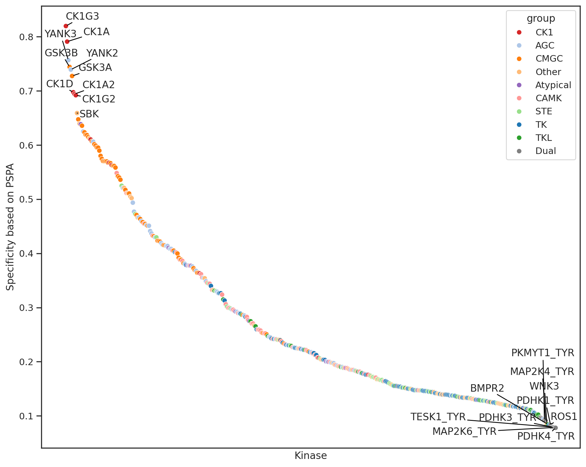
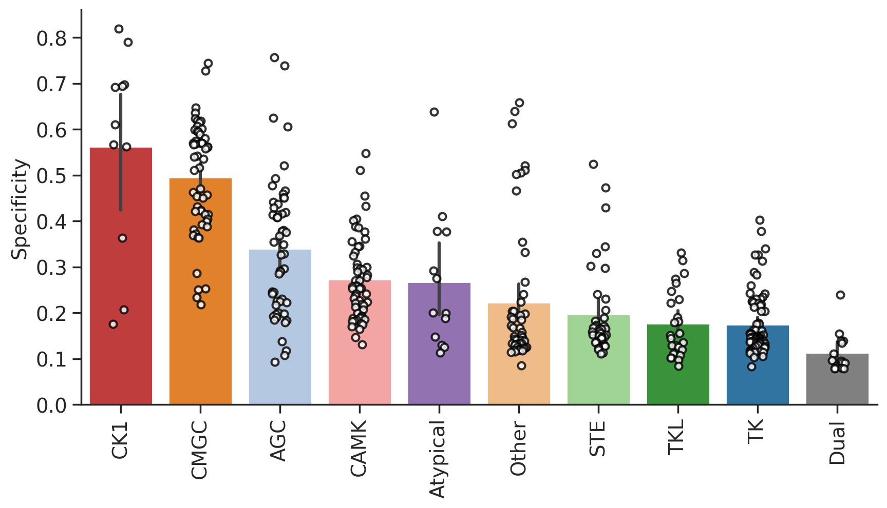
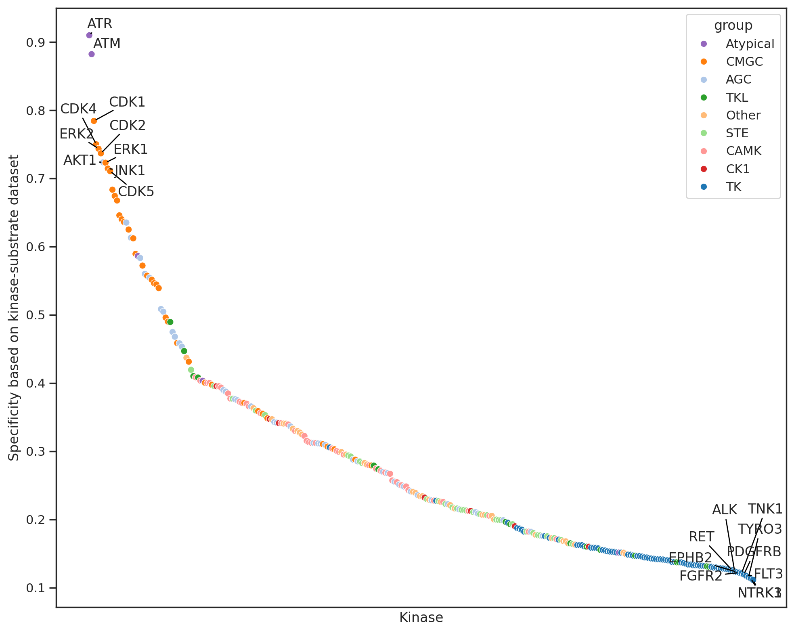
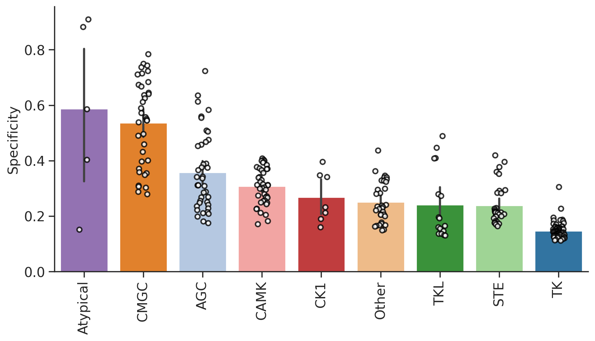
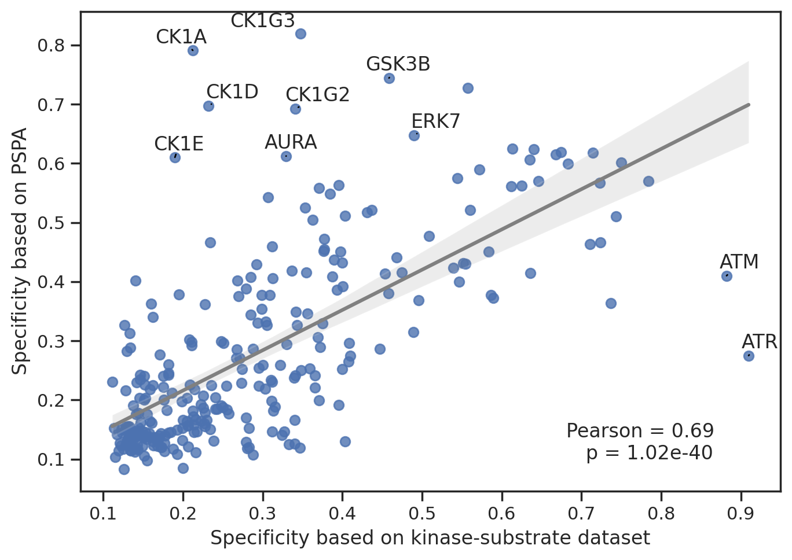

# Overall Specificity


<!-- WARNING: THIS FILE WAS AUTOGENERATED! DO NOT EDIT! -->

``` python
import pandas as pd,seaborn as sns
from katlas.core import *
from katlas.plot import *
from matplotlib import pyplot as plt
```

## Load raw data

``` python
pspa_ST = pd.read_csv('raw/pspa_raw.csv').set_index('kinase')

pspa_tyr = pd.read_csv('raw/pspa_tyr_raw.csv').set_index('kinase')
```

## Map pspa tyr kinase

Transform protein name to gene name

``` python
pspa_info = pd.read_csv('raw/lew_tyr_info.csv')
```

``` python
pspa_info
```

<div>
<style scoped>
    .dataframe tbody tr th:only-of-type {
        vertical-align: middle;
    }
&#10;    .dataframe tbody tr th {
        vertical-align: top;
    }
&#10;    .dataframe thead th {
        text-align: right;
    }
</style>

<table class="dataframe" data-quarto-postprocess="true" data-border="1">
<thead>
<tr class="header" style="text-align: right;">
<th data-quarto-table-cell-role="th"></th>
<th data-quarto-table-cell-role="th">lew_kinase</th>
<th data-quarto-table-cell-role="th">lew_kinase2</th>
<th data-quarto-table-cell-role="th">kinase</th>
<th data-quarto-table-cell-role="th">tyr</th>
<th data-quarto-table-cell-role="th">kinase_tyr</th>
</tr>
</thead>
<tbody>
<tr class="odd">
<td data-quarto-table-cell-role="th">0</td>
<td>ABL</td>
<td>ABL</td>
<td>ABL1</td>
<td>NaN</td>
<td>ABL1</td>
</tr>
<tr class="even">
<td data-quarto-table-cell-role="th">1</td>
<td>ACK</td>
<td>ACK</td>
<td>TNK2</td>
<td>NaN</td>
<td>TNK2</td>
</tr>
<tr class="odd">
<td data-quarto-table-cell-role="th">2</td>
<td>ALK</td>
<td>ALK</td>
<td>ALK</td>
<td>NaN</td>
<td>ALK</td>
</tr>
<tr class="even">
<td data-quarto-table-cell-role="th">3</td>
<td>ARG</td>
<td>ARG</td>
<td>ABL2</td>
<td>NaN</td>
<td>ABL2</td>
</tr>
<tr class="odd">
<td data-quarto-table-cell-role="th">4</td>
<td>AXL</td>
<td>AXL</td>
<td>AXL</td>
<td>NaN</td>
<td>AXL</td>
</tr>
<tr class="even">
<td data-quarto-table-cell-role="th">...</td>
<td>...</td>
<td>...</td>
<td>...</td>
<td>...</td>
<td>...</td>
</tr>
<tr class="odd">
<td data-quarto-table-cell-role="th">88</td>
<td>VEGFR2</td>
<td>VEGFR2</td>
<td>KDR</td>
<td>NaN</td>
<td>KDR</td>
</tr>
<tr class="even">
<td data-quarto-table-cell-role="th">89</td>
<td>VEGFR3</td>
<td>VEGFR3</td>
<td>FLT4</td>
<td>NaN</td>
<td>FLT4</td>
</tr>
<tr class="odd">
<td data-quarto-table-cell-role="th">90</td>
<td>WEE1_TYR</td>
<td>WEE1</td>
<td>WEE1</td>
<td>TYR</td>
<td>WEE1_TYR</td>
</tr>
<tr class="even">
<td data-quarto-table-cell-role="th">91</td>
<td>YES</td>
<td>YES</td>
<td>YES1</td>
<td>NaN</td>
<td>YES1</td>
</tr>
<tr class="odd">
<td data-quarto-table-cell-role="th">92</td>
<td>ZAP70</td>
<td>ZAP70</td>
<td>ZAP70</td>
<td>NaN</td>
<td>ZAP70</td>
</tr>
</tbody>
</table>

<p>93 rows × 5 columns</p>
</div>

``` python
kinase_map = pspa_info.set_index('lew_kinase').kinase_tyr
```

``` python
# map kinase name
pspa_tyr.index = pspa_tyr.index.map(kinase_map)
```

``` python
pspa_tyr.index
```

    Index(['ABL1', 'TNK2', 'ALK', 'ABL2', 'AXL', 'BLK', 'BMPR2_TYR', 'PTK6', 'BTK',
           'CSF1R', 'CSK', 'MATK', 'DDR1', 'DDR2', 'EGFR', 'EPHA1', 'EPHA2',
           'EPHA3', 'EPHA4', 'EPHA5', 'EPHA6', 'EPHA7', 'EPHA8', 'EPHB1', 'EPHB2',
           'EPHB3', 'EPHB4', 'BMX', 'PTK2', 'FER', 'FES', 'FGFR1', 'FGFR2',
           'FGFR3', 'FGFR4', 'FGR', 'FLT3', 'FRK', 'FYN', 'HCK', 'ERBB2', 'ERBB4',
           'IGF1R', 'INSR', 'INSRR', 'ITK', 'JAK1', 'JAK2', 'JAK3', 'KIT', 'LCK',
           'LIMK1_TYR', 'LIMK2_TYR', 'LTK', 'LYN', 'MERTK', 'MET', 'MAP2K4_TYR',
           'MAP2K6_TYR', 'MAP2K7_TYR', 'MST1R', 'MUSK', 'PKMYT1_TYR', 'NEK10_TYR',
           'PDGFRA', 'PDGFRB', 'PDHK1_TYR', 'PDHK3_TYR', 'PDHK4_TYR', 'PINK1_TYR',
           'PTK2B', 'RET', 'ROS1', 'SRC', 'SRMS', 'SYK', 'TEC', 'TESK1_TYR', 'TEK',
           'TNK1', 'TNNI3K_TYR', 'NTRK1', 'NTRK2', 'NTRK3', 'TXK', 'TYK2', 'TYRO3',
           'FLT1', 'KDR', 'FLT4', 'WEE1_TYR', 'YES1', 'ZAP70'],
          dtype='object', name='kinase')

## Combine

``` python
pspa_combine = pd.concat([pspa_ST,pspa_tyr]).iloc[:,:-23] # cut the 5 position of tyr as st do not have
```

``` python
pspa_combine
```

<div>
<style scoped>
    .dataframe tbody tr th:only-of-type {
        vertical-align: middle;
    }
&#10;    .dataframe tbody tr th {
        vertical-align: top;
    }
&#10;    .dataframe thead th {
        text-align: right;
    }
</style>

<table class="dataframe" data-quarto-postprocess="true" data-border="1">
<thead>
<tr class="header" style="text-align: right;">
<th data-quarto-table-cell-role="th"></th>
<th data-quarto-table-cell-role="th">-5P</th>
<th data-quarto-table-cell-role="th">-5G</th>
<th data-quarto-table-cell-role="th">-5A</th>
<th data-quarto-table-cell-role="th">-5C</th>
<th data-quarto-table-cell-role="th">-5S</th>
<th data-quarto-table-cell-role="th">-5T</th>
<th data-quarto-table-cell-role="th">-5V</th>
<th data-quarto-table-cell-role="th">-5I</th>
<th data-quarto-table-cell-role="th">-5L</th>
<th data-quarto-table-cell-role="th">-5M</th>
<th data-quarto-table-cell-role="th">-5F</th>
<th data-quarto-table-cell-role="th">-5Y</th>
<th data-quarto-table-cell-role="th">-5W</th>
<th data-quarto-table-cell-role="th">-5H</th>
<th data-quarto-table-cell-role="th">-5K</th>
<th data-quarto-table-cell-role="th">-5R</th>
<th data-quarto-table-cell-role="th">-5Q</th>
<th data-quarto-table-cell-role="th">-5N</th>
<th data-quarto-table-cell-role="th">-5D</th>
<th data-quarto-table-cell-role="th">-5E</th>
<th data-quarto-table-cell-role="th">-5s</th>
<th data-quarto-table-cell-role="th">-5t</th>
<th data-quarto-table-cell-role="th">-5y</th>
<th data-quarto-table-cell-role="th">-4P</th>
<th data-quarto-table-cell-role="th">-4G</th>
<th data-quarto-table-cell-role="th">-4A</th>
<th data-quarto-table-cell-role="th">-4C</th>
<th data-quarto-table-cell-role="th">-4S</th>
<th data-quarto-table-cell-role="th">-4T</th>
<th data-quarto-table-cell-role="th">-4V</th>
<th data-quarto-table-cell-role="th">-4I</th>
<th data-quarto-table-cell-role="th">-4L</th>
<th data-quarto-table-cell-role="th">-4M</th>
<th data-quarto-table-cell-role="th">-4F</th>
<th data-quarto-table-cell-role="th">-4Y</th>
<th data-quarto-table-cell-role="th">-4W</th>
<th data-quarto-table-cell-role="th">-4H</th>
<th data-quarto-table-cell-role="th">-4K</th>
<th data-quarto-table-cell-role="th">-4R</th>
<th data-quarto-table-cell-role="th">-4Q</th>
<th data-quarto-table-cell-role="th">-4N</th>
<th data-quarto-table-cell-role="th">-4D</th>
<th data-quarto-table-cell-role="th">-4E</th>
<th data-quarto-table-cell-role="th">-4s</th>
<th data-quarto-table-cell-role="th">-4t</th>
<th data-quarto-table-cell-role="th">-4y</th>
<th data-quarto-table-cell-role="th">-3P</th>
<th data-quarto-table-cell-role="th">-3G</th>
<th data-quarto-table-cell-role="th">-3A</th>
<th data-quarto-table-cell-role="th">-3C</th>
<th data-quarto-table-cell-role="th">-3S</th>
<th data-quarto-table-cell-role="th">-3T</th>
<th data-quarto-table-cell-role="th">-3V</th>
<th data-quarto-table-cell-role="th">-3I</th>
<th data-quarto-table-cell-role="th">-3L</th>
<th data-quarto-table-cell-role="th">-3M</th>
<th data-quarto-table-cell-role="th">-3F</th>
<th data-quarto-table-cell-role="th">-3Y</th>
<th data-quarto-table-cell-role="th">-3W</th>
<th data-quarto-table-cell-role="th">-3H</th>
<th data-quarto-table-cell-role="th">-3K</th>
<th data-quarto-table-cell-role="th">-3R</th>
<th data-quarto-table-cell-role="th">-3Q</th>
<th data-quarto-table-cell-role="th">-3N</th>
<th data-quarto-table-cell-role="th">-3D</th>
<th data-quarto-table-cell-role="th">-3E</th>
<th data-quarto-table-cell-role="th">-3s</th>
<th data-quarto-table-cell-role="th">-3t</th>
<th data-quarto-table-cell-role="th">-3y</th>
<th data-quarto-table-cell-role="th">-2P</th>
<th data-quarto-table-cell-role="th">-2G</th>
<th data-quarto-table-cell-role="th">-2A</th>
<th data-quarto-table-cell-role="th">-2C</th>
<th data-quarto-table-cell-role="th">-2S</th>
<th data-quarto-table-cell-role="th">-2T</th>
<th data-quarto-table-cell-role="th">-2V</th>
<th data-quarto-table-cell-role="th">-2I</th>
<th data-quarto-table-cell-role="th">-2L</th>
<th data-quarto-table-cell-role="th">-2M</th>
<th data-quarto-table-cell-role="th">-2F</th>
<th data-quarto-table-cell-role="th">-2Y</th>
<th data-quarto-table-cell-role="th">-2W</th>
<th data-quarto-table-cell-role="th">-2H</th>
<th data-quarto-table-cell-role="th">-2K</th>
<th data-quarto-table-cell-role="th">-2R</th>
<th data-quarto-table-cell-role="th">-2Q</th>
<th data-quarto-table-cell-role="th">-2N</th>
<th data-quarto-table-cell-role="th">-2D</th>
<th data-quarto-table-cell-role="th">-2E</th>
<th data-quarto-table-cell-role="th">-2s</th>
<th data-quarto-table-cell-role="th">-2t</th>
<th data-quarto-table-cell-role="th">-2y</th>
<th data-quarto-table-cell-role="th">-1P</th>
<th data-quarto-table-cell-role="th">-1G</th>
<th data-quarto-table-cell-role="th">-1A</th>
<th data-quarto-table-cell-role="th">-1C</th>
<th data-quarto-table-cell-role="th">-1S</th>
<th data-quarto-table-cell-role="th">-1T</th>
<th data-quarto-table-cell-role="th">-1V</th>
<th data-quarto-table-cell-role="th">-1I</th>
<th data-quarto-table-cell-role="th">-1L</th>
<th data-quarto-table-cell-role="th">-1M</th>
<th data-quarto-table-cell-role="th">-1F</th>
<th data-quarto-table-cell-role="th">-1Y</th>
<th data-quarto-table-cell-role="th">-1W</th>
<th data-quarto-table-cell-role="th">-1H</th>
<th data-quarto-table-cell-role="th">-1K</th>
<th data-quarto-table-cell-role="th">-1R</th>
<th data-quarto-table-cell-role="th">-1Q</th>
<th data-quarto-table-cell-role="th">-1N</th>
<th data-quarto-table-cell-role="th">-1D</th>
<th data-quarto-table-cell-role="th">-1E</th>
<th data-quarto-table-cell-role="th">-1s</th>
<th data-quarto-table-cell-role="th">-1t</th>
<th data-quarto-table-cell-role="th">-1y</th>
<th data-quarto-table-cell-role="th">1P</th>
<th data-quarto-table-cell-role="th">1G</th>
<th data-quarto-table-cell-role="th">1A</th>
<th data-quarto-table-cell-role="th">1C</th>
<th data-quarto-table-cell-role="th">1S</th>
<th data-quarto-table-cell-role="th">1T</th>
<th data-quarto-table-cell-role="th">1V</th>
<th data-quarto-table-cell-role="th">1I</th>
<th data-quarto-table-cell-role="th">1L</th>
<th data-quarto-table-cell-role="th">1M</th>
<th data-quarto-table-cell-role="th">1F</th>
<th data-quarto-table-cell-role="th">1Y</th>
<th data-quarto-table-cell-role="th">1W</th>
<th data-quarto-table-cell-role="th">1H</th>
<th data-quarto-table-cell-role="th">1K</th>
<th data-quarto-table-cell-role="th">1R</th>
<th data-quarto-table-cell-role="th">1Q</th>
<th data-quarto-table-cell-role="th">1N</th>
<th data-quarto-table-cell-role="th">1D</th>
<th data-quarto-table-cell-role="th">1E</th>
<th data-quarto-table-cell-role="th">1s</th>
<th data-quarto-table-cell-role="th">1t</th>
<th data-quarto-table-cell-role="th">1y</th>
<th data-quarto-table-cell-role="th">2P</th>
<th data-quarto-table-cell-role="th">2G</th>
<th data-quarto-table-cell-role="th">2A</th>
<th data-quarto-table-cell-role="th">2C</th>
<th data-quarto-table-cell-role="th">2S</th>
<th data-quarto-table-cell-role="th">2T</th>
<th data-quarto-table-cell-role="th">2V</th>
<th data-quarto-table-cell-role="th">2I</th>
<th data-quarto-table-cell-role="th">2L</th>
<th data-quarto-table-cell-role="th">2M</th>
<th data-quarto-table-cell-role="th">2F</th>
<th data-quarto-table-cell-role="th">2Y</th>
<th data-quarto-table-cell-role="th">2W</th>
<th data-quarto-table-cell-role="th">2H</th>
<th data-quarto-table-cell-role="th">2K</th>
<th data-quarto-table-cell-role="th">2R</th>
<th data-quarto-table-cell-role="th">2Q</th>
<th data-quarto-table-cell-role="th">2N</th>
<th data-quarto-table-cell-role="th">2D</th>
<th data-quarto-table-cell-role="th">2E</th>
<th data-quarto-table-cell-role="th">2s</th>
<th data-quarto-table-cell-role="th">2t</th>
<th data-quarto-table-cell-role="th">2y</th>
<th data-quarto-table-cell-role="th">3P</th>
<th data-quarto-table-cell-role="th">3G</th>
<th data-quarto-table-cell-role="th">3A</th>
<th data-quarto-table-cell-role="th">3C</th>
<th data-quarto-table-cell-role="th">3S</th>
<th data-quarto-table-cell-role="th">3T</th>
<th data-quarto-table-cell-role="th">3V</th>
<th data-quarto-table-cell-role="th">3I</th>
<th data-quarto-table-cell-role="th">3L</th>
<th data-quarto-table-cell-role="th">3M</th>
<th data-quarto-table-cell-role="th">3F</th>
<th data-quarto-table-cell-role="th">3Y</th>
<th data-quarto-table-cell-role="th">3W</th>
<th data-quarto-table-cell-role="th">3H</th>
<th data-quarto-table-cell-role="th">3K</th>
<th data-quarto-table-cell-role="th">3R</th>
<th data-quarto-table-cell-role="th">3Q</th>
<th data-quarto-table-cell-role="th">3N</th>
<th data-quarto-table-cell-role="th">3D</th>
<th data-quarto-table-cell-role="th">3E</th>
<th data-quarto-table-cell-role="th">3s</th>
<th data-quarto-table-cell-role="th">3t</th>
<th data-quarto-table-cell-role="th">3y</th>
<th data-quarto-table-cell-role="th">4P</th>
<th data-quarto-table-cell-role="th">4G</th>
<th data-quarto-table-cell-role="th">4A</th>
<th data-quarto-table-cell-role="th">4C</th>
<th data-quarto-table-cell-role="th">4S</th>
<th data-quarto-table-cell-role="th">4T</th>
<th data-quarto-table-cell-role="th">4V</th>
<th data-quarto-table-cell-role="th">4I</th>
<th data-quarto-table-cell-role="th">4L</th>
<th data-quarto-table-cell-role="th">4M</th>
<th data-quarto-table-cell-role="th">4F</th>
<th data-quarto-table-cell-role="th">4Y</th>
<th data-quarto-table-cell-role="th">4W</th>
<th data-quarto-table-cell-role="th">4H</th>
<th data-quarto-table-cell-role="th">4K</th>
<th data-quarto-table-cell-role="th">4R</th>
<th data-quarto-table-cell-role="th">4Q</th>
<th data-quarto-table-cell-role="th">4N</th>
<th data-quarto-table-cell-role="th">4D</th>
<th data-quarto-table-cell-role="th">4E</th>
<th data-quarto-table-cell-role="th">4s</th>
<th data-quarto-table-cell-role="th">4t</th>
<th data-quarto-table-cell-role="th">4y</th>
</tr>
<tr class="odd">
<th data-quarto-table-cell-role="th">kinase</th>
<th data-quarto-table-cell-role="th"></th>
<th data-quarto-table-cell-role="th"></th>
<th data-quarto-table-cell-role="th"></th>
<th data-quarto-table-cell-role="th"></th>
<th data-quarto-table-cell-role="th"></th>
<th data-quarto-table-cell-role="th"></th>
<th data-quarto-table-cell-role="th"></th>
<th data-quarto-table-cell-role="th"></th>
<th data-quarto-table-cell-role="th"></th>
<th data-quarto-table-cell-role="th"></th>
<th data-quarto-table-cell-role="th"></th>
<th data-quarto-table-cell-role="th"></th>
<th data-quarto-table-cell-role="th"></th>
<th data-quarto-table-cell-role="th"></th>
<th data-quarto-table-cell-role="th"></th>
<th data-quarto-table-cell-role="th"></th>
<th data-quarto-table-cell-role="th"></th>
<th data-quarto-table-cell-role="th"></th>
<th data-quarto-table-cell-role="th"></th>
<th data-quarto-table-cell-role="th"></th>
<th data-quarto-table-cell-role="th"></th>
<th data-quarto-table-cell-role="th"></th>
<th data-quarto-table-cell-role="th"></th>
<th data-quarto-table-cell-role="th"></th>
<th data-quarto-table-cell-role="th"></th>
<th data-quarto-table-cell-role="th"></th>
<th data-quarto-table-cell-role="th"></th>
<th data-quarto-table-cell-role="th"></th>
<th data-quarto-table-cell-role="th"></th>
<th data-quarto-table-cell-role="th"></th>
<th data-quarto-table-cell-role="th"></th>
<th data-quarto-table-cell-role="th"></th>
<th data-quarto-table-cell-role="th"></th>
<th data-quarto-table-cell-role="th"></th>
<th data-quarto-table-cell-role="th"></th>
<th data-quarto-table-cell-role="th"></th>
<th data-quarto-table-cell-role="th"></th>
<th data-quarto-table-cell-role="th"></th>
<th data-quarto-table-cell-role="th"></th>
<th data-quarto-table-cell-role="th"></th>
<th data-quarto-table-cell-role="th"></th>
<th data-quarto-table-cell-role="th"></th>
<th data-quarto-table-cell-role="th"></th>
<th data-quarto-table-cell-role="th"></th>
<th data-quarto-table-cell-role="th"></th>
<th data-quarto-table-cell-role="th"></th>
<th data-quarto-table-cell-role="th"></th>
<th data-quarto-table-cell-role="th"></th>
<th data-quarto-table-cell-role="th"></th>
<th data-quarto-table-cell-role="th"></th>
<th data-quarto-table-cell-role="th"></th>
<th data-quarto-table-cell-role="th"></th>
<th data-quarto-table-cell-role="th"></th>
<th data-quarto-table-cell-role="th"></th>
<th data-quarto-table-cell-role="th"></th>
<th data-quarto-table-cell-role="th"></th>
<th data-quarto-table-cell-role="th"></th>
<th data-quarto-table-cell-role="th"></th>
<th data-quarto-table-cell-role="th"></th>
<th data-quarto-table-cell-role="th"></th>
<th data-quarto-table-cell-role="th"></th>
<th data-quarto-table-cell-role="th"></th>
<th data-quarto-table-cell-role="th"></th>
<th data-quarto-table-cell-role="th"></th>
<th data-quarto-table-cell-role="th"></th>
<th data-quarto-table-cell-role="th"></th>
<th data-quarto-table-cell-role="th"></th>
<th data-quarto-table-cell-role="th"></th>
<th data-quarto-table-cell-role="th"></th>
<th data-quarto-table-cell-role="th"></th>
<th data-quarto-table-cell-role="th"></th>
<th data-quarto-table-cell-role="th"></th>
<th data-quarto-table-cell-role="th"></th>
<th data-quarto-table-cell-role="th"></th>
<th data-quarto-table-cell-role="th"></th>
<th data-quarto-table-cell-role="th"></th>
<th data-quarto-table-cell-role="th"></th>
<th data-quarto-table-cell-role="th"></th>
<th data-quarto-table-cell-role="th"></th>
<th data-quarto-table-cell-role="th"></th>
<th data-quarto-table-cell-role="th"></th>
<th data-quarto-table-cell-role="th"></th>
<th data-quarto-table-cell-role="th"></th>
<th data-quarto-table-cell-role="th"></th>
<th data-quarto-table-cell-role="th"></th>
<th data-quarto-table-cell-role="th"></th>
<th data-quarto-table-cell-role="th"></th>
<th data-quarto-table-cell-role="th"></th>
<th data-quarto-table-cell-role="th"></th>
<th data-quarto-table-cell-role="th"></th>
<th data-quarto-table-cell-role="th"></th>
<th data-quarto-table-cell-role="th"></th>
<th data-quarto-table-cell-role="th"></th>
<th data-quarto-table-cell-role="th"></th>
<th data-quarto-table-cell-role="th"></th>
<th data-quarto-table-cell-role="th"></th>
<th data-quarto-table-cell-role="th"></th>
<th data-quarto-table-cell-role="th"></th>
<th data-quarto-table-cell-role="th"></th>
<th data-quarto-table-cell-role="th"></th>
<th data-quarto-table-cell-role="th"></th>
<th data-quarto-table-cell-role="th"></th>
<th data-quarto-table-cell-role="th"></th>
<th data-quarto-table-cell-role="th"></th>
<th data-quarto-table-cell-role="th"></th>
<th data-quarto-table-cell-role="th"></th>
<th data-quarto-table-cell-role="th"></th>
<th data-quarto-table-cell-role="th"></th>
<th data-quarto-table-cell-role="th"></th>
<th data-quarto-table-cell-role="th"></th>
<th data-quarto-table-cell-role="th"></th>
<th data-quarto-table-cell-role="th"></th>
<th data-quarto-table-cell-role="th"></th>
<th data-quarto-table-cell-role="th"></th>
<th data-quarto-table-cell-role="th"></th>
<th data-quarto-table-cell-role="th"></th>
<th data-quarto-table-cell-role="th"></th>
<th data-quarto-table-cell-role="th"></th>
<th data-quarto-table-cell-role="th"></th>
<th data-quarto-table-cell-role="th"></th>
<th data-quarto-table-cell-role="th"></th>
<th data-quarto-table-cell-role="th"></th>
<th data-quarto-table-cell-role="th"></th>
<th data-quarto-table-cell-role="th"></th>
<th data-quarto-table-cell-role="th"></th>
<th data-quarto-table-cell-role="th"></th>
<th data-quarto-table-cell-role="th"></th>
<th data-quarto-table-cell-role="th"></th>
<th data-quarto-table-cell-role="th"></th>
<th data-quarto-table-cell-role="th"></th>
<th data-quarto-table-cell-role="th"></th>
<th data-quarto-table-cell-role="th"></th>
<th data-quarto-table-cell-role="th"></th>
<th data-quarto-table-cell-role="th"></th>
<th data-quarto-table-cell-role="th"></th>
<th data-quarto-table-cell-role="th"></th>
<th data-quarto-table-cell-role="th"></th>
<th data-quarto-table-cell-role="th"></th>
<th data-quarto-table-cell-role="th"></th>
<th data-quarto-table-cell-role="th"></th>
<th data-quarto-table-cell-role="th"></th>
<th data-quarto-table-cell-role="th"></th>
<th data-quarto-table-cell-role="th"></th>
<th data-quarto-table-cell-role="th"></th>
<th data-quarto-table-cell-role="th"></th>
<th data-quarto-table-cell-role="th"></th>
<th data-quarto-table-cell-role="th"></th>
<th data-quarto-table-cell-role="th"></th>
<th data-quarto-table-cell-role="th"></th>
<th data-quarto-table-cell-role="th"></th>
<th data-quarto-table-cell-role="th"></th>
<th data-quarto-table-cell-role="th"></th>
<th data-quarto-table-cell-role="th"></th>
<th data-quarto-table-cell-role="th"></th>
<th data-quarto-table-cell-role="th"></th>
<th data-quarto-table-cell-role="th"></th>
<th data-quarto-table-cell-role="th"></th>
<th data-quarto-table-cell-role="th"></th>
<th data-quarto-table-cell-role="th"></th>
<th data-quarto-table-cell-role="th"></th>
<th data-quarto-table-cell-role="th"></th>
<th data-quarto-table-cell-role="th"></th>
<th data-quarto-table-cell-role="th"></th>
<th data-quarto-table-cell-role="th"></th>
<th data-quarto-table-cell-role="th"></th>
<th data-quarto-table-cell-role="th"></th>
<th data-quarto-table-cell-role="th"></th>
<th data-quarto-table-cell-role="th"></th>
<th data-quarto-table-cell-role="th"></th>
<th data-quarto-table-cell-role="th"></th>
<th data-quarto-table-cell-role="th"></th>
<th data-quarto-table-cell-role="th"></th>
<th data-quarto-table-cell-role="th"></th>
<th data-quarto-table-cell-role="th"></th>
<th data-quarto-table-cell-role="th"></th>
<th data-quarto-table-cell-role="th"></th>
<th data-quarto-table-cell-role="th"></th>
<th data-quarto-table-cell-role="th"></th>
<th data-quarto-table-cell-role="th"></th>
<th data-quarto-table-cell-role="th"></th>
<th data-quarto-table-cell-role="th"></th>
<th data-quarto-table-cell-role="th"></th>
<th data-quarto-table-cell-role="th"></th>
<th data-quarto-table-cell-role="th"></th>
<th data-quarto-table-cell-role="th"></th>
<th data-quarto-table-cell-role="th"></th>
<th data-quarto-table-cell-role="th"></th>
<th data-quarto-table-cell-role="th"></th>
<th data-quarto-table-cell-role="th"></th>
<th data-quarto-table-cell-role="th"></th>
<th data-quarto-table-cell-role="th"></th>
<th data-quarto-table-cell-role="th"></th>
<th data-quarto-table-cell-role="th"></th>
<th data-quarto-table-cell-role="th"></th>
<th data-quarto-table-cell-role="th"></th>
<th data-quarto-table-cell-role="th"></th>
<th data-quarto-table-cell-role="th"></th>
<th data-quarto-table-cell-role="th"></th>
<th data-quarto-table-cell-role="th"></th>
<th data-quarto-table-cell-role="th"></th>
<th data-quarto-table-cell-role="th"></th>
<th data-quarto-table-cell-role="th"></th>
<th data-quarto-table-cell-role="th"></th>
<th data-quarto-table-cell-role="th"></th>
<th data-quarto-table-cell-role="th"></th>
<th data-quarto-table-cell-role="th"></th>
<th data-quarto-table-cell-role="th"></th>
</tr>
</thead>
<tbody>
<tr class="odd">
<td data-quarto-table-cell-role="th">AAK1</td>
<td>7.614134e+06</td>
<td>2.590563e+06</td>
<td>3.001315e+06</td>
<td>4.696631e+06</td>
<td>4.944312e+06</td>
<td>8.315838e+06</td>
<td>1.005654e+07</td>
<td>1.643306e+07</td>
<td>1.049974e+07</td>
<td>9.133578e+06</td>
<td>4.493054e+06</td>
<td>1.006273e+07</td>
<td>3.327455e+06</td>
<td>3.504743e+06</td>
<td>2.767294e+06</td>
<td>1.010574e+07</td>
<td>5.923673e+06</td>
<td>2.909153e+06</td>
<td>1.695156e+06</td>
<td>1.617849e+06</td>
<td>2.128670e+06</td>
<td>2.128670e+06</td>
<td>6.460995e+06</td>
<td>5.260313e+06</td>
<td>6.325834e+06</td>
<td>6.957994e+06</td>
<td>5.369435e+06</td>
<td>5.713921e+06</td>
<td>6.612202e+06</td>
<td>6.093662e+06</td>
<td>6.120309e+06</td>
<td>7.306988e+06</td>
<td>6.829678e+06</td>
<td>5.119222e+06</td>
<td>5.263236e+06</td>
<td>3.974771e+06</td>
<td>5.065008e+06</td>
<td>7.968511e+06</td>
<td>7.041049e+06</td>
<td>6.174444e+06</td>
<td>4.228327e+06</td>
<td>3.271231e+06</td>
<td>5.511934e+06</td>
<td>3.267818e+06</td>
<td>3.267818e+06</td>
<td>3.338570e+06</td>
<td>8.921287e+06</td>
<td>4.210323e+06</td>
<td>9.202468e+06</td>
<td>5.247518e+06</td>
<td>6.741480e+06</td>
<td>6.810878e+06</td>
<td>5271476.43</td>
<td>4928031.78</td>
<td>4.337562e+06</td>
<td>6.432257e+06</td>
<td>4.006022e+06</td>
<td>3.383022e+06</td>
<td>3.493591e+06</td>
<td>3.269350e+06</td>
<td>4.253144e+06</td>
<td>4.777087e+06</td>
<td>5.719014e+06</td>
<td>4.787112e+06</td>
<td>2.233865e+06</td>
<td>3.045337e+06</td>
<td>2.489664e+06</td>
<td>2.489664e+06</td>
<td>2.253600e+06</td>
<td>2.216029e+06</td>
<td>2.766177e+06</td>
<td>5.269960e+06</td>
<td>5.606488e+06</td>
<td>5.715777e+06</td>
<td>8.442377e+06</td>
<td>3330815.96</td>
<td>3699660.08</td>
<td>5.573758e+06</td>
<td>1.141874e+07</td>
<td>3289921.82</td>
<td>3.904724e+06</td>
<td>2.831768e+06</td>
<td>5.548345e+06</td>
<td>5.749699e+06</td>
<td>5.431821e+06</td>
<td>1.485362e+07</td>
<td>7.911792e+06</td>
<td>7.877661e+06</td>
<td>6.228872e+06</td>
<td>2.050311e+06</td>
<td>2.050311e+06</td>
<td>4.757609e+06</td>
<td>1.274357e+07</td>
<td>7922825.91</td>
<td>4.320089e+06</td>
<td>3.424102e+06</td>
<td>2951131.47</td>
<td>3.531424e+06</td>
<td>4.395649e+06</td>
<td>4.876362e+06</td>
<td>7.337788e+06</td>
<td>6213208.09</td>
<td>6.110447e+06</td>
<td>8.716737e+06</td>
<td>4935259.96</td>
<td>7.723412e+06</td>
<td>1.379149e+07</td>
<td>1.035962e+07</td>
<td>4.456719e+06</td>
<td>4.865705e+06</td>
<td>1.811253e+06</td>
<td>1.639403e+06</td>
<td>1.357999e+06</td>
<td>1.357999e+06</td>
<td>2.002371e+06</td>
<td>6415286.88</td>
<td>99964895.25</td>
<td>4.316875e+06</td>
<td>3.007075e+06</td>
<td>2745785.51</td>
<td>8.910120e+06</td>
<td>1.483692e+06</td>
<td>1.412341e+06</td>
<td>1.811600e+06</td>
<td>1.711245e+06</td>
<td>1.783236e+06</td>
<td>1.979521e+06</td>
<td>2.246919e+06</td>
<td>2.217612e+06</td>
<td>2.688448e+06</td>
<td>3.450818e+06</td>
<td>1.911930e+06</td>
<td>2358432.64</td>
<td>1421652.45</td>
<td>1.359588e+06</td>
<td>1.706013e+06</td>
<td>1.706013e+06</td>
<td>1.389642e+06</td>
<td>5119157.71</td>
<td>7278540.04</td>
<td>7.284322e+06</td>
<td>6.474715e+06</td>
<td>8.229141e+06</td>
<td>3.132517e+07</td>
<td>5.271194e+06</td>
<td>3.595811e+06</td>
<td>4.019474e+06</td>
<td>4.672000e+06</td>
<td>4.719446e+06</td>
<td>4.458959e+06</td>
<td>5.560394e+06</td>
<td>6.019748e+06</td>
<td>5.603859e+06</td>
<td>7.520621e+06</td>
<td>7.492737e+06</td>
<td>8.100332e+06</td>
<td>5364638.21</td>
<td>5087031.12</td>
<td>3.976345e+06</td>
<td>3.976345e+06</td>
<td>3.984759e+06</td>
<td>7.873215e+06</td>
<td>10666925.10</td>
<td>6726092.35</td>
<td>8.347111e+06</td>
<td>8474126.59</td>
<td>36243425.13</td>
<td>7.049439e+06</td>
<td>4.480458e+06</td>
<td>5.646461e+06</td>
<td>5.049205e+06</td>
<td>4.966940e+06</td>
<td>6.154423e+06</td>
<td>5.554385e+06</td>
<td>7784625.71</td>
<td>8536454.84</td>
<td>10411516.21</td>
<td>7199439.88</td>
<td>8496115.61</td>
<td>4678462.79</td>
<td>4293019.55</td>
<td>3871242.35</td>
<td>3871242.35</td>
<td>4144314.24</td>
<td>6.754641e+06</td>
<td>7.548893e+06</td>
<td>6.945442e+06</td>
<td>6.316584e+06</td>
<td>5.852228e+06</td>
<td>1.198637e+07</td>
<td>4.544765e+06</td>
<td>4.468426e+06</td>
<td>4.958371e+06</td>
<td>4.992757e+06</td>
<td>5.630292e+06</td>
<td>5.605199e+06</td>
<td>8.889243e+06</td>
<td>6.020663e+06</td>
<td>8.938081e+06</td>
<td>9.983402e+06</td>
<td>6.833482e+06</td>
<td>6.364453e+06</td>
<td>4.189046e+06</td>
<td>4921595.57</td>
<td>2705053.53</td>
<td>2705053.53</td>
<td>2909279.71</td>
</tr>
<tr class="even">
<td data-quarto-table-cell-role="th">ACVR2A</td>
<td>4.991039e+06</td>
<td>5.783856e+06</td>
<td>7.015771e+06</td>
<td>8.367603e+06</td>
<td>7.072052e+06</td>
<td>7.601400e+06</td>
<td>7.188292e+06</td>
<td>7.513916e+06</td>
<td>7.159895e+06</td>
<td>6.266123e+06</td>
<td>7.217726e+06</td>
<td>6.944710e+06</td>
<td>9.655464e+06</td>
<td>6.855045e+06</td>
<td>6.135260e+06</td>
<td>5.714942e+06</td>
<td>5.174360e+06</td>
<td>6.446238e+06</td>
<td>1.067680e+07</td>
<td>9.490371e+06</td>
<td>9.417512e+06</td>
<td>9.417512e+06</td>
<td>9.143263e+06</td>
<td>5.189501e+06</td>
<td>6.115977e+06</td>
<td>6.183207e+06</td>
<td>8.746775e+06</td>
<td>8.620216e+06</td>
<td>8.958569e+06</td>
<td>6.057960e+06</td>
<td>5.865980e+06</td>
<td>5.795429e+06</td>
<td>6.425254e+06</td>
<td>6.896824e+06</td>
<td>6.528270e+06</td>
<td>8.404648e+06</td>
<td>6.144456e+06</td>
<td>4.524121e+06</td>
<td>5.095303e+06</td>
<td>5.374812e+06</td>
<td>5.585577e+06</td>
<td>1.159205e+07</td>
<td>9.685649e+06</td>
<td>9.011965e+06</td>
<td>9.011965e+06</td>
<td>7.594632e+06</td>
<td>5.362571e+06</td>
<td>6.972104e+06</td>
<td>5.730145e+06</td>
<td>8.939563e+06</td>
<td>8.882397e+06</td>
<td>9.190427e+06</td>
<td>5827104.19</td>
<td>5369092.23</td>
<td>5.113058e+06</td>
<td>5.497993e+06</td>
<td>5.506587e+06</td>
<td>5.872247e+06</td>
<td>6.306875e+06</td>
<td>5.653091e+06</td>
<td>3.785783e+06</td>
<td>4.917763e+06</td>
<td>5.423081e+06</td>
<td>5.362812e+06</td>
<td>1.121296e+07</td>
<td>1.286189e+07</td>
<td>1.286491e+07</td>
<td>1.286491e+07</td>
<td>1.040912e+07</td>
<td>2.387566e+06</td>
<td>3.719260e+06</td>
<td>3.944903e+06</td>
<td>1.306509e+07</td>
<td>9.492139e+06</td>
<td>8.190708e+06</td>
<td>3735685.73</td>
<td>3374694.08</td>
<td>3.204388e+06</td>
<td>2.964892e+06</td>
<td>3752110.50</td>
<td>3.701144e+06</td>
<td>4.014811e+06</td>
<td>3.625178e+06</td>
<td>2.636457e+06</td>
<td>3.752367e+06</td>
<td>5.717786e+06</td>
<td>5.027611e+06</td>
<td>3.199105e+07</td>
<td>3.890473e+07</td>
<td>7.519771e+06</td>
<td>7.519771e+06</td>
<td>5.361107e+06</td>
<td>3.979857e+06</td>
<td>3356955.48</td>
<td>4.841646e+06</td>
<td>1.484390e+07</td>
<td>7884721.89</td>
<td>8.307355e+06</td>
<td>6.504731e+06</td>
<td>4.736171e+06</td>
<td>7.504066e+06</td>
<td>8479523.23</td>
<td>6.886560e+06</td>
<td>7.839785e+06</td>
<td>8170003.32</td>
<td>6.301557e+06</td>
<td>3.133306e+06</td>
<td>3.399144e+06</td>
<td>5.297926e+06</td>
<td>4.806449e+06</td>
<td>7.245964e+06</td>
<td>7.619248e+06</td>
<td>8.081957e+06</td>
<td>8.081957e+06</td>
<td>1.066555e+07</td>
<td>1962410.84</td>
<td>3317170.91</td>
<td>3.730968e+06</td>
<td>1.044143e+07</td>
<td>6905481.50</td>
<td>7.758918e+06</td>
<td>7.639850e+06</td>
<td>6.777724e+06</td>
<td>5.034766e+06</td>
<td>5.741319e+06</td>
<td>5.371632e+06</td>
<td>5.597504e+06</td>
<td>5.543419e+06</td>
<td>4.036400e+06</td>
<td>1.885554e+06</td>
<td>2.399467e+06</td>
<td>7.087499e+06</td>
<td>3680225.89</td>
<td>9707458.36</td>
<td>1.850553e+07</td>
<td>2.680623e+07</td>
<td>2.680623e+07</td>
<td>1.618774e+07</td>
<td>5866522.32</td>
<td>8056284.20</td>
<td>6.653384e+06</td>
<td>8.609148e+06</td>
<td>6.900910e+06</td>
<td>6.081477e+06</td>
<td>5.928764e+06</td>
<td>5.427121e+06</td>
<td>4.000029e+06</td>
<td>5.214510e+06</td>
<td>5.833633e+06</td>
<td>6.561916e+06</td>
<td>5.830996e+06</td>
<td>6.657870e+06</td>
<td>4.773873e+06</td>
<td>5.549060e+06</td>
<td>5.962668e+06</td>
<td>5.118947e+06</td>
<td>7342349.21</td>
<td>6089086.81</td>
<td>6.553063e+06</td>
<td>6.553063e+06</td>
<td>5.205000e+06</td>
<td>6.765402e+06</td>
<td>5981896.69</td>
<td>5346578.80</td>
<td>6.919984e+06</td>
<td>7959489.88</td>
<td>7230276.28</td>
<td>5.724909e+06</td>
<td>5.600558e+06</td>
<td>6.186548e+06</td>
<td>5.952585e+06</td>
<td>6.508513e+06</td>
<td>6.613615e+06</td>
<td>6.419485e+06</td>
<td>5958101.56</td>
<td>4666926.40</td>
<td>3909037.15</td>
<td>5041118.65</td>
<td>5297856.53</td>
<td>6281516.23</td>
<td>8795439.82</td>
<td>5241575.71</td>
<td>5241575.71</td>
<td>8237893.33</td>
<td>7.993594e+06</td>
<td>5.729649e+06</td>
<td>5.252570e+06</td>
<td>7.759900e+06</td>
<td>5.847330e+06</td>
<td>6.832130e+06</td>
<td>5.439640e+06</td>
<td>5.935277e+06</td>
<td>5.396841e+06</td>
<td>6.976825e+06</td>
<td>5.517910e+06</td>
<td>6.107147e+06</td>
<td>8.435954e+06</td>
<td>6.039473e+06</td>
<td>5.556301e+06</td>
<td>5.178735e+06</td>
<td>6.490098e+06</td>
<td>5.862481e+06</td>
<td>6.742906e+06</td>
<td>6750653.36</td>
<td>7414220.16</td>
<td>7414220.16</td>
<td>6209576.97</td>
</tr>
<tr class="odd">
<td data-quarto-table-cell-role="th">ACVR2B</td>
<td>2.648033e+07</td>
<td>2.568969e+07</td>
<td>2.813730e+07</td>
<td>4.517591e+07</td>
<td>3.287672e+07</td>
<td>3.351696e+07</td>
<td>2.701119e+07</td>
<td>2.199626e+07</td>
<td>2.341299e+07</td>
<td>2.567058e+07</td>
<td>3.002968e+07</td>
<td>3.017269e+07</td>
<td>3.586173e+07</td>
<td>2.574340e+07</td>
<td>2.146662e+07</td>
<td>2.345728e+07</td>
<td>2.476593e+07</td>
<td>2.960038e+07</td>
<td>5.294219e+07</td>
<td>4.475642e+07</td>
<td>3.786952e+07</td>
<td>3.786952e+07</td>
<td>3.692942e+07</td>
<td>2.631562e+07</td>
<td>3.072667e+07</td>
<td>2.822669e+07</td>
<td>3.812676e+07</td>
<td>4.301345e+07</td>
<td>4.277259e+07</td>
<td>2.546188e+07</td>
<td>2.249653e+07</td>
<td>2.536736e+07</td>
<td>2.457962e+07</td>
<td>3.063236e+07</td>
<td>2.981163e+07</td>
<td>3.456903e+07</td>
<td>2.990129e+07</td>
<td>1.856668e+07</td>
<td>1.805841e+07</td>
<td>2.416071e+07</td>
<td>2.800391e+07</td>
<td>5.038351e+07</td>
<td>4.287344e+07</td>
<td>3.860183e+07</td>
<td>3.860183e+07</td>
<td>4.178142e+07</td>
<td>2.158990e+07</td>
<td>2.589693e+07</td>
<td>2.536640e+07</td>
<td>3.239116e+07</td>
<td>3.926870e+07</td>
<td>3.495329e+07</td>
<td>24544954.48</td>
<td>21195505.14</td>
<td>1.995029e+07</td>
<td>2.206874e+07</td>
<td>2.472332e+07</td>
<td>2.649370e+07</td>
<td>3.046722e+07</td>
<td>2.554031e+07</td>
<td>1.985960e+07</td>
<td>1.709886e+07</td>
<td>2.606574e+07</td>
<td>2.715736e+07</td>
<td>5.479210e+07</td>
<td>5.501460e+07</td>
<td>4.908985e+07</td>
<td>4.908985e+07</td>
<td>6.436937e+07</td>
<td>1.038309e+07</td>
<td>1.462589e+07</td>
<td>2.080868e+07</td>
<td>4.763634e+07</td>
<td>3.530416e+07</td>
<td>3.796242e+07</td>
<td>16548611.68</td>
<td>12258162.50</td>
<td>1.649462e+07</td>
<td>1.420021e+07</td>
<td>15925579.76</td>
<td>1.632044e+07</td>
<td>1.587850e+07</td>
<td>2.056051e+07</td>
<td>1.249803e+07</td>
<td>1.395433e+07</td>
<td>2.043374e+07</td>
<td>2.712993e+07</td>
<td>1.209644e+08</td>
<td>1.577022e+08</td>
<td>3.655727e+07</td>
<td>3.655727e+07</td>
<td>2.745861e+07</td>
<td>1.581925e+07</td>
<td>15139149.87</td>
<td>2.134236e+07</td>
<td>2.952187e+07</td>
<td>25664232.00</td>
<td>2.839195e+07</td>
<td>2.770178e+07</td>
<td>1.981812e+07</td>
<td>3.667232e+07</td>
<td>36335662.38</td>
<td>2.687820e+07</td>
<td>3.477983e+07</td>
<td>41496713.73</td>
<td>2.682559e+07</td>
<td>1.472776e+07</td>
<td>1.410475e+07</td>
<td>2.151356e+07</td>
<td>2.518703e+07</td>
<td>3.866288e+07</td>
<td>3.471438e+07</td>
<td>4.933006e+07</td>
<td>4.933006e+07</td>
<td>4.925704e+07</td>
<td>8904399.29</td>
<td>14948055.42</td>
<td>1.676565e+07</td>
<td>4.025226e+07</td>
<td>24215134.31</td>
<td>3.063690e+07</td>
<td>2.996006e+07</td>
<td>2.465090e+07</td>
<td>2.120177e+07</td>
<td>2.584864e+07</td>
<td>2.215540e+07</td>
<td>2.495283e+07</td>
<td>2.731012e+07</td>
<td>2.319200e+07</td>
<td>1.048079e+07</td>
<td>1.053792e+07</td>
<td>2.869759e+07</td>
<td>20916022.30</td>
<td>58048288.98</td>
<td>1.103872e+08</td>
<td>1.218935e+08</td>
<td>1.218935e+08</td>
<td>6.994578e+07</td>
<td>36115383.96</td>
<td>32738418.07</td>
<td>2.844781e+07</td>
<td>2.846730e+07</td>
<td>3.062024e+07</td>
<td>2.789244e+07</td>
<td>2.911362e+07</td>
<td>2.531559e+07</td>
<td>1.774232e+07</td>
<td>2.229611e+07</td>
<td>2.180289e+07</td>
<td>2.737951e+07</td>
<td>2.451023e+07</td>
<td>2.252698e+07</td>
<td>1.927138e+07</td>
<td>2.121534e+07</td>
<td>2.208222e+07</td>
<td>2.398039e+07</td>
<td>34155403.55</td>
<td>28198813.13</td>
<td>3.838533e+07</td>
<td>3.838533e+07</td>
<td>2.851153e+07</td>
<td>3.257098e+07</td>
<td>30150790.48</td>
<td>26899530.88</td>
<td>3.005933e+07</td>
<td>38558739.93</td>
<td>36859921.47</td>
<td>2.703936e+07</td>
<td>2.759019e+07</td>
<td>3.215902e+07</td>
<td>2.853096e+07</td>
<td>2.644059e+07</td>
<td>3.290203e+07</td>
<td>3.110638e+07</td>
<td>23931820.75</td>
<td>17025117.96</td>
<td>21234075.57</td>
<td>24959228.30</td>
<td>24492089.19</td>
<td>27379743.65</td>
<td>34799587.30</td>
<td>29745626.40</td>
<td>29745626.40</td>
<td>32930899.01</td>
<td>3.587234e+07</td>
<td>2.894266e+07</td>
<td>3.263029e+07</td>
<td>3.230768e+07</td>
<td>2.935148e+07</td>
<td>3.215859e+07</td>
<td>2.758575e+07</td>
<td>2.708777e+07</td>
<td>2.642711e+07</td>
<td>2.600846e+07</td>
<td>2.400660e+07</td>
<td>2.926031e+07</td>
<td>3.910546e+07</td>
<td>2.798420e+07</td>
<td>2.249692e+07</td>
<td>2.423690e+07</td>
<td>2.913286e+07</td>
<td>2.652739e+07</td>
<td>3.638873e+07</td>
<td>34729319.54</td>
<td>37906081.09</td>
<td>37906081.09</td>
<td>31761418.56</td>
</tr>
<tr class="even">
<td data-quarto-table-cell-role="th">AKT1</td>
<td>1.839951e+07</td>
<td>1.810468e+07</td>
<td>1.683184e+07</td>
<td>1.724774e+07</td>
<td>2.264728e+07</td>
<td>1.780129e+07</td>
<td>1.303757e+07</td>
<td>1.327190e+07</td>
<td>1.415649e+07</td>
<td>1.540976e+07</td>
<td>1.667196e+07</td>
<td>1.574220e+07</td>
<td>1.602750e+07</td>
<td>1.990716e+07</td>
<td>2.896621e+07</td>
<td>4.630867e+07</td>
<td>1.498802e+07</td>
<td>1.425860e+07</td>
<td>1.146417e+07</td>
<td>1.146659e+07</td>
<td>1.298722e+07</td>
<td>1.298722e+07</td>
<td>1.306109e+07</td>
<td>1.939893e+07</td>
<td>2.204418e+07</td>
<td>1.906361e+07</td>
<td>1.679807e+07</td>
<td>2.456108e+07</td>
<td>2.105365e+07</td>
<td>1.613429e+07</td>
<td>1.406539e+07</td>
<td>1.598032e+07</td>
<td>1.917523e+07</td>
<td>1.565065e+07</td>
<td>1.672654e+07</td>
<td>2.071500e+07</td>
<td>2.172773e+07</td>
<td>3.938727e+07</td>
<td>5.864980e+07</td>
<td>1.939885e+07</td>
<td>1.714231e+07</td>
<td>1.209032e+07</td>
<td>1.498625e+07</td>
<td>1.635376e+07</td>
<td>1.635376e+07</td>
<td>1.475836e+07</td>
<td>1.350972e+07</td>
<td>1.207279e+07</td>
<td>1.448511e+07</td>
<td>1.314060e+07</td>
<td>2.006536e+07</td>
<td>1.566591e+07</td>
<td>6344537.74</td>
<td>6534731.06</td>
<td>7.876058e+06</td>
<td>7.508916e+06</td>
<td>7.223255e+06</td>
<td>9.468824e+06</td>
<td>9.373015e+06</td>
<td>2.230909e+07</td>
<td>6.216923e+07</td>
<td>2.418045e+08</td>
<td>1.493157e+07</td>
<td>8.856712e+06</td>
<td>4.399326e+06</td>
<td>4.368742e+06</td>
<td>8.590356e+06</td>
<td>8.590356e+06</td>
<td>7.963766e+06</td>
<td>6.789908e+06</td>
<td>1.326800e+07</td>
<td>2.111062e+07</td>
<td>2.197163e+07</td>
<td>4.133298e+07</td>
<td>4.051411e+07</td>
<td>9863410.69</td>
<td>9269011.71</td>
<td>2.289257e+07</td>
<td>1.116827e+07</td>
<td>11301067.87</td>
<td>8.789775e+06</td>
<td>7.431841e+06</td>
<td>1.878957e+07</td>
<td>4.890019e+07</td>
<td>1.630226e+08</td>
<td>1.222802e+07</td>
<td>9.955364e+06</td>
<td>3.198070e+06</td>
<td>2.965348e+06</td>
<td>7.792557e+06</td>
<td>7.792557e+06</td>
<td>6.120956e+06</td>
<td>2.229303e+07</td>
<td>28410424.95</td>
<td>1.584233e+07</td>
<td>1.487992e+07</td>
<td>24373755.69</td>
<td>1.811641e+07</td>
<td>9.634837e+06</td>
<td>7.220573e+06</td>
<td>2.097791e+07</td>
<td>24295340.44</td>
<td>1.785176e+07</td>
<td>2.661260e+07</td>
<td>14220032.24</td>
<td>2.526613e+07</td>
<td>3.818571e+07</td>
<td>3.752555e+07</td>
<td>2.168447e+07</td>
<td>3.081111e+07</td>
<td>1.557435e+07</td>
<td>8.290899e+06</td>
<td>6.467371e+06</td>
<td>6.467371e+06</td>
<td>1.930039e+07</td>
<td>7187402.87</td>
<td>13136588.59</td>
<td>9.834130e+06</td>
<td>1.866756e+07</td>
<td>25572492.56</td>
<td>2.454095e+07</td>
<td>2.793931e+07</td>
<td>3.395299e+07</td>
<td>2.444179e+07</td>
<td>3.378535e+07</td>
<td>4.623650e+07</td>
<td>1.704266e+07</td>
<td>2.246250e+07</td>
<td>1.581214e+07</td>
<td>1.705496e+07</td>
<td>1.902314e+07</td>
<td>2.157018e+07</td>
<td>18462014.12</td>
<td>5882718.69</td>
<td>5.841048e+06</td>
<td>9.088321e+06</td>
<td>9.088321e+06</td>
<td>1.147951e+07</td>
<td>14699453.43</td>
<td>21525508.02</td>
<td>1.821118e+07</td>
<td>2.359812e+07</td>
<td>6.103037e+07</td>
<td>4.038845e+07</td>
<td>2.217929e+07</td>
<td>2.044153e+07</td>
<td>2.271884e+07</td>
<td>1.580155e+07</td>
<td>1.524072e+07</td>
<td>1.832569e+07</td>
<td>1.667933e+07</td>
<td>3.135762e+07</td>
<td>2.609526e+07</td>
<td>3.910237e+07</td>
<td>1.812946e+07</td>
<td>2.170967e+07</td>
<td>10984748.38</td>
<td>7899072.12</td>
<td>9.884168e+06</td>
<td>9.884168e+06</td>
<td>1.295170e+07</td>
<td>1.977395e+07</td>
<td>28710820.58</td>
<td>19788527.29</td>
<td>2.465938e+07</td>
<td>38048939.96</td>
<td>28284495.88</td>
<td>1.855286e+07</td>
<td>1.989256e+07</td>
<td>1.959928e+07</td>
<td>1.991439e+07</td>
<td>2.452511e+07</td>
<td>2.324808e+07</td>
<td>2.285437e+07</td>
<td>30978724.22</td>
<td>37068344.22</td>
<td>45991399.36</td>
<td>22887074.13</td>
<td>25185236.76</td>
<td>11842652.96</td>
<td>12741276.18</td>
<td>13591360.01</td>
<td>13591360.01</td>
<td>13703183.16</td>
<td>4.100723e+07</td>
<td>2.647743e+07</td>
<td>2.171967e+07</td>
<td>2.020362e+07</td>
<td>3.896130e+07</td>
<td>3.227091e+07</td>
<td>1.836489e+07</td>
<td>1.691842e+07</td>
<td>2.057025e+07</td>
<td>2.022813e+07</td>
<td>1.732320e+07</td>
<td>1.551240e+07</td>
<td>2.315157e+07</td>
<td>2.951154e+07</td>
<td>5.094266e+07</td>
<td>4.815292e+07</td>
<td>3.269388e+07</td>
<td>2.889660e+07</td>
<td>1.970135e+07</td>
<td>13887460.52</td>
<td>17483074.60</td>
<td>17483074.60</td>
<td>11696833.54</td>
</tr>
<tr class="odd">
<td data-quarto-table-cell-role="th">AKT2</td>
<td>5.439238e+06</td>
<td>5.569477e+06</td>
<td>5.805463e+06</td>
<td>6.301076e+06</td>
<td>5.004932e+06</td>
<td>4.812023e+06</td>
<td>3.906822e+06</td>
<td>3.776845e+06</td>
<td>4.450345e+06</td>
<td>4.629320e+06</td>
<td>4.945258e+06</td>
<td>4.922328e+06</td>
<td>4.818865e+06</td>
<td>5.502850e+06</td>
<td>8.846468e+06</td>
<td>1.333189e+07</td>
<td>4.466206e+06</td>
<td>4.288906e+06</td>
<td>2.757477e+06</td>
<td>2.846855e+06</td>
<td>4.120974e+06</td>
<td>4.120974e+06</td>
<td>4.296410e+06</td>
<td>5.553405e+06</td>
<td>6.777167e+06</td>
<td>6.560099e+06</td>
<td>6.582762e+06</td>
<td>5.632446e+06</td>
<td>5.626769e+06</td>
<td>4.006943e+06</td>
<td>3.777457e+06</td>
<td>4.557922e+06</td>
<td>5.073876e+06</td>
<td>3.998927e+06</td>
<td>4.589151e+06</td>
<td>3.853566e+06</td>
<td>5.877348e+06</td>
<td>1.132398e+07</td>
<td>1.341026e+07</td>
<td>5.637101e+06</td>
<td>5.224016e+06</td>
<td>3.264182e+06</td>
<td>3.696234e+06</td>
<td>4.296297e+06</td>
<td>4.296297e+06</td>
<td>3.662821e+06</td>
<td>2.964034e+06</td>
<td>3.057508e+06</td>
<td>4.553668e+06</td>
<td>5.296786e+06</td>
<td>4.880460e+06</td>
<td>4.469909e+06</td>
<td>2397056.82</td>
<td>2383607.99</td>
<td>2.527122e+06</td>
<td>2.537479e+06</td>
<td>2.505547e+06</td>
<td>2.706595e+06</td>
<td>2.558155e+06</td>
<td>4.758159e+06</td>
<td>1.664300e+07</td>
<td>8.780359e+07</td>
<td>4.181480e+06</td>
<td>2.649826e+06</td>
<td>1.856813e+06</td>
<td>2.009072e+06</td>
<td>3.014999e+06</td>
<td>3.014999e+06</td>
<td>2.786490e+06</td>
<td>2.330602e+06</td>
<td>3.722199e+06</td>
<td>5.979231e+06</td>
<td>8.974567e+06</td>
<td>1.363241e+07</td>
<td>1.010563e+07</td>
<td>2942671.35</td>
<td>2646410.48</td>
<td>4.742427e+06</td>
<td>2.952549e+06</td>
<td>2697527.22</td>
<td>2.668971e+06</td>
<td>2.644657e+06</td>
<td>4.975136e+06</td>
<td>1.710828e+07</td>
<td>3.647206e+07</td>
<td>3.975190e+06</td>
<td>3.308858e+06</td>
<td>1.834547e+06</td>
<td>1.841426e+06</td>
<td>2.918462e+06</td>
<td>2.918462e+06</td>
<td>2.568866e+06</td>
<td>6.512287e+06</td>
<td>6714446.62</td>
<td>5.519547e+06</td>
<td>5.502392e+06</td>
<td>6214686.11</td>
<td>5.051604e+06</td>
<td>3.036099e+06</td>
<td>2.495300e+06</td>
<td>4.484786e+06</td>
<td>5714877.99</td>
<td>4.615614e+06</td>
<td>7.993743e+06</td>
<td>4279316.71</td>
<td>7.406520e+06</td>
<td>7.869915e+06</td>
<td>9.347586e+06</td>
<td>6.492965e+06</td>
<td>9.718326e+06</td>
<td>3.850429e+06</td>
<td>2.650874e+06</td>
<td>2.558032e+06</td>
<td>2.558032e+06</td>
<td>4.818770e+06</td>
<td>3390428.52</td>
<td>4010009.36</td>
<td>3.705137e+06</td>
<td>7.307115e+06</td>
<td>5708742.09</td>
<td>5.610131e+06</td>
<td>4.741528e+06</td>
<td>5.361541e+06</td>
<td>5.198120e+06</td>
<td>6.335042e+06</td>
<td>8.358214e+06</td>
<td>4.558845e+06</td>
<td>4.563970e+06</td>
<td>4.449433e+06</td>
<td>4.786098e+06</td>
<td>5.282519e+06</td>
<td>5.576834e+06</td>
<td>5150662.99</td>
<td>2286465.27</td>
<td>2.105027e+06</td>
<td>3.628510e+06</td>
<td>3.628510e+06</td>
<td>4.152546e+06</td>
<td>4557267.80</td>
<td>6705472.43</td>
<td>6.335118e+06</td>
<td>8.824775e+06</td>
<td>1.846957e+07</td>
<td>8.797708e+06</td>
<td>4.532827e+06</td>
<td>3.618750e+06</td>
<td>4.297882e+06</td>
<td>3.940765e+06</td>
<td>3.314978e+06</td>
<td>4.326879e+06</td>
<td>3.564338e+06</td>
<td>8.661598e+06</td>
<td>6.560407e+06</td>
<td>6.956136e+06</td>
<td>4.339532e+06</td>
<td>6.049277e+06</td>
<td>3175814.63</td>
<td>2833442.97</td>
<td>5.420414e+06</td>
<td>5.420414e+06</td>
<td>5.570731e+06</td>
<td>5.492324e+06</td>
<td>6803045.82</td>
<td>5712262.24</td>
<td>8.338449e+06</td>
<td>6916137.16</td>
<td>5765528.76</td>
<td>3.987390e+06</td>
<td>3.310626e+06</td>
<td>4.606345e+06</td>
<td>3.944711e+06</td>
<td>4.615744e+06</td>
<td>4.760317e+06</td>
<td>4.766437e+06</td>
<td>7463546.47</td>
<td>9581858.17</td>
<td>9777288.15</td>
<td>5173060.60</td>
<td>4932877.74</td>
<td>3157981.08</td>
<td>3133584.99</td>
<td>4337162.19</td>
<td>4337162.19</td>
<td>5399811.38</td>
<td>9.707178e+06</td>
<td>7.244547e+06</td>
<td>5.450861e+06</td>
<td>7.077129e+06</td>
<td>7.739123e+06</td>
<td>7.823933e+06</td>
<td>3.778465e+06</td>
<td>4.053743e+06</td>
<td>4.346510e+06</td>
<td>4.803778e+06</td>
<td>4.018213e+06</td>
<td>4.513237e+06</td>
<td>4.161649e+06</td>
<td>6.812202e+06</td>
<td>1.159068e+07</td>
<td>9.932526e+06</td>
<td>6.544477e+06</td>
<td>6.252361e+06</td>
<td>3.629092e+06</td>
<td>3510048.19</td>
<td>5499662.30</td>
<td>5499662.30</td>
<td>4188620.88</td>
</tr>
<tr class="even">
<td data-quarto-table-cell-role="th">...</td>
<td>...</td>
<td>...</td>
<td>...</td>
<td>...</td>
<td>...</td>
<td>...</td>
<td>...</td>
<td>...</td>
<td>...</td>
<td>...</td>
<td>...</td>
<td>...</td>
<td>...</td>
<td>...</td>
<td>...</td>
<td>...</td>
<td>...</td>
<td>...</td>
<td>...</td>
<td>...</td>
<td>...</td>
<td>...</td>
<td>...</td>
<td>...</td>
<td>...</td>
<td>...</td>
<td>...</td>
<td>...</td>
<td>...</td>
<td>...</td>
<td>...</td>
<td>...</td>
<td>...</td>
<td>...</td>
<td>...</td>
<td>...</td>
<td>...</td>
<td>...</td>
<td>...</td>
<td>...</td>
<td>...</td>
<td>...</td>
<td>...</td>
<td>...</td>
<td>...</td>
<td>...</td>
<td>...</td>
<td>...</td>
<td>...</td>
<td>...</td>
<td>...</td>
<td>...</td>
<td>...</td>
<td>...</td>
<td>...</td>
<td>...</td>
<td>...</td>
<td>...</td>
<td>...</td>
<td>...</td>
<td>...</td>
<td>...</td>
<td>...</td>
<td>...</td>
<td>...</td>
<td>...</td>
<td>...</td>
<td>...</td>
<td>...</td>
<td>...</td>
<td>...</td>
<td>...</td>
<td>...</td>
<td>...</td>
<td>...</td>
<td>...</td>
<td>...</td>
<td>...</td>
<td>...</td>
<td>...</td>
<td>...</td>
<td>...</td>
<td>...</td>
<td>...</td>
<td>...</td>
<td>...</td>
<td>...</td>
<td>...</td>
<td>...</td>
<td>...</td>
<td>...</td>
<td>...</td>
<td>...</td>
<td>...</td>
<td>...</td>
<td>...</td>
<td>...</td>
<td>...</td>
<td>...</td>
<td>...</td>
<td>...</td>
<td>...</td>
<td>...</td>
<td>...</td>
<td>...</td>
<td>...</td>
<td>...</td>
<td>...</td>
<td>...</td>
<td>...</td>
<td>...</td>
<td>...</td>
<td>...</td>
<td>...</td>
<td>...</td>
<td>...</td>
<td>...</td>
<td>...</td>
<td>...</td>
<td>...</td>
<td>...</td>
<td>...</td>
<td>...</td>
<td>...</td>
<td>...</td>
<td>...</td>
<td>...</td>
<td>...</td>
<td>...</td>
<td>...</td>
<td>...</td>
<td>...</td>
<td>...</td>
<td>...</td>
<td>...</td>
<td>...</td>
<td>...</td>
<td>...</td>
<td>...</td>
<td>...</td>
<td>...</td>
<td>...</td>
<td>...</td>
<td>...</td>
<td>...</td>
<td>...</td>
<td>...</td>
<td>...</td>
<td>...</td>
<td>...</td>
<td>...</td>
<td>...</td>
<td>...</td>
<td>...</td>
<td>...</td>
<td>...</td>
<td>...</td>
<td>...</td>
<td>...</td>
<td>...</td>
<td>...</td>
<td>...</td>
<td>...</td>
<td>...</td>
<td>...</td>
<td>...</td>
<td>...</td>
<td>...</td>
<td>...</td>
<td>...</td>
<td>...</td>
<td>...</td>
<td>...</td>
<td>...</td>
<td>...</td>
<td>...</td>
<td>...</td>
<td>...</td>
<td>...</td>
<td>...</td>
<td>...</td>
<td>...</td>
<td>...</td>
<td>...</td>
<td>...</td>
<td>...</td>
<td>...</td>
<td>...</td>
<td>...</td>
<td>...</td>
<td>...</td>
<td>...</td>
<td>...</td>
<td>...</td>
<td>...</td>
<td>...</td>
<td>...</td>
<td>...</td>
<td>...</td>
<td>...</td>
<td>...</td>
<td>...</td>
<td>...</td>
<td>...</td>
<td>...</td>
<td>...</td>
<td>...</td>
</tr>
<tr class="odd">
<td data-quarto-table-cell-role="th">KDR</td>
<td>1.845994e+08</td>
<td>1.957994e+08</td>
<td>1.620357e+08</td>
<td>1.425970e+08</td>
<td>1.574334e+08</td>
<td>1.531566e+08</td>
<td>1.242434e+08</td>
<td>1.222766e+08</td>
<td>1.247404e+08</td>
<td>1.387319e+08</td>
<td>1.320501e+08</td>
<td>3.212094e+08</td>
<td>1.232232e+08</td>
<td>1.662514e+08</td>
<td>2.406540e+08</td>
<td>2.325982e+08</td>
<td>1.629513e+08</td>
<td>1.748919e+08</td>
<td>1.597018e+08</td>
<td>1.573808e+08</td>
<td>2.024139e+08</td>
<td>2.024139e+08</td>
<td>2.343784e+08</td>
<td>2.093327e+08</td>
<td>2.182291e+08</td>
<td>1.694768e+08</td>
<td>1.589847e+08</td>
<td>1.400628e+08</td>
<td>1.215501e+08</td>
<td>1.236381e+08</td>
<td>1.212599e+08</td>
<td>1.288776e+08</td>
<td>1.350534e+08</td>
<td>1.337981e+08</td>
<td>3.489371e+08</td>
<td>1.621376e+08</td>
<td>1.594608e+08</td>
<td>1.957685e+08</td>
<td>2.218688e+08</td>
<td>1.832141e+08</td>
<td>1.450143e+08</td>
<td>1.696696e+08</td>
<td>2.059610e+08</td>
<td>1.797783e+08</td>
<td>1.797783e+08</td>
<td>3.465001e+08</td>
<td>1.764191e+08</td>
<td>1.798238e+08</td>
<td>1.403922e+08</td>
<td>1.522956e+08</td>
<td>1.614405e+08</td>
<td>1.624723e+08</td>
<td>97116549.48</td>
<td>87894050.45</td>
<td>1.144018e+08</td>
<td>1.073124e+08</td>
<td>1.256586e+08</td>
<td>2.601954e+08</td>
<td>1.354943e+08</td>
<td>1.562289e+08</td>
<td>1.808831e+08</td>
<td>1.983757e+08</td>
<td>1.671430e+08</td>
<td>1.890440e+08</td>
<td>1.849732e+08</td>
<td>1.974620e+08</td>
<td>2.159131e+08</td>
<td>2.159131e+08</td>
<td>3.480707e+08</td>
<td>1.680516e+08</td>
<td>2.121389e+08</td>
<td>1.482204e+08</td>
<td>1.518226e+08</td>
<td>1.778658e+08</td>
<td>1.457419e+08</td>
<td>98964002.64</td>
<td>84868417.51</td>
<td>1.124117e+08</td>
<td>1.002724e+08</td>
<td>95951357.65</td>
<td>3.285036e+08</td>
<td>1.022371e+08</td>
<td>1.742936e+08</td>
<td>1.887219e+08</td>
<td>2.416173e+08</td>
<td>1.851435e+08</td>
<td>2.045934e+08</td>
<td>1.708671e+08</td>
<td>1.860065e+08</td>
<td>1.767469e+08</td>
<td>1.767469e+08</td>
<td>3.090243e+08</td>
<td>1.188183e+08</td>
<td>89051272.85</td>
<td>1.151995e+08</td>
<td>1.159393e+08</td>
<td>94696774.99</td>
<td>1.213877e+08</td>
<td>1.357540e+08</td>
<td>1.487129e+08</td>
<td>1.250131e+08</td>
<td>92272369.57</td>
<td>1.193200e+08</td>
<td>4.440216e+08</td>
<td>97288308.48</td>
<td>1.935258e+08</td>
<td>1.024152e+08</td>
<td>1.186661e+08</td>
<td>1.512899e+08</td>
<td>1.921856e+08</td>
<td>3.177159e+08</td>
<td>2.066806e+08</td>
<td>2.317617e+08</td>
<td>2.317617e+08</td>
<td>4.083211e+08</td>
<td>87256206.00</td>
<td>82746706.73</td>
<td>1.152023e+08</td>
<td>1.249391e+08</td>
<td>96370778.31</td>
<td>1.270050e+08</td>
<td>2.422357e+08</td>
<td>1.655861e+08</td>
<td>1.438567e+08</td>
<td>1.585119e+08</td>
<td>2.166335e+08</td>
<td>4.173761e+08</td>
<td>1.769612e+08</td>
<td>1.855242e+08</td>
<td>1.277513e+08</td>
<td>1.547331e+08</td>
<td>1.722054e+08</td>
<td>85832568.02</td>
<td>40667663.17</td>
<td>5.628033e+07</td>
<td>8.607198e+07</td>
<td>8.607198e+07</td>
<td>2.867590e+08</td>
<td>93375633.02</td>
<td>61857084.06</td>
<td>1.016017e+08</td>
<td>1.216673e+08</td>
<td>1.366118e+08</td>
<td>1.369927e+08</td>
<td>1.519612e+08</td>
<td>1.362806e+08</td>
<td>2.058174e+08</td>
<td>1.577987e+08</td>
<td>1.991776e+08</td>
<td>2.673724e+08</td>
<td>2.056605e+08</td>
<td>1.274456e+08</td>
<td>1.955392e+08</td>
<td>2.624548e+08</td>
<td>1.502404e+08</td>
<td>1.654458e+08</td>
<td>88813224.00</td>
<td>92015520.24</td>
<td>1.609418e+08</td>
<td>1.609418e+08</td>
<td>2.713942e+08</td>
<td>1.064620e+08</td>
<td>62825929.96</td>
<td>73448605.22</td>
<td>1.851681e+08</td>
<td>80953459.85</td>
<td>91255988.64</td>
<td>2.235464e+08</td>
<td>2.774836e+08</td>
<td>3.458329e+08</td>
<td>2.841824e+08</td>
<td>2.982122e+08</td>
<td>1.345363e+08</td>
<td>1.472108e+08</td>
<td>70781952.14</td>
<td>63438948.91</td>
<td>94692994.53</td>
<td>75925157.54</td>
<td>62880211.30</td>
<td>42400986.98</td>
<td>33264285.34</td>
<td>41583473.61</td>
<td>41583473.61</td>
<td>54785067.47</td>
<td>2.122488e+08</td>
<td>1.652770e+08</td>
<td>1.358981e+08</td>
<td>1.498572e+08</td>
<td>1.609743e+08</td>
<td>1.621507e+08</td>
<td>1.379373e+08</td>
<td>1.202268e+08</td>
<td>1.486198e+08</td>
<td>1.633846e+08</td>
<td>1.803211e+08</td>
<td>1.225866e+08</td>
<td>1.792355e+08</td>
<td>1.557999e+08</td>
<td>2.499706e+08</td>
<td>2.622000e+08</td>
<td>1.675666e+08</td>
<td>1.413788e+08</td>
<td>1.091009e+08</td>
<td>99767688.13</td>
<td>88619532.24</td>
<td>88619532.24</td>
<td>86228832.63</td>
</tr>
<tr class="even">
<td data-quarto-table-cell-role="th">FLT4</td>
<td>9.527287e+07</td>
<td>1.108087e+08</td>
<td>1.018308e+08</td>
<td>1.047181e+08</td>
<td>1.068304e+08</td>
<td>9.834637e+07</td>
<td>9.014825e+07</td>
<td>1.040920e+08</td>
<td>9.891781e+07</td>
<td>1.105403e+08</td>
<td>1.302039e+08</td>
<td>2.535754e+08</td>
<td>1.431045e+08</td>
<td>1.469079e+08</td>
<td>1.256505e+08</td>
<td>1.432047e+08</td>
<td>1.242661e+08</td>
<td>1.257643e+08</td>
<td>1.202844e+08</td>
<td>1.108484e+08</td>
<td>1.137919e+08</td>
<td>1.137919e+08</td>
<td>1.233803e+08</td>
<td>1.006505e+08</td>
<td>1.063429e+08</td>
<td>1.073346e+08</td>
<td>1.102806e+08</td>
<td>9.273107e+07</td>
<td>8.137801e+07</td>
<td>9.285344e+07</td>
<td>8.773211e+07</td>
<td>1.020419e+08</td>
<td>9.208616e+07</td>
<td>1.250498e+08</td>
<td>2.314315e+08</td>
<td>1.770868e+08</td>
<td>1.185848e+08</td>
<td>1.091383e+08</td>
<td>1.257240e+08</td>
<td>1.192239e+08</td>
<td>9.857048e+07</td>
<td>1.158219e+08</td>
<td>1.273432e+08</td>
<td>1.135650e+08</td>
<td>1.135650e+08</td>
<td>1.419767e+08</td>
<td>8.383172e+07</td>
<td>9.303058e+07</td>
<td>8.376291e+07</td>
<td>1.088769e+08</td>
<td>1.142799e+08</td>
<td>1.054061e+08</td>
<td>74624848.46</td>
<td>77892681.57</td>
<td>8.858186e+07</td>
<td>8.942262e+07</td>
<td>1.088996e+08</td>
<td>1.685240e+08</td>
<td>1.075460e+08</td>
<td>1.210646e+08</td>
<td>1.010023e+08</td>
<td>1.139494e+08</td>
<td>1.166737e+08</td>
<td>1.294503e+08</td>
<td>1.362060e+08</td>
<td>1.405987e+08</td>
<td>1.184014e+08</td>
<td>1.184014e+08</td>
<td>1.448507e+08</td>
<td>9.920510e+07</td>
<td>9.956644e+07</td>
<td>9.223786e+07</td>
<td>1.008186e+08</td>
<td>1.135684e+08</td>
<td>9.434233e+07</td>
<td>80387170.27</td>
<td>86557385.12</td>
<td>9.314699e+07</td>
<td>1.009508e+08</td>
<td>78519178.46</td>
<td>2.038745e+08</td>
<td>9.396798e+07</td>
<td>1.220643e+08</td>
<td>9.664937e+07</td>
<td>1.225922e+08</td>
<td>1.216018e+08</td>
<td>1.264343e+08</td>
<td>1.309542e+08</td>
<td>1.367723e+08</td>
<td>1.017378e+08</td>
<td>1.017378e+08</td>
<td>1.303649e+08</td>
<td>5.552047e+07</td>
<td>46822983.26</td>
<td>6.073501e+07</td>
<td>7.467692e+07</td>
<td>62586752.98</td>
<td>7.544506e+07</td>
<td>8.490972e+07</td>
<td>9.952870e+07</td>
<td>7.105435e+07</td>
<td>62340565.83</td>
<td>1.038976e+08</td>
<td>3.415294e+08</td>
<td>67190188.21</td>
<td>1.180385e+08</td>
<td>4.183557e+07</td>
<td>4.828306e+07</td>
<td>1.092799e+08</td>
<td>1.522379e+08</td>
<td>2.699608e+08</td>
<td>1.840926e+08</td>
<td>1.395679e+08</td>
<td>1.395679e+08</td>
<td>3.009675e+08</td>
<td>48307484.74</td>
<td>29729503.87</td>
<td>5.531971e+07</td>
<td>7.234901e+07</td>
<td>50659803.65</td>
<td>7.615618e+07</td>
<td>1.794495e+08</td>
<td>1.433742e+08</td>
<td>8.980624e+07</td>
<td>8.620633e+07</td>
<td>1.853386e+08</td>
<td>3.033752e+08</td>
<td>1.509153e+08</td>
<td>9.156575e+07</td>
<td>5.443460e+07</td>
<td>6.212801e+07</td>
<td>1.054484e+08</td>
<td>45167113.31</td>
<td>31089503.64</td>
<td>3.793244e+07</td>
<td>6.239648e+07</td>
<td>6.239648e+07</td>
<td>2.123985e+08</td>
<td>45499258.91</td>
<td>32062870.69</td>
<td>5.067143e+07</td>
<td>7.470231e+07</td>
<td>6.613714e+07</td>
<td>8.649376e+07</td>
<td>9.429418e+07</td>
<td>9.823639e+07</td>
<td>1.313531e+08</td>
<td>1.030058e+08</td>
<td>1.522009e+08</td>
<td>2.170597e+08</td>
<td>2.515437e+08</td>
<td>1.011415e+08</td>
<td>8.351873e+07</td>
<td>1.260408e+08</td>
<td>8.660960e+07</td>
<td>8.692776e+07</td>
<td>62531758.10</td>
<td>81757111.18</td>
<td>1.324287e+08</td>
<td>1.324287e+08</td>
<td>2.862477e+08</td>
<td>5.387717e+07</td>
<td>65263004.12</td>
<td>43998774.09</td>
<td>8.973695e+07</td>
<td>46378007.47</td>
<td>65948151.74</td>
<td>1.282258e+08</td>
<td>1.664552e+08</td>
<td>1.924253e+08</td>
<td>1.811333e+08</td>
<td>2.825176e+08</td>
<td>9.225860e+07</td>
<td>1.189017e+08</td>
<td>54475523.79</td>
<td>36221303.85</td>
<td>50714552.25</td>
<td>54072557.92</td>
<td>35599201.38</td>
<td>38790459.40</td>
<td>33489880.18</td>
<td>47725114.43</td>
<td>47725114.43</td>
<td>59598202.96</td>
<td>1.211344e+08</td>
<td>1.045894e+08</td>
<td>7.782042e+07</td>
<td>9.473629e+07</td>
<td>9.558070e+07</td>
<td>8.808094e+07</td>
<td>7.800558e+07</td>
<td>7.513335e+07</td>
<td>8.895855e+07</td>
<td>1.017871e+08</td>
<td>1.115061e+08</td>
<td>9.370596e+07</td>
<td>1.353061e+08</td>
<td>1.383617e+08</td>
<td>1.209482e+08</td>
<td>1.419939e+08</td>
<td>1.131221e+08</td>
<td>9.016833e+07</td>
<td>9.482552e+07</td>
<td>92947714.00</td>
<td>83142327.88</td>
<td>83142327.88</td>
<td>93502673.43</td>
</tr>
<tr class="odd">
<td data-quarto-table-cell-role="th">WEE1_TYR</td>
<td>4.876443e+06</td>
<td>5.871573e+06</td>
<td>5.126751e+06</td>
<td>4.908054e+06</td>
<td>3.972485e+06</td>
<td>3.994803e+06</td>
<td>5.210680e+06</td>
<td>5.241236e+06</td>
<td>5.842673e+06</td>
<td>5.156345e+06</td>
<td>5.821810e+06</td>
<td>8.696807e+06</td>
<td>7.004115e+06</td>
<td>3.886012e+06</td>
<td>5.605546e+06</td>
<td>5.857112e+06</td>
<td>4.488515e+06</td>
<td>4.444629e+06</td>
<td>4.879367e+06</td>
<td>4.494150e+06</td>
<td>5.391370e+06</td>
<td>5.391370e+06</td>
<td>6.383847e+06</td>
<td>5.814988e+06</td>
<td>7.229796e+06</td>
<td>5.408739e+06</td>
<td>6.297107e+06</td>
<td>3.957267e+06</td>
<td>4.032790e+06</td>
<td>5.299856e+06</td>
<td>7.055887e+06</td>
<td>6.131435e+06</td>
<td>5.706786e+06</td>
<td>6.592508e+06</td>
<td>1.075552e+07</td>
<td>6.892924e+06</td>
<td>4.726814e+06</td>
<td>5.759139e+06</td>
<td>8.598406e+06</td>
<td>5.518253e+06</td>
<td>4.362253e+06</td>
<td>4.957419e+06</td>
<td>7.124850e+06</td>
<td>5.238178e+06</td>
<td>5.238178e+06</td>
<td>7.799524e+06</td>
<td>4.311982e+06</td>
<td>4.544266e+06</td>
<td>3.512244e+06</td>
<td>3.772531e+06</td>
<td>3.971352e+06</td>
<td>3.798543e+06</td>
<td>4828316.91</td>
<td>5347044.88</td>
<td>4.762746e+06</td>
<td>4.560338e+06</td>
<td>5.405338e+06</td>
<td>7.004498e+06</td>
<td>5.238221e+06</td>
<td>3.217830e+06</td>
<td>4.738488e+06</td>
<td>5.190623e+06</td>
<td>2.973037e+06</td>
<td>3.512958e+06</td>
<td>3.636841e+06</td>
<td>3.875281e+06</td>
<td>5.588615e+06</td>
<td>5.588615e+06</td>
<td>7.562031e+06</td>
<td>4.466259e+06</td>
<td>8.208144e+06</td>
<td>4.720987e+06</td>
<td>5.154941e+06</td>
<td>9.448901e+06</td>
<td>6.486036e+06</td>
<td>4910417.32</td>
<td>5012522.04</td>
<td>4.603682e+06</td>
<td>3.938797e+06</td>
<td>4609456.85</td>
<td>8.109969e+06</td>
<td>4.767304e+06</td>
<td>4.520230e+06</td>
<td>5.516719e+06</td>
<td>8.177096e+06</td>
<td>3.896482e+06</td>
<td>5.313795e+06</td>
<td>3.152875e+06</td>
<td>3.945017e+06</td>
<td>5.966684e+06</td>
<td>5.966684e+06</td>
<td>7.340191e+06</td>
<td>2.549929e+06</td>
<td>2346751.23</td>
<td>2.437080e+06</td>
<td>3.414921e+06</td>
<td>2274245.53</td>
<td>2.153022e+06</td>
<td>3.751801e+06</td>
<td>3.882228e+06</td>
<td>5.446256e+06</td>
<td>4074361.02</td>
<td>7.610095e+06</td>
<td>1.013603e+07</td>
<td>3964860.83</td>
<td>3.526344e+06</td>
<td>3.148331e+06</td>
<td>3.302942e+06</td>
<td>1.908456e+06</td>
<td>4.904408e+06</td>
<td>2.097801e+06</td>
<td>1.581509e+06</td>
<td>2.931072e+06</td>
<td>2.931072e+06</td>
<td>2.440787e+07</td>
<td>2645011.91</td>
<td>4566742.82</td>
<td>2.807901e+06</td>
<td>3.480600e+06</td>
<td>2791747.97</td>
<td>2.905426e+06</td>
<td>3.622323e+06</td>
<td>4.436105e+06</td>
<td>3.603958e+06</td>
<td>3.944843e+06</td>
<td>4.409288e+06</td>
<td>1.175407e+07</td>
<td>3.995985e+06</td>
<td>3.266891e+06</td>
<td>6.350836e+06</td>
<td>1.847695e+07</td>
<td>4.035590e+06</td>
<td>4209748.11</td>
<td>1563572.88</td>
<td>1.967721e+06</td>
<td>4.312955e+06</td>
<td>4.312955e+06</td>
<td>4.701977e+06</td>
<td>2286548.56</td>
<td>2842024.50</td>
<td>2.801326e+06</td>
<td>3.496991e+06</td>
<td>3.865210e+06</td>
<td>3.116179e+06</td>
<td>3.750411e+06</td>
<td>4.155538e+06</td>
<td>3.767856e+06</td>
<td>4.125346e+06</td>
<td>5.289154e+06</td>
<td>6.063396e+06</td>
<td>5.469000e+06</td>
<td>2.733519e+06</td>
<td>7.570371e+06</td>
<td>9.469932e+06</td>
<td>3.413686e+06</td>
<td>3.487883e+06</td>
<td>1743381.33</td>
<td>1889036.23</td>
<td>3.091826e+06</td>
<td>3.091826e+06</td>
<td>4.187263e+06</td>
<td>3.285147e+06</td>
<td>4005935.68</td>
<td>2878185.59</td>
<td>4.897422e+06</td>
<td>3808906.86</td>
<td>3382221.05</td>
<td>4.799403e+06</td>
<td>6.171617e+06</td>
<td>4.162197e+06</td>
<td>4.760300e+06</td>
<td>5.001929e+06</td>
<td>6.524175e+06</td>
<td>4.625505e+06</td>
<td>4799746.41</td>
<td>11089123.17</td>
<td>17762952.56</td>
<td>3987265.34</td>
<td>3817935.02</td>
<td>2192702.44</td>
<td>2397048.38</td>
<td>3014291.42</td>
<td>3014291.42</td>
<td>3627261.67</td>
<td>3.218481e+06</td>
<td>3.911377e+06</td>
<td>3.442698e+06</td>
<td>4.108626e+06</td>
<td>4.145691e+06</td>
<td>3.674678e+06</td>
<td>3.186256e+06</td>
<td>3.315947e+06</td>
<td>3.193508e+06</td>
<td>4.717188e+06</td>
<td>3.464837e+06</td>
<td>4.113069e+06</td>
<td>5.223508e+06</td>
<td>3.936281e+06</td>
<td>8.499614e+06</td>
<td>9.559533e+06</td>
<td>4.159084e+06</td>
<td>3.232722e+06</td>
<td>2.564364e+06</td>
<td>2958838.67</td>
<td>2848258.50</td>
<td>2848258.50</td>
<td>3540779.21</td>
</tr>
<tr class="even">
<td data-quarto-table-cell-role="th">YES1</td>
<td>4.388800e+07</td>
<td>3.701994e+07</td>
<td>3.481183e+07</td>
<td>3.092071e+07</td>
<td>3.417660e+07</td>
<td>3.269791e+07</td>
<td>2.818378e+07</td>
<td>2.430711e+07</td>
<td>2.589843e+07</td>
<td>3.001820e+07</td>
<td>3.098741e+07</td>
<td>7.225892e+07</td>
<td>2.717705e+07</td>
<td>3.656928e+07</td>
<td>4.411553e+07</td>
<td>4.190382e+07</td>
<td>3.952476e+07</td>
<td>4.870355e+07</td>
<td>4.847165e+07</td>
<td>3.954898e+07</td>
<td>4.223318e+07</td>
<td>4.223318e+07</td>
<td>4.330762e+07</td>
<td>3.871600e+07</td>
<td>4.307422e+07</td>
<td>3.249909e+07</td>
<td>2.954765e+07</td>
<td>2.915008e+07</td>
<td>2.504897e+07</td>
<td>2.950539e+07</td>
<td>2.581442e+07</td>
<td>3.276242e+07</td>
<td>3.278300e+07</td>
<td>2.518636e+07</td>
<td>6.846428e+07</td>
<td>2.626186e+07</td>
<td>3.509659e+07</td>
<td>3.405138e+07</td>
<td>3.474894e+07</td>
<td>3.761577e+07</td>
<td>3.466141e+07</td>
<td>4.874814e+07</td>
<td>5.422012e+07</td>
<td>3.696111e+07</td>
<td>3.696111e+07</td>
<td>4.370227e+07</td>
<td>3.430529e+07</td>
<td>3.527904e+07</td>
<td>2.773809e+07</td>
<td>3.129215e+07</td>
<td>3.653163e+07</td>
<td>2.911044e+07</td>
<td>18863566.65</td>
<td>18870762.51</td>
<td>2.231184e+07</td>
<td>2.498938e+07</td>
<td>2.680747e+07</td>
<td>9.774771e+07</td>
<td>3.305079e+07</td>
<td>3.487628e+07</td>
<td>2.354907e+07</td>
<td>2.568350e+07</td>
<td>3.872871e+07</td>
<td>4.690893e+07</td>
<td>5.742351e+07</td>
<td>7.298088e+07</td>
<td>3.822835e+07</td>
<td>3.822835e+07</td>
<td>4.001387e+07</td>
<td>4.153055e+07</td>
<td>3.516956e+07</td>
<td>3.125919e+07</td>
<td>3.022024e+07</td>
<td>4.150052e+07</td>
<td>3.066189e+07</td>
<td>20993603.39</td>
<td>17744895.01</td>
<td>2.151818e+07</td>
<td>2.303727e+07</td>
<td>18054015.23</td>
<td>4.098795e+07</td>
<td>2.184199e+07</td>
<td>4.026645e+07</td>
<td>2.763980e+07</td>
<td>3.009290e+07</td>
<td>3.726356e+07</td>
<td>4.439083e+07</td>
<td>4.266481e+07</td>
<td>4.454552e+07</td>
<td>3.470207e+07</td>
<td>3.470207e+07</td>
<td>3.822795e+07</td>
<td>2.962915e+07</td>
<td>12982072.83</td>
<td>1.331777e+07</td>
<td>1.301074e+07</td>
<td>11826901.63</td>
<td>3.448698e+07</td>
<td>5.152390e+07</td>
<td>7.122018e+07</td>
<td>3.906559e+07</td>
<td>22242818.10</td>
<td>1.488054e+07</td>
<td>3.592302e+07</td>
<td>17496588.38</td>
<td>1.673862e+07</td>
<td>1.068810e+07</td>
<td>9.109077e+06</td>
<td>1.190166e+07</td>
<td>1.057250e+07</td>
<td>1.462966e+07</td>
<td>1.871160e+07</td>
<td>2.442721e+07</td>
<td>2.442721e+07</td>
<td>1.840133e+07</td>
<td>12307440.08</td>
<td>75474764.65</td>
<td>4.227679e+07</td>
<td>2.417023e+07</td>
<td>30147674.19</td>
<td>2.885262e+07</td>
<td>2.375704e+07</td>
<td>1.568923e+07</td>
<td>1.585931e+07</td>
<td>2.961819e+07</td>
<td>1.925453e+07</td>
<td>3.061024e+07</td>
<td>4.110035e+07</td>
<td>2.131285e+07</td>
<td>1.114286e+07</td>
<td>1.432213e+07</td>
<td>2.389115e+07</td>
<td>17139000.66</td>
<td>21876801.89</td>
<td>3.521984e+07</td>
<td>3.219329e+07</td>
<td>3.219329e+07</td>
<td>5.872647e+07</td>
<td>20129956.79</td>
<td>20863777.95</td>
<td>2.984062e+07</td>
<td>2.479669e+07</td>
<td>3.613492e+07</td>
<td>4.003520e+07</td>
<td>3.617003e+07</td>
<td>3.200356e+07</td>
<td>2.996492e+07</td>
<td>3.308997e+07</td>
<td>3.008884e+07</td>
<td>4.279914e+07</td>
<td>2.266066e+07</td>
<td>1.973580e+07</td>
<td>2.003712e+07</td>
<td>2.643394e+07</td>
<td>2.790915e+07</td>
<td>2.198168e+07</td>
<td>17668186.60</td>
<td>35472597.75</td>
<td>3.687711e+07</td>
<td>3.687711e+07</td>
<td>3.447247e+07</td>
<td>1.489388e+07</td>
<td>19208725.20</td>
<td>17869773.24</td>
<td>2.081944e+07</td>
<td>19330414.01</td>
<td>26115657.86</td>
<td>3.933501e+07</td>
<td>4.381334e+07</td>
<td>4.191676e+07</td>
<td>2.900706e+07</td>
<td>8.135996e+07</td>
<td>7.895329e+07</td>
<td>4.802747e+07</td>
<td>28834890.52</td>
<td>15886947.68</td>
<td>26265507.49</td>
<td>17225935.88</td>
<td>18902690.14</td>
<td>14169689.03</td>
<td>15724328.22</td>
<td>14310277.23</td>
<td>14310277.23</td>
<td>18314094.58</td>
<td>2.295632e+07</td>
<td>2.948489e+07</td>
<td>2.440241e+07</td>
<td>3.538887e+07</td>
<td>2.743227e+07</td>
<td>2.953307e+07</td>
<td>2.461687e+07</td>
<td>2.378259e+07</td>
<td>2.531245e+07</td>
<td>3.765723e+07</td>
<td>3.625260e+07</td>
<td>3.659640e+07</td>
<td>3.258638e+07</td>
<td>3.278408e+07</td>
<td>3.088992e+07</td>
<td>3.984858e+07</td>
<td>3.431597e+07</td>
<td>2.627859e+07</td>
<td>2.217816e+07</td>
<td>25878925.56</td>
<td>19507805.80</td>
<td>19507805.80</td>
<td>24576787.03</td>
</tr>
<tr class="odd">
<td data-quarto-table-cell-role="th">ZAP70</td>
<td>3.479007e+07</td>
<td>5.089375e+07</td>
<td>3.604176e+07</td>
<td>3.698927e+07</td>
<td>2.720694e+07</td>
<td>2.970104e+07</td>
<td>2.687712e+07</td>
<td>2.196685e+07</td>
<td>1.775315e+07</td>
<td>3.041197e+07</td>
<td>2.771184e+07</td>
<td>5.883724e+07</td>
<td>2.006319e+07</td>
<td>3.704433e+07</td>
<td>2.720444e+07</td>
<td>2.613975e+07</td>
<td>2.844293e+07</td>
<td>4.062089e+07</td>
<td>5.030325e+07</td>
<td>4.489984e+07</td>
<td>9.376309e+07</td>
<td>9.376309e+07</td>
<td>6.983973e+07</td>
<td>5.147896e+07</td>
<td>4.173963e+07</td>
<td>4.557217e+07</td>
<td>3.782565e+07</td>
<td>2.568037e+07</td>
<td>1.934137e+07</td>
<td>1.978773e+07</td>
<td>1.643291e+07</td>
<td>1.671232e+07</td>
<td>1.810531e+07</td>
<td>1.446109e+07</td>
<td>4.825036e+07</td>
<td>1.829595e+07</td>
<td>2.499168e+07</td>
<td>1.782960e+07</td>
<td>2.003822e+07</td>
<td>3.011578e+07</td>
<td>2.407158e+07</td>
<td>4.895978e+07</td>
<td>7.337738e+07</td>
<td>7.543967e+07</td>
<td>7.543967e+07</td>
<td>8.880339e+07</td>
<td>2.702740e+07</td>
<td>2.804445e+07</td>
<td>2.469433e+07</td>
<td>3.448179e+07</td>
<td>3.465973e+07</td>
<td>2.465622e+07</td>
<td>17009918.51</td>
<td>15005688.07</td>
<td>1.426882e+07</td>
<td>1.379747e+07</td>
<td>1.575808e+07</td>
<td>5.686548e+07</td>
<td>1.819765e+07</td>
<td>2.163889e+07</td>
<td>1.628310e+07</td>
<td>1.819147e+07</td>
<td>2.574102e+07</td>
<td>3.899722e+07</td>
<td>5.211884e+07</td>
<td>5.347352e+07</td>
<td>1.147688e+08</td>
<td>1.147688e+08</td>
<td>1.099977e+08</td>
<td>1.965619e+07</td>
<td>3.622705e+07</td>
<td>2.090029e+07</td>
<td>3.062898e+07</td>
<td>3.239786e+07</td>
<td>2.937801e+07</td>
<td>16135929.72</td>
<td>9616165.56</td>
<td>1.081683e+07</td>
<td>1.473991e+07</td>
<td>11458833.09</td>
<td>4.740347e+07</td>
<td>1.080063e+07</td>
<td>2.330673e+07</td>
<td>1.464370e+07</td>
<td>1.340711e+07</td>
<td>3.392046e+07</td>
<td>3.543117e+07</td>
<td>3.510205e+07</td>
<td>5.104344e+07</td>
<td>9.830557e+07</td>
<td>9.830557e+07</td>
<td>8.429801e+07</td>
<td>1.020147e+07</td>
<td>12805905.03</td>
<td>1.714053e+07</td>
<td>2.463400e+07</td>
<td>15444852.89</td>
<td>1.793451e+07</td>
<td>1.374336e+07</td>
<td>1.642528e+07</td>
<td>1.368027e+07</td>
<td>11523548.37</td>
<td>9.936240e+06</td>
<td>5.806872e+07</td>
<td>9847734.79</td>
<td>1.624087e+07</td>
<td>8.526765e+06</td>
<td>6.874230e+06</td>
<td>1.644832e+07</td>
<td>2.055236e+07</td>
<td>5.827398e+07</td>
<td>3.356433e+07</td>
<td>1.131096e+08</td>
<td>1.131096e+08</td>
<td>2.805097e+08</td>
<td>5150115.57</td>
<td>7904296.55</td>
<td>1.747502e+07</td>
<td>2.553542e+07</td>
<td>16107605.30</td>
<td>2.143970e+07</td>
<td>2.570193e+07</td>
<td>1.262578e+07</td>
<td>1.250667e+07</td>
<td>1.593116e+07</td>
<td>2.456814e+07</td>
<td>5.006683e+07</td>
<td>3.373409e+07</td>
<td>2.179051e+07</td>
<td>9.079338e+06</td>
<td>7.361703e+06</td>
<td>2.302828e+07</td>
<td>10432974.78</td>
<td>9634651.04</td>
<td>2.115807e+07</td>
<td>2.880897e+07</td>
<td>2.880897e+07</td>
<td>2.435354e+08</td>
<td>19240725.01</td>
<td>10605012.03</td>
<td>1.599354e+07</td>
<td>1.659459e+07</td>
<td>1.679256e+07</td>
<td>2.107296e+07</td>
<td>1.927703e+07</td>
<td>1.410325e+07</td>
<td>1.849459e+07</td>
<td>1.611687e+07</td>
<td>2.337036e+07</td>
<td>3.643179e+07</td>
<td>5.260776e+07</td>
<td>1.506519e+07</td>
<td>1.580775e+07</td>
<td>1.500818e+07</td>
<td>2.219572e+07</td>
<td>1.973623e+07</td>
<td>14062208.30</td>
<td>21100501.01</td>
<td>4.264821e+07</td>
<td>4.264821e+07</td>
<td>5.097307e+07</td>
<td>5.028049e+07</td>
<td>16194823.09</td>
<td>18523719.84</td>
<td>2.481554e+07</td>
<td>20950947.73</td>
<td>15050336.77</td>
<td>2.979601e+07</td>
<td>2.144306e+07</td>
<td>1.839510e+07</td>
<td>3.816655e+07</td>
<td>1.778492e+07</td>
<td>3.066108e+07</td>
<td>3.039690e+07</td>
<td>18213790.50</td>
<td>7484113.68</td>
<td>8317140.76</td>
<td>12044214.04</td>
<td>9595410.26</td>
<td>8345465.51</td>
<td>5280276.61</td>
<td>6996614.41</td>
<td>6996614.41</td>
<td>9647949.46</td>
<td>2.827068e+07</td>
<td>1.811919e+07</td>
<td>1.410497e+07</td>
<td>1.926840e+07</td>
<td>1.675929e+07</td>
<td>1.523420e+07</td>
<td>1.446941e+07</td>
<td>8.742151e+06</td>
<td>1.219322e+07</td>
<td>1.591530e+07</td>
<td>1.128030e+07</td>
<td>1.073606e+07</td>
<td>1.547527e+07</td>
<td>1.927306e+07</td>
<td>1.613359e+07</td>
<td>1.601645e+07</td>
<td>2.046052e+07</td>
<td>1.166506e+07</td>
<td>1.714012e+07</td>
<td>16040747.79</td>
<td>12641195.81</td>
<td>12641195.81</td>
<td>9148528.89</td>
</tr>
</tbody>
</table>

<p>396 rows × 207 columns</p>
</div>

## Scale each position to 1

``` python
data= []
for kinase in pspa_combine.index:
    m = get_one_kinase(pspa_combine,kinase).T # It will drop s as it is a duplicate of t
    norm = m/m.sum()
    data.append(norm.unstack().values)
    
# Get column name
col = norm.unstack().reset_index()
col['Position'] = col['position'].astype(str) + col['aa']

# Get the stacked normalize data
norm = pd.DataFrame(data,columns=col['Position'].tolist(),index=pspa_combine.index)
```

## Check

Make sure it is one for each kinase

``` python
m = get_one_kinase(norm,kinase,drop_s=False).T
```

``` python
m.sum()
```

    position
    -5    1.0
    -4    1.0
    -3    1.0
    -2    1.0
    -1    1.0
     1    1.0
     2    1.0
     3    1.0
     4    1.0
    dtype: float64

## Get specificity score

``` python
speci = pd.DataFrame(norm.max(1),columns=['speci']).reset_index()
```

``` python
info=Data.get_kinase_info().query('pseudo=="0"')
```

``` python
info = info[['kinase','group']]
```

``` python
speci = speci.merge(info,how='left')
```

``` python
speci
```

<div>
<style scoped>
    .dataframe tbody tr th:only-of-type {
        vertical-align: middle;
    }
&#10;    .dataframe tbody tr th {
        vertical-align: top;
    }
&#10;    .dataframe thead th {
        text-align: right;
    }
</style>

<table class="dataframe" data-quarto-postprocess="true" data-border="1">
<thead>
<tr class="header" style="text-align: right;">
<th data-quarto-table-cell-role="th"></th>
<th data-quarto-table-cell-role="th">kinase</th>
<th data-quarto-table-cell-role="th">speci</th>
<th data-quarto-table-cell-role="th">group</th>
</tr>
</thead>
<tbody>
<tr class="odd">
<td data-quarto-table-cell-role="th">0</td>
<td>AAK1</td>
<td>0.639600</td>
<td>Other</td>
</tr>
<tr class="even">
<td data-quarto-table-cell-role="th">1</td>
<td>ACVR2A</td>
<td>0.228739</td>
<td>TKL</td>
</tr>
<tr class="odd">
<td data-quarto-table-cell-role="th">2</td>
<td>ACVR2B</td>
<td>0.221615</td>
<td>TKL</td>
</tr>
<tr class="even">
<td data-quarto-table-cell-role="th">3</td>
<td>AKT1</td>
<td>0.466208</td>
<td>AGC</td>
</tr>
<tr class="odd">
<td data-quarto-table-cell-role="th">4</td>
<td>AKT2</td>
<td>0.520962</td>
<td>AGC</td>
</tr>
<tr class="even">
<td data-quarto-table-cell-role="th">...</td>
<td>...</td>
<td>...</td>
<td>...</td>
</tr>
<tr class="odd">
<td data-quarto-table-cell-role="th">391</td>
<td>KDR</td>
<td>0.124571</td>
<td>TK</td>
</tr>
<tr class="even">
<td data-quarto-table-cell-role="th">392</td>
<td>FLT4</td>
<td>0.145792</td>
<td>TK</td>
</tr>
<tr class="odd">
<td data-quarto-table-cell-role="th">393</td>
<td>WEE1_TYR</td>
<td>0.239644</td>
<td>NaN</td>
</tr>
<tr class="even">
<td data-quarto-table-cell-role="th">394</td>
<td>YES1</td>
<td>0.141651</td>
<td>TK</td>
</tr>
<tr class="odd">
<td data-quarto-table-cell-role="th">395</td>
<td>ZAP70</td>
<td>0.378409</td>
<td>TK</td>
</tr>
</tbody>
</table>

<p>396 rows × 3 columns</p>
</div>

``` python
# unmapped are dual specific kinase with tyr tested 
speci[speci.group.isna()]
```

<div>
<style scoped>
    .dataframe tbody tr th:only-of-type {
        vertical-align: middle;
    }
&#10;    .dataframe tbody tr th {
        vertical-align: top;
    }
&#10;    .dataframe thead th {
        text-align: right;
    }
</style>

<table class="dataframe" data-quarto-postprocess="true" data-border="1">
<thead>
<tr class="header" style="text-align: right;">
<th data-quarto-table-cell-role="th"></th>
<th data-quarto-table-cell-role="th">kinase</th>
<th data-quarto-table-cell-role="th">speci</th>
<th data-quarto-table-cell-role="th">group</th>
</tr>
</thead>
<tbody>
<tr class="odd">
<td data-quarto-table-cell-role="th">309</td>
<td>BMPR2_TYR</td>
<td>0.134159</td>
<td>NaN</td>
</tr>
<tr class="even">
<td data-quarto-table-cell-role="th">354</td>
<td>LIMK1_TYR</td>
<td>0.111245</td>
<td>NaN</td>
</tr>
<tr class="odd">
<td data-quarto-table-cell-role="th">355</td>
<td>LIMK2_TYR</td>
<td>0.094722</td>
<td>NaN</td>
</tr>
<tr class="even">
<td data-quarto-table-cell-role="th">360</td>
<td>MAP2K4_TYR</td>
<td>0.090374</td>
<td>NaN</td>
</tr>
<tr class="odd">
<td data-quarto-table-cell-role="th">361</td>
<td>MAP2K6_TYR</td>
<td>0.078441</td>
<td>NaN</td>
</tr>
<tr class="even">
<td data-quarto-table-cell-role="th">362</td>
<td>MAP2K7_TYR</td>
<td>0.096297</td>
<td>NaN</td>
</tr>
<tr class="odd">
<td data-quarto-table-cell-role="th">365</td>
<td>PKMYT1_TYR</td>
<td>0.091303</td>
<td>NaN</td>
</tr>
<tr class="even">
<td data-quarto-table-cell-role="th">366</td>
<td>NEK10_TYR</td>
<td>0.154401</td>
<td>NaN</td>
</tr>
<tr class="odd">
<td data-quarto-table-cell-role="th">369</td>
<td>PDHK1_TYR</td>
<td>0.082651</td>
<td>NaN</td>
</tr>
<tr class="even">
<td data-quarto-table-cell-role="th">370</td>
<td>PDHK3_TYR</td>
<td>0.079051</td>
<td>NaN</td>
</tr>
<tr class="odd">
<td data-quarto-table-cell-role="th">371</td>
<td>PDHK4_TYR</td>
<td>0.077827</td>
<td>NaN</td>
</tr>
<tr class="even">
<td data-quarto-table-cell-role="th">372</td>
<td>PINK1_TYR</td>
<td>0.139151</td>
<td>NaN</td>
</tr>
<tr class="odd">
<td data-quarto-table-cell-role="th">380</td>
<td>TESK1_TYR</td>
<td>0.079315</td>
<td>NaN</td>
</tr>
<tr class="even">
<td data-quarto-table-cell-role="th">383</td>
<td>TNNI3K_TYR</td>
<td>0.139203</td>
<td>NaN</td>
</tr>
<tr class="odd">
<td data-quarto-table-cell-role="th">393</td>
<td>WEE1_TYR</td>
<td>0.239644</td>
<td>NaN</td>
</tr>
</tbody>
</table>

</div>

``` python
speci.group = speci.group.fillna('Dual')
```

## Plot

``` python
sort_pspa = speci.sort_values('speci',ascending=False)
sort_pspa
```

<div>
<style scoped>
    .dataframe tbody tr th:only-of-type {
        vertical-align: middle;
    }
&#10;    .dataframe tbody tr th {
        vertical-align: top;
    }
&#10;    .dataframe thead th {
        text-align: right;
    }
</style>

<table class="dataframe" data-quarto-postprocess="true" data-border="1">
<thead>
<tr class="header" style="text-align: right;">
<th data-quarto-table-cell-role="th"></th>
<th data-quarto-table-cell-role="th">kinase</th>
<th data-quarto-table-cell-role="th">speci</th>
<th data-quarto-table-cell-role="th">group</th>
</tr>
</thead>
<tbody>
<tr class="odd">
<td data-quarto-table-cell-role="th">69</td>
<td>CK1G3</td>
<td>0.819808</td>
<td>CK1</td>
</tr>
<tr class="even">
<td data-quarto-table-cell-role="th">63</td>
<td>CK1A</td>
<td>0.791040</td>
<td>CK1</td>
</tr>
<tr class="odd">
<td data-quarto-table-cell-role="th">299</td>
<td>YANK3</td>
<td>0.756693</td>
<td>AGC</td>
</tr>
<tr class="even">
<td data-quarto-table-cell-role="th">110</td>
<td>GSK3B</td>
<td>0.744287</td>
<td>CMGC</td>
</tr>
<tr class="odd">
<td data-quarto-table-cell-role="th">298</td>
<td>YANK2</td>
<td>0.739325</td>
<td>AGC</td>
</tr>
<tr class="even">
<td data-quarto-table-cell-role="th">...</td>
<td>...</td>
<td>...</td>
<td>...</td>
</tr>
<tr class="odd">
<td data-quarto-table-cell-role="th">369</td>
<td>PDHK1_TYR</td>
<td>0.082651</td>
<td>Dual</td>
</tr>
<tr class="even">
<td data-quarto-table-cell-role="th">380</td>
<td>TESK1_TYR</td>
<td>0.079315</td>
<td>Dual</td>
</tr>
<tr class="odd">
<td data-quarto-table-cell-role="th">370</td>
<td>PDHK3_TYR</td>
<td>0.079051</td>
<td>Dual</td>
</tr>
<tr class="even">
<td data-quarto-table-cell-role="th">361</td>
<td>MAP2K6_TYR</td>
<td>0.078441</td>
<td>Dual</td>
</tr>
<tr class="odd">
<td data-quarto-table-cell-role="th">371</td>
<td>PDHK4_TYR</td>
<td>0.077827</td>
<td>Dual</td>
</tr>
</tbody>
</table>

<p>396 rows × 3 columns</p>
</div>

``` python
from fastcore.xtras import load_pickle
```

``` python
kinase_color = load_pickle('raw/kinase_color.pkl')
```

``` python
kinase_color
```

    {'TK': (0.12156862745098039, 0.4666666666666667, 0.7058823529411765),
     'AGC': (0.6823529411764706, 0.7803921568627451, 0.9098039215686274),
     'CMGC': (1.0, 0.4980392156862745, 0.054901960784313725),
     'Other': (1.0, 0.7333333333333333, 0.47058823529411764),
     'TKL': (0.17254901960784313, 0.6274509803921569, 0.17254901960784313),
     'STE': (0.596078431372549, 0.8745098039215686, 0.5411764705882353),
     'CK1': (0.8392156862745098, 0.15294117647058825, 0.1568627450980392),
     'CAMK': (1.0, 0.596078431372549, 0.5882352941176471),
     'Atypical': (0.5803921568627451, 0.403921568627451, 0.7411764705882353),
     'RGC': (0.7725490196078432, 0.6901960784313725, 0.8352941176470589)}

``` python
kinase_color['Dual'] =(0.5, 0.5, 0.5) # add gray
```

``` python
sns.set(rc={"figure.dpi":200, 'savefig.dpi':200})
sns.set_context('notebook')
sns.set_style("ticks")
```

``` python
plot_rank(sort_pspa,x='kinase',y='speci',hue='group',palette=kinase_color)
plt.ylabel('Specificity based on PSPA')
plt.xlabel('Kinase');
```



``` python
plot_bar(sort_pspa,'speci','group',palette=kinase_color,figsize=(10,5))
plt.ylabel('Specificity');
```

    /home/zeus/miniconda3/envs/cloudspace/lib/python3.10/site-packages/katlas/plot.py:406: FutureWarning: 

    Passing `palette` without assigning `hue` is deprecated and will be removed in v0.14.0. Assign the `x` variable to `hue` and set `legend=False` for the same effect.

      sns.barplot(data=df, x=group, y=value, order=idx, **kwargs)



## plot for CDDM

``` python
ks = Data.get_cddm().iloc[:,:-6]
```

``` python
# ks = pd.read_excel('raw/freq_main.xlsx',index_col = 0)

ks = ks.max(1).reset_index(name='speci')

ks = ks.rename(columns={'index':'kinase'})

sort_ks = ks.sort_values('speci',ascending=False).reset_index(drop=True)

# sort_ks.to_csv('raw/specificity_ks.csv',index=False)

sort_ks =sort_ks.merge(info)
```

``` python
plot_rank(sort_ks,x='kinase',y='speci',hue='group',palette=kinase_color)
plt.ylabel('Specificity based on kinase-substrate dataset')
plt.xlabel('Kinase');
```



``` python
plot_bar(sort_ks,'speci','group',palette=kinase_color,figsize=(10,5))
plt.ylabel('Specificity');
```

    /home/zeus/miniconda3/envs/cloudspace/lib/python3.10/site-packages/katlas/plot.py:406: FutureWarning: 

    Passing `palette` without assigning `hue` is deprecated and will be removed in v0.14.0. Assign the `x` variable to `hue` and set `legend=False` for the same effect.

      sns.barplot(data=df, x=group, y=value, order=idx, **kwargs)



``` python
overlap = sort_ks[sort_ks.kinase.isin(sort_pspa.kinase)]

overlap = overlap.rename(columns = {'speci':'ks_speci'})

overlap = overlap.merge(sort_pspa.iloc[:,:2],'left')

overlap = overlap.rename(columns = {'speci':'PSPA_speci'})
```

``` python
upper_left = overlap.query('ks_speci<0.5 & PSPA_speci>0.6')

lower_right = overlap.query('ks_speci>0.8 & PSPA_speci<0.5')
```

``` python
overlap=overlap.merge(info)
```

``` python
from adjustText import adjust_text
```

``` python
plt.figure(figsize=(7,5))
plot_corr(x=overlap.ks_speci, y = overlap.PSPA_speci)
plt.ylabel('Specificity based on PSPA')
plt.xlabel('Specificity based on kinase-substrate dataset')
# n = 20
texts = []
for i, row in upper_left.iterrows():
    texts.append(plt.text(row['ks_speci'], row['PSPA_speci'], row['kinase'], ha='center', va='bottom'))
    
for i, row in lower_right.iterrows():
    texts.append(plt.text(row['ks_speci'], row['PSPA_speci'], row['kinase'], ha='center', va='bottom'))
    
# Use adjustText to adjust text positions
adjust_text(texts, arrowprops=dict(arrowstyle='-', color='black'))

plt.tight_layout()
```


